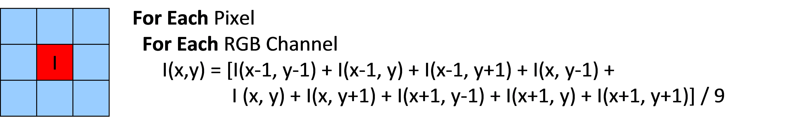

.. ========================= begin_copyright_notice ============================

  Copyright (C) 2021-2022 Intel Corporation

  SPDX-License-Identifier: MIT

  =========================== end_copyright_notice =============================

==================================
C for Metal Language Specification
==================================

Revision |release|

Primary Author(s): Kai Yu Chen, Guei-Yuan Lueh

Contributor(s): Chu-cheow Lim, Somnath Ghosh, Chunling Hu, Biju
George, Weiyu Chen, Alexander Yermolovich, Puyan Lotfi, Gang Chen,
Julia Gould, Wei Pan, David Stuttard, Tim Renouf, Tim Corringham,
Stephen Thomas, Vladimirov Konstantin, Us Alexander, Parshintsev
Anatoly, Sidorenko Anton, Zabaznov Anton, Bezzubikov Alexader,
Ryabtsev Dmitry, Rudenko Nikita.

Legal Notices and Disclaimers
=============================

INFORMATION IN THIS DOCUMENT IS PROVIDED IN CONNECTION WITH INTEL® PRODUCTS. NO LICENSE,
EXPRESS OR IMPLIED, BY ESTOPPEL OR OTHERWISE, TO ANY INTELLECTUAL PROPERTY RIGHTS IS
GRANTED BY THIS DOCUMENT. EXCEPT AS PROVIDED IN INTEL'S TERMS AND CONDITIONS OF SALE FOR
SUCH PRODUCTS, INTEL ASSUMES NO LIABILITY WHATSOEVER, AND INTEL DISCLAIMS ANY EXPRESS OR
IMPLIED WARRANTY, RELATING TO SALE AND/OR USE OF INTEL PRODUCTS INCLUDING LIABILITY OR
WARRANTIES RELATING TO FITNESS FOR A PARTICULAR PURPOSE, MERCHANTABILITY, OR
INFRINGEMENT OF ANY PATENT, COPYRIGHT OR OTHER INTELLECTUAL PROPERTY RIGHT.
UNLESS OTHERWISE AGREED IN WRITING BY INTEL, THE INTEL PRODUCTS ARE NOT DESIGNED NOR
INTENDED FOR ANY APPLICATION IN WHICH THE FAILURE OF THE INTEL PRODUCT COULD CREATE A
SITUATION WHERE PERSONAL INJURY OR DEATH MAY OCCUR.
Intel may make changes to specifications and product descriptions at any time, without notice. Designers
must not rely on the absence or characteristics of any features or instructions marked "reserved" or
"undefined." Intel reserves these for future definition and shall have no responsibility whatsoever for
conflicts or incompatibilities arising from future changes to them. The information here is subject to
change without notice. Do not finalize a design with this information.
The products described in this document may contain design defects or errors known as errata which may
cause the product to deviate from published specifications. Current characterized errata are available on
request.
Contact your local Intel sales office or your distributor to obtain the latest specifications and before
placing your product order.
Copies of documents which have an order number and are referenced in this document, or other Intel
literature, may be obtained by calling 1-800-548-4725, or by visiting Intel's Web Site.
Intel processor numbers are not a measure of performance. Processor numbers differentiate features
within each processor family, not across different processor families. See
http://www.intel.com/products/processor_number for details.
This document contains information on products in the design phase of development.
BunnyPeople, Celeron, Celeron Inside, Centrino, Centrino Atom, Centrino Atom Inside, Centrino Inside,
Centrino logo, Core Inside, FlashFile, i960, InstantIP, Intel, Intel logo, Intel386, Intel486, IntelDX2,
IntelDX4, IntelSX2, Intel Atom, Intel Atom Inside, Intel Core, Intel Inside, Intel Inside logo, Intel. Leap
ahead., Intel. Leap ahead. logo, Intel NetBurst, Intel NetMerge, Intel NetStructure, Intel SingleDriver, Intel
SpeedStep, Intel StrataFlash, Intel Viiv, Intel vPro, Intel XScale, Itanium, Itanium Inside, MCS, MMX, Oplus,
OverDrive, PDCharm, Pentium, Pentium Inside, skoool, Sound Mark, The Journey Inside, Viiv Inside, vPro
Inside, VTune, Xeon, and Xeon Inside are trademarks of Intel Corporation in the U.S. and other countries.
* Other names and brands may be claimed as the property of others.

Copyright (C) 2009-2019, Intel Corporation. All rights reserved.

.. contents:: Table of Contents
   :depth: 3

1 Introduction
==============

1.1 Purpose / Scope
-------------------
This document provides a specification for the C for Metal language. C for Metal is intended to support
high-level programming of compute and media kernels for the Intel® Graphics Media Accelerators [1]. The language is
based on standard C++ language with some restrictions, plus additional features that are designed for
easy expression of the inherent data parallelism in media applications and simplified interface with the
architecture specific hardware features. The organization of this document is as follows:

* Section 2 describes the data types, including the supported subset of C++ data types, CM-defined
  vector and matrix object types, variable qualifiers, type conversion/casting rules, and restrictions.

* Section 3 describes the operations and member functions, in particular the set of overloaded
  operations on vectors and matrices.

* Section 4 describes the functions, user/kernel function qualifiers, calling conventions and built-in
  functions

* Section 5 describes inline assembly.

* Section 6 describes the functions that can be found in the C for Metal Template Library

* Appendix A provides the media kernel example written in CM.

* Appendix B describes the access macros for VME interface.

This document assumes reader familiarity with the standard C++ language. It is not intended to describe
details of the target device, C for Metal software stack, or the C for Metal compiler usage. Some background
information is provided in the relevant sections. Please refer to the references listed in section 1.3 for
further information.

1.2 Definitions, Acronyms, and Abbreviation
-------------------------------------------

=========== ====================================================================
Term        Description
=========== ====================================================================
C++  FE     Standard Intel(R) C++ Compiler Front-End
CM FE       C for Metal Compiler Front-End
SIMD        Single Instruction Multiple Data
GPU         Graphics Processing Unit
GenX        Graphics core generations for Intel® Graphics Media Accelerators [1]
Host        IA-32 and Intel® 64 architecture processors
Device      Intel® GenX GPU
Kernel      A program that can be executed on GenX hardware
Thread      An instance of a kernel program that is executed on a GenX hardware
LSB         Least Significant Bit
GRF         General Register File, a set of general-purpose registers available in GenX
DWORD       Double-word, represents 4 bytes for GenX
=========== ====================================================================

1.3 References and Related Information
--------------------------------------

* [1] "Intel® Graphics Media Accelerator Developer's Guide",
  http://software.intel.com/en-us/articles/intel-graphics-media-accelerator-developers-guide/.
* [2] United States Patent 7257695, 2007.
* [3] "Intel® C++ Compiler User and Reference Guides",
  http://www.intel.com/cd/software/products/asmo-na/eng/347618.htm.
* [4] "Graphics documentation", Vol5c.6, Intel Corporation.
* [5] C for Metal Usage Model.
* [6] C for Metal Runtime API specification.
* [7] :title:`CMC User Guide`.
* [8] :title:`C for Metal Porting Guide`.

1.4 Revision History
--------------------

Changes since C for Metal 4.0
^^^^^^^^^^^^^^^^^^^^^^^^^^^^^

* Updated definition of sample32 API with new Output Format Control field

* Added cm_bf_insert, cm_bf_extract and cm_bf_reverse intrinsics

* Modified scatter/gather read/write to reflect the support for non dword types (e.g. now supports
  char, uchar, short, ushort) as well as being byte addressable (not supported pre IVB)

* Description of Gen10 HEVC VME Interface

Changes since C for Metal 5.0
^^^^^^^^^^^^^^^^^^^^^^^^^^^^^

* Update the description of the cm_sincos() intrinsic

* Remove the requirement that the arguments to cm_min() and cm_max() have the same kind of type

* Clarified that a mask used as a SIMD control flow condition has each
  element considered "true" if not equal to zero. This is different to a mask's
  use in the merge function, where only the least significant bit is
  considered.

* Added cm_pause intrinsic information

* Added new style write_typed_atomic (cm-llvm/cmc only)

* Removed the deprecated function genx_select, and appendix describing clang-cm

* Removed non-supported cm_fgetround and cm_fsetround intrinsics. Added description of
  _GENX_ROUNDING_MODE_ kernel directive

* Added scalar variant for scatter write (enables writing a scalar to buffers - only way to do this
  as all other variants require 2D surface)

* Moved topics relating to compiler usage to the CMC User Guide document.

Changes since C for Metal 6.0
^^^^^^^^^^^^^^^^^^^^^^^^^^^^^

* For oword load read(), documented the deprecated MODIFIED_DWALIGNED modifier
  in addition to DWALIGNED.

* Clarified behaviour of cm_shr for different input types, added docs for
  cm_asr and newly implemented cm_lsr.

* Allowed using ``cm_send`` and ``cm_sends`` inside SIMD control-flow.
  When used inside SIMD control-flow, the width of control-flow decides
  the SIMD width of the resulting ``send`` or ``sends``. Therefore use this new
  feature with caution because the resulting message may or may not be
  supported by hardware.

* Added new _GENX_FLOAT_CONTROL_ support to extend floating point control from just rounding modes
  (that _GENX_ROUNDING_MODE_ implements). The new support includes denorm control and ALT/IEEE for
  single precision float.

* Added half-precision floating-point (half) as one of basic scalar data types.

* Added new predicate arguments to write_atomic and typed_write_atomic.

* Added read_scaled and write_scaled.

* Updated global variable wording and added __declspec(genx_volatile) qualifier.

* Enabled SIMD-32 control-flow. Because of this, many gather, scatter,
  and atomic functions are also extended to allow SIMD-32. However,
  since SIMD-32 messages may not be natively supported by the target machine,
  compiler may split them into SIMD-16 or SIMD-8. Splitting and merging may
  require extra temp-registers, hence negaively impact the total registers that
  user code can use.

2 Data Types
============

2.1 Scalar Data Types
---------------------

2.1.1 Overview
^^^^^^^^^^^^^^

C for Metal supports the following basic scalar data types defined in C++:

* char, unsigned char (uchar), short, unsigned short (ushort), int, unsigned int (uint), float, half

  * C for Metal supports IEEE-754 conformant 16-bit half-precision floating point type.
    To enable this, use namespace "half_float" for host code, and keyword "half" for variable declaration.

* double: double-precision floating-point data type is only supported for Gen7+ hardware platform,
  with the following usage restrictions:

  * Double operands can be used with usual C for Metal operators where floating-point operands are
    allowed, except division.
  * Double operands can be used with the following C for Metal intrinsic functions:
    cm_abs/cm_min/cm_max/cm_add/cm_mul/cm_sum (all operands must be of double type).
  * Double operands cannot be used in DWord scattered read/write and DWord atomic write.

* unsigned long long, long long: unsigned and signed long long data types are 64-bit integers that are
  supported for Gen8+ hardware platform with strict restrictions:

  * unsigned long long and long long operands can be used with usual C for Metal operators where long
    long operands are allowed, except multiplication and division.
  * No C for Metal intrinsic functions are allowed for unsigned long long and long long types.
  * Unsigned long long and long long operands cannot be used in DWord scattered read/write
    and DWord atomic write.

* svmptr_t: represents an integer of pointer size for SVM (shared virtual memory, Gen8+). When
  declaring a struct that is in SVM, use svmptr_t for a pointer field. The size of svmptr_t is set by
  compiler options /DCM_PTRSIZE=32 or /DCM_PTRSIZE=64; use the size appropriate to whether the
  C for Metal program will be run from a 32 bit or 64 bit application. See :ref:`SharedVirtualMemory`.

The C for Metal compiler will issue an error message for unsupported data types.

2.1.2 Saturation
^^^^^^^^^^^^^^^^

CM supports return value saturation for the most of arithmetic built-in functions.
Saturation is a clamping operation that converts any data that is outside the saturation target range
for the built-in return type to the closest represented value with the target range.

If the return type is float, saturation target range is [0.0, 1.0].
Any floating-point value greater than 1.0 (including +inf) saturates to 1.0,
while any negative floating value (including -inf) saturates to 0.0. NaN saturates to 0.0.
Floating point values between 0.0 and 1.0 are unchanged by saturation.

For integer data types, the maximum range for the given numerical data type is the saturation target range.
Specifically, if integer arithmetic overflows, with saturation the result will be either the largest
or the smallest representable value of the destination type.

The table below lists the saturation target range for data types that support saturation.

===================== =========== =====================================
Built-in return type  Synonyms    Saturation target range
===================== =========== =====================================
half                              [0.0, 1.0]
float                             [0.0, 1.0]
double                            [0.0, 1.0]
uint8_t               uchar       [0, 255]
int8_t                char        [-128, 127]
uint16_t              ushort      [0, 65535]
int16_t               short       [-32768, 32767]
uint32_t              uint        [0, 2\ :sup:`32`\  - 1]
int32_t               int         [-2\ :sup:`31`\ , 2\ :sup:`31`\  - 1]
uint64_t                          [0, 2\ :sup:`64`\  - 1]
int64_t                           [-2\ :sup:`63`\ , 2\ :sup:`63`\  - 1]
===================== =========== =====================================

2.2 Compound Data Types
-----------------------
2.2.1 Base Object
^^^^^^^^^^^^^^^^^

To facilitate the expression of high-level data-parallel operations, C for Metal provides the users with two kinds of
compound data types for base objects: vector and matrix. These types are defined using syntax similar to C++
template classes. The parameters are the type of data element and the size of a vector/matrix, as described
below, which must be compile-time constants according to the C++ language specification.

* "Vector< type, size>" represents a vector of length "size" with elements of type "type".

* "Matrix<type, rows, columns>" represents a "rows" x "columns" matrix with elements of type
  "type".

Note: The data element type must be a supported scalar data type as described in Section 2.1.

Note: The total size of a matrix or vector must be less than the GRF size available for each
hardware thread on the target platform.

Some examples of base object declarations:

2.2.2 Reference Object
^^^^^^^^^^^^^^^^^^^^^^

In addition, C for Metal allows the user to define two types of reference objects: vector_ref and matrix_ref, as
described below:

* "vector_ref<type, size>" represents a reference to the elements of some base object that form a
  vector of length "size" with elements of type "type".
* "matrix_ref<type, rows, columns>" represents a reference to the elements of some base object that
  form a "rows" x "columns" matrix with elements of type "type".

The reference objects represent subsets of the base objects. While a base object occupies a storage space
in the GRF that does not overlap with the storage space of other base objects, a reference object is used
internally to refer to a region in the base object and share the storage space. All operations on a reference
object result in applying these operations to the corresponding elements of the base object.

An example of reference object declaration:

.. literalinclude:: ../../../test/CMFE/cmlangspec/2_2_2_a_codegen.cpp
      :language: c++
      :lines: 28,35

2.2.3 Structures
^^^^^^^^^^^^^^^^

C for Metal supports C structures containing all the supported scalar data types and vector/matrix object types
described above, with the restriction that the structure data members must be properly aligned.  The
reference object cannot be declared as a structure field.

2.2.4 Masks
^^^^^^^^^^^

Masks for SIMD comparison and merge operations are represented in C for Metal as follows:

* int -- a vector mask packed into a single int type scalar.

* vector<ushort, size> -- a vector mask.

* matrix<ushort, rows, columns> -- a matrix mask.

Note: Only LSB of each vector/matrix mask element is significant when used in a
merge function. However, when used as a SIMD control flow condition, each
element is compared with 0, thus any non-zero value signifies "true".

2.3 Other Built-in Data Types
-----------------------------

The following built-in data types are defined in C for Metal to represent different objects created and managed by
the C for Metal host runtime [6]. Variables of such data types must be passed through kernel function
parameters, except the reserved global surface indexes CM_STATIC_BUFFER_0 / CM_STATIC_BUFFER_1 /
CM_STATIC_BUFFER_2 / CM_STATIC_BUFFER_3. C for Metal does not allow the explicit use of local/global
variable or modification of such data types in kernel functions, except used as function call argument.
C for Metal does not allow alias among SurfaceIndexes used for dataport functions, as the ordering
between typed and untyped accesses may not be guaranteed by either compiler or hardware.

* SurfaceIndex: represents a surface object used in dataport or other shared functions.

* SamplerIndex: represents a Sampler state object used in Sampler functions.

* VmeIndex: represents a VME state object used in VME functions.

C for Metal supports the use of vector of SurfaceIndex in kernel function, which must be passed from host as
kernel function parameters. C for Metal does not allow modification, reference, or sub-vector select/iselect
operation of SurfaceIndex vector (only basic member select operation vector(i) is allowed).

Usage example:

.. literalinclude:: ../../../test/CMFE/cmlangspec/2_3_a.cpp
      :language: c++
      :lines: 20-30

2.4 Variable Qualifiers
-----------------------

Global variable example:

.. literalinclude:: ../../../test/CMFE/cmlangspec/2_4_a.cpp
      :language: c++
      :lines: 20-56

C for Metal supports global variables, which can be vector/matrix objects described above.
Such variables are treated as normal local C++ variables declared in kernel functions.
Functions can lexically reference global variables. This allows using them
like global variables in addition to function parameters. Note that these global variables
are thread private (i.e., a global variable is shared among the GenX kernel function marked
with "__declspec(genx_main)" and all its callee functions within the same GenX hardware thread).

C for Metal also supports the "__declspec(genx_volatile)" (#define'd to _GENX_VOLATILE_) qualifier
for global variables to indicate that optimizations on these variables shall be limited,
which often helps to decrease register pressure and increases performance.

Optionally, this declspec takes an offset argument to bind a global variable to a specific byte offset,
__declspec(genx_volatile(Offset)), #define'd to _GENX_VOLATILE_BINDING_(Offset).
It is user's responsibility to ensure there is no overlap to other binding globals or thread payloads.

An example is given above (please refer to Section 3 and Section 4 for description
on the operations and functions). C for Metal does not support the initialization of global variables.

2.5 Type Conversions and Casting
--------------------------------

Mixed type operation example:

.. literalinclude:: ../../../test/CMFE/cmlangspec/2_5_a.cpp
      :language: c++
      :lines: 18-25

C for Metal allows mixed operations of vector and matrix objects of different shapes if the operands have the
same number of data elements. The operand shape conformance is checked at compile time by C++ FE
using template specialization rules for vector/matrix classes. An example is given above.

In such cases, C for Metal compiler determines the data element type in the destination operand based on the
source operand data types using standard C++ rules for handling mixed type computation for scalars
(using template specialization mechanisms). Just like in standard C++, users may want to add explicit type
conversions to change the default type promotion and conversion rules. An example is given here:

.. literalinclude:: ../../../test/CMFE/cmlangspec/2_5_b.cpp
      :language: c++
      :lines: 18-26

2.6 Restrictions
----------------

C for Metal places restrictions on using the following standard C++ features in kernel functions and user defined
functions written for the graphics device (described in Section 3.4):

* Pointers

* C++ references

* Classes other than the supported C structures and vector/matrix/vector_ref/matrix_ref types

* Class inheritance

* Arrays

* Exception handling

* Dynamic type identification

* Memory allocation

* Static variables

* Volatile variables

* Calls to external functions

3 Operations
============

3.1 Scalar Data Operations
--------------------------

C for Metal supports the standard C++ operations for the allowed scalar data types described in Section 2.1.

For floating point operations, C for Metal supports the operation modes implemented in GenX hardware which
have deviations from the IEEE* Floating-point standard IEEE-754.

3.2 Compound Data Operations
----------------------------

C for Metal provides a set of overloaded operators for manipulating vector and matrix objects. These are
described below.

3.2.1 Assignment Operators
^^^^^^^^^^^^^^^^^^^^^^^^^^

C for Metal allows the user to assign the value for each data element in a vector/matrix object, as well as to use
component-wise assignment between two objects. If a source operand is of scalar type then it is
replicated. An example is given here:

.. literalinclude:: ../../../test/CMFE/cmlangspec/3_2_1_a.cpp
      :language: c++
      :lines: 18-34

The assignment operator can be used between two matrix/vector objects with different shapes, if they
have the same total number of data elements. The data elements are copied in the row-major fashion.

3.2.2 Vector/matrix Constructors
^^^^^^^^^^^^^^^^^^^^^^^^^^^^^^^^

Constructor example:

.. literalinclude:: ../../../test/CMFE/cmlangspec/3_2_2_a.cpp
      :language: c++
      :lines: 21-24

Similar to standard C++, constructors can be also used in C for Metal to set the data elements in vector/matrix
objects. One restriction is that vector_ref constructor can only take vector/vector_ref object with the
same data type/size, which must be contiguous. Similarly, the matrix_ref constructor can only take
matrix/matrix_ref object with the same data type/size, which must be contiguous. An example is given
above.

To model the data movement instructions with saturation on the target device, C for Metal provides a special
variant of matrix/vector constructor with the "SAT" parameter, as illustrated here:

.. literalinclude:: ../../../test/CMFE/cmlangspec/3_2_2_b.cpp
      :language: c++
      :lines: 21-26

C for Metal provides the following member functions that return the size of a matrix/vector object.

n_rows(): returns the number of rows in a matrix.

n_cols(): returns the number of columns in a matrix.

n_elems(): returns the number of elements in a vector.

3.2.3 Vector/Matrix Initializers
^^^^^^^^^^^^^^^^^^^^^^^^^^^^^^^^

This feature allows users to initialize matrices and vectors through normal C array-initializers. Even though
arrays cannot be used within GenX functions, this feature enables full C syntax of array-initialization for
initializing matrices and vectors. It is advisable to use this feature instead of initializing matrices and
vectors through assignments in the GenX kernels because the compiler would be able to analyze the
initialization sequence and produce optimized vector-immediate or constant moves whenever possible.
The syntax for initializing a vector or matrix during its declaration is simply passing an initialized global
static array (initializer array) as shown in the example here:

.. literalinclude:: ../../../test/CMFE/cmlangspec/3_2_3_a.cpp
      :language: c++
      :lines: 20-33

The initial values of the global array or the initializer-array are sequentially copied to the
vector or matrix. Both integer and floating-point values can be used for initialization using this feature.
Initializer array could be bigger or smaller than the initialized array -- initialization would be done up
to the minimum of their sizes. Initializer array can have more than one dimension -- this gives more
flexibility to users allowing them to skip initialization of some segments of the matrix or vector.

A matrix can also be efficiently declared and initialized with an arithmetic sequence by the built-in
function cm_matrix as shown below. This function uses optimized GenX instruction sequence to perform
the desired initialization. **Note: requires inclusion of cm/cmtl.h header**

Syntax: cm_matrix(M,T,R,C,I,S);

Where M -- Name of the matrix; T -- Type of the elements; R - #Rows; C - #Columns; I -- Initial value of the
sequence; S -- Step of the sequence.

Example:

.. literalinclude:: ../../../test/CMFE/cmlangspec/3_2_3_b.cpp
      :language: c++
      :lines: 18-25

Here, matrix 'm' is declared as a 4x8 ushort matrix and initialized to the values 10, 15, 20, 25, ...
Note that, you must not declare 'm' before as this function declares 'm' and then initializes.

Similarly, a vector can be declared and initialized efficiently with cm_vector function.
**Note: requires inclusion of cm/cmtl.h header**:

Syntax: cm_vector(V,T,N,I,S);

Where V -- Name of the vector; T -- Type of the elements; N - #Elements; I -- Initial value of the sequence; S
-- Step of the sequence.

Example:

.. literalinclude:: ../../../test/CMFE/cmlangspec/3_2_3_c.cpp
      :language: c++
      :lines: 18-25

Here, vector 'v' is declared as a 16-element ushort vector and initialized to the values 2, 5, 8, ...
Note that, you must not declare 'v' before as this function declares 'v' and then initializes.

A pre-declared vector or matrix can also be efficiently assigned an arithmetic sequence with the following
cmtl function (requires cm/cmtl header to be included):

Syntax: cmtl::cm_vector_assign(V,I,S);

Where V -- Name of the vector (can use a matrix 'format'-ed to a vector); I -- Initial value of the sequence;
S -- Step of the sequence. Here initial value 'I' can be a variable.

Example:

.. literalinclude:: ../../../test/CMFE/cmlangspec/3_2_3_d.cpp
      :language: c++
      :lines: 18-27

Here, 10 elements of vector 'v' are assigned as follows: v(2) =  i; v(3) = i+3; v(4) =  i+6, ...

Note that, here 'v' is assumed to be already declared before.

3.2.4 Arithmetic Operators
^^^^^^^^^^^^^^^^^^^^^^^^^^

C for Metal supports the following arithmetic operators for vector/matrix objects:

+, -, \*, /, %, +=, -=, \*=

These are all component-wise operations that follow standard C++ rules for the corresponding scalar data
computation. The operands must conform to the type conversion rules described in 2.5. Only when an
operand is of scalar type, it is replicated as needed.

Arithmetic operation example:

.. literalinclude:: ../../../test/CMFE/cmlangspec/3_2_4_a.cpp
      :language: c++
      :lines: 18-32

3.2.5 Shift Operators
^^^^^^^^^^^^^^^^^^^^^

C for Metal supports the following shift operators for vector/matrix objects:

>>, <<, >>=, <<=

These are all component-wise operations that follow standard C++ rules for the corresponding scalar data
computation.

3.2.6 Bitwise Operators
^^^^^^^^^^^^^^^^^^^^^^^

C for Metal supports the following bitwise operators for vector/matrix objects:

&, \|, ^, !, &=, \|=, ^=, ~

These are all component-wise operations that follow standard C++ rules for the corresponding scalar data
computation.

3.2.7 Logical Operators
^^^^^^^^^^^^^^^^^^^^^^^

C for Metal supports logical operators which operate on values that are contextually converted to bool. These
are guaranteed to be evaluated left-to-right within an expression.

&& \|\|

3.2.8 Comparison Operators
^^^^^^^^^^^^^^^^^^^^^^^^^^

C for Metal provides a set of overloaded comparison operators for vector/matrix objects. They perform
component-wise comparison for the operands "x" and "y" and the result value is 0 for False, 1 for True. If
one operand is of scalar type then it is replicated to match the size of another operand.

* vector<ushort, size>  operator OP (VM x, VMC y);

* vector<ushort, size>  operator OP (VMC x, VM y);

Note:

* OP is one of {<; <=; >; >=; ==; !=}
* VM is any type of vector/vector_ref/matrix/matrix_ref
* VMC is any type of vector/vector_ref/matrix/matrix_ref/<scalar_type>

The comparison operations can be used for assignment to a mask, as in the following example.

.. literalinclude:: ../../../test/CMFE/cmlangspec/3_2_8_a.cpp
      :language: c++
      :lines: 18-29

.. _SelectMemberFunctions:

3.2.9 Select Member Functions
^^^^^^^^^^^^^^^^^^^^^^^^^^^^^

C for Metal provides a set of "select" functions for referencing a subset of the elements of vector/matrix objects.
All these operations (except "iselect" and "replicate") return a reference to the elements
of matrix/vector objects, so they can be used as L-values in the statements.

() Operator: Standard Matrix/Vector Element-Access Operator
"""""""""""""""""""""""""""""""""""""""""""""""""""""""""""

The two basic operators are described below:

* operator(ushort i): returns the i-th scalar element of a vector.
* operator(ushort i, ushort j): returns the (i, j)-th scalar element of a matrix, where "i" is the index
  of a row and "j" is the index of a column (the index starts from 0).

() select operation example:

.. literalinclude:: ../../../test/CMFE/cmlangspec/3_2_9_a.cpp
      :language: c++
      :lines: 22-25

Alternatively, C for Metal supports the following syntax that is similar to the standard C array access operator:

[] Operator: Standard Matrix/Vector Element-Access Operator
"""""""""""""""""""""""""""""""""""""""""""""""""""""""""""

The two basic operators are described below:

* operator[ushort i]: returns the i-th scalar element of a vector.
* operator[ushort i][ushort j]: returns the [i][j]-th scalar element of a matrix, where "i" is the index
  of a row and "j" is the index of a column (the index starts from 0)..

[] select operation example:

.. literalinclude:: ../../../test/CMFE/cmlangspec/3_2_9_b.cpp
      :language: c++
      :lines: 22-27

select: Sub-Matrix or Sub-Vector Selection with Regular Stride
""""""""""""""""""""""""""""""""""""""""""""""""""""""""""""""

C for Metal also allows users to select a sub-matrix or sub-vector with regular strides using the following:

* **select<size, stride>(ushort i=0)**: returns a reference to the sub-vector starting from the i-th
  element ("size" indicates the number of selected elements; "stride" indicates the distance
  between two adjacent selected elements).

* **select<v_size, v_stride, h_size, h_stride>(ushort i=0, ushort j=0)**: returns a reference to the sub-
  matrix starting from the (i, j)-th element ("v_size" indicates the number of selected rows;
  "v_stride" indicates the distance between two adjacent selected rows; "h_size" indicates the
  number of selected columns; "h_stride" indicates the distance between two adjacent selected
  columns).

Sub-matrix/sub-vector select operation example:

.. literalinclude:: ../../../test/CMFE/cmlangspec/3_2_9_c.cpp
      :language: c++
      :lines: 22-26

.. literalinclude:: ../../../test/CMFE/cmlangspec/3_2_9_d.cpp
      :language: c++
      :lines: 22-27

.. literalinclude:: ../../../test/CMFE/cmlangspec/3_2_9_e.cpp
      :language: c++
      :lines: 22-27

.. literalinclude:: ../../../test/CMFE/cmlangspec/3_2_9_f.cpp
      :language: c++
      :lines: 22-26

Note: C for Metal currently has the following restrictions on "select" operation:

* The horizontal stride and vertical stride must be greater than 0.

* The horizontal / vertical stride must be 1 if the horizontal / vertical size is 1.

Out-of-bound select may be exploited in CM to facilitate kernel optimization,
in which case the values returned for out-of-bound elements are don't cares and
should not affect final output correctness.

The following can be used in C for Metal to return a reference to the whole object.

* **select_all()**

For instance, for a matrix object this function is equivalent to "select<rows, 1, columns, 1>(0, 0)", where
(rows, columns) specifies the original matrix size. An example is given below.

Select_all( ) operation example:

.. literalinclude:: ../../../test/CMFE/cmlangspec/3_2_9_g.cpp
      :language: c++
      :lines: 18-33

iselect: Indirect-Select or Vector Indexing
"""""""""""""""""""""""""""""""""""""""""""

C for Metal allows selecting a stream of elements from a vector based on the index-values in another vector.
**Doesn't support Double data type on IVB.**

**iselect(idx)** -- which means indirectly select the vector elements as specified by the index or offset
values  in the vector 'idx', and return a new vector of length that is equal to the length of 'idx' vector. 'idx'
vector could be of any arbitrary length. The data type of idx must be unsigned short. An example of its use
is shown below:

iselect(idx) operation example:

.. literalinclude:: ../../../test/CMFE/cmlangspec/3_2_9_h.cpp
      :language: c++
      :lines: 18-44

C for Metal also allows selecting a stream of elements from a matrix based on vector offsets.

**iselect(row, col)** -- which means indirectly select the matrix elements as specified by the row and column
indices: row and col, both of which have unsigned short type, and return a new vector of length that is
equal to the length of row or col vector. Note that row and col must have the same length. An example of
its use is shown below.

iselect(row, col) operation example:

.. literalinclude:: ../../../test/CMFE/cmlangspec/3_2_9_i.cpp
      :language: c++
      :lines: 26-31

The iselect method returns a vector or matrix, rather than a vector_ref or a matrix_ref. Therefore iselect
cannot be used as an lvalue.

replicate: source region replication operations
"""""""""""""""""""""""""""""""""""""""""""""""

The replicate operations all operate on linear (one dimensional) regions of matrix/vectors. A row major
layout is assumed for matrix objects in determining the linear order.

The following can be used in C for Metal to replicate a matrix/vector object "REP" times and return a new vector
of "REP" * "rows" * "columns" length, where (rows, columns) specifies the original matrix size.

* **replicate<REP>()**

The following can be used in C for Metal to replicate "W" consecutive elements starting at  (i,j)/ (i) from the
matrix/vector object "REP" times, and return a new vector of "REP" * "W" length.

* **replicate<REP, W>( ushort i=0, ushort j=0) )**

* **replicate<REP, W>( ushort i=0 )**

The following can be used in C for Metal to select/replicate "REP" blocks of "W" consecutive elements starting at
(i,j)/(i) from the matrix/vector object with each block strided by "VS" elements, and return a new vector
of "REP" * "W" length. Selected blocks of "W" elements will overlap if "VS" < "W".

* **replicate<REP, VS, W>( ushort i=0, ushort j=0) )**

* **replicate<REP, VS, W>( ushort i=0 )**

The following can be used in C for Metal to select/replicate "REP" blocks of "W" sequential elements with a stride
of "HS" starting at  (i,j)/(i) from the matrix/vector object with each block strided by "VS" elements, and
return a new vector of "REP" * "W" length. Selected blocks of "W" elements will overlap if "VS" < "W".

* **replicate<REP, VS, W, HS>( ushort i=0, ushort j=0) )**

* **replicate<REP, VS, W, HS>( ushort i=0 )**

row and column: Row and column region selection operations
""""""""""""""""""""""""""""""""""""""""""""""""""""""""""

The following can be used in C for Metal to return a reference to the i-th row/column of a matrix object:

* **row(i)**
* **column(i)**

Row/column select operation example:

.. literalinclude:: ../../../test/CMFE/cmlangspec/3_2_9_j.cpp
      :language: c++
      :lines: 22-26

3.2.10 Format Member Functions
^^^^^^^^^^^^^^^^^^^^^^^^^^^^^^

The following can be used in C for Metal to reinterpret the basic type (the type of data elements) of a
matrix/vector and change the shape to another matrix/vector.

* **format<type, rows, columns>( )**: returns a reference to the calling object interpreted as a new
  matrix with the shape determined by the template parameters. The size of the new matrix must
  not exceed the size of the source object.

* **format<type>( )**: returns a reference to the calling object interpreted as a new vector with the
  size determined by the template type parameter.

The object to be formatted must be contiguous and aligned. Generally it is the user's responsibility to
ensure that the format usage is correct. When a discontinuity is detected at compile time the C
for Metal compiler will issue an error message. Compiler is expected to preserve the new format
type as specified by the programmer for code generation.

Format operation example:

.. literalinclude:: ../../../test/CMFE/cmlangspec/3_2_10_a.cpp
      :language: c++
      :lines: 22-38

3.2.11 Merge Member Functions
^^^^^^^^^^^^^^^^^^^^^^^^^^^^^

To model the masked move operations on the target device, C for Metal provides a set of "merge" functions for
vector/matrix objects.

Merge operations with one source operand are defined as follows:

* void VM::merge(VMC x, int mask)

* void VM::merge(VMC x, VM mask)

Note:

* VM is any type of vector/vector_ref/matrix/matrix_ref
* VMC is any type of vector/vector_ref/matrix/matrix_ref/<scalar_type>

The semantic is that if a bit of the mask (or the LSB of the element of a vector/matrix mask) is set, the
value of x (or the corresponding element of x if it is a vector/matrix object) is copied to the corresponding
position of the method's invoking vector/matrix object.

One-source merge operation example:

.. literalinclude:: ../../../test/CMFE/cmlangspec/3_2_11_a.cpp
      :language: c++
      :lines: 22-38

Merge operations with two source operands are defined as follows:

* void VM::merge(VMC x, VMC y, int mask)

* void VM::merge(VMC x, VMC y, VM mask)

Note:

* VM is any type of vector/vector_ref/matrix/matrix_ref
* VMC is any type of vector/vector_ref/matrix/matrix_ref/<scalar_type>

Two-source merge operation example:

.. literalinclude:: ../../../test/CMFE/cmlangspec/3_2_11_b.cpp
      :language: c++
      :lines: 22-30

The semantic is that if a bit of the mask (or the LSB of the element of a vector/matrix mask) is set, the
value of x (or the corresponding element of x if it is a vector/matrix object) is copied to the corresponding
position of the destination vector/matrix. Otherwise, the value of y (or the corresponding element of y if
it is a vector/matrix object) is copied to the corresponding position of the method's invoking
vector/matrix object.

3.2.12 Boolean Reduction Functions
^^^^^^^^^^^^^^^^^^^^^^^^^^^^^^^^^^

To facilitate boolean operations, C for Metal provides two predefined boolean reduction functions on mask
objects:

* ushort vector<ushort, size>::any(void) / ushort matrix<ushort, R, C>::any(void)

  This function will return a 1 if any of the value in the mask is non-zero; it will return 0 otherwise.

* ushort vector<ushort, size>::all(void) / ushort matrix<ushort, R, C>::all(void)

  This function will return a 1 if all the values in the mask are non-zero; it will return 0 otherwise.

There is no restriction on the size of the mask.  The result of either function can be used as a scalar value
and can be used in the standard C++ control-flow constructs.

Boolean reduction example:

.. literalinclude:: ../../../test/CMFE/cmlangspec/3_2_12_a.cpp
      :language: c++
      :lines: 22-51

3.3 Evaluation Order
--------------------

For all operations (including both scalar and compound data operations), all operands are read first and
then the operation is performed. For the example below, v2 is equal to the result of the
original values of m1's rows 0 and 1 plus m1's row 1 and 2.

Evaluation order example:

.. literalinclude:: ../../../test/CMFE/cmlangspec/3_3_a.cpp
      :language: c++
      :lines: 22-30

3.4 Control flow
----------------

C for Metal supports both scalar as well as SIMD control flow statements. Control flow statements define control
flow (statement) blocks that are subject to the control condition.

3.4.1 Scalar control flow
^^^^^^^^^^^^^^^^^^^^^^^^^

Scalar control flow in C for Metal is expressed by means of the standard C++ control flow statements -- conditional
statements (if-else/switch), loop statements (for/while/do-while), jump statements (break/continue/goto
/return) or function calls.

In scalar control flow statements, the condition must be a scalar and all channels of statements within
scalar control flow blocks are subject to the same scalar condition. The control flow is thus stated to be
uniform for all SIMD channels within control flow blocks. There are no other restrictions imposed by using
just scalar control flow statements.

The boolean reduction example above shows the use of scalar control flow.

3.4.2 SIMD control flow
^^^^^^^^^^^^^^^^^^^^^^^

SIMD control flow in C for Metal is expressed by means of predefined C++ macros. The predefined macros used to
express SIMD control flow and their scalar equivalents as shown in Table 3-1. The SIMD control flow
statements allow the C for Metal programmer to take advantage of the native SIMD control flow support
available in GenX hardware. The execution semantics of these statements match the corresponding
instructions available in GenX instruction set architecture.

SIMD control flow statements:

=============== ======================================= ==============================
Statement type  SIMD control flow statement             Scalar control flow equivalent
=============== ======================================= ==============================
Conditional     SIMD_IF_BEGIN/SIMD_ELSE/                if-else
                SIMD_ELSEIF/SIMD_IF_END
Loop            SIMD_DO_WHILE_BEGIN/SIMD_DO_WHILE_END   do-while
Jump            SIMD_BREAK/SIMD_CONTINUE                break/continue
=============== ======================================= ==============================

In SIMD control flow statements, the condition is generally a SIMD (vector or matrix) condition in place of
a scalar condition. Optionally the condition may also be a scalar  if the SIMD control flow statement is
nested in a SIMD control flow block;
such a scalar is considered to be replicated to the size of the SIMD width of the enclosing SIMD control flow block.
The scalar size of the SIMD condition is stated to be the SIMD width
of the associated block. The SIMD width of a SIMD control flow block with a scalar condition is defined to
be the SIMD width of its enclosing SIMD control flow block.

SIMD control flow is defined on a per channel basis for all statements within a control flow block such that
each channel may take independent control paths within the block. The control flow is thus stated to be
divergent for different channels computed within the block. Generally the scalar size of all statements
(number of channels) within SIMD control flow blocks must correspond with the scalar size of the SIMD
condition, in which case each scalar condition component associates to each corresponding statement
channel; optionally scalar statements with a SIMD width of one are allowed, in which case the scalar
condition associated with the scalar statements is determined to be true if any of the channels in the
SIMD control flow block is active and false otherwise.

SIMD control flow usage example:

.. literalinclude:: ../../../test/CMFE/cmlangspec/3_4_2_a.cpp
      :language: c++
      :lines: 26-52

The following constraints are placed on statements appearing within SIMD control flow blocks in order to
guarantee consistent semantics and to allow for an efficient implementation.

* The SIMD width of a SIMD control flow block must be a power of two, greater than one and less
  than or equal to 32.

* Nested SIMD control flow blocks must have the same SIMD width as their enclosing SIMD blocks.
  Thus the SIMD width of all nested SIMD control flow blocks is determined by the SIMD width of
  outermost SIMD control flow block.

* All statements within a SIMD control flow block must either have their SIMD widths correspond
  to the SIMD width of its block, or must have a SIMD width equal to one. For statements  that
  have destinations, requiring the statement to have a SIMD width equal to the SIMD width of its
  block implies that the destinations must be a vector/matrix of SIMD width elements; source
  expressions of statements may be either scalars of size one or vectors/matrices of SIMD width
  elements as permitted  by the existing C for Metal semantics.

* Scalar control flow statements and conditional expressions are not permitted in SIMD control
  flow blocks.

* Jump statements other than the SIMD_BREAK and SIMD_CONTINUE statements are not allowed
  in a SIMD control flow blocks. Likewise SIMD_BREAK and SIMD_CONTINUE statements are not
  allowed in a non-SIMD context.

* Calling user-defined functions within a SIMD context is not permitted. There are no restrictions
  imposed on calling intrinsic functions provided none of the other constraints are violated.

* If it is not possible to determine the SIMD width of an statement in a SIMD context, then that
  statement is considered illegal in a SIMD context. For example an statement such as (scalar1 *
  scalar2) without a destination is considered illegal in SIMD context.

* The source operands of C for Metal reduction operators reduction operators (any(), all(), cm_sum(),
  cm_prod(), cm_reduction_max(), cm_reduction_min()) are required to have a size equal to the
  SIMD width of its immediate context. Furthermore reduction functions will perform reduction
  only on active scalar sub-elements of its source as determined by its context's SIMD mask.

* The dot product, the sum of absolute differences and the line operators are not allowed in SIMD
  control flow blocks as they operate on tuple variable which are not well-defined when we use
  SIMD masks.

* Block read/write, sampler, VME and thread communication intrinsics are not allowed in SIMD
  control flow context. It is however possible to use scatter read/write statements in a SIMD
  context provided the read/write destination/source size is equal to the SIMD width of the block.

4 Functions
===========

4.1 Function Qualifiers
-----------------------

C for Metal allows the user to write standard C++ functions. In addition, the following attribute qualifiers are used
to specify functions to be compiled for the graphics device. These cannot be used for the functions
running on the host.

* "_GENX_MAIN_" is used to specify a GenX kernel function, which cannot be called from another
  kernel function.

  _GENX_MAIN_ void kernel(formal_parameters)

  The formal parameter declarations must comply with the parameter passing restrictions described in
  Section 4.2. There can be more than one kernel function in a file.

* "_GENX_" may be used (but is not required) to specify a user defined GenX function, which can be
  called from kernel functions or other user defined functions.

  _GENX_ [inline] return_type function(formal\_ parameters)

  The optional "inline" qualifier is used to indicate if the function should be inlined by the C for Metal compiler at
  the call site. If a user defined function with the "inline" specifier is not inlined, the C for Metal compiler will
  issue a warning/error message.

A "genx_main" kernel function and all of the "genx" functions that it invokes transitively must be in the
same file.

4.2 User-defined functions
--------------------------

C for Metal supports user-defined function calls without recursion.  Parameters to a user-defined C for Metal function
may have scalar type, vector/matrix type, or  SurfaceIndex/SamplerIndex/VmeIndex type.  In addition,
vector_ref and matrix_ref types may be used to pass a vector/matrix object by reference.  A user-defined
function can return scalar values or vector/matrix types. vector_ref/matrix_ref return types are not
supported.

Function usage example:

.. literalinclude:: ../../../test/CMFE/cmlangspec/4_2_a.cpp
      :language: c++
      :lines: 20-65

In the pass-by-value parameter passing scheme a copy of the function call argument value is associated
with the corresponding subprogram parameter, whereas in the pass-by-reference scheme the address of
the argument is associated with the subprogram pass-by-reference parameter. In the subprogram body
every reference to the pass-by-reference formal becomes an indirect access using the address associated
with the parameter. The pass-by-reference arguments are therefore required to be l-values (named
objects having an address).  Pass-by-reference parameters are declared by specifying the parameter types
to be either of a matrix_ref or vector_ref type.  No other pass-by-reference parameter types are allowed.

The pass-by-reference scheme is useful to copy-out values from the subprogram back to the caller. It also
may be useful to convey large inputs to subprograms, as the amount of parameter conveying code will be
reduced.

There is a restriction imposed on arguments passed by reference in order to allow for an efficient CM
implementation. Specifically the restriction is that for a subprogram that uses pass-by-reference, the
behavior must be the same as if we use a copy-in/copy-out semantic to convey the pass-by-reference
argument; otherwise the C for Metal program is said to be erroneous and may produce incorrect results. Such
errors are not caught by the compiler and it's up to the user to guarantee safety.

The implication of the above stated restriction is that no pass-by-reference argument that is written to in
a subprogram (either directly or transitively by means of a nested subprogram call pass-by-reference
argument) may overlap with another pass-by-reference parameter or a global variable that is referenced
in the subprogram; in addition no pass-by-reference subprogram argument that is referenced may
overlap with a global variable that is written to in the subprogram.

The reason for the above rule is to allow the implementation to opportunistically use copy-in/copy-out
operations at the call/return sites in order to produce more optimal code by guaranteeing whole register
alignment to the subprogram parameter.

Pass-by-reference parameters may be semantically classified as:

| IN  - parameters that are only read
| OUT  - parameters that are only written
| INOUT - parameters that are both read and written

An important point to consider when using pass-by-reference parameters is that all reads and writes to
pass-by-reference parameters involve register-indirect operations in GEN ASM. Register-indirect
operations are limited to be SIMD8 (as opposed to SIMD16) in the GEN architecture. In addition there will
be additional address computation code generated. This can result in increased code size if there are a lot
of references to pass-by-ref parameters in the subprogram body. In addition, code involving register-
indirect operations may execute in hardware with more latency because of more conservative
dependency checks in hardware.

Another important point to consider is that arguments of pass-by-reference parameters are enforced to
be whole register aligned at call sites. If the argument cannot be guaranteed to be whole register aligned
then copy-in/copy-out operations are inserted which increases code size. In addition copy-in/copy-out
operations are also inserted if the argument is not contiguous to guarantee correctness; however this is
expected to be rare.

The implications are:

1.  If the IN parameter size is less than or equal to two GRFs it is better to use pass-by-value for it.

2.  OUT parameters are best updated only as a final statement in the subprogram body in order to
    reduce code involving register-indirect.

3.  If the arguments to most of the calls involving pass-by-reference IN parameters, are not whole
    register aligned then it is disadvantages to use pass-by-reference because of the compiler generated
    copy-in operations inserted to guarantee whole register alignment. Pass-by-value should probably
    not be used for such parameters. This is because the price paid involves both the copy-in/copy-out
    operations as well as the impact of the register-indirect operations. It's better to use pass-by-value
    for IN parameters in such situations.

4.  If the arguments to most of the call to pass-by-reference OUT parameters are not whole register
    aligned then it is disadvantages to use pass-by-reference for the same reason as for IN parameters.
    For OUT parameters a global variable could be used to convey the return value back to the caller (a
    user generated copy-out operation).

5.  If the arguments to most of the calls to pass-by-reference are discontinuous then pass-by-reference
    should not be used.

6.  If there are a lot of references to pass-by-reference parameters in the subprogram body, it may be
    disadvantageous to use pass-by-reference for the parameter as the amount of register-indirect code
    produced increases. On the other hand if the parameter size is large and there are a lot of call sites
    then it may be advantageous to use pass-by-reference for the parameter.

4.3 Built-in Functions
----------------------

C for Metal defines a set of built-in or intrinsic functions that are efficiently translated to GenX instructions based
on the target platform. It is advisable to use the intrinsic functions whenever possible to get better
performance. The intrinsic functions have the following format:

       Intrinsic_Function_Name<Template_Parameters> (Function\_ Parameters)

The template parameters cannot be variables and are usually optional as they are determined by the
compiler from the types of the function parameters. If present, template parameter 'T' represents the
data type of the return value. Most intrinsic functions have a flag parameter, which is a bit mask that
specifies the execution mode (e.g., the SAT bit indicates the saturation mode). Other bits in the flags are
reserved. The default value of the flag is 0.

Usually, the intrinsic functions have the same type restrictions as the corresponding GenX instructions.
Note that while a math intrinsic function returns a vector, CM allows assigning it to a matrix
with the same number of elements, as described in Section 2.5.

cm_abs<T>
^^^^^^^^^

Absolute value. The behavior is undefined if the result cannot fit in T.

.. code-block:: c++
  RetTy cm_abs(FstTy src0, int flag = _GENX_NOSAT)

There are several overloads for different types:

* Parameter 1: matrix(_ref), vector(_ref) or scalar;
* Parameter 2: flags (default is 0; use SAT for saturation);
* Return: vector or scalar;

Semantics:

#. Calculates absolute value of operand in infinite precision;
#. Saturates to destination type if flag is SAT;
#. Without saturation, for minimal signed value, result is minimal signed value.

cm_add<T>
^^^^^^^^^

cm_add currently is implemented in quite a strange way taking the worst parts from both C++ and our HW:

.. code-block:: c++
  RetTy cm_add(FstTy src0, SndTy src1, int flag = _GENX_NOSAT)

There are several overloads for different types:

* Parameter 1: matrix(_ref), vector(_ref) or scalar;
* Parameter 2: matrix(_ref), vector(_ref) or scalar;
* Parameter 3: flags (default is 0; use SAT for saturation);
* Return: vector or scalar.

Semantics:

#. Applies C++ integral promotions on its operands;
#. Extends operands to infinite precision;
#. Adds promoted operands;
#. Saturates to destination type if flag is SAT.

cm_addc
^^^^^^^

Add with carry.

* Parameter 1: matrix(_ref), vector(_ref) or scalar
* Parameter 2: matrix(_ref), vector(_ref) or scalar
* Parameter 3: matrix_ref, vector_ref or reference to a scalar
* Return: vector or scalar

Only unsigned type arguments are supported.

cm_subb
^^^^^^^

Subtraction with borrow.

* Parameter 1: matrix(_ref), vector(_ref) or scalar
* Parameter 2: matrix(_ref), vector(_ref) or scalar
* Parameter 3: matrix_ref, vector_ref or reference to a scalar
* Return: vector or scalar

Only unsigned type arguments are supported.

cm_mul<T>
^^^^^^^^^

Multiply.

* Parameter 1: matrix(_ref), vector(_ref) or scalar
* Parameter 2: matrix(_ref), vector(_ref) or scalar
* Parameter 3: flags (default is 0; use SAT for saturation)
* Return: vector or scalar

Restrictions:

1. The destination cannot be a float if any source operand is an integer;
2. If one source operand is a float, the other source operand cannot be an integer;
3. If one source operand is int/uint type, the SAT flag cannot be 1.

cm_quot<T>
^^^^^^^^^^

Quotient of division.

* Parameter 1: matrix(_ref), vector(_ref) or scalar
* Parameter 2: matrix(_ref), vector(_ref) or scalar
* Parameter 3: flags (default is 0; no saturation available)
* Return: vector or scalar

Only integer type arguments are supported.

cm_mod<T>
^^^^^^^^^

Remainder (modulus) of division.

* Parameter 1: matrix(_ref), vector(_ref) or scalar
* Parameter 2: matrix(_ref), vector(_ref) or scalar
* Parameter 3: flags (default is 0; no saturation available)
* Return: vector or scalar

Only integer type arguments are supported.

cm_fmod<T>
^^^^^^^^^^

Floating-point Remainder, same as C standard function fmod():
cm_fmod(y,x)=r, if y = qx + r where q is an integer and r<x.

NOTE: now part of cmtl; see :ref:`CMTemplateLibrary` (requires cmtl:: namespace)

* Parameter 1: matrix(_ref), vector(_ref) or scalar
* Parameter 2: matrix(_ref), vector(_ref) or scalar
* Parameter 3: flags (default is 0; use SAT for saturation)
* Return: vector or scalar

Only floating-point type arguments are supported.

cm_div<T>
^^^^^^^^^

Quotient and remainder of division.

* Parameter 1: matrix(_ref), vector(_ref)
* Parameter 2: matrix(_ref), vector(_ref) or scalar
* Parameter 3: matrix(_ref), vector(_ref) or scalar
* Parameter 4: flags (default is 0; no saturation available)
* Return: vector or scalar (quotient); the
  remainder is returned into the 1st parameter (passed by ref).

Only integer type arguments are supported.

cm_avg<T>
^^^^^^^^^

Average value rounded up.

* Parameter 1: matrix(_ref), vector(_ref)
* Parameter 2: matrix(_ref), vector(_ref) or scalar
* Parameter 3: flags (default is 0; use SAT for saturation)
* Return: vector or scalar

cm_dp2, cm_dp3, cm_dp4
^^^^^^^^^^^^^^^^^^^^^^

Two-, three- and four-wide dot product.

* Parameter 1: matrix(_ref), vector(_ref)
* Parameter 2: matrix(_ref), vector(_ref) or scalar
* Parameter 3: flags (default is 0; use SAT for saturation)
* Return: vector

Only floating-point type arguments are supported.

Dot product, line and sum of difference operators are not permitted in a SIMD
control flow context.

cm_dp4 performs the 4-wide dot product operation for each 4-tuple of elements
in the input vector/matrix parameters, and sets the same scalar product result
to each element of the corresponding 4-tuple in the return value.

cm_dph
^^^^^^

Four-wide homogeneous dot product.

* Parameter 1: matrix(_ref), vector(_ref)
* Parameter 2: matrix(_ref), vector(_ref) or scalar
* Parameter 3: flags (default is 0; use SAT for saturation)
* Return: vector

Only floating-point type arguments are supported.

Dot product, line and sum of difference operators are not permitted in a SIMD
control flow context.

cm_frc
^^^^^^

Fraction.

* Parameter 1: matrix(_ref), vector(_ref)
* Return: vector

Only floating-point type arguments are supported.

This function returns a vector that contains the fractional portion of each component in the
input vector/matrix.

cm_line
^^^^^^^

Component-wise linear equation. First vector provides the scalar
coefficients -- Only 1st and 4th element of the vector are used as the two
scalar coefficients needed for this function.

* Parameter 1: vector of length 4
* Parameter 2: matrix(_ref), vector(_ref), multiple of 8 elements
* Parameter 3: flags (default is NOSAT; use SAT for saturation)
* Return: vector

This function computes the linear equation R[i] = X[0] * Y[i] + X[3] for each element Y[i] in the
second input parameter, and sets the result to the corresponding element R[i] in the return value.
The scalar values X[0] and X[3] used in the linear equation correspond to the first and fourth
elements of the 4-tuple in the first input parameter.

Only floating-point type arguments are supported.

Dot product, line and sum of difference operators are not permitted in a SIMD
control flow context.

cm_lzd
^^^^^^

Leading zero detection.

* Parameter 1: matrix(_ref), vector(_ref) or scalar
* Parameter 2: flags (default is 0)
* Return: vector or scalar

This function computes the number of leading zeros in each component of the
input parameter, and returns the result stored in a vector (for vector/matrix
input parameter) or a scalar (for scalar input parameter).

cm_max<T>, cm_min<T>
^^^^^^^^^^^^^^^^^^^^

Maximum and minimum.

* Parameter 1: matrix(_ref), vector(_ref) or scalar
* Parameter 2: matrix(_ref), vector(_ref) or scalar
* Parameter 3: saturation (default is NOSAT; use SAT for saturation)
* Return: vector or scalar

cm_rndd
^^^^^^^

Round down.

* Parameter 1: matrix(_ref), vector(_ref) or scalar.
* Parameter 2: flags (default is 0; use SAT for saturation).
* Return: vector or scalar.

cm_floor<T>
^^^^^^^^^^^

floor(x) is the largest integer not greater than x -- same functionality as
cm_rndd.

NOTE: now part of cmtl; see :ref:`CMTemplateLibrary` (requires cmtl:: namespace)

* Parameter 1: matrix(_ref), vector(_ref) or scalar.
* Parameter 2: flags (default is 0; use SAT for saturation).
* Return: vector or scalar.

cm_rndu
^^^^^^^

Round up.

* Parameter 1: matrix(_ref), vector(_ref) or scalar.
* Parameter 2: flags (default is 0; use SAT for saturation).
* Return: vector or scalar.

cm_ceil<T>
^^^^^^^^^^

ceil(x) is the smallest integer not less than x -- same functionality as
cm_rndu.

NOTE: now part of cmtl; see :ref:`CMTemplateLibrary` (requires cmtl:: namespace)

* Parameter 1: matrix(_ref), vector(_ref) or scalar.
* Parameter 2: flags (default is 0; use SAT for saturation).
* Return: vector or scalar.

cm_rnde
^^^^^^^

Round even.

* Parameter 1: matrix(_ref), vector(_ref) or scalar.
* Parameter 2: flags (default is 0; use SAT for saturation).
* Return: vector or scalar.

cm_rndz
^^^^^^^

Round zero.

* Parameter 1: matrix(_ref), vector(_ref) or scalar.
* Parameter 2: flags (default is 0; use SAT for saturation).
* Return: vector or scalar.

cm_sad2<T>
^^^^^^^^^^

Two-wide sum of absolute difference.

* Parameter 1: matrix(_ref), vector(_ref)
* Parameter 2: matrix(_ref), vector(_ref) or scalar
* Parameter 3: flags (default is 0; use SAT for saturation).
* Return: vector or scalar

In a SIMD control flow context reduction functions will perform reduction only
on active channels of its source as determined by its context's SIMD mask.

Dot product, line and sum of difference operators are not permitted in a SIMD
control flow context.

cm_sada2<T>
^^^^^^^^^^^

Compute two-wide sum of absolute difference between src1 and src2, add that to
src3, and store the result to the first channel per 2-tuple in dst.

* Parameter 1: matrix(_ref) or  vector(_ref)
* Parameter 2: matrix(_ref), vector(_ref) or scalar
* Parameter 3: matrix(_ref) or vector(_ref)
* Parameter 4: flags (default is 0; use SAT for saturation).
* Return: vector or scalar

In a SIMD control flow context reduction functions will perform reduction only
on active channels of its source as determined by its context's SIMD mask.

Dot product, line and sum of difference operators are not permitted in a SIMD
control flow context.

cm_sum<T>
^^^^^^^^^

Sum of all elements.

* Parameter 1: matrix(_ref) or vector(_ref).
* Parameter 2: saturation (default is NOSAT; use SAT for saturation).
* Return: scalar.

In a SIMD control flow context reduction functions will perform reduction only
on active channels of its source as determined by its context's SIMD mask.

The order of continuant scalar operation is not guaranteed and the
correctness of result should not depend on computation order.

cm_reduced_min<T>
^^^^^^^^^^^^^^^^^

Find the minimum element of a matrix/vector. T is the type of the elements.

* Parameter 1: matrix(_ref) or vector(_ref).
* Parameter 2: saturation (default is NOSAT; use SAT for saturation).
* Return: scalar.

In a SIMD control flow context reduction functions will perform reduction only
on active channels of its source as determined by its context's SIMD mask.

cm_reduced_max<T>
^^^^^^^^^^^^^^^^^

Find the maximum element of a matrix/vector. T is the type of the elements.

* Parameter 1: matrix(_ref) or vector(_ref).
* Parameter 2: saturation (default is NOSAT; use SAT for saturation).
* Return: scalar.

In a SIMD control flow context reduction functions will perform reduction only
on active channels of its source as determined by its context's SIMD mask.

cm_prod<T>
^^^^^^^^^^

Product of all elements.

* Parameter 1: matrix(_ref) or vector(_ref).
* Parameter 2: saturation (default is NOSAT; use SAT for saturation).
* Return: scalar4.

Restrictions:

1. The destination cannot be a float if any source operand is an integer;
2. If one source operand is a float, the other source operand cannot be an integer;
3. If one source operand is int/uint type, the SAT flag cannot be 1.

The order of continuant scalar operation is not guaranteed and the
correctness of result should not depend on computation order.

This operation is currently not supported in the SIMD control flow context.

cm_inv
^^^^^^

Inversion (dst = 1.0/src).

* Parameter 1: matrix(_ref), vector(_ref) or
  scalar
* Parameter 2: flags (default is 0; use SAT for saturation).
* Return: vector or scalar

Only half and single precision floating-point type arguments are supported.

cm_log
^^^^^^

Logarithm of base 2.
* Parameter 1: matrix(_ref), vector(_ref) or scalar
* Parameter 2: flags (default is 0; use SAT for saturation)
* Return: vector or scalar

Restrictions:

1. The destination cannot be a floating-point type if any source operand is an integer;
2. If one source operand is a floating-point type, the other source operand cannot be an integer;
3. If one source operand is int/uint type, the SAT flag cannot be 1.
4. double-precision floating-point types are not supported.

cm_exp
^^^^^^

Exponent of base 2.

* Parameter 1: matrix(_ref), vector(_ref) or
  scalar
* Parameter 2: flags (default is 0; use SAT for saturation).
* Return: vector or scalar

Only half and single precision floating-point type arguments are supported.

cm_sqrt
^^^^^^^

Square root.

* Parameter 1: matrix(_ref), vector(_ref) or scalar
* Parameter 2: flags (default is 0; use SAT for saturation).
* Return: vector or scalar

Only half and single precision floating-point type arguments are supported.

cm_sqrt_ieee
^^^^^^^^^^^^

Square root with IEEE compliant semantics.

* Parameter 1: matrix(_ref), vector(_ref) or scalar
* Parameter 2: flags (default is 0; use SAT for saturation).
* Return: vector or scalar

Only single or double precision floating-point type arguments are supported.

cm_rsqrt
^^^^^^^^

dst = 1.0/sqrt(src).

* Parameter 1: matrix(_ref), vector(_ref) or scalar
* Parameter 2: flags (default is 0; use SAT for saturation)
* Return: vector or scalar

Only half or single precision floating-point type arguments are supported.

cm_pow
^^^^^^

Power.

* Parameter 1: matrix(_ref), vector(_ref) or scalar
* Parameter 2: scalar for Gen6, matrix(_ref),
  vector(_ref) or scalar for Gen6.
* Parameter 3: flags (default is 0; use SAT for saturation).
* Return: vector or scalar

Only half or single precision floating-point type arguments are supported.

cm_sin
^^^^^^

Sine.
* Parameter 1: matrix(_ref), vector(_ref) or scalar
* Parameter 2: flags (default is 0; use SAT for saturation).
* Return: vector or scalar

Only half and single precision floating-point type arguments are supported.

cm_cos
^^^^^^

Cosine.

* Parameter 1: matrix(_ref), vector(_ref) or
  scalar
* Parameter 2: flags (default is 0; use SAT for saturation).
* Return: vector or scalar

Only half and single precision floating-point type arguments are supported.

cm_sincos
^^^^^^^^^

Sine and cosine.

* Parameter 1:  matrix_ref, vector_ref
* Parameter 2: matrix(_ref) or vector(_ref)
* Parameter 3: flags (default is 0; use SAT for saturation)
* Return: vector or matrix (sine) and cosine
  into the 1st parameter (passed by ref)

Only half and single precision floating-point type arguments are supported.

cm_asin
^^^^^^^

Inverse function of sine.

* Parameter 1: matrix(_ref), vector(_ref) or scalar
* Parameter 2: flags (default is 0; use SAT for saturation).
* Return: vector or scalar

Only floating-point type arguments are supported.

cm_acos
^^^^^^^

Inverse function of cosine.

* Parameter 1: matrix(_ref), vector(_ref) or scalar
* Parameter 2: flags (default is 0; use SAT for saturation).
* Return: vector or scalar

Only floating-point type arguments are supported.

cm_atan
^^^^^^^

Inverse function of tangent.

* Parameter 1: matrix(_ref), vector(_ref) or scalar
* Parameter 2: flags (default is 0; use SAT for saturation).
* Return: vector or scalar

Only floating-point type arguments are supported.

cm_atan2
^^^^^^^^

Same as C standard function atan2().

NOTE: now part of cmtl; see :ref:`CMTemplateLibrary` (requires cmtl:: namespace)

* Parameter 1: matrix(_ref), vector(_ref) or scalar
* Parameter 2: matrix(_ref), vector(_ref) or scalar
* Parameter 3: flags (default is 0; use SAT for saturation).
* Return: matrix, vector or scalar

Only floating-point type arguments are supported.

cm_atan2_fast
^^^^^^^^^^^^^

Faster version of cm_atan2, but has a lower precision -- only accurate up to
0.01, where cm_atan2 is precise up to 0.00001.

NOTE: now part of cmtl; see :ref:`CMTemplateLibrary` (requires cmtl:: namespace)

* Parameter 1: matrix(_ref), vector(_ref) or scalar
* Parameter 2: matrix(_ref), vector(_ref) or scalar
* Parameter 3: flags (default is 0; use SAT for saturation).
* Return: matrix, vector or scalar

Only floating-point type arguments are supported.

cm_div_ieee
^^^^^^^^^^^

Division with IEEE compliant semantics.

* Parameter 1: matrix(_ref), vector(_ref) or scalar
* Parameter 2: matrix(_ref), vector(_ref) or scalar
* Parameter 3: flags (default is 0; use SAT for saturation)
* Return: vector or scalar.

Only single or double precision floating-point type arguments are supported.

cm_imul
^^^^^^^

Hi 32 bits and low 32 bits of the 64-bit result of integer multiply.

* Parameter 1:  matrix(_ref), vector(_ref)
* Parameter 2: matrix(_ref) or vector(_ref) or scalar
* Parameter 3: matrix(_ref) or vector(_ref) or scalar
* Parameter 4: flags (default is 0; no saturation available)
* Return: vector or scalar (hi 32 bits); the
  low 32 bits is returned into the 1st
  parameter (passed by ref)

Only integer type arguments are supported.

cm_pack_mask
^^^^^^^^^^^^

Pack a vector / matrix mask into an integer

* Parameter 1:  matrix(_ref), vector(_ref) .
* Return: scalar.

The vector/matrix data type must be unsigned short, and the size must be 8, 16, or 32.

This operation is currently not supported in the SIMD control flow context.

cm_unpack_mask<T, SZ>
^^^^^^^^^^^^^^^^^^^^^

Unpack an integer to a vector mask

* Parameter 1:  scalar.
* Return: vector

The vector/matrix data type must be unsigned short, and the size must be 8, 16, or 32.

This operation is currently not supported in the SIMD control flow context.

cm_cbit {Gen7+}
^^^^^^^^^^^^^^^

Count component-wise the total bits set in source operand .

* Parameter 1:  matrix(_ref), vector(_ref) or scalar.
* Return: vector or scalar.

The source operand must be of "int" type. The destination operand must be of
"unsigned int" type.

cm_fbl {Gen7+}
^^^^^^^^^^^^^^

Find component-wise the first bit from LSB side.

* Parameter 1:  matrix(_ref), vector(_ref) or scalar
* Return: vector or scalar

The source operand must be of integer type.
The destination operand must be of "unsigned int" type.
If the source operand is equal to 0, returns 0xFFFFFFFF.

cm_fbh {Gen7+}
^^^^^^^^^^^^^^

Find component-wise the first bit from MSB side.

* Parameter 1:  matrix(_ref), vector(_ref) or scalar.
* Return: vector.

Both the source and destination operands must be of the same "int" or "unsigned
int" type. If the source operand type is unsigned, returns the count of leading
zeros from the MSB side. If the source operand type is signed and positive,
returns the count of leading zeros from MSB side. If the operand type is signed
and negative, returns the count of leading ones from MSB side. If the source
operand is equal to 0 and the type is unsigned, returns 0xFFFFFFFF. If the
source operand is equal to 0 or 0xFFFFFFFF and the type is signed, returns
0xFFFFFFFF.

cm_rdtsc
^^^^^^^^

Returns time stamp information as a vector of 4 32bit values: 1st and 2nd are
the low and high bits of the 64bit timestamp, 3rd contain a bit that is set
when a context switch occurs, and the 4th is unused.

* Return: vector

The return vector data type must be unsigned int.

cm_shr
^^^^^^

Perform right bit shift. The sign of parameter 1 dictates what operation is actually carred out and
this matches the behavior of the >> operator (lsr for unsigned, asr for signed)

* Parameter 1:  matrix(_ref), vector(_ref)
* Parameter 2:  matrix(_ref), vector(_ref)
* Parameter 3:  saturation (default is NOSAT; use SAT for saturation)
* Return: vector

Only bits 0-5 are read from second operand, MSBs are disregarded.

Note: It is usually simpler to use the >> operator with appropriate cast to an unsigned or signed
type to get the desired behavior from >>, followed by an optional saturation intrinsic to achieve
the same effect for the same cost and with clearer meaning.

cm_lsr
^^^^^^

Perform logical right bit shift.

* Parameter 1:  matrix(_ref), vector(_ref)
* Parameter 2:  matrix(_ref), vector(_ref)
* Parameter 3:  saturation (default is NOSAT; use SAT for saturation)
* Return: vector

The semantics of the operation are the usual integer promotions but with an implicit cast to an
unsigned type prior to the shift. This can be described by the following pseudo code:

* Parameter 1 is cast according to integer promotion rules for bitwise shift (e.g. char -> int)
* Result of this case is then cast to equivalent unsigned type (e.g. int -> unsigned int)
* Result of this is then shifted (e.g. Val >> Parameter 2)
* Result is then converted to the result type with optional saturation

Only bits 0-5 are read from second operand, MSBs are disregarded.

Note: It is usually simpler to use the >> operator with appropriate cast to an unsigned type,
followed by an optional saturation intrinsic to achieve the same effect for the same cost and with
clearer meaning.

cm_asr
^^^^^^

Perform arithmetic right bit shift.

* Parameter 1:  matrix(_ref), vector(_ref)
* Parameter 2:  matrix(_ref), vector(_ref)
* Parameter 3:  saturation (default is NOSAT; use SAT for saturation)
* Return: vector

The semantics of the operation are the usual integer promotions but with an implicit cast to a
signed type prior to the shift. This can be described by the following pseudo code:

* Parameter 1 is cast according to integer promotion rules for bitwise shift (e.g. unsigned char -> unsigned int)
* Result of this case is then cast to equivalent signed type (e.g. unsigned int -> int)
* Result of this is then shifted (i.e. Val >> Parameter 2)
* Result is then converted to the result type with optional saturation

Only bits 0-5 are read from second operand, MSBs are disregarded.

Note: It is usually simpler to use the >> operator with appropriate cast to a signed type,
followed by an optional saturation intrinsic to achieve the same effect for the same cost and with
clearer meaning.

cm_shl
^^^^^^

Perform logical left bit shift.

* Parameter 1:  matrix(_ref), vector(_ref)
* Parameter 2:  matrix(_ref), vector(_ref)
* Parameter 3:  saturation (default is NOSAT; use SAT for saturation), if
  33 bits are over flown behavior is
  undefined. Only lower 5 bits of src 2
  are used for shifting.
* Return: vector

Parameter 1 should be of unsigned type, otherwise behavior is unspecified.

Only bits 0-5 are read from second operand, MSBs are disregarded.

cm_pln
^^^^^^

Component-wise plane function:
dst[i] =
src0[0] * src1[i] +
src0[1] * src2[i] +
src0[3]

* Parameter 1: vector of length 4
* Parameter 2: matrix(_ref) or vector(_ref)
* Parameter 3: matrix(_ref) or vector(_ref)
* Parameter 4: saturation (default is NOSAT; use SAT for saturation)
* Return: vector.

This is not allowed in SIMD Control Flow context. The size of destination,
2nd and 3rd source operands must be a multiple of 8. The operand type must be
float.

cm_lrp
^^^^^^

Component-wise linear interpolation function:
dst[i] =
src1[i]*src0[i] +
src2[i]*(1.0 - src0[i])

* Parameter 1: matrix(_ref) or vector(_ref)
* Parameter 2: matrix(_ref) or vector(_ref)
* Parameter 3: matrix(_ref) or vector(_ref)
* Return: vector.

This is not allowed in SIMD Control Flow context. The operand type must be
float and the size must be a multiple of 4.

cm_bf_insert
^^^^^^^^^^^^

Bitfield insert.

Dst = src with bits defined as width bits starting at offset
replaced with value.

Only int and uint
supported.

* Parameter 1: width (vector)
* Parameter 2: offset (vector)
* Parameter 3: val (vector)
* Parameter 4: src (vector)
* Return: vector

cm_bf_extract
^^^^^^^^^^^^^

Bitfield extract.

Dst = field from src
at offset for width
bits.

Dst sign extended
for signed types.

Only int and uint
supported.

* Parameter 1: width (vector)
* Parameter 2: offset (vector)
* Parameter 3: src (vector)
* Return: vector

cm_bfn {XEHP_SDV+}
^^^^^^^^^^^^^^^^^^

Boolean function calculation.

Performs specified boolean logical operation with 3 sources.

* Template parameter: function index (boolean expression from BFNT
  enum values)

  BFNT values: BFN_X, BFN_Y, BFN_Z (correspond to s0, s1 and s2). Any
  boolean expression with these values and ~, &, | and ^ operators is
  allowed.

* Parameter 1: s0 (scalar or vector)
* Parameter 2: s1 (scalar or vector)
* Parameter 3: s2 (scalar or vector)
* Return: scalar or vector (depending on parameter types)

Parameters must be either all scalars of short/ushort/int/uint type or
all vectors of such types. All parameter types must be the same. Mix
of vector and vector_ref is allowed -- vector_ref will be implicitly
converted to vector type.

Example:

.. code-block:: c++

  d = cm_bfn<~BFN_X & ~BFN_Y & ~BFN_Z>(s0, s1, s2)

cm_bf_reverse
^^^^^^^^^^^^^

Bitfield reverse.
Bitwise reverse of unsigned 32 bit src operand.

* Parameter 1: src (vector)
* Return: vector

An example of intrinsic function usage:

.. literalinclude:: ../../../test/CMFE/cmlangspec/4_3_a.cpp
      :language: c++
      :lines: 22-46

4.4 Common Types For Memory Operations
--------------------------------------

**ChannelMaskType** -- an
enumeration constant that specifies which of the R,G,B,A channels should be
enabled for a dataport or sampler operation.  At least one of the channels must be
activated, and there are 15 possible values:

* CM_R_ENABLE
* CM_G_ENABLE
* CM_GR_ENABLE
* CM_B_ENABLE
* CM_BR_ENABLE
* CM_BG_ENABLE
* CM_BGR_ENABLE
* CM_A_ENABLE
* CM_AR_ENABLE
* CM_AG_ENABLE
* CM_AGR_ENABLE
* CM_AB_ENABLE
* CM_ABR_ENABLE
* CM_ABG_ENABLE
* CM_ABGR_ENABLE

**CmAtomicOpType** -- an enumeration constant that specifies the operation performed for the various
atomic read-modify-write library functions.  The atomic operation and the returned result for a single
destination location are described in the table below. The new value of the destination (new_dst) is
computed as indicated based on the old value of the destination (old_dst) and up to two sources included
in the message (src0 and src1).  All operations below, except ATOMIC_MAXSINT and ATOMIC_MINSINT,
treat all values as unsigned integers.

======================= ======================================= ====================
Atomic Operation        New Value at address                    Return value
======================= ======================================= ====================
ATOMIC_AND              old_dst & src0                          old_dst
ATOMIC_OR               old_dst | src0                          old_dst
ATOMIC_XOR              old_dst ^ src0                          old_dst
ATOMIC_XCHG             src0                                    old_dst
ATOMIC_INC              old_dst + 1                             old_dst
ATOMIC_DEC              old_dst - 1                             old_dst
ATOMIC_ADD              old_dst + src0                          old_dst
ATOMIC_SUB              old_dst - src0                          old_dst
ATOMIC_REVSUB           src0 - old_dst                          old_dst
ATOMIC_MAXSINT          imax(old_dst, src0)                     old_dst
ATOMIC_MINSINT          imin(old_dst, src0)                     old_dst
ATOMIC_MAX              umax(old_dst, src0)                     old_dst
ATOMIC_MIN              umin(old_dst, src0)                     old_dst
ATOMIC_CMPXCHG          (src1 == old_dst) ? src0 : old_dst      old_dst
ATOMIC_PREDEC           old_dst - 1                             new_dst
======================= ======================================= ====================

4.5 Dataport Interface
----------------------

Media Block Read/Write
^^^^^^^^^^^^^^^^^^^^^^

C for Metal provides several qualifiers that can be applied to the surface index:

=============== ============================================================
Qualifier
=============== ============================================================
TOP_FIELD       indicates only the top field surface data are needed.

BOTTOM_FIELD    indicates only the bottom field surface data are needed.
                This may not be used together with TOP_FIELD.
=============== ============================================================

For out-of-bounds read, the address is clamped to the nearest edge of the
surface, and the pixel in that position is returned.  Out-of-bound writes are
dropped.  Out-of-bound behavior is undefined, however, if the surface width is
not DWord-aligned.

The valid combination of block width and height is described in the following table.

======================= ===========================
Block Width (bytes)     Maximum Block Height (rows)
======================= ===========================
1-4                     64
5-8                     32
9-16                    16
17-32                   8
33-64 {BDW+}            4
======================= ===========================

Supported Surfaces:

======= ======= =======================================================
Format  Type    Notes
======= ======= =======================================================
Any     2D      * Block width and offset should be pixel-aligned for read.
                * For CM_SURFACE_FORMAT_YUY2,  Block width and offset should
                  be pixel pair aligned
                * For Block width > 32 read or write, the surface must be linear or x-
                  tiled.
======= ======= =======================================================

read
""""

.. code-block:: c++

  void read (SurfaceIndex IND, int X, int Y, matrix_ref<TYPE, M, N> m);

=============== ============================================================
Parameters
=============== ============================================================
IND
                surface index, which must correspond to a 2D type surface
                (optionally qualified as specified above)

X
                zero based X-coordinate of the left upper rectangle corner in
                BYTES;

                For regular surfaces, the X-offset must be pixel aligned.

                For surfaces with compact format (e.g., YUY2), this must be
                DWord (i.e. 4 bytes) aligned.

Y
                zero based Y-coordinate of the left upper rectangle corner in
                ROWS.

m
                the data location to be read / written:
                the width of matrix m must be pixel aligned.
=============== ============================================================

Usage example:

.. code-block:: c++

  read (TOP_FIELD(ind), ...)  // only reads top field surface data

write
"""""

.. code-block:: c++

  void write(SurfaceIndex IND, int X, int Y, const matrix m);

=============== ================================================================
Parameters
=============== ================================================================
IND
                surface index, which must correspond to a 2D type surface
                (optionally qualified as specified above)

X
                zero based X-coordinate of the left upper rectangle corner in BYTES;
                must be DWord (i.e. 4 bytes) aligned.

Y
                zero based Y-coordinate of the left upper rectangle corner in ROWS.

m
                the data location to be read / written:
                the width of matrix m must be DWord (i.e. 4 bytes) aligned.
=============== ================================================================

Media Block Read/Write for Planar Surface
^^^^^^^^^^^^^^^^^^^^^^^^^^^^^^^^^^^^^^^^^

C for Metal provides several qualifiers that can be applied to the surface index:

=============== ================================================================
Qualifier
=============== ================================================================
TOP_FIELD
                indicates only the top field surface data are needed.

BOTTOM_FIELD
                indicates only the bottom field surface data are needed.  This may not be
                used together with TOP_FIELD.
=============== ================================================================

The planar media block read and write have the same restrictions on the block
width and height as the regular media read/write.

Supported Surfaces:

========================= ======= =======================================================
Format                    Type    Notes
========================= ======= =======================================================
CM_SURFACE_FORMAT_NV12    2D      * Block width and offset should be pixel-aligned for read.
                                  * Only Y and UV plane are available.
========================= ======= =======================================================

read_plane
""""""""""

.. code-block:: c++

  void read_plane(SurfaceIndex IND, CmSurfacePlaneIndex plane_index, int X, int Y, matrix_ref m);

=============== ================================================================
Parameters
=============== ================================================================
IND
                surface index, which must correspond to a 2D type surface with
                planar format (optionally qualified as specified above)

plane_index
                the index to the plane. CmSurfacePlaneIndex is an enumerator
                type with 4 possible values, as listed below. This must be a
                compile time constant.

                * GENX_SURFACE_Y_PLANE
                * GENX_SURFACE_U_PLANE
                * GENX_SURFACE_UV_PLANE
                * GENX_SURFACE_V_PLANE

X
                zero based X-coordinate of the left upper rectangle corner in BYTES;

                The alignment rule applies to each sub-plane surface
                separately.  For example, for NV12 format, the Y-plane is Byte
                aligned, while the UV plane is Word aligned.

Y
                zero based Y-coordinate of the left upper rectangle corner in ROWS.

m
                the data location to be read / written:
                the width of matrix m must be pixel aligned.
=============== ================================================================

write_plane
"""""""""""
.. code-block:: c++

  void write_plane(SurfaceIndex IND, int plane_index, int X, int Y, const matrix m);

=============== ================================================================
Parameters
=============== ================================================================
IND
                surface index, which must correspond to a 2D type surface with
                planar format (optionally qualified as specified above)

plane_index
                the index to the plane. CmSurfacePlaneIndex is an enumerator
                type with 4 possible values, as listed below. This must be a
                compile time constant.

                * GENX_SURFACE_Y_PLANE
                * GENX_SURFACE_U_PLANE
                * GENX_SURFACE_UV_PLANE
                * GENX_SURFACE_V_PLANE

X
                zero based X-coordinate of the left upper rectangle corner in BYTES;
                must be DWord (i.e. 4 bytes) aligned.

Y
                zero based Y-coordinate of the left upper rectangle corner in ROWS.

m
                the data location to be read / written:
                the width of matrix m must be DWord (i.e. 4 bytes) aligned.
=============== ================================================================

OWord Block Read/Write
^^^^^^^^^^^^^^^^^^^^^^

C for Metal provides the following qualifiers for specifying the input usage options:

=================== ================================================================
Qualifier
=================== ================================================================
DWALIGNED           indicates that the offset is DWord aligned.
MODIFIED_DWALIGNED  deprecated: same as DWALIGNED, as there is no modified bit in
                    current hardware.
=================== ================================================================

Out-of-bound reads return zero, while out-of-bound writes are dropped.

Note: C for Metal currently only supports read/write operations of OWord Block data with
size <= 128 bytes.

Supported Surfaces:

========================= ======= =======================================================
Format                    Type    Notes
========================= ======= =======================================================
N/A                       Buffer
========================= ======= =======================================================

read
""""

.. code-block:: c++

  void read(SurfaceIndex IND, int offset, vector_ref v);

=============== ================================================================
Parameters
=============== ================================================================
IND
                surface index, which must correspond to a buffer
                (optionally qualified as specified above)

offset
                zero based offset of the input buffer in *bytes*.  Must be
                OWord (i.e. 16 bytes) aligned, but need be only DWord (i.e. 4
                bytes) aligned if the DWALIGNED or MODIFIED_DWALIGNED modifier
                is present.

v
                the data location to be read.
                the width of vector v must be OWord (i.e. 16 bytes) aligned.
=============== ================================================================

Usage example:

.. code-block:: c++

  read (DWALIGNED(ind), ...)  // the offset ind is DWord aligned
  read(ind, ...)              // the offset ind is OWord aligned

write
"""""

.. code-block:: c++

  void write(SurfaceIndex IND, int offset, const vector v);

=============== ================================================================
Parameters
=============== ================================================================
IND
                surface index, which must correspond to a buffer
                (optionally qualified as specified above)

offset
                zero based offset of the output buffer in *bytes*;
                must be OWord (i.e. 16 bytes) aligned.

v
                the data location to be written.
                the width of vector v can be only 1, 2, 4 or 8 OWords.
=============== ================================================================

Scattered Read/Write
^^^^^^^^^^^^^^^^^^^^

Out-of-bound reads return zero, while out-of-bound writes are dropped.

Scattered read/write may appear in SIMD control flow blocks, as long as it size matches
that of the controlling SIMD expression.

Supported Surfaces:

========================= ======= =======================================================
Format                    Type    Notes
========================= ======= =======================================================
N/A                       Buffer
========================= ======= =======================================================

read
""""

.. code-block:: c++

  void read(SurfaceIndex IND, uint global_offset, vector<uint, N> element_offset, vector_ref<T, N> v);

=============== ================================================================
Parameters
=============== ================================================================
IND
                surface index, which must correspond to a buffer

global_offset
                zero based global offset of a set of sattered elements
                to be read from the surface. This offset is in units of the
                size of the elements.

element_offset
                zero based offset of each element (relative to the global
                offset) to be read; N must be a power of 2 and no more than 32.
                This offset is in units of the size of the elements.

v
                the data location to store the return result.
                N must be equal to the length of element_offset.
                T can be either char, uchar, short, ushort, int, uint or float.
=============== ================================================================

write
"""""

.. code-block:: c++

  void write(SurfaceIndex IND, uint global_offset, vector<uint, N> element_offset, vector<T, N> v);

  or

  void write(SurfaceIndex IND, uint global_offset, uint element_offset, T val);

=============== ================================================================
Parameters
=============== ================================================================
IND
                surface index, which must correspond to a buffer.

global_offset
                zero based global offset of a set of scattered elements
                to be written to the surface. This offset is in units of the
                size of the elements.

element_offset
                zero based offset of each element (relative to the global
                offset) to be written; N must be a power of 2 and no more than 32, or a scalar.
                This offset is in units of the size of the elements.

v
                data location that contains the data to be written.
                N must be equal to the length of element_offset or else a scalar.
                T can be either char, uchar, short, ushort, int, uint or float.
=============== ================================================================

Scaled Scattered Read/Write
^^^^^^^^^^^^^^^^^^^^^^^^^^^

Scaled scattered read/write are similar to scattered read/write.
The only difference is that the scaled version takes byte offsets and
there is no alignment restrictions on either offsets.

read_scaled
"""""""""""

.. code-block:: c++

  void read_scaled(SurfaceIndex IND, uint global_offset, vector<uint, N> element_offset, vector_ref<T, N> v);

=============== ================================================================
Parameters
=============== ================================================================
IND
                surface index, which must correspond to a buffer

global_offset
                zero based global offset of a set of sattered elements
                to be read from the surface. This offset is in bytes.

element_offset
                zero based offset of each element (relative to the global
                offset) to be read; N must be a power of 2 and no more than 32.
                This offset is in bytes.

v
                the data location to store the return result.
                N must be equal to the length of element_offset.
                T can be either char, uchar, short, ushort, int, uint or float.
=============== ================================================================

write_scaled
""""""""""""

.. code-block:: c++

  void write_scaled(SurfaceIndex IND, uint global_offset, vector<uint, N> element_offset, vector<T, N> v);

=============== ================================================================
Parameters
=============== ================================================================
IND
                surface index, which must correspond to a buffer.

global_offset
                zero based global offset of a set of scattered elements
                to be written to the surface. This offset is in bytes.

element_offset
                zero based offset of each element (relative to the global
                offset) to be written; N must be a power of 2 and no more than 32, or a scalar.
                This offset is in bytes.

v
                data location that contains the data to be written.
                N must be equal to the length of element_offset.
                T can be either char, uchar, short, ushort, int, uint or float.
=============== ================================================================

DWord Atomic Write
^^^^^^^^^^^^^^^^^^

Performs atomic read-modify-write operations on the N element offsets
specified, where N can be 1, 2, 4, 8, 16, or 32.

.. code-block:: c++

  template <CmAtomicOpType Op, typename T, int N>
  write_atomic(vector<ushort, N> mask, SurfaceIndex index, vector<uint, N> element_offset,
               vector<T, N> src0, vector<T, N> src1, vector_ref<T, N> v);

  template <CmAtomicOpType Op, typename T, int N>
  write_atomic(vector<ushort, N> mask, SurfaceIndex index, vector<uint, N> element_offset,
               vector<T, N> src0, vector<T, N> src1);

  template <CmAtomicOpType Op, typename T, int N>
  write_atomic(vector<ushort, N> mask, SurfaceIndex index, vector<uint, N> element_offset,
               vector<T, N> src0, vector_ref<T, N> v);

  template <CmAtomicOpType Op, typename T, int N>
  write_atomic(vector<ushort, N> mask, SurfaceIndex index, vector<uint, N> element_offset,
               vector<T, N> src0);

  template <CmAtomicOpType Op, typename T, int N>
  write_atomic(vector<ushort, N> mask, SurfaceIndex index, vector<uint, N> element_offset,
               vector_ref<T, N> v);

  template <CmAtomicOpType Op, typename T, int N>
  write_atomic(vector<ushort, N> mask, SurfaceIndex index, vector<uint, N> element_offset);

=============== ============================================================
Parameters
=============== ============================================================
op              the atomic operation kind

mask            (optional) predicate to specify enabled channels.

index           surface index, which must correspond to a buffer.

element_offset  zero based offset of each DWord to be written. This is in units of DWords.

src0            the first source operand for the specified atomic operation.

src1            the second source operand for the specified atomic operation.

v               the data location to store the returned result, which corresponds to the old surface data value.
=============== ============================================================

Out-of-bound reads return zero, while out-of-bound writes are dropped.

Supported Surfaces:

========================= ======= =======================================================
Format                    Type    Notes
========================= ======= =======================================================
N/A                       Buffer
========================= ======= =======================================================

Transpose Read {Gen8+}
^^^^^^^^^^^^^^^^^^^^^^

.. code-block:: c++

  void read_transpose(SurfaceIndex IND, CM_READ_SIZE height, CM_READ_SIZE width,
    int X, int Y, matrix_ref m);

=============== ============================================================
Parameters
=============== ============================================================
IND
                surface index, which must correspond to a 2D type surface

height
                The block height. Valid values:

                * CM_READ_1 (1 row)
                * CM_READ_2 (2 row)
                * CM_READ_4 (4 row)
                * CM_READ_8 (8 row)

width
                The block width. Valid values:

                * CM_READ_1 (1 DWord)
                * CM_READ_2 (2 DWord)
                * CM_READ_4 (4 DWord)
                * CM_READ_8 (8 DWord)

X
                zero based X-coordinate in unit of block width.

Y
                zero based Y-coordinate in unit of block height.

m
                the data location to be read.  The width and height of the
                matrix must be the transpose of the width and height
                parameters.  Width in bytes of the matrix must be equal to the
                number of dwords read after transpose.
=============== ============================================================

If the address is out-of-bound, it is clamped to the nearest edge of the surface, and the pixel in that
position is returned.

Supported Surfaces:

========================= ======= =======================================================
Format                    Type    Notes
========================= ======= =======================================================
Any                       2D
========================= ======= =======================================================

Usage example:

.. code-block:: c++

  matrix<int, 8, 2> m;
  read_transpose(ind, CM_READ_2, CM_READ_8, 2,  1, m)  //x offset = 16 bytes, y offset = 2 rows

Untyped Surface Read/Write {Gen7+}
^^^^^^^^^^^^^^^^^^^^^^^^^^^^^^^^^^

Out-of-bound reads return zero, while out-of-bound writes are dropped.

Supported Surfaces:

========================= ======= =======================================================
Format                    Type    Notes
========================= ======= =======================================================
N/A                       Buffer
========================= ======= =======================================================

read_untyped
""""""""""""

.. code-block:: c++

  void read_untyped(SurfaceIndex IND, ChannelMaskType channelMask,
    matrix_ref<T, N1, N2> m,  const vector<uint, N2> u);

=============== ============================================================
Parameters
=============== ============================================================
IND
                surface index, which must correspond to a buffer

channelMask
                enabled channels.  It must be a compile time constant.

m
                the matrix to store the return results. The type T must be of
                size of DWord (i.e., int, uint, or float).

                The size N1 is at least the number of enabled channels and N2
                must be either 8 or 16.

u
                the offsets of the data elements to be read from surface,
                which must be in unit of DWords. The size N2 must be either 8 or 16.
=============== ============================================================

The compiler generates code for GenX hardware to perform scattered read from
offsets given by u.  The results are returned in m with each enabled channel
returned in the next row of m.  The enabled channels are returned in R, G, B, A
order with no gap in m for disabled channels.

write_untyped
"""""""""""""

.. code-block:: c++

  void write_untyped(SurfaceIndex IND, ChannelMaskType channelMask,
    matrix_ref<T, N1, N2> m, const vector<uint, N2> u);

=============== ============================================================
Parameters
=============== ============================================================
IND
                surface index, which must correspond to a buffer

channelMask
                enabled channels. It must be a compile time constant.

m
                the matrix that stores the data to be written. The type T
                must be of size of DWord (i.e., int, uint, or float).

                The size N1 is at least the number of enabled channels and N2
                must be either 8 or 16.

u
                the offsets of the data elements to written surface, which
                must be in unit of DWords. The size N2 must be either 8 or 16.
=============== ============================================================

The compiler generates code for GenX hardware to perform scattered write to
offsets given by u. Only enabled channels are written to the surface.

Typed Surface Read/Write {Gen7+}
^^^^^^^^^^^^^^^^^^^^^^^^^^^^^^^^

Out-of-bound reads return zero, while out-of-bound writes are dropped.

Supported Surfaces:

========================= ======= === === === === =======================================
Format                    Type    R   G   B   A   Message Data Type
========================= ======= === === === === =======================================
CM_SURFACE_FORMAT_R32F    2D/3D   R               float
========================= ======= === === === === =======================================

read_typed
""""""""""

.. code-block:: c++

  void read_typed(SurfaceIndex IND, ChannelMaskType channelMask,
    matrix_ref<T, N1, N2> m, const vector<uint, N2> u,
    const vector<uint, N2> v = 0, const vector<uint, N2> r = 0);

=============== ============================================================
Parameters
=============== ============================================================
IND
                surface index, which must correspond to a 1D, 2D or 3D
                surface

channelMask
                enabled channels.  It must be a compile time constant.

m
                the matrix to store the return results. The type T must be of
                size of DWord (i.e., int, uint, or float).

                The size N1 is at least the number of enabled channels and N2
                must be 8, 16, or 32.

u
                the x coordinates of the data elements to be read from
                surface, which must be in unit of pixels. The size N2 must
                be 8, 16, or 32.

v
                (optional, default = 0) the y coordinates of the data
                elements to be read from non-1D surface types; ignored
                otherwise.

r
                (optional, default = 0) the z coordinates of the data
                elements to be read from 3D surface types; ignored
                otherwise.
=============== ============================================================

The compiler generates code for GenX hardware to perform scattered read from
the given offsets.  The results are returned in m with each enabled channel
returned in the next row of m.  The enabled channels are returned in R, G, B, A
order with no gap in m for disabled channels.

write_typed
"""""""""""

.. code-block:: c++

  void write_typed(SurfaceIndex IND, ChannelMaskType channelMask,
    matrix_ref<T, N1, N2> m, vector<uint, N2> u,
    vector<uint, N2> v = 0, vector<uint, N2> r = 0);

=============== ============================================================
Parameters
=============== ============================================================
IND
                surface index, which must correspond to a 1D, 2D or 3D surface

channelMask
                enabled channels.  It must be a compile time constant.

m
                the matrix that stores the data to be written. The type T must
                be of size of DWord (i.e., int, uint, or float). The size N1 is
                at least the number of enabled channels and N2 must be 8,
                16, or 32.

u
                the x coordinates of the data elements to be written to
                surface, which must be in unit of pixels. The size N2 must be
                8, 16, or 32.

v
                (optional, default = 0) the y coordinates of the data elements
                to be written to non-1D surface types; ignored otherwise.

r
                (optional, default = 0) the z coordinates of the data elements
                to be written to 3D surface types; ignored otherwise.
=============== ============================================================

The compiler generates code for GenX hardware to perform scattered write to the
given offsets. Only enabled channels are written to the surface.

Typed Surface Atomic Write {Gen9+}
^^^^^^^^^^^^^^^^^^^^^^^^^^^^^^^^^^

{Only for new cm-llvm compiler cmc - not supported for legacy cm-icl compiler - icl}

.. code-block:: c++

  void write_typed_atomic<ATOMIC_OP>(vector<ushort, N> mask, SurfaceIndex IND,
    vector_ref<T, N> ret, vector<T, N> src0, vector<T, N> src1, vector<uint, N> u,
    vector<uint, N> v, vector<uint, N> r, vector<uint, N> LOD);

=============== ============================================================
Parameters
=============== ============================================================
ATOMIC_OP
                atomic operation to perform. These are the same enums as the
                other atomic operations.  Please refer to these for details.

mask            (optional) predicate to specify enabled channels.

IND
                surface index, which must correspond to a 1D, 2D or 3D
                surface [6].

ret
                the vector that stores the data returned. This contains the
                values in the surface before the atomic operation was
                performed. The type T must be of size of DWord and must be
                unsigned except for the ATOMIC_IMIN and ATOMIC_IMAX variants
                where it can be signed. The size N can be 1, 2, 4, 8, 16, or 32

Src0
                the vector containing src0 data for the operation. Not
                required for INC and DEC operations. Must be unsigned int.

Src1
                the vector containing src1 data for the operation. Only
                required for CMPXCHG operations. Must be unsigned int.

u
                the x coordinates of the data elements to be written to
                surface, which must be in unit of pixels.

v
                (optional) the y coordinates of the data elements to be
                written to non-1D surface types; ignored otherwise.

r
                (optional) the z coordinates of the data elements to be
                written to 3D surface types; ignored otherwise.

LOD
                (optional) the w coordinates of the data elements to be
                written to 3D surface types; ignored otherwise.
=============== ============================================================

The compiler generates code for GenX hardware to perform scattered write to the
given offsets with the associated atomic operation. Out-of-bound writes are
dropped.

=============== =============== =============== =============== ===============
Surface Type    U               V               R               LOD
=============== =============== =============== =============== ===============
1D              X pixel address N/A             N/A             LOD
1D_array        X pixel address Array index     N/A             LOD
2D              X pixel address Y pixel address N/A             LOD
2D_array        X pixel address Y pixel address Array index     LOD
3D              X pixel address Y pixel address Z pixel address LOD
=============== =============== =============== =============== ===============

Supported Surfaces:

=========================== ===================== === === === === ===============
Format                      Type                  R   G   B   A   Message Data
                                                                  Type
=========================== ===================== === === === === ===============
CM_SURFACE_FORMAT_R32_UINT  1D/2D/3D/CUBE/BUFFER                  Integer
CM_SURFACE_FORMAT_R32_SINT  1D/2D/3D/CUBE/BUFFER                  Integer
=========================== ===================== === === === === ===============

4.6 Shared Local Memory (SLM) and Groups Interface {Gen7+}
----------------------------------------------------------

The shared local memory (SLM) is a high bandwidth memory that is not backed up by system memory.  It
is only supported for Gen7+. Its contents are uninitialized after creation, and its contents disappear when
de-allocated.

The host program needs to organize all the threads into groups (collection of threads) by specifying the
group-space and the thread-space within each group. This group and thread space information can be
subsequently used to execute a kernel in that space. Formal description of the host API functions can be
found in 'C for Metal runtime API Specification' [6].

A kernel needs to specify which data would be allocated in the SLM (cm_slm_alloc). All the declared SLM
buffers are allocated once for each group generated and are accessible only from the threads within that
group. Runtime and hardware will keep track of each group's SLM data separately.

In the current SLM support in CM, SLM values are not first-class operands which mean they cannot be
used directly in C for Metal operations. They need to be read to GRF registers (cm_slm_read) before being used.
After their use, they could be written back to SLM if needed (cm_slm_write). However, if data written to
SLM by one thread needs to be read by other threads in the group, a barrier (cm_barrier) needs to be
inserted to make the writes visible to the reads. If the SLM writes needed are only for loading data from
global memory to SLM, then the kernel can simply use cm_slm_load to load data from memory to SLM --
cm_slm_load would transparently distribute the work, of reading data from memory and writing to SLM,
amongst the available threads in the current group and insert the necessary barrier needed to make the
loaded data visible to all threads. The kernel could also perform atomic operations on data residing in the
SLM (cm_slm_atomic).

In order to distinguish data and operations between threads in a group, the kernel can get the thread IDs
through cm_local_id and thread counts in a group through cm_local_size. For data distinction across
groups, kernel can call cm_group_id and cm_group_count to get the group IDs and group dimensions
respectively in the group space. For programming convenience, some useful functions are provided to get
the linearized IDs and sizes in one dimensional group and thread spaces.

Note on EMU-mode Support: Currently EMU mode is not supported if the kernel uses cm_barrier().
However, if the only purpose of the barrier is to load data from memory to SLM, the kernel can use
cm_slm_load() which is supported in EMU mode with one restriction -- only one SLM buffer is used, i.e.,
there is a single call to cm_slm_alloc().

Note on Performance: Use cm_slm_read4() and cm_slm_write4() instead of cm_slm_read() and
cm_slm_write() whenever possible, as read4 and write4 versions provide much higher read/write
bandwidth (an order of magnitude higher) on Gen7. Read4 and write4 versions can read/write 4 dwords
per address -- even if all 4 dwords per address are not needed, use read4/write4 (with appropriate mask
argument) for higher performance. Also note that, data read or written using read4/write4 intrinsics are
transposed by the hardware -- the application should try to take advantage of this; otherwise, it would
incur the overhead of transposing the data back to the desired layout.

In this section, we describe the kernel APIs needed to explicitly control and use the SLM.

ID and Size API Functions
^^^^^^^^^^^^^^^^^^^^^^^^^

cm_local_id
"""""""""""
.. code-block:: c++

  uint cm_local_id (uint dim);

Get the thread ID of this thread in the 2D thread-space of its
group along dimension 'dim'.

cm_local_size
"""""""""""""

.. code-block:: c++

  uint cm_local_size (uint dim);

Get the number of threads along dimension 'dim' in the 2D
thread-space of the current group.

cm_group_id
"""""""""""

.. code-block:: c++

  uint cm_group_id (uint dim);

Get the group ID of the group this thread belongs to, in the 2D
group-space, along the dimension 'dim'.

cm_group_count
""""""""""""""

.. code-block:: c++

  uint cm_group_count (uint dim);

Get the number of groups in the 2D group-space along the
dimension 'dim'.

cm_linear_local_id
""""""""""""""""""

.. code-block:: c++

  uint cm_linear_local_id (void);

Get the linear thread ID of this thread in its group.

cm_linear_global_id
"""""""""""""""""""

.. code-block:: c++

  uint cm_linear_global_id (void);

Get the linear global ID of this thread.

cm_linear_local_size
""""""""""""""""""""

.. code-block:: c++

  uint cm_linear_local_size (void);

Get the total number of threads in a group.

cm_linear_group_id
""""""""""""""""""

.. code-block:: c++

  uint cm_linear_group_id (void);

Get the linear group ID of this group.

cm_linear_group_count
"""""""""""""""""""""

.. code-block:: c++

  uint cm_linear_group_count (void);

Get the total number of groups.

cm_linear_global_size
"""""""""""""""""""""

.. code-block:: c++

  uint cm_linear_global_size (void);

Get the total number of threads.

SLM Functions
^^^^^^^^^^^^^

cm_slm_init
"""""""""""

.. code-block:: c++

  void cm_slm_init (uint slmSize);

Initializes SLM for the kernel. SLM size (in Bytes) needed per
group has to be specified in 'slmSize'. Maximum SLM size per
group that can be specified here is 64 KB on Gen7.

cm_slm_alloc
""""""""""""

.. code-block:: c++

  uint cm_slm_alloc (uint bufferSize);

Allocate a SLM buffer of size 'bufferSize' in current-group's SLM
-- this is allocated once per group; Maximum of all SLM
allocations is 64KB and is always rounded up to next multiple of
4KB. Currently, this function would return an integer identifier
of the SLM buffer allocated -- this is the byte-offset of this
buffer in SLM. In the first implementation, there would be no
support of freeing SLM buffer and reusing it -- can be supported
later.

cm_slm_write
""""""""""""

.. code-block:: c++

  void cm_slm_write (uint slmBuffer,
             vector_ref<ushort, N> v_Addr,
             vector_ref<TYPE, N> v_Src);

Where:

* N = 8, 16, or 32;
* TYPE could be of size byte, word or dword.

Write N data elements (byte, word, or dword) given in the
vector 'v_Src' into the SLM buffer 'slmBuffer' at the element-
offsets specified in 'v_Addr'. Note that the addresses are in
units of element size.

A variant of this API 'cm_slm_write_scaled" is provided with
the same parameters, except the addresses are in units of bytes.

Note: Writes to overlapping addresses will have undefined
write ordering.

cm_slm_write4
"""""""""""""

.. code-block:: c++

  void cm_slm_write4 (uint slmBuffer,
             vector_ref<uint, N> v_Addr,
             vector_ref<TYPE, M> v_Src,
             SLM_ChannelMaskType mask);

Where:

* N = 8, 16, or 32;
* M is at least N*C where C is the
  number of channels enabled in
  'mask'.
* TYPE must be of size dword (so, could be int, uint, or float).
* 'mask' specifies the channels that
  are enabled -- it has to be a compile-time constant of the enum type
  SLM_ChannelMaskType that can have the following 15 values:

  * SLM_R_ENABLE
  * SLM_G_ENABLE
  * SLM_GR_ENABLE
  * SLM_B_ENABLE
  * SLM_BR_ENABLE
  * SLM_BG_ENABLE
  * SLM_BGR_ENABLE
  * SLM_A_ENABLE
  * SLM_AR_ENABLE
  * SLM_AG_ENABLE
  * SLM_AGR_ENABLE
  * SLM_AB_ENABLE
  * SLM_ABR_ENABLE
  * SLM_ABG_ENABLE
  * SLM_ABGR_ENABLE

Write N 4-element vectors, say {R,G,B,A}, where each
element is of size dword and is also referred to as a channel.

The elements to be written must be in the vector 'v_Src' and
organized channel-wise, i.e. all R's followed by all G's, and so
on. Address of each 4-element vector inside the SLM buffer
'slmBuffer' must be specified in 'v_Addr'. Note that the
addresses are in units of element size. One or more channels in
the 4-element vector could be masked, and v_Src must contain
only the unmasked or enabled elements.  The argument 'mask'
specifies the channels that are enabled. Only the enabled
channels are written to SLM.
e.g. if mask = SLM_BR_ENABLE (i.e. only R and B channels
enabled), and v_Src is B7B6B5B4B3B2B1B0 R7R6R5R4R3R2R1R0,
8 vectors written to SLM are as (x B7 x R7), (x B6 x R6), ... (x B0 x
R0) -  where 'x' means the value is not written.

Note: cm_slm_write4() provides an order of magnitude more
bandwidth than cm_slm_write() on Gen7 hardware. Whenever
possible, cm_slm_write4() should be used instead of
cm_slm_write() to achieve higher performance.

Note: Writes to overlapping addresses will have undefined
write ordering.

A variant of this API 'cm_slm_write4_scaled" is provided with
the same parameters, except the addresses are in units of bytes.

cm_slm_read
"""""""""""

.. code-block:: c++

  void cm_slm_read(uint slmBuffer,
                   vector_ref<ushort, N> v_Addr,
                   vector_ref<TYPE, N> v_Dst);

Where:

* N = 8, 16, or 32;
* TYPE could be of size byte, word or dword.

Read N data elements (byte, word, or dword) from the
SLM buffer 'slmBuffer' at the element-offsets specified in
'v_Addr', and write back into the vector 'v_Dst'. Note that the
addresses are in units of element size.

A variant of this API 'cm_slm_read_scaled" is provided with
the same parameters, except the addresses are in units of bytes.

cm_slm_read4
""""""""""""

.. code-block:: c++

  void cm_slm_read4(uint slmBuffer,
                    vector_ref<uint, N> v_Addr,
                    vector_ref<TYPE, M> v_Dst,
                    SLM_ChannelMaskType mask);

Where:

* N = 8, 16, or 32;
* M is at least N*C where C is the number of channels enabled in 'mask';
* TYPE must be of size dword (so, could be int, uint, or float);
* 'mask' specifies the channels that are enabled -- it has to be a compile-time
  constant of the enum type SLM_ChannelMaskType that can have the following 15 values:

  * SLM_R_ENABLE
  * SLM_G_ENABLE
  * SLM_GR_ENABLE
  * SLM_B_ENABLE
  * SLM_BR_ENABLE
  * SLM_BG_ENABLE
  * SLM_BGR_ENABLE
  * SLM_A_ENABLE
  * SLM_AR_ENABLE
  * SLM_AG_ENABLE
  * SLM_AGR_ENABLE
  * SLM_AB_ENABLE
  * SLM_ABR_ENABLE
  * SLM_ABG_ENABLE
  * SLM_ABGR_ENABLE

Read N 4-element vectors, say {R,G,B,A}, where each
element is of size dword and is also referred to as a channel.

The elements read from SLM are written back to the vector
'v_Dst' and organized channel-wise, i.e. all R's followed by all
G's, and so on. Address of each 4-element vector inside the
SLM buffer 'slmBuffer' must be specified in 'v_Addr'. Note that
the addresses are in units of element size. One or more
channels in the 4-element vector could be masked, and v_Dst
contains only the unmasked elements. Only the lower 4 bits of
'mask' specify the elements masked. A '1' implies that the
corresponding element of each vector will not be read from
SLM.
e.g. if mask = SLM_BR_ENABLE, 'v_Dst' would contain
B7B6B5B4B3B2B1B0 R7R6R5R4R3R2R1R0, where the data elements
correspond to the 8 vectors (x B7 x R7), (x B6 x R6), ... (x B0 x R0)
read from SLM at the addresses specified in v_Addr, where 'x'
means the value is not read.

Note: This provides much more (order of magnitude) read
bandwidth than cm_slm_read() on Gen7 hardware. Whenever
possible, cm_slm_read4() should be used instead of
cm_slm_read() to achieve higher performance.

A variant of this API 'cm_slm_read4_scaled" is provided with
the same parameters, except the addresses are in units of bytes.

cm_slm_fence
""""""""""""

.. code-block:: c++

  void cm_slm_fence (unsigned char mask);

For Gen10+, cm_slm_fence(CM_GLOBAL_COHERENT_FENCE) must be
added before a barrier to enforce read/write ordering.

cm_barrier
""""""""""

.. code-block:: c++

  void cm_barrier (void);

Inserts a barrier to ensure all writes to SLM before this point
would be henceforth visible to other threads in the same
group.

cm_sbarrier
"""""""""""

.. code-block:: c++

  void cm_sbarrier (uint flag);

Split a barrier into two separate events: 1) signal: cm_sbarrier(1);
2) wait: cm_sbarrier(0). The input parameter flag must be a compile-time constant.

cm_slm_load
"""""""""""

.. code-block:: c++

  // statefull read
  void cm_slm_load(uint slmBuffer,
                   SurfaceIndex memSurfIndex,
                   uint memOffset,
                   uint loadSize);

  // stateless read
  void cm_slm_load(uint slmBuffer,
                   svmptr_t addr,
                   uint memOffset,
                   uint loadSize);

Load 'loadSize' bytes from memory surface 'memSurfIndex' or address 'addr'
starting at 'memOffset' to the SLM buffer 'slmBuffer'.
'loadSize' must be a multiple of 256.

cm_slm_atomic
"""""""""""""

.. code-block:: c++

  void cm_slm_atomic(uint slmBuffer,
                     CmAtomicOpType aop,
                     T  v_Addr,
                     T1 v_Dst,
                     T2 v_Src0,
                     T3 v_Src1);

Where:

* v_Src0 and v_Src1 are optional and are needed based on
  the atomic operation 'aop';
* Type T is vector_ref<ushort, N>, where N is 8 or 16.
* The types T1, T2, T3 are either
  vector_ref<TYPE, N>, where TYPE could be int or uint, and N is 8 or 16.
* v_Src0 and v_Src1 both are needed
  when 'aop' is ATOMIC_CMPXCHG.
  No sources needed when 'aop' is
  ATOMIC_INC, ATOMIC_DEC, AND
  ATOMIC_PREDEC.
  For all other atomic operations, only
  one source v_Src0 is needed.
* v_Dst can optionally be NULL which
  indicates no return value is to be
  used.
* 'aop' specifies the atomic operation.
  It has to be a compile-time constant.

This causes atomic read-modify-write operations on the
destination locations addressed.

The destination locations are given in 'v_Addr' and the desired
atomic operation is specified as 'aop'. The value returned in
'v_Dst' depends on the atomic operation. Whether the two
optional sources, 'v_Src0' and 'v_Src1', are needed also
depends on the atomic operation.

SLM Block Read/Write
^^^^^^^^^^^^^^^^^^^^^^

C for Metal provides the following qualifiers for specifying the input usage options:

=================== ================================================================
Qualifier
=================== ================================================================
DWALIGNED           indicates that the offset is DWord aligned.
MODIFIED_DWALIGNED  deprecated: same as DWALIGNED, as there is no modified bit in
                    current hardware.
=================== ================================================================

Out-of-bound reads return zero, while out-of-bound writes are dropped.

Note: C for Metal currently only supports read/write operations of SLM Block data with
size <= 128 bytes.

cm_slm_block_read
"""""""""""""""""

.. code-block:: c++

  void cm_slm_block_read(uint slmBuffer, int offset, vector_ref v);

=============== ================================================================
Parameters
=============== ================================================================
slmBuffer
                must correspond to a SLM-buffer
                (optionally qualified as specified above)

offset
                zero based offset of the input buffer in *bytes*.  Must be
                OWord (i.e. 16 bytes) aligned, but need be only DWord (i.e. 4
                bytes) aligned if the DWALIGNED or MODIFIED_DWALIGNED modifier
                is present.

v
                the data location to be read / written:
                the width of vector v must be OWord (i.e. 16 bytes) aligned.
=============== ================================================================

Usage example:

.. code-block:: c++

  read (DWALIGNED(slmBuffer), ...)  // the offset ind is DWord aligned
  read(ind, ...)                    // the offset ind is OWord aligned

cm_slm_block_write
""""""""""""""""""

.. code-block:: c++

  void cm_slm_block_write(uint slmBuffer, int offset, const vector v);

=============== ================================================================
Parameters
=============== ================================================================
slmBuffer
                must correspond to a SLM-buffer
                (optionally qualified as specified above)

offset
                zero based offset of the input buffer in *bytes*;
                must be OWord (i.e. 16 bytes) aligned.

v
                the data location to be read / written:
                the width of vector v can be only 1, 2, 4 or 8 OWords.
=============== ================================================================

4.7 Sampler Interface
---------------------

C for Metal provides the user with the following sampler function support:

sample16
^^^^^^^^

.. code-block:: c++

  void sample16(matrix_ref<T, N, 16> m, ChannelMaskType channelMask,
    SurfaceIndex surfIndex, SamplerIndex sampIndex, vector<float, 16> u,
    vector<float, 16> v = 0, vector<float, 16> r = 0);

=============== ============================================================
Parameters
=============== ============================================================
m
                the matrix to store the return results, where N is at least
                the number of enabled channels. The element type T can be
                one of float, int, or unsigned int based on the format of
                the surface being sampled.

channelMask
                enabled channels.  It must be a compile time constant.

surfIndex
                surface index. This is an abstract handle that represents
                the surface created by C for Metal host runtime [6] and must be
                passed through kernel function parameters. C for Metal does not allow
                the explicit use of local/global variable or modification of
                such abstract data types in kernel functions, except used as
                function call argument.

sampIndex
                the index into the sampler state table. This is an abstract
                handle that represents the sampler state created by C for Metal host
                runtime [6] and must be passed through kernel function
                parameters. C for Metal does not allow the explicit use of
                local/global variable or modification of such abstract data
                types in kernel functions, except used as function call
                argument.

u
                the normalized x coordinates of the texels to be sampled.

v
                (optional, default = 0) the normalized y coordinates for
                non-1D surface types; ignored otherwise.

r
                (optional, default = 0) the normalized z coordinates for any
                3D surface types; ignored otherwise.
=============== ============================================================

The compiler generates code for GenX hardware to sample 16 texels given by u,
v, and r.  The results are returned in m with each enabled channel returned in
the next row of m.  The enabled channels are returned in R, G, B, A order with
no gap in m for disabled channels.

Supported Surfaces:

================================= ======= === === === === =======================================
Format                            Type    R   G   B   A   Return Type
================================= ======= === === === === =======================================
CM_SURFACE_FORMAT_A8R8G8B8        2D/3D   R   G   B   A   float
CM_SURFACE_FORMAT_A8              2D/3D               A   float
CM_SURFACE_FORMAT_YUY2            2D      V   Y   U       float
CM_SURFACE_FORMAT_NV12 {Gen7_5+}  2D      Cr  Y   Cb      float
================================= ======= === === === === =======================================

load16
^^^^^^

.. code-block:: c++

  void load16(matrix_ref<float, N, 16> m, ChannelMaskType channelMask,
    SurfaceIndex surfIndex, vector<uint, 16> u, vector<uint, 16> v = 0,
    vector<uint, 16> r = 0);

=============== ============================================================
Parameters
=============== ============================================================
m
                the matrix to store the return results, where N is at least the
                number of enabled channels.

channelMask
                enabled channels.  It must be a compile time constant.

surfIndex
                surface index. This is an abstract handle that represents the
                surface created by C for Metal host runtime [6] and must be passed
                through kernel function parameters. C for Metal does not allow the
                explicit use of local/global variable or modification of such
                abstract data types in kernel functions, except used as
                function call argument.

u
                the unnormalized x coordinates of the texels to be sampled.

v
                (optional, default = 0) the unnormalized y coordinates for
                non-1D surface types; ignored otherwise.

r
                (optional, default = 0) the unnormalized z coordinates for any
                3D surface types; ignored otherwise.
=============== ============================================================

The compiler generates a sampler "ld" message, which samples the surface using
the default sampler state.  The u, v, and r parameters represent integer texel
addresses.  The results, in normalized floating point values of range [0, 1],
are returned in m with each enabled channel returned in the next row of m.  The
enabled channels are returned in R, G, B, A order with no gap in m for disabled
channels.

Supported Surfaces:

================================= ======= === === === === =======================================
Format                            Type    R   G   B   A   Return Type
================================= ======= === === === === =======================================
CM_SURFACE_FORMAT_A8R8G8B8        2D/3D   R   G   B   A   float
CM_SURFACE_FORMAT_A8              2D/3D               A   float
CM_SURFACE_FORMAT_YUY2            2D      V   Y   U       float
CM_SURFACE_FORMAT_NV12 {Gen7_5+}  2D      Cr  Y   Cb      float
================================= ======= === === === === =======================================

cm_3d_sample
^^^^^^^^^^^^

{Only for new cm-llvm compiler cmc on SKL+ - not supported for legacy cm-icl compiler - icl}

.. code-block:: c++

  template <CM3DSampleOp Op, ChannelMaskType Ch, typename T, int N,
            typename... Args>
  void cm_3d_sample(vector_ref<T, N> dst, ushort Aoffimmi,
                    SamplerIndex sampIndex, SurfaceIndex surfIndex,
                    Args... args);

=============== =========================================================================
Parameters
=============== =========================================================================
Op
                sample operation. Please refer to the table below to see what
                operations are available

Ch
                channel mask selection. See section 4.4 for the permitted
                values.

args
                between 1 and 15 variadic arguments, each of which must be
                a same type and be a vector or matrix of type float (half is
                permitted on CNL+). The number of elements in this type
                determines if the operation is performed in SIMD8 or SIMD16
                mode. If the number of less than 16, only the first 8
                elements are significant and the operation is performed in
                SIMD8 mode. If there are 16 or more elements, the first 16
                only are significant and the operation is performed in SIMD16
                mode. There must be at least 8 elements in this type.

                The precise number of arguments depends on the sample operation being
                performed, see the table below for details of what needs to be
                supplied.

dst
                a reference to the destination vector, where the results of
                the sample are stored. This is a vector of type  half, float,
                ushort, short, int or uint.

                For 32-bit return types (float, int, uint):

                For each enabled channel in Ch up to 8 or 16 values are returned
                starting from R, dependent on the SIMD width. Disabled channels
                are skipped in the results, with only enabled channels being
                written.

                For 16-bit return types (half, short and ushort):

                For each enabled channel in Ch 16 elements are written to the
                destination starting from R. Disabled channels are skipped
                in the results, with only the enabled pixels being written.
                In SIMD8 mode the upper 8 elements for each returned channel
                are undefined.

                For LOD operations the R channel contains the clamped LOD
                values while the G channel contains the unclamped LOD values. The
                B and A channels have undefined values and should be masked out.

                For all operations, if CM_3D_SAMPLE_NULL_MASK_ENABLE is enabled
                in Op then an additional GRF's worth of data is written after
                the sampler data, with 8 or 16 bits (dependent on the SIMD width)
                of the first ushort containing pixel null mask values: all bits
                contain 1 except for those where a null page was source for at
                least one texel.

Aofimmi
                a ushort value containing the Aofimmi modifier, where:

                * Bit 0-3: The R offset
                * Bit 4-7: The V offset
                * Bit 8-11: The U offset

                These offsets must be in the range [-8,7]. Bit 12-15 are reserved
                and must be zero.

sampIndex
                the sampler index

surfIndex
                the surface index
=============== =========================================================================

This samples "surfIndex" using the sampler state "sampIndex". LOD, bias, ref,
and gradients are computed differently based on the sampler operation.

The type CM3DSampleOp defines what sample operations are supported and
how any variadic arguments supplied are interpreted according to each
specific operation. For any of the variadic arguments it is
possible to give 0 to indicate a default, all zeros argument, and
any missing trailing variadic arguments will be defaulted to 0 anyway.

The table below lists the operations available and the arguments expected,
in the order they are expected.

==================== =======================================================
3D Sample Operation  Variadic Arguments
==================== =======================================================
CM_3D_SAMPLE         u, v, r, ai
CM_3D_SAMPLE_B       bias, u, v, r, ai
CM_3D_SAMPLE_L       lod, u, v, r, ai
CM_3D_SAMPLE_C       ref, u, v, r, ai
CM_3D_SAMPLE_D       u, dudx, duxy, v, dvdx, dvdy, r, drdx, drdy, ai
CM_3D_SAMPLE_B_C     ref, bias, u, v, r, ai
CM_3D_SAMPLE_L_C     ref, lod, u, v, r, ai
CM_3D_LOD            u, v, r, ai
CM_3D_SAMPLE_D_C     ref, u, dudx, duxy, v, dvdx, dvdy, r, drdx, drdy, ai
CM_3D_SAMPLE_LZ      u, v, r, ai
CM_3D_SAMPLE_C_LZ    ref, u, v, r, ai
==================== =======================================================

Each of the values above can be composed with CM_3D_SAMPLE_NULLMASK_ENABLE
using the | operation to enable a variant of the operation that also
returns pixel null mask information.

The following table lists surface types supported for each operation:

==================== =======================
3D Sample Operation  Surface Types
==================== =======================
CM_3D_SAMPLE         1D, 2D, 3D, CUBE
CM_3D_SAMPLE_B       1D, 2D, 3D, CUBE
CM_3D_SAMPLE_L       1D, 2D, 3D, CUBE
CM_3D_SAMPLE_C       1D, 2D, CUBE
CM_3D_SAMPLE_D       1D, 2D, 3D, CUBE
CM_3D_SAMPLE_B_C     1D, 2D, CUBE
CM_3D_SAMPLE_L_C     1D, 2D, 3D, CUBE
CM_3D_SAMPLE_D_C     1D, 2D, CUBE
CM_3D_SAMPLE_LZ      1D, 2D, 3D, CUBE
CM_3D_SAMPLE_C_LZ    1D, 2D, CUBE
==================== =======================

The following table lists how the common "u", "v", "r", and "ai" arguments are interpreted
against different surface types:

=============== ========================= ============================ ============================ =============================
Surface Type    u                         v                            r                            ai
=============== ========================= ============================ ============================ =============================
1D              Normalized x coordinate   Unnormalized array index     ignored                      ignored
2D              Normalized x coordinate   Normalized y coordinate      Unnormalized array index     ignored
3D              Normalized x coordinate   Normalized y coordinate      Normalized z coordinate      ignored
CUBE            Normalized x coordinate   Normalized y coordinate      Normalized z coordinate      Unnormalized array index
=============== ========================= ============================ ============================ =============================

cm_3d_load
^^^^^^^^^^

{Only for new cm-llvm compiler cmc on SKL+ - not supported for legacy cm-icl compiler - icl}

.. code-block:: c++

  template <CM3DLoadOp Op, ChannelMaskType Ch, typename T, int N,
            typename... Args>
  void cm_3d_load(vector_ref<T, N> dst, ushort Aofimmi, SurfaceIndex surfIndex,
                  Args... args);

=============== =========================================================================
Parameters
=============== =========================================================================
Op
                load operation. Please refer to the table below to see what
                operations are available

Ch
                channel mask selection. See section 4.4 for the permitted
                values.

args
                between 1 and 15 variadic arguments, each of which must be
                a same type and be a vector or matrix of type uint or ushort
                The number of elements in this type determines if the operation
                is performed in SIMD8 or SIMD16 mode. If the number of less than
                16, only the first 8 elements are significant and the operation
                is performed in SIMD8 mode. If there are 16 or more elements, the
                first 16 only are significant and the operation is performed in
                SIMD16 mode. There must be at least 8 elements in this type.

                The precise number of arguments depends on the load operation being
                performed, see the table below for details of what needs to be
                supplied.

dst
                a reference to the destination vector, where the results of
                the load are stored. This is a vector of type half, float, ushort,
                short, int or uint.

                For 32-bit return types (float, int, uint):

                For each enabled channel in Ch up to 8 or 16 values are returned
                starting from R, dependent on the SIMD width. Disabled channels
                are skipped in the results, with only enabled channels being
                written.

                For 16-bit return types (half, short and ushort):

                For each enabled channel in Ch 16 elements are written to the
                destination starting from R. Disabled channels are skipped
                in the results, with only the enabled pixels being written.
                In SIMD8 mode the upper 8 elements for each returned channel
                are undefined.

                For all operations, if CM_3D_LOAD_NULL_MASK_ENABLE is enabled
                in Op then an additional GRF's worth of data is written after
                the sampler data, with 8 or 16 bits (dependent on the SIMD width)
                of the first ushort containing pixel null mask values: all bits
                contain 1 except for those where a null page was source for at
                least one texel.

Aofimmi
                a ushort value containing the Aofimmi modifier, where:

                * Bit 0-3: The R offset
                * Bit 4-7: The V offset
                * Bit 8-11: The U offset

                These offsets must be in the range [-8,7]. Bit 12-15 are reserved
                and must be zero.

surfIndex
                the surface index
=============== =========================================================================

This loads data from "surfIndex" at the given integer texel addresses

The type CM3DLoadOp defines what load operations are supported and
how any variadic arguments supplied are interpreted according to each
specific operation. For any of the variadic arguments it is
possible to give 0 to indicate a default, all zeros argument, and
any missing trailing variadic arguments will defaulted to 0 anyway.

The table below lists the operations available and the arguments expected,
in the order they are expected.

.. table:: Arguments for 3d load opcodes
   :width: 100%

   ============================================ =======================================================
   3D Load Operation                            Variadic Arguments
   ============================================ =======================================================
   CM_3D_LOAD                                   u, v, lod, r
   CM_3D_LOAD_LZ                                u, v, r
   CM_3D_LOAD_2DMS_W (type uint)                si, mcsl, mcsh, u, v, r, lod
   CM_3D_LOAD_2DMS_W (type ushort) {ICL+}       si, mcs0, mcs1, mcs2, mcs3, u, v, r, lod
   CM_3D_LOAD_MCS                               u, v, r, lod
   ============================================ =======================================================

Each of the values above can be composed with CM_3D_LOAD_NULLMASK_ENABLE
using the | operation to enable a variant of the operation that also
returns pixel null mask information.

The following table lists surface types supported for each operation:

.. table:: Allowed surface types for 3d load opcodes
   :width: 50%

   ==================== =======================
   3D Load Operation    Surface Types
   ==================== =======================
   CM_3D_LOAD           1D, 2D, 3D, BUFFER
   CM_3D_LOAD_LZ        1D, 2D, 3D, BUFFER
   CM_3D_LOAD_2DMS_W    2D
   CM_3D_LOAD_MCS       2D
   ==================== =======================

The following table lists how the common "u", "v", "r", and "ai" arguments are interpreted
against different surface types:

=============== ========================= ============================ ============================
Surface Type    u                         v                            r
=============== ========================= ============================ ============================
1D              Unnormalized x coordinate Unnormalized array index     ignored
2D              Unnormalized x coordinate Unnormalized y coordinate    Unnormalized array index
3D              Unnormalized x coordinate Unnormalized y coordinate    Unnormalized z coordinate
=============== ========================= ============================ ============================

4.8 Adaptive Video Scaling
--------------------------

cm_avs_sampler
^^^^^^^^^^^^^^

.. code-block:: c++

  void cm_avs_sampler(matrix_ref m, ChannelMaskType channelMask,
    SurfaceIndex surfIndex, SamplerIndex sampIndex, float u, float v,
    float deltaU, float deltaV, float u2d, int GroupID =-1,
    short VertBlockNumber = -1, OutputFormatControl cntrl=0,
    float v2d=0, AVSExecMode execMode=0, bool IEFBypass=0);

=============== ============================================================
Parameters
=============== ============================================================
m
                matrix to store the return results. See below for details.

channelMask
                enabled channels.  It must be a compile time constant.

surfIndex
                surface index, which must correspond to a 2D type surface
                that has a format  with <= 10 bits  per channel.

sampIndex
                the index into the sampler state table.

u
                the normalized x coordinat of pixel 0.

v
                the normalized y coordinat of pixel 0.

deltaU
                the difference in coordinates for adjacent pixels in the X
                direction.

deltaV
                the difference in coordinates for adjacent pixels in the Y
                direction.

u2d
                Defines the change in the delta U for adjacent pixels in the
                X direction

GroupID
                This field is valid and must be set for Gen7+, for all
                previous platforms this field is ignored.  This parameter
                will be used to group messages for reorder for sample_8x8
                messages.  For all messages with the same Group ID they must
                have the following in common: Surface state, Sampler State,
                GRFID, M0, and M1 except for Block number.

VertBlockNumber
                This field is valid and must be set for Gen7+, for all
                previous platforms this field is ignored. This field will
                specify the vertical block offset being sent for this
                sample_8x8 messages.  This will be equal to the vertical
                pixel offset from the given address divided by 4.

                e.g.  A 16x16 macro-block can be processed with 4 16x4
                blocks.  They can share one Group ID, Pix0U, and Pix0V for
                the group.  Top block has VBN=0, the next below has VBN=1,
                and so on.  Here Pix0U, and Pix0V are address for the pixel
                at the top left of the group, not the block origin.

cntrl
                An enumeration constant that specifies the output format for
                each pixel.

                * CM_16_FULL: two bytes will be returned for each pixel
                  channel, and TYPE of m must be short or unsigned short.
                * CM_16_DOWN_SAMPLE {Gen7.5+}: like previous, except that
                  only the even pixels in R and B channels are returned.
                * CM_8_FULL {Gen7.5+}: one byte will be returned for each
                  pixel channel, and TYPE of m must be char or unsigned
                  char.
                * CM_8_DOWN_SAMPLE {Gen7.5+}: like previous, except that
                  only the even pixels in R and B channels are returned.

v2d
                Defines the change in the delta V for adjacent pixels in the
                Y direction. This parameter is for Gen8+ only, ignored for
                previous architectures.

execMode
                an enumeration constant that determines the number of pixels
                to be returned.

                * CM_AVS_16x4
                * CM_AVS_16x8 {Gen8+}
                * CM_AVS_8x4 {Gen9+} output shuffle must be set
                * CM_AVS_4x4 {Gen9+} output shuffle must be set

IEFBypass
                Gen8 only, this field enables EIF pass. Default is 0.
=============== ============================================================

The results are returned
in matrix m with each enabled channel stored in the next row.  The
actual data returned is determined by a combination of
channelMask, cntrl, execMode, as well as whether output
shuffle is enabled in the sampler state.

* If output shuffle is off:

  ========= ========= ========= =========
  R[0:N]    G[0:N]    B[0:N]    A[0:N]
  R[64:127] G[64:127] B[64:127] A[64:127]
  ========= ========= ========= =========

  Where R[0] corresponds to the first element in m.  N is
  equal to the number of pixels specified by the execMode
  except for CM_AVS_16x8, for which N is 63.  For
  CM_AVS_16x8 mode, an additional 64 pixels will be
  delivered.  The disabled channels will be skipped with no
  gap in m.  The cntrl field determines the pixel channel
  size as well as whether the odd pixels will be skipped for
  the R and B channels.

* If output shuffle is on {Gen9+}:

  The format of CM_AVS_16x4 mode becomes

  ============================ ============================ ============================ ============================
  R[0:7][16:23][32:39][48:55]  G[0:7][16:23][32:39][48:55]  B[0:7][16:23][32:39][48:55]  A[0:7][16:23][32:39][48:55]
  R[8:15][24:31][40:47][56:63] G[8:15][24:31][40:47][56:63] B[8:15][24:31][40:47][56:63] A[8:15][24:31][40:47][56:63]
  ============================ ============================ ============================ ============================

  The disabled channels will be skipped with no gap in m.  The
  cntrl field determines the pixel channel size as well as
  whether the odd pixels will be skipped for the R and B
  channels.

  The format of CM_AVS_8x4 and CM_AVS_4x4 is the same as
  before, while CM_AVS_16x8 is not supported.

  For CM_8_DOWN_SAMPLE control mode, if either R or B channel
  (but not both) are disabled, the two channels will not be
  skipped in m, but the disabled channel is not written to m.
  If both R and B channels are disabled they will still be
  skipped.

Supported Surfaces:

================================= ======= === === === === =======================================
Format                            Type    R   G   B   A   Notes
================================= ======= === === === === =======================================
CM_SURFACE_FORMAT_UYVY            2D      Cr  Y   Cb      Swappy
CM_SURFACE_FORMAT_YUY2            2D      Cr  Y   Cb      Normal
CM_SURFACE_FORMAT_A8              2D      R
CM_SURFACE_FORMAT_NV12            2D      Cr  Y   Cb
================================= ======= === === === === =======================================

4.9 Video Analytics Functions (Gen8+)
-------------------------------------

4.9.1 2d Convolve
^^^^^^^^^^^^^^^^^

.. code-block:: c++

  void cm_va_2d_convolve(matrix_ref<short, 4, 16> m, SurfaceIndex surfIndex,
    SamplerIndex sampIndex, float u, float v, CONVExecMode execMode=0,
    bool big_kernel=false);

=============== ============================================================
Parameters
=============== ============================================================
m
                the matrix to store the return results. Output format is
                16bit SINT.

                * 16x4 mode: matrix<short, 4,16>. Data is laid out in pixel
                  sequential order.
                * 16x1 mode: matrix<short, 1,16>. Data is laid out in pixel
                  sequential order.

surfIndex
                surface index, which must correspond to a 2D type surface
                that has either 8-bit or 16bit format.

sampIndex
                the index into the sampler state table.

u
                the normalized x coordinate of pixel 0.

v
                the normalized y coordinate of pixel 0.

execMode
                Two modes are supported: 16x4, 16x1. The return matrix
                varies depending on mode set.  The default mode is 16x4.

                * CM_CONV_16x4
                * CM_CONV_16x1

big_kernel
                Gen9+ functionality. For Gen8 this value is ignored. Set to
                true when size of the kernel is larger then  15x15.
=============== ============================================================

In addition, the sampler state setup in the host must satisfy the following constraints:

* Surface Type must be 2D
* Surface Format must be 8-bit or 16-bit format
* Mode supported 16x4, 16x1

Supported Surfaces

======================= ===== ============================
Format                  Type  Notes
======================= ===== ============================
CM_SURFACE_FORMAT_V8U8  2D    Signed planar
CM_SURFACE_FORMAT_A8    2D    Planar
======================= ===== ============================

4.9.2 Min Max Filter
^^^^^^^^^^^^^^^^^^^^

.. code-block:: c++

  void cm_va_min_max_filter(matrix_ref<TYPE, N, M> m, SurfaceIndex surfIndex,
    SamplerIndex sampIndex, float u, float v, OutputFormatControl cntrl,
    MMFExecMode execMode, MMFEnableMode mmfMode);

=============== ============================================================
Parameters
=============== ============================================================
m
                the matrix to store the return results. Number of pixels per
                row depends on the Surface format.  It is up to the user to
                make sure matrix of the correct size is passed in, based on
                surface input format. A Min or Max can be disabled,
                corresponding values are invalid.

                * 16 bit surface 16x4 mode: matrix<short, 4,32>. Data is
                  laid out in pixel sequential order, with min max for each
                  pixel.
                * 8-bit surface 16x4 mode: matrix<uchar,4,32> Data is laid
                  out in pixel sequential order, with min max interleaved
                  for each pixel: pixel0 min, pixel1 min, pixel0 max, pixel1
                  max.
                * 16-bit surface 16x1 mode: matrix<short, 1,32>. Data is
                  laid out in pixel sequential order, with min max for each
                  pixel.
                * 8-bit surface 16x1 mode: matrix<uchar,1,32> Data is laid
                  out in pixel sequential order, with min max interleaved
                  for each pixel: pixel0 min, pixel1 min, pixel0 max, pixel1
                  max.
                * 16-bit surface 1x1 mode: matrix<short, 1,2>. Data is laid
                  out in pixel sequential order, with min max for each
                  pixel.
                * 8-bit surface 1x1 mode: matrix<uchar,1,4> Data is laid out
                  in pixel sequential order, with min max interleaved for
                  each pixel: pixel0 min, pixel1 min, pixel0 max, pixel1
                  max.

surfIndex
                surface index, which must correspond to a 2D type surface
                that has either 8-bit or 16 bit format.

sampIndex
                the index into the sampler state table.

u
                the normalized x coordinate of pixel 0.

v
                the normalized y coordinate of pixel 0.

cntrl
                Specifies output format, the size of the return matrix will
                vary depending on mode. Modes are:

                * CM_16_FULL
                * CM_8_FULL

execMode
                Three modes are supported: 16x4, 16x1, and 1x1. The return
                matrix varies depending on mode set. The default mode is
                16x4.

                * CM_MMF_16x4
                * CM_MMF_16x1
                * CM_MMF_1x1

mmfMode
                Used to enable MinMax functionality.

                * CM_MINMAX_ENABLE
                * CM_MAX_ENABLE
                * CM_MIN_ENABLE
=============== ============================================================

In addition, the sampler state setup in the host must satisfy the following constraints:

* Surface Type must be 2D
* Surface Format must be 8-bit or 16 bit.

Supported Surfaces:

======================= ===== ============================
Format                  Type  Notes
======================= ===== ============================
CM_SURFACE_FORMAT_V8U8  2D    Signed planar
CM_SURFACE_FORMAT_A8    2D    Planar
======================= ===== ============================

4.9.3 Min Max
^^^^^^^^^^^^^

.. code-block:: c++

  void cm_va_min_max(vector_ref<TYPE, N> vect, SurfaceIndex surfIndex,
    float u, float v, MMFEnableMode mmfMode)

=============== ============================================================
Parameters
=============== ============================================================
vect
                the vector to store the return results. Pixel 0 Max and Min
                are stored in vect[1], vect[0] respectively. The type,
                uchar, or ushort, of matrix needs to correspond to the input
                format: 8- bit, 16-bit.

                * vector_ref<uchar, 32> - for 8-bit input format
                * vector_ref<ushort, 16> - for 16-bit input format

surfIndex
                surface index, which must correspond to a 2D type surface
                that has either 8-bit or 16-bit format.  This is an abstract
                handle that represents the surface created by C for Metal host
                runtime [6] and must be passed through kernel function
                parameters. C for Metal does not allow the explicit use of
                local/global variable or modification of such abstract data
                types in kernel functions, except used as function call
                argument.

u
                the normalized x coordinate of pixel 0.

v
                the normalized y coordinate of pixel 0.

mmfMode
                Used to enable MinMax functionality. By default both are
                enabled. Modes are:

                * CM_MINMAX_ENABLE
                * CM_MAX_ENABLE
                * CM_MIN_ENABLE
=============== ============================================================

In addition, the sampler state setup in the host must satisfy the following
constraints:

* Surface Type must be 2D

Supported Surfaces:

======================= ===== ============================
Format                  Type  Notes
======================= ===== ============================
CM_SURFACE_FORMAT_V8U8  2D    Signed planar
CM_SURFACE_FORMAT_A8    2D    Planar
======================= ===== ============================

4.9.4 Erode
^^^^^^^^^^^

.. code-block:: c++

  void cm_va_erode(vector_ref<uint, N> vect, SurfaceIndex surfIndex,
    SamplerIndex sampIndex, float u, float v, EDExecMode execMode);

=============== ============================================================
Parameters
=============== ============================================================
vect
                the vector to store the return results.

                * In 64x4 mode each value in the vector contains 32 values,
                  N is 8.
                * In 64x1 mode each value in the vector contains 32 values,
                  N is 2.
                * In 32x4 mode each even value [0,6] in the vector contains
                  32 values, N is 8.
                * In 32x1 mode each value in the vector contains 32 values,
                  N is 1.

surfIndex
                surface index, which must correspond to a 2D type surface
                that has 32-bit format.

sampIndex
                the index into the sampler state table.

u
                the normalized x coordinate of pixel 0.

v
                the normalized y coordinate of pixel 0.

execMode
                There are four modes: 16x4, 16x1, 32x4, and 32x1. It is up
                to the user to make sure the return matrix has appropriate
                number of pixels and rows. The default mode is: 16x4.

                * CM_ED_64x4
                * CM_ED_32x4
                * CM_ED_64x1
                * CM_ED_32x1
=============== ============================================================

In addition, the sampler state setup in the host must satisfy the following constraints:

* Surface Type must be 2D
* Surface Format is 1 bit per pixel.

Supported Surfaces:

=========================== ===== ============================
Format                      Type  Notes
=========================== ===== ============================
CM_SURFACE_FORMAT_A8R8G8B8  2D    Planar 1 bit per pixel format
CM_SURFACE_FORMAT_X8R8G8B8  2D    Planar 1 bit per pixel format
=========================== ===== ============================

4.9.5 Dilate
^^^^^^^^^^^^

.. code-block:: c++

  void cm_va_dilate(vector_ref<uint, N> vect, SurfaceIndex surfIndex,
    SamplerIndex sampIndex, float u, float v, EDExecMode execMode);

=============== ============================================================
Parameters
=============== ============================================================
vect
                the vector to store the return results.

                * In 64x4 mode each value in the vector contains 32 values,
                  N is 8.
                * In 64x1 mode each value in the vector contains 32 values,
                  N is 2.
                * In 32x4 mode each even value [0,6] in the vector contains
                  32 values, N is 8.
                * In 32x1 mode each value in the vector contains 32 values,
                  N is 1.

surfIndex
                surface index, which must correspond to a 2D type surface
                that has 32-bit format.

sampIndex
                the index into the sampler state table.

u
                the normalized x coordinate of pixel 0.

v
                the normalized y coordinate of pixel 0.

execMode
                There are four modes: 16x4, 16x1, 32x4, and 32x1. It is up
                to the user to make sure the return matrix has appropriate
                number of pixels and rows. The default mode is: 16x4.

                * CM_ED_64x4
                * CM_ED_32x4
                * CM_ED_64x1
                * CM_ED_32x1
=============== ============================================================

In addition, the sampler state setup in the host must satisfy the following constraints:

* Surface Type must be 2D
* Surface Format is 1 bit per pixel.

Supported Surfaces:

=========================== ===== ============================
Format                      Type  Notes
=========================== ===== ============================
CM_SURFACE_FORMAT_A8R8G8B8  2D    Planar 1 bit per pixel format
CM_SURFACE_FORMAT_X8R8G8B8  2D    Planar 1 bit per pixel format
=========================== ===== ============================

4.9.6 Centroid
^^^^^^^^^^^^^^

.. code-block:: c++

  void cm_va_centroid(matrix_ref<int, 4, 8> m, SurfaceIndex surfIndex, float u, float v, uchar vSize)

=============== ============================================================
Parameters
=============== ============================================================
m
                the matrix to store the return results. Values are returned
                in order [jSum, Division/Sum, ..] starting with  column 0,
                to column 15 inclusive.

surfIndex
                surface index, which must correspond to a 2D type surface
                that has either 8-bit or 16-bit format.

u
                the normalized x coordinate of pixel 0.

v
                the normalized y coordinate of pixel 0.

vSize
                To control the size of the centroid in vertical direction if
                less than 8 is required. Valid range is [0-7]. Default value
                of 0 means size is 8.
=============== ============================================================

In addition, the sampler state setup in the host must satisfy the following constraints:

* Surface Type must be 2D
* Surface Format must be 8-bit

Supported Surfaces:

======================= ===== ============================
Format                  Type  Notes
======================= ===== ============================
CM_SURFACE_FORMAT_V8U8  2D    Signed planar
CM_SURFACE_FORMAT_A8    2D    Planar
======================= ===== ============================

4.9.7 Boolean Centroid
^^^^^^^^^^^^^^^^^^^^^^

.. code-block:: c++

  void cm_va_boolean_centroid(matrix_ref<uint, 2, 8> m, SurfaceIndex surfIndex, float u, float v,
    uchar vSize, uchar hSize)

=============== ============================================================
Parameters
=============== ============================================================
m
                the matrix to store the return results. Values are returned
                are iSum, jSum, Sum, column 0 is in row0, etc. The return
                value of Sum from the Sampler8x8 is a signed value.

surfIndex
                surface index, which must correspond to a 2D type surface.

u
                the normalized x coordinate of pixel 0.

v
                the normalized y coordinate of pixel 0.

hSize
                To control the size of the BoolCentroid in horizontal
                direction if less than 64 is required.

vSize
                To control the size of the BoolCentroid in vertical
                direction if less than 4 is required. Valid range is [0-3].
                Default value of 0 means size is 4.
=============== ============================================================

In addition, the sampler state setup in the host must satisfy the following constraints:

* Surface Type must be 2D
* Surface Format must be 1-bit. On the host side and driver side C for Metal uses D3D formats.

Supported Surfaces:

=========================== ===== ============================
Format                      Type  Notes
=========================== ===== ============================
CM_SURFACE_FORMAT_A8R8G8B8  2D    Planar 1 bit per pixel format
CM_SURFACE_FORMAT_X8R8G8B8  2D    Planar 1 bit per pixel format
=========================== ===== ============================

4.10 Video Analytics Functions (Gen9+)
--------------------------------------

4.10.1 1d Convolve
^^^^^^^^^^^^^^^^^^

.. code-block:: c++

  void cm_va_1d_convolution(matrix_ref<short, N, 16> m,
    SurfaceIndex surfIndex, SamplerIndex sampIndex, bool isHdirection,
    float u, float v, CONVExecMode execMode=0);

=============== ============================================================
Parameters
=============== ============================================================
m
                the vector  to store the return results. Output format is
                16bit SINT.

                * 16x4 mode: matrix<short, 4,16>. Data is layed out in pixel
                  sequential order.
                * 16x1 mode: matrix<short, 1,16>. Data is layed out in pixel
                  sequential order.

surfIndex
                surface index, which must correspond to a 2D type surface
                that has either 8-bit or 16bit format.

sampIndex
                the index into the sampler state table.

isHdirection
                * TRUE : horizontal 1DConvolve
                * FALSE: vertical 1dConvolve

u
                the normalized x coordinat of pixel 0.

v
                the normalized y coordinat of pixel 0.

execMode
                Two modes are supported: 16x4, 16x1. The return matrix
                varies depending on mode set. The default mode is 16x4.

                * CM_CONV_16x4
                * CM_CONV_16x1
=============== ============================================================

In addition, the sampler state setup in the host must satisfy the following constraints:

* Surface Type must be 2D
* Surface Format must be 8-bit or 16-bit format
* Mode supported 16x4, 16x1

Supported Surfaces:

======================= ===== ============================
Format                  Type  Notes
======================= ===== ============================
CM_SURFACE_FORMAT_V8U8  2D    Signed planar
CM_SURFACE_FORMAT_A8    2D    Planar
======================= ===== ============================

4.10.2 1Pixel Convolve
^^^^^^^^^^^^^^^^^^^^^^

.. code-block:: c++

  void cm_va_1pixel_convolve(matrix_ref<short, 1, 1> m, SurfaceIndex surfIndex,
    SamplerIndex sampIndex, float u, float v, CONVExecMode execMode,
    matrix<short, 1, 32> offsets);

=============== ============================================================
Parameters
=============== ============================================================
m
                the matrix to store the return results. Output format is
                16bit SINT.

                * 16x1 mode: matrix_ref<short, 1,16>. Data is layed out in pixel
                  sequential order.
                * 1x1 mode: matrix_ref<short, 1,1>

surfIndex
                surface index, which must correspond to a 2D type surface
                that has either 8-bit or 16bit format.

sampIndex
                the index into the sampler state table.

u
                the normalized x coordinat of pixel 0.

v
                the normalized y coordinat of pixel 0.

execMode
                Three modes are supported: 16x1 and 1x1. The return matrix
                varies depending on mode set.

                * CM_CONV_16x1
                * CM_CONV_1x1

Offsets
                offsets of pixels from U,V address. A row contains 15 pairs
                of x,y. For 1x1 mode offset is not applicable and should be
                omitted.
=============== ============================================================

In addition, the sampler state setup in the host must satisfy the following constraints:

* Surface Type must be 2D
* Surface Format must be 8-bit or 16-bit format
* Mode supported 16x1, 1x1

Supported Surfaces:

======================= ===== ============================
Format                  Type  Notes
======================= ===== ============================
CM_SURFACE_FORMAT_V8U8  2D    Signed planar
CM_SURFACE_FORMAT_A8    2D    Unsigned planar
======================= ===== ============================

4.10.3 LBP Creation
^^^^^^^^^^^^^^^^^^^

.. code-block:: c++

  void cm_va_lbp_creation(matrix_ref<uchar, N, 16> m, SurfaceIndex surfIndex,
    float u, float v, LBPCreationExecMode execMode);

=============== ============================================================
Parameters
=============== ============================================================
m
                the matrix to store the return results. Output format is
                16bit SINT.

                * 5x5 mode: matrix_ref<uchar, 4,16>. Data is laid out in pixel
                  sequential order.
                * 3x3  mode: matrix_ref<uchar, 4,16>. Data is laid out in pixel
                  sequential order.
                * 3x3 and 5x5 modes: matrix_ref<uchar, 8, 16> First 4 rows will
                  be results of 3x3 operation, the next 4 rows will be
                  results of 5x5 operation.

surfIndex
                surface index, which must correspond to a 2D type surface
                that has either 8-bit or 16bit format.

u
                the normalized x coordinat of pixel 0.

v
                the normalized y coordinat of pixel 0.

execMode
                Three modes are supported: 5x5, 3x3, and BOTH. The return
                matrix varies depending on mode set. The default mode is
                16x4.

                * CM_LBP_CREATION_5x5
                * CM_LBP_CREATION_3x3
                * CM_LBP_CREATION_BOTH
=============== ============================================================

Supported Surfaces:

======================= ===== ============================
Format                  Type  Notes
======================= ===== ============================
CM_SURFACE_FORMAT_V8U8  2D    Signed planar
CM_SURFACE_FORMAT_A8    2D    Unsigned planar
======================= ===== ============================

4.10.4 LBP Correlation
^^^^^^^^^^^^^^^^^^^^^^

.. code-block:: c++

  void cm_va_lbp_correlation(matrix_ref<uchar, N, 16> m,
    SurfaceIndex surfIndex, float u, float v, short xoff_disparity);

=============== ============================================================
Parameters
=============== ============================================================
m
                the matrix to store the return results. Output format is
                16bit SINT.

                * matrix_ref<uchar, 4,16>. Data is layed out in pixel sequential
                  order.

surfIndex
                surface index, which must correspond to a 2D type surface
                that has either 8-bit or 16bit format.

u
                the normalized x coordinat of pixel 0.

v
                the normalized y coordinat of pixel 0.

xoff_disparity
                16bit signed x-offset for right image with respect to left
                image
=============== ============================================================

Supported Surfaces:

======================= ===== ============================
Format                  Type  Notes
======================= ===== ============================
CM_SURFACE_FORMAT_A8    2D    Unsigned planar
======================= ===== ============================

4.10.5 Flood Fill
^^^^^^^^^^^^^^^^^

.. code-block:: c++

  void cm_va_flood_fill(vector_ref<ushort, 8> v, bool is8Connect,
    vector<ushort, 10> pxMaskHDir, ushort pxMaskVDirLeft,
    ushort pxMaskVDirRight, uchar loopCount);

=============== ============================================================
Parameters
=============== ============================================================
v
                the vector to store the return results. Output format is
                1bpp.

                * 16x8 mode: vector_ref<ushort, 8>. Data is laid out in pixel
                  sequential order.

Is8Connect
                * TRUE: 8 connect is used for floodfill
                * FALSE: 4 connect is used for floodfill

pxMaskHDir
                Pixel Mask of the bottom adjacent pixels in horizontal
                direction. Index [0,7] are for rows [0,7], Index 8 is for
                row: -1, Index 9 is for row 8.

pxMaskVDirLeft
                Pixel mask of the adjacent pixels in vertical direction. The
                mask is 10 bits per entry. All MSB bits passed 10 bits must
                be 0.

pxMaskVDirRight
                Pixel mask of the adjacent pixels in vertical direction. The
                mask is 10 bits per entry. All MSB bits passed 10 bits must
                be 0.

loopCount
                Number of times FloodFill will be repeated on HW. Valid
                range is [1,16]
=============== ============================================================

4.10.6 Correlation Search
^^^^^^^^^^^^^^^^^^^^^^^^^

.. code-block:: c++

  void cm_va_correlation_search(matrix_ref<T, N, M> m, SurfaceIndex surfIndex,
    float u, float v, float vertOrigin, float horizOrigin,
    uchar xDirectionSize, uchar yDirectionSize, uchar xDirSearchSize,
    uchar yDirSearchSize);

=============== ============================================================
Parameters
=============== ============================================================
m
                the matrix to store the return results. Output format is
                32bit SINT.

                * width less then 8: matrix_ref<int, N,8>. Data is layed out in
                  sequential order. Rows depend on height of search region.
                  Only valid rows are returned.
                * width greater then 8: matrix_ref<int, N,16>. Data is layed out
                  in sequential order. Rows depend on height of search
                  region. Only valid rows are returned.

surfIndex
                surface index, which must correspond to a 2D type surface
                that has either 8-bit or 16bit format.

u
                the normalized x coordinate of pixel 0.

v
                the normalized y coordinate of pixel 0.

vertOrigin
                Normalized vertical origin of the reference image.

horizOrigin
                Normalized horizontal origin of the reference image.

xDirectionSize
                X Direction size of the Source Correlation. Valid range
                [1,8]

yDirectionSize
                Y direction size of the Source Correlation. Valid range
                [1,8]

xDirSearchSize
                X direction Search Size. Valid range [3,16]

yDirSearchsize
                Y direction Search Size. Valid range [3,16]
=============== ============================================================

Supported Surfaces:

======================= ===== ============================
Format                  Type  Notes
======================= ===== ============================
CM_SURFACE_FORMAT_V8U8  2D    Signed planar
CM_SURFACE_FORMAT_A8    2D    Unsigned planar
======================= ===== ============================

4.11 Video Analytics Functions HDC Write {Gen9+}
------------------------------------------------

These variants of VA functions write their output to another surface directly instead of GRF.  The output
surface must have the same dimension (width*height in pixels) as the input surface.

4.11.1 2d Convolve
^^^^^^^^^^^^^^^^^^

.. code-block:: c++

  void cm_va_2d_convolve_hdc(SurfaceIndex surfIndex, SamplerIndex sampIndex,
    float u, float v, bool big_kernel, CM_FORMAT_SIZE size,
    SurfaceIndex destIndex, ushort x_offset, ushort y_offset);

=============== ============================================================
Parameters
=============== ============================================================
surfIndex
                surface index, which must correspond to a 2D type surface
                that has either 8-bit or 16bit format.

sampIndex
                the index into the sampler state table.

u
                the normalized x coordinate of pixel 0.

v
                the normalized y coordinate of pixel 0.

big_kernel
                Set to true when size of the kernel is larger then  15x15.

size
                Specifies the format of the output surface. Two formats are
                supported:

                * CM_HDC_FORMAT_16S
                * CM_HDC_FORMAT_8U

destIndex
                surface index of the 2D surface where data will be written.

x_offset
                A byte offset in to the output surface.

y_offset
                A row offset in to the output surface
=============== ============================================================

16x4 pixels will be written to the output surface.  Each pixel is clamped to unsigned char for 8-bit
output surfaces.

Supported Surfaces:

======================= ===== ============================
Format                  Type  Notes
======================= ===== ============================
CM_SURFACE_FORMAT_V8U8  2D    Signed planar
CM_SURFACE_FORMAT_A8    2D    Planar
======================= ===== ============================

Supported Output Surfaces:

=========================== ===== ============================
Format                      Type  Notes
=========================== ===== ============================
CM_SURFACE_FORMAT_R16_SINT  2D    Signed
CM_SURFACE_FORMAT_R8_UINT   2D    Unsigned
=========================== ===== ============================

4.11.2 Min Max Filter
^^^^^^^^^^^^^^^^^^^^^

.. code-block:: c++

  void cm_va_min_max_filter_hdc(SurfaceIndex surfIndex,
    SamplerIndex sampIndex, float u, float v, MMFEnableMode mmfMode,
    CM_FORMAT_SIZE size, SurfaceIndex destIndex, ushort x_offset,
    ushort y_offset);

=============== ============================================================
Parameters
=============== ============================================================
surfIndex
                surface index, which must correspond to a 2D type surface
                that has either 8-bit or 16 bit format.

sampIndex
                the index into the sampler state table.

u
                the normalized x coordinate of pixel 0.

v
                the normalized y coordinate of pixel 0.

mmfMode
                Used to enable MinMax functionality.

                * CM_MAX_ENABLE
                * CM_MIN_ENABLE

size
                Specifies the format used for the output. Two formats are
                supported:

                * CM_HDC_FORMAT_16S
                * CM_HDC_FORMAT_8U

destIndex
                surface index of the 2D surface where data will be written.

x_offset
                A byte offset in to the output surface.

y_offset
                A row offset in to the output surface.
=============== ============================================================

16x4 pixels will be written to the output surface.  Each pixel is clamped to unsigned char for 8-bit
output surfaces.

Supported Surfaces:

======================= ===== ============================
Format                  Type  Notes
======================= ===== ============================
CM_SURFACE_FORMAT_V8U8  2D    Signed planar
CM_SURFACE_FORMAT_A8    2D    Planar
======================= ===== ============================

Supported Output Surfaces:

=========================== ===== ============================
Format                      Type  Notes
=========================== ===== ============================
CM_SURFACE_FORMAT_R16_SINT  2D    Signed
CM_SURFACE_FORMAT_R8_UINT   2D    Unsigned
=========================== ===== ============================

4.11.3 Erode
^^^^^^^^^^^^

.. code-block:: c++

  void cm_va_erode_hdc(SurfaceIndex surfIndex, SamplerIndex sampIndex,
    float u, float v, SurfaceIndex destIndex, ushort x_offset,
    ushort y_offset);

=============== ============================================================
Parameters
=============== ============================================================
surfIndex
                surface index, which must correspond to a 2D type surface
                that has 32-bit format.

sampIndex
                the index into the sampler state table.

u
                the normalized x coordinate of pixel 0.

v
                the normalized y coordinate of pixel 0.

destIndex
                surface index of the 2D surface where data will be written.

x_offset
                A byte offset in to the output surface.

y_offset
                A row offset in to the output surface
=============== ============================================================

64x4 pixels with one-bit per pixel will be written to the output surface.

Supported Surfaces:

=========================== ===== ============================
Format                      Type  Notes
=========================== ===== ============================
CM_SURFACE_FORMAT_A8R8G8B8  2D    Planar 1 bit per pixel format
CM_SURFACE_FORMAT_X8R8G8B8  2D    Planar 1 bit per pixel format
=========================== ===== ============================

Supported Output Surfaces:

=========================== ===== ============================
Format                      Type  Notes
=========================== ===== ============================
CM_SURFACE_FORMAT_R8_UINT   2D    Unsigned
=========================== ===== ============================

4.11.4 Dilate
^^^^^^^^^^^^^

.. code-block:: c++

  void cm_va_dilate_hdc(SurfaceIndex surfIndex, SamplerIndex sampIndex,
    float u, float v, SurfaceIndex destIndex, ushort x_offset,
    ushort y_offset);

=============== ============================================================
Parameters
=============== ============================================================
surfIndex
                surface index, which must correspond to a 2D type surface
                that has 32-bit format.

sampIndex
                the index into the sampler state table.

u
                the normalized x coordinate of pixel 0.

v
                the normalized y coordinate of pixel 0.

destIndex
                surface index of the 2D surface where data will be written.

x_offset
                A byte offset in to the output surface.

y_offset
                A row offset in to the output surface
=============== ============================================================

64x4 pixels with one-bit per pixel will be written to the output surface.

Supported Surfaces:

=========================== ===== ============================
Format                      Type  Notes
=========================== ===== ============================
CM_SURFACE_FORMAT_A8R8G8B8  2D    Planar 1 bit per pixel format
CM_SURFACE_FORMAT_X8R8G8B8  2D    Planar 1 bit per pixel format
=========================== ===== ============================

Supported Output Surfaces:

=========================== ===== ============================
Format                      Type  Notes
=========================== ===== ============================
CM_SURFACE_FORMAT_R8_UINT   2D    Unsigned
=========================== ===== ============================

4.11.5 1d Convolve
^^^^^^^^^^^^^^^^^^

.. code-block:: c++

  void cm_va_1d_convolution_hdc(SurfaceIndex surfIndex,
    SamplerIndex sampIndex, bool isHdirection, float u, float v,
    CM_FORMAT_SIZE size, SurfaceIndex destIndex, ushort x_offset,
    ushort y_offset);

=============== ============================================================
Parameters
=============== ============================================================
surfIndex
                surface index, which must correspond to a 2D type surface
                that has either 8-bit or 16bit format.

sampIndex
                the index into the sampler state table.

isHdirection
                * TRUE : horizontal 1DConvolve
                * FALSE: vertical 1dConvolve

u
                the normalized x coordinate of pixel 0.

v
                the normalized y coordinate of pixel 0.

size
                Specifies the format used for the output. Two formats are
                supported:

                  * CM_HDC_FORMAT_16S
                  * CM_HDC_FORMAT_8U

destIndex
                surface index of the 2D surface where data will be written.

x_offset
                A byte offset in to the output surface.

y_offset
                A row offset in to the output surface.
=============== ============================================================

For vertical convolve, 16x4 pixels will be written to the output surface.  For horizontal convolve, 4x16
pixels will be written to the output surface.  Each pixel is clamped to unsigned char for 8-bit output
surfaces.

Supported Surfaces:

======================= ===== ============================
Format                  Type  Notes
======================= ===== ============================
CM_SURFACE_FORMAT_V8U8  2D    Signed planar
CM_SURFACE_FORMAT_A8    2D    Planar
======================= ===== ============================

Supported Output Surfaces:

=========================== ===== ============================
Format                      Type  Notes
=========================== ===== ============================
CM_SURFACE_FORMAT_R16_SINT  2D    Signed
CM_SURFACE_FORMAT_R8_UINT   2D    Unsigned
=========================== ===== ============================

4.11.6 1Pixel Convolve
^^^^^^^^^^^^^^^^^^^^^^

.. code-block:: c++

  void cm_va_1pixel_convolve_hdc(SurfaceIndex surfIndex,
    SamplerIndex sampIndex, float u, float v, matrix<short, 1, 32> offsets,
    CM_FORMAT_SIZE size, SurfaceIndex destIndex, ushort x_offset,
    ushort y_offset );

=============== ============================================================
Parameters
=============== ============================================================
surfIndex
                surface index, which must correspond to a 2D type surface
                that has either 8-bit or 16bit format.

sampIndex
                the index into the sampler state table.

u
                the normalized x coordinat of pixel 0.

v
                the normalized y coordinat of pixel 0.

offsets
                offsets of pixels from U,V address.

size
                Specifies the format used for the output. Two formats are
                supported:

                * CM_HDC_FORMAT_16S
                * CM_HDC_FORMAT_8U

destIndex
                surface index of the 2D surface where data will be written.

x_offset
                A byte offset in to the output surface.

y_offset
                A row offset in to the output surface
=============== ============================================================

16x1 pixels will be written to the output surface.  Each pixel is clamped to unsigned char for 8-bit output
surfaces.

Supported Surfaces:

======================= ===== ============================
Format                  Type  Notes
======================= ===== ============================
CM_SURFACE_FORMAT_V8U8  2D    Signed planar
CM_SURFACE_FORMAT_A8    2D    Planar
======================= ===== ============================

Supported Output Surfaces:

=========================== ===== ============================
Format                      Type  Notes
=========================== ===== ============================
CM_SURFACE_FORMAT_R16_SINT  2D    Signed
CM_SURFACE_FORMAT_R8_UINT   2D    Unsigned
=========================== ===== ============================

4.11.7 LBP Creation
^^^^^^^^^^^^^^^^^^^

.. code-block:: c++

  void cm_va_lbp_creation_hdc(SurfaceIndex surfIndex, float u, float v,
    LBPCreationExecMode execMode, SurfaceIndex destIndex, ushort x_offset,
    ushort y_offset);

=============== ============================================================
Parameters
=============== ============================================================
surfIndex
                surface index, which must correspond to a 2D type surface
                that has either 8-bit or 16bit format.

u
                the normalized x coordinate of pixel 0.

v
                the normalized y coordinate of pixel 0.

execMode
                valid values are:

                * CM_LBP_CREATION_5x5
                * CM_LBP_CREATION_3x3

destIndex
                surface index of the 2D surface where data will be written.

x_offset
                A byte offset in to the output surface.

y_offset
                A row offset in to the output surface.
=============== ============================================================

16x4 pixels will be written to the output surface.

Supported Surfaces:

======================= ===== ============================
Format                  Type  Notes
======================= ===== ============================
CM_SURFACE_FORMAT_V8U8  2D    Signed planar
CM_SURFACE_FORMAT_A8    2D    Planar
======================= ===== ============================

Supported Output Surfaces:

=========================== ===== ============================
Format                      Type  Notes
=========================== ===== ============================
CM_SURFACE_FORMAT_R16_SINT  2D    Signed
CM_SURFACE_FORMAT_R8_UINT   2D    Unsigned
=========================== ===== ============================

4.11.8 LBP Correlation
^^^^^^^^^^^^^^^^^^^^^^

.. code-block:: c++

  void cm_va_lbp_correlation_hdc(SurfaceIndex surfIndex, float u, float v,
    short xoff_disparity, SurfaceIndex destIndex, ushort x_offset,
    ushort y_offset);

=============== ============================================================
Parameters
=============== ============================================================
surfIndex
                surface index, which must correspond to a 2D type surface
                that has either 8-bit or 16bit format.

u
                the normalized x coordinat of pixel 0.

v
                the normalized y coordinat of pixel 0.

xoff_disparity
                16bit signed x-offset for right image with respect to left
                image

destIndex
                surface index of the 2D surface where data will be written.

x_offset
                A byte offset in to the output surface.

y_offset
                A row offset in to the output surface
=============== ============================================================

16x4 pixels will be written to the output surface.

Supported Surfaces:

======================= ===== ============================
Format                  Type  Notes
======================= ===== ============================
CM_SURFACE_FORMAT_A8    2D    Planar
======================= ===== ============================

Supported Output Surfaces:

=========================== ===== ============================
Format                      Type  Notes
=========================== ===== ============================
CM_SURFACE_FORMAT_R8_UINT   2D    Unsigned
=========================== ===== ============================

4.12 VME Interface
------------------

4.12.1 Gen6 VME Interface
^^^^^^^^^^^^^^^^^^^^^^^^^

C for Metal provides the user with the following Video Motion Estimation (VME) function support for Gen6
architecture. More detailed information on the VME functionality is provided in reference [4].

The formal parameters for all three functions below are described here:

=============== ============================================================
Parameters
=============== ============================================================
mInput
                the matrix that stores the VME payload data.  For detailed
                description of the payload content, please refer to [4]. The
                input matrix type "vme_InputMrfType" is defined as
                matrix<unsigned char, 4, 32>.

surfIndex
                surface index. This is an abstract handle that represents
                the surface created by C for Metal host runtime [6] and must be
                passed through kernel function parameters. C for Metal does not allow
                the explicit use of local/global variable or modification of
                such abstract data types in kernel functions, except used as
                function call argument.

SPIndex
                search path LUT index. This is an abstract handle that
                represents the VME state created by C for Metal host runtime [6] and
                must be passed through kernel function parameters. C for Metal does
                not allow the explicit use of local/global variable or
                modification of such abstract data types in kernel
                functions, except used as function call argument.

lutSubIndex
                the index into the RDLUT state table, with a range of [0-3].

srcMB
                The position of the left-top integer corner of the source
                macroblock or block located in the surface (in unit of
                pixels, relative to the surface origin).

ref0
                The position of the left-top integer corner of the first
                reference window located in the first reference surface (in
                unit of pixels, relative to the surface origin).

ref1
                The position of the left-top integer corner of the second
                reference window located in the second reference surface (in
                unit of pixels, relative to the surface origin; ignored in
                single reference mode).

topMinus8Pels
                The positions of the top neighborhood pixels. Please refer
                to reference [4] for more detailed description of the data
                members.

leftPels
                The positions of the left neighborhood pixels. Please refer
                to [4] for more detailed description of the data members.

mOutput
                the matrix that stores the VME output data.  For detailed
                description of the output content, refer to [4]. For
                "run_vme_intra", the output matrix type
                vme_OutputGrfShortType" is defined as
                matrix<unsigned char, 1, 32>. For "run_vme_inter" and
                "run_vme_all", the output matrix type vme_OutputGrfType" is
                defined as matrix<unsigned char, 4, 32>.
=============== ============================================================

run_vme_intra
"""""""""""""

.. code-block:: c++

  void run_vme_intra(vme_InputMrfType mInput, SurfaceIndex surfIndex, VmeIndex SPIndex,
    uint lutSubIndex, vector<ushort, 2> srcMB, vector<ushort, 2> ref0, vector<ushort, 2> ref1,
    vector<uchar, 32> topMinus8Pels, vector<uchar, 16> leftPels, vme_OutputGrfShortType mOutput);

The compiler generates code for GenX hardware to perform VME function in intra-search only mode.

run_vme_inter
"""""""""""""

.. code-block:: c++

  void run_vme_inter(vme_InputMrfType mInput, SurfaceIndex surfIndex, VmeIndex SPIndex,
    uint lutSubIndex, vector<ushort, 2> srcMB, vector<ushort, 2> ref0, vector<ushort, 2> ref1,
    vector<uchar, 32> topMinus8Pels, vector<uchar, 16> leftPels, vme_OutputGrfType mOutput);

The compiler generates code for GenX hardware to perform VME function in inter-search only mode.

run_vme_all
"""""""""""

.. code-block:: c++

  void run_vme_all(vme_InputMrfType mInput, SurfaceIndex surfIndex, VmeIndex SPIndex,
    uint lutSubIndex, vector<ushort, 2> srcMB, vector<ushort, 2> ref0, vector<ushort, 2> ref1,
    vector<uchar, 32> topMinus8Pels, vector<uchar, 16> leftPels, vme_OutputGrfType mOutput);

The compiler generates code for GenX hardware to perform VME functions in both inter- and intra-search
enabled mode.

4.12.2 Gen7 VME Interface
^^^^^^^^^^^^^^^^^^^^^^^^^

C for Metal provides the user with the following Video Motion Estimation (VME) function support for Gen7
architecture.

run_vme_intra
"""""""""""""

.. code-block:: c++

  void run_vme_intra(matrix<uchar, 5, 32> mInput, VMEStreamMode streamMode,
    VMESearchCtrl searchCtrl, SurfaceIndex surfIndex, VmeIndex SPIndex, uint lutSubIndex,
    vector<ushort, 2> srcMB, vector<ushort, 2> ref0, vector<ushort, 2> ref1,
    vector<uchar, 32> topMinus8Pels, vector<uchar, 16> leftPels, matrix_ref<uchar, 1, 32> mOutput);

The compiler generates code for GenX hardware to perform VME function in intra-search only mode.

=============== ============================================================
Parameters
=============== ============================================================
mInput
                the matrix that stores the VME payload data.

streamMode
                VME stream mode, which must be set to VME_STREAM_DISABLE for
                run_vme_intra function.

searchCtrl
                VME search control, which must be set to
                VME_SEARCH_SINGLE_REF_SINGLE_REC_SINGLE_START for
                run_vme_intra function.

surfIndex
                surface index. This is an abstract handle that represents
                the surface created by C for Metal host runtime [6] and must be
                passed through kernel function parameters. C for Metal does not allow
                the explicit use of local/global variable or modification of
                such abstract data types in kernel functions, except used as
                function call argument.

SPIndex
                search path LUT index. This is an abstract handle that
                represents the VME state created by C for Metal host runtime [6] and
                must be passed through kernel function parameters. C for Metal does
                not allow the explicit use of local/global variable or
                modification of such abstract data types in kernel
                functions, except used as function call argument.

lutSubIndex
                the index into the RDLUT state table, with a range of [0-3].

srcMB
                The position of the left-top integer corner of the source
                macroblock or block located in the surface (in unit of
                pixels, relative to the picture origin).

ref0
                The position of the left-top integer corner of the first
                reference window located in the first reference surface (in
                unit of pixels, relative to source MB location).

ref1
                The position of the left-top integer corner of the second
                reference window located in the second reference surface (in
                unit of pixels, relative to source MB location; ignored in
                single reference mode).

topMinus8Pels
                The positions of the top neighborhood pixels.

leftPels
                The positions of the left neighborhood pixels.

mOutput
                the matrix that stores the VME output data.
=============== ============================================================

run_vme_inter
"""""""""""""

.. code-block:: c++

  void run_vme_inter(matrix<uchar, N1, 32> mInput, VMEStreamMode streamMode,
    VMESearchCtrl searchCtrl, SurfaceIndex surfIndex, VmeIndex SPIndex, uint lutSubIndex,
    vector<ushort, 2> srcMB, vector<ushort, 2> ref0, vector<ushort, 2> ref1,
    vector<uchar, 32> topMinus8Pels, vector<uchar, 16> leftPels, matrix_ref<uchar, N2, 32> mOutput);

The compiler generates code for GenX hardware to perform VME function in inter-search only mode.

run_vme_all
"""""""""""

.. code-block:: c++

  void run_vme_all(matrix<uchar, N1, 32> mInput, VMEStreamMode streamMode,
    VMESearchCtrl searchCtrl, SurfaceIndex surfIndex, VmeIndex SPIndex, uint lutSubIndex,
    vector<ushort, 2> srcMB, vector<ushort, 2> ref0, vector<ushort, 2> ref1,
    vector<uchar, 32> topMinus8Pels, vector<uchar, 16> leftPels, matrix_ref<uchar, N2, 32> mOutput);

The compiler generates code for GenX hardware to perform VME functions in both inter- and intra-search
enabled mode.

=============== ============================================================
Parameters
=============== ============================================================
mInput
                the matrix that stores the VME payload data, where N1 can be
                the following values:

                * N1 = 5 if stream-in is disabled.
                * N1 = 9 if stream-in is enabled and search ctrl is set to
                  dual-record and dual-reference.
                * N1 = 7 if stream-in is enabled and search ctrl is set to
                  other type.

streamMode
                VME stream mode, which is an enumeration type with 4
                possible values, as listed below.  It must be a compile time
                constant.

                * VME_STREAM_DISABLE
                * VME_STREAM_OUT
                * VME_STREAM_IN
                * VME_STREAM_IN_OUT

searchCtrl
                VME search control, which is an enumeration type with 4
                possible values, as listed below. It must be a compile time
                constant.

                * VME_SEARCH_SINGLE_REF_SINGLE_REC_SINGLE_START
                * VME_SEARCH_SINGLE_REF_SINGLE_REC_DUAL_START
                * VME_SEARCH_SINGLE_REF_DUAL_REC
                * VME_SEARCH_DUAL_REF_DUAL_REC

surfIndex
                surface index. This is an abstract handle that represents
                the surface created by C for Metal host runtime [6] and must be
                passed through kernel function parameters. C for Metal does not allow
                the explicit use of local/global variable or modification of
                such abstract data types in kernel functions, except used as
                function call argument.

SPIndex
                search path LUT index. This is an abstract handle that
                represents the VME state created by C for Metal host runtime [6] and
                must be passed through kernel function parameters. C for Metal does
                not allow the explicit use of local/global variable or
                modification of such abstract data types in kernel
                functions, except used as function call argument.

lutSubIndex
                the index into the RDLUT state table, with a range of [0-3].

srcMB
                The position of the left-top integer corner of the source
                macroblock or block located in the surface (in unit of
                pixels, relative to the picture origin).

ref0
                The position of the left-top integer corner of the first
                reference window located in the first reference surface (in
                unit of pixels, relative to source MB location).

ref1
                The position of the left-top integer corner of the second
                reference window located in the second reference surface (in
                unit of pixels, relative to source MB location; ignored in
                single reference mode).

topMinus8Pels
                The positions of the top neighborhood pixels.

leftPels
                The positions of the left neighborhood pixels.

mOutput
                the matrix that stores the VME output data, where N2 can be
                the following values:

                * N2 = 6 if stream-out is disabled.
                * N2 = 10 if stream-out is enabled and search ctrl is set to
                  dual-record and dual-reference.
                * N2 = 8 if stream-out is enabled and search ctrl is set to
                  other type.
=============== ============================================================

4.12.3 Gen7_5 VME Interface
^^^^^^^^^^^^^^^^^^^^^^^^^^^

C for Metal provides the following Video Motion Estimation (VME) APIs for Gen7_5 architecture.

run_vme_ime
"""""""""""

.. code-block:: c++

  void run_vme_ime(matrix<uchar, 3, 32> UNIInput, matrix<uchar, N1, 32> IMEInput,
    VMEStreamMode streamMode, VMESearchCtrl searchCtrl, SurfaceIndex curSurfIndex,
    vector<short, 2> ref0, vector<short, 2> ref1, vector<ushort, 4> costCenter,
    matrix_ref<uchar, N2, 32> IMEOutput);

The compiler generates code for GenX hardware to perform Integer Motion Estimation (IME). The formal
parameters are described below:

=============== ============================================================
Parameters
=============== ============================================================
UNIInput
                the matrix that stores the universal VME payload data.

IMEInput
                the matrix that stores the IME specific payload data, where
                N1 can be the following values:

                * N1 = 2 if stream-in is disabled.
                * N1 = 6 if stream-in is enabled and search ctrl is set to
                  dual-record and dual-reference.
                * N1 = 4 if stream-in is enabled and search ctrl is set to
                  other type.

streamMode
                VME stream mode, which is an enumeration type with 4
                possible values, as listed below.  It must be a compile time
                constant.

                * VME_STREAM_DISABLE
                * VME_STREAM_OUT
                * VME_STREAM_IN
                * VME_STREAM_IN_OUT

searchCtrl
                VME search control, which is an enumeration type with 4
                possible values, as listed below. It must be a compile time
                constant.

                * VME_SEARCH_SINGLE_REF_SINGLE_REC_SINGLE_START
                * VME_SEARCH_SINGLE_REF_SINGLE_REC_DUAL_START
                * VME_SEARCH_SINGLE_REF_DUAL_REC
                * VME_SEARCH_DUAL_REF_DUAL_REC

curSurfIndex
                surface index. This is an abstract handle that represents
                the surface created by C for Metal host runtime [6] and must be
                passed through kernel function parameters. C for Metal does not allow
                the explicit use of local/global variable or modification of
                such abstract data types in kernel functions, except used as
                function call argument.

ref0
                The position of the left-top integer corner of the first
                reference window located in the first reference surface (in
                unit of pixels, relative to the source MB).

ref1
                The position of the left-top integer corner of the second
                reference window located in the second reference surface (in
                unit of pixels, relative to the source MB; ignored in single
                reference mode).

costCenter
                The coordinates for the cost centers relative to the picture
                source MB. The coordinates are specified in the following
                order: {CostCenter0X, CostCenter0Y, CostCenter1X,
                CostCenter1Y}.

IMEOutput
                the matrix that stores the IME output data, where N2 can be
                the following values:

                * N2 = 7 if stream-out is disabled.
                * N2 = 11 if stream-out is enabled and search ctrl is set to
                  dual-record and dual-reference.
                * N2 = 9 if stream-out is enabled and search ctrl is set to
                  other type.
=============== ============================================================

run_vme_sic
"""""""""""

.. code-block:: c++

  void run_vme_sic(matrix<uchar, 3, 32> UNIInput, matrix<uchar, 4, 32> SICInput,
    SurfaceIndex curSurfIndex, matrix_ref<uchar, 7, 32> UNIOutput);

The compiler generates code for GenX hardware to perform Skip and Intra Check (SIC). The formal
parameters are described below:

=============== ============================================================
Parameters
=============== ============================================================
UNIInput
                the matrix that stores the universal VME payload data.

SICInput
                the matrix that stores the SIC specific payload data.

curSurfIndex
                surface index. This is an abstract handle that represents
                the surface created by C for Metal host runtime [6] and must be
                passed through kernel function parameters. C for Metal does not allow
                the explicit use of local/global variable or modification of
                such abstract data types in kernel functions, except used as
                function call argument.

UNIOutput
                the matrix that stores the SIC output data (same structure
                as universal VME output data).
=============== ============================================================

run_vme_fbr
"""""""""""

.. code-block:: c++

  void run_vme_fbr(matrix<uchar, 3, 32> UNIInput, matrix<uchar, 4, 32> FBRInput,
    SurfaceIndex curSurfIndex, uchar FBRMbMode, uchar FBRSubMbShape, uchar FBRSubPredMode,
    matrix_ref<uchar, 7, 32> UNIOutput);

The compiler generates code for GenX hardware to perform Fractional and Bidirectional Refinement (FBR).
The formal parameters are described below:

=============== ============================================================
Parameters
=============== ============================================================
UNIInput
                the matrix that stores the universal VME payload data.

FBRInput
                the matrix that stores the FBR specific payload data.

curSurfIndex
                surface index. This is an abstract handle that represents
                the surface created by C for Metal host runtime [6] and must be
                passed through kernel function parameters. C for Metal does not allow
                the explicit use of local/global variable or modification of
                such abstract data types in kernel functions, except used as
                function call argument.

FBRMbMode
                the inter macroblock type, which can be the following 2-bit
                values:

                * 00: 16x16
                * 01: 16x8
                * 10: 8x16
                * 11: 8x8

FBRSubMbShape
                the subshape per block for fractional and bidirectional
                refinement, which can be the following combination of 8-bit
                values:

                * Bits [1:0]: SubMbShape[0]
                * Bits [3:2]: SubMbShape[1]
                * Bits [5:4]: SubMbShape[2]
                * Bits [7:6]: SubMbShape[3]

                where each 2-bit correspond to the following shapes:

                * 00: 8x8
                * 01: 8x4
                * 10: 4x8
                * 11: 4x4

FBRSubPredMode
                the selection of shapes from the input message for
                performing FME, which can be the following combination of
                8-bit values:

                * Bits [1:0]: SubMbPredMode[0]
                * Bits [3:2]: SubMbPredMode[1]
                * Bits [5:4]: SubMbPredMode[2]
                * Bits [7:6]: SubMbPredMode[3]

                where each 2-bit correspond to the following selections:

                * 00: Forward
                * 01: Backward
                * 10: Bidirectional
                * 11: Illegal

UNIOutput
                the matrix that stores the FBR output data (same structure
                as universal VME output data).
=============== ============================================================

4.12.4 Gen8 VME Interface
^^^^^^^^^^^^^^^^^^^^^^^^^

C for Metal provides the following Video Motion Estimation (VME) APIs for Gen8 architecture.

run_vme_ime
"""""""""""

.. code-block:: c++

  void run_vme_ime(matrix<uchar, 4, 32> UNIInput, matrix<uchar, N1, 32> IMEInput,
    VMEStreamMode streamMode, VMESearchCtrl searchCtrl, SurfaceIndex curSurfIndex,
    vector<short, 2> ref0, vector<short, 2> ref1, vector<ushort, 16> costCenter,
    matrix_ref<uchar, N2, 32> IMEOutput);

The compiler generates code for GenX hardware to perform Integer Motion Estimation (IME). The formal
parameters are described below:

=============== ============================================================
Parameters
=============== ============================================================
UNIInput
                the matrix that stores the universal VME payload data.

IMEInput
                the matrix that stores the IME specific payload data, where
                N1 can be the following values:

                * N1 = 2 if stream-in is disabled.
                * N1 = 6 if stream-in is enabled and search ctrl is set to
                  dual-record and dual-reference.
                * N1 = 4 if stream-in is enabled and search ctrl is set to
                  other type.

streamMode
                VME stream mode, which is an enumeration type with 4
                possible values, as listed below.  It must be a compile time
                constant.

                * VME_STREAM_DISABLE
                * VME_STREAM_OUT
                * VME_STREAM_IN
                * VME_STREAM_IN_OUT

searchCtrl
                VME search control, which is an enumeration type with 4
                possible values, as listed below. It must be a compile time
                constant.

                * VME_SEARCH_SINGLE_REF_SINGLE_REC_SINGLE_START
                * VME_SEARCH_SINGLE_REF_SINGLE_REC_DUAL_START
                * VME_SEARCH_SINGLE_REF_DUAL_REC
                * VME_SEARCH_DUAL_REF_DUAL_REC

curSurfIndex
                surface index. This is an abstract handle that represents
                the surface created by C for Metal host runtime [6] and must be
                passed through kernel function parameters. C for Metal does not allow
                the explicit use of local/global variable or modification of
                such abstract data types in kernel functions, except used as
                function call argument.

ref0
                The position of the left-top integer corner of the first
                reference window located in the first reference surface (in
                unit of pixels, relative to the source MB).

ref1
                The position of the left-top integer corner of the second
                reference window located in the second reference surface (in
                unit of pixels, relative to the source MB; ignored in single
                reference mode).

costCenter
                The coordinates for the cost centers relative to the picture
                source MB. The coordinates are specified in the following
                order: {FWDCostCenter0X, FWDCostCenter0Y, BWDCostCenter0X,
                BWDCostCenter0Y, FWDCostCenter1X, FWDCostCenter1Y,
                BWDCostCenter1X, BWDCostCenter1Y, FWDCostCenter2X,
                FWDCostCenter2Y, BWDCostCenter2X, BWDCostCenter2Y,
                FWDCostCenter3X, FWDCostCenter3Y, BWDCostCenter3X,
                BWDCostCenter3Y}

IMEOutput
                the matrix that stores the IME output data, where N2 can be
                the following values:

                * N2 = 7 if stream-out is disabled.
                * N2 = 11 if stream-out is enabled and search ctrl is set to
                  dual-record and dual-reference.
                * N2 = 9 if stream-out is enabled and search ctrl is set to
                  other type.
=============== ============================================================

run_vme_sic
"""""""""""

.. code-block:: c++

  void run_vme_sic(matrix<uchar, 4, 32> UNIInput, matrix<uchar, 4, 32> SICInput,
    SurfaceIndex curSurfIndex, matrix_ref<uchar, 7, 32> UNIOutput);

The compiler generates code for GenX hardware to perform Skip and Intra Check (SIC). The formal
parameters are described below:

=============== ============================================================
Parameters
=============== ============================================================
UNIInput
                the matrix that stores the universal VME payload data.

SICInput
                the matrix that stores the SIC specific payload data.

curSurfIndex
                surface index. This is an abstract handle that represents
                the surface created by C for Metal host runtime [6] and must be
                passed through kernel function parameters. C for Metal does not allow
                the explicit use of local/global variable or modification of
                such abstract data types in kernel functions, except used as
                function call argument.

UNIOutput
                the matrix that stores the SIC output data (same structure
                as universal VME output data).
=============== ============================================================

run_vme_fbr
"""""""""""

.. code-block:: c++

  void run_vme_fbr(matrix<uchar, 4, 32> UNIInput, matrix<uchar, 4, 32> FBRInput,
    SurfaceIndex curSurfIndex, uchar FBRMbMode, uchar FBRSubMbShape, uchar FBRSubPredMode,
    matrix_ref<uchar, 7, 32> UNIOutput);

The compiler generates code for GenX hardware to perform Fractional and Bidirectional Refinement (FBR).
The formal parameters are described below:

=============== ============================================================
Parameters
=============== ============================================================
UNIInput
                the matrix that stores the universal VME payload data.

FBRInput
                the matrix that stores the FBR specific payload data.

curSurfIndex
                surface index. This is an abstract handle that represents
                the surface created by C for Metal host runtime [6] and must be
                passed through kernel function parameters. C for Metal does not allow
                the explicit use of local/global variable or modification of
                such abstract data types in kernel functions, except used as
                function call argument.

FBRMbMode
                the inter macroblock type, which can be the following 2-bit
                values:

                * 00: 16x16
                * 01: 16x8
                * 10: 8x16
                * 11: 8x8

FBRSubMbShape
                the subshape per block for fractional and bidirectional
                refinement, which can be the following combination of 8-bit
                values:

                * Bits [1:0]: SubMbShape[0]
                * Bits [3:2]: SubMbShape[1]
                * Bits [5:4]: SubMbShape[2]
                * Bits [7:6]: SubMbShape[3]

                where each 2-bit correspond to the following shapes:

                * 00: 8x8
                * 01: 8x4
                * 10: 4x8
                * 11: 4x4

FBRSubPredMode
                the selection of shapes from the input message for
                performing FME, which can be the following combination of
                8-bit values:

                * Bits [1:0]: SubMbPredMode[0]
                * Bits [3:2]: SubMbPredMode[1]
                * Bits [5:4]: SubMbPredMode[2]
                * Bits [7:6]: SubMbPredMode[3]

                where each 2-bit correspond to the following selections:

                * 00: Forward
                * 01: Backward
                * 10: Bidirectional
                * 11: Illegal

UNIOutput
                the matrix that stores the FBR output data (same structure
                as universal VME output data).
=============== ============================================================

run_vme_idm
"""""""""""

.. code-block:: c++

  void run_vme_idm(matrix<uchar, 4, 32> UNIInput, matrix<uchar, 1, 32> IDMInput,
    SurfaceIndex curSurfIndex, matrix_ref<uchar, 16, 32> IDMOutput);

The compiler generates code for GenX hardware to generate distortion mesh output (IDM). The formal
parameters are described below:

=============== ============================================================
Parameters
=============== ============================================================
UNIInput
                the matrix that stores the universal VME payload data.

IDMInput
                the matrix that stores the IDM specific payload data.

curSurfIndex
                surface index. This is an abstract handle that represents
                the surface created by C for Metal host runtime [6] and must be
                passed through kernel function parameters. C for Metal does not allow
                the explicit use of local/global variable or modification of
                such abstract data types in kernel functions, except used as
                function call argument.

IDMOutput
                the matrix that stores the IDM output data.
=============== ============================================================

4.12.5 Gen10 HEVC VME Interface
^^^^^^^^^^^^^^^^^^^^^^^^^^^^^^^

C for Metal provides the following HEVC-specific Video Motion Estimation (VME) APIs for the Gen10 architecture

cm_vme_hevc_ime
"""""""""""""""

.. code-block:: c++

  void cm_vme_hevc_ime (matrix<uchar, 5, 32> IMEInput, matrix<uchar, 10, 32> StreamInput,
    int LenStreamInput, SurfaceIndex curSurfIndex, matrix_ref<uchar, 12, 32> IMEOutput);

These generate code to perform an HEVC Integer Motion Estimation (IME) operation in GenX hardware.

=============== ============================================================
Parameters
=============== ============================================================
IMEInput
                this holds the universal VME and search path (IME) input
                payloads.

LenStreamInput
                the length of Stream Input, it could be either 0 (for an
                IME-F operation) or 10 (for an IME-S operation) .

StreamInput
                this holds the stream-in major shape motion-vector and
                distortion (SISO)  input payload.  Unused if
                LengthStreamInput is 0.

curSurfIndex
                the surface index.

IMEOutput
                this holds the output payload, comprising the universal VME
                return data and the stream out motion-vector and distortion
                data (SISO).
=============== ============================================================

cm_vme_hevc_sic, cm_vme_hevc_sc
"""""""""""""""""""""""""""""""

.. code-block:: c++

  void cm_vme_hevc_sic(matrix_ref<uchar, 5, 32> SICInput, matrix_ref<uchar, 8, 32> NPInput,
    int LengthNP, SurfaceIndex curSurfIndex, matrix_ref<uchar, 22, 32> SICOutput);

  void cm_vme_hevc_sc(matrix_ref<uchar, 5, 32> SICInput, SurfaceIndex curSurfIndex,
    matrix_ref<uchar, 2, 32> SICOutput);

These generate code to perform an HEVC Skip and/or Intra Check (SIC, IC, SC) operation in GenX
hardware.

=============== ============================================================
Parameters
=============== ============================================================
SICInput
                this hold the universal VME and SIC input payloads.

NPInput
                this holds the neighbor pixel (NP) input payload. Not used
                if LengthNP is 0.

LengthNP
                the size of Neighbor Pixel payload, 8 for SIC or IC
                operations, 0 for SC operations.  curSurfIndex -  the
                surface index.

SICOutput
                this stores the SIC output payload, comprising the universal
                VME return data followed the intra steam-in steam-out data
                (SSRA) and Coding Unit (CU) data (these latter two data
                groups are only meaningful if an Intra Check was performed).
=============== ============================================================

cm_vme_hevc_sc() should be used in situations where it is always the case that there will be no need for
an Intra Check. This avoids having to create NPInput matrix just to satisfy the parameter requirements for
cm_vme_hevc_sic() even though it will be unused, and to avoid having SICOutput be unnecessarily large.

cm_vme_hevc_hpm_u
"""""""""""""""""

.. code-block:: c++

  void cm_vme_hevc_hpm_u (matrix_ref<uchar, 12, 32> HPMInput, matrix_ref<uchar, 10, 32> StreamInpInter,
    SurfaceIndex curSurfIndex,  matrix_ref<uchar, 23, 32> HPMOutput);

These generate code to perform an HEVC Partitioning Message (HPM) with single-directional inter
prediction in GenX hardware.

=============== ============================================================
Parameters
=============== ============================================================
HPMInput
                this holds the universal VME, Skip Intra Check (SIC),
                IntraPred and distortion (SSRA) and Neighbor Motion Vector
                (NMV) input payloads.

StreamInpInter
                this holds the stream-in major shape motion vector and
                distortion data (SISO).

curSurfIndex
                the surface index.

HPMOutput
                the matrix that hold the output payload, comprising the
                universal VME return data and major shape stream out data
                (CU).
=============== ============================================================

cm_vme_hevc_hpm_b
"""""""""""""""""

.. code-block:: c++

  void cm_vme_hevc_hpm_b (matrix<uchar, 12, 32> HPMInput, matrix<uchar, 20, 32> StreamInpInter,
    int LenStrmInpInter, SurfaceIndex curSurfIndex,  matrix_ref<uchar, 23, 32> HPMOutput);

These generate code to perform HEVC Partitioning Message (HPM) with single- or bi-directional Inter
Prediction in GenX hardware.

=============== ============================================================
Parameters
=============== ============================================================
HPMInput
                this holds the universal VME, Skip Intra Check (SIC),
                IntraPred and distortion (SSRA) and Neighbor Motion Vector
                (NMV) input payloads.

StreamInpInter
                this holds the stream-in major shape motion vector and
                distortion data (SISO).

LenStrmInpInter
                the size of StreamInputInter payload, 10 for
                single-directional, 20 for bi-directional.

curSurfIndex
                the surface index

HPMOutput
                this  holds the output payload, comprising the universal VME
                return data and major shape stream out data (CU).
=============== ============================================================

cm_vme_hevc_fbr
"""""""""""""""

.. code-block:: c++

  void cm_vme_hevc_fbr(matrix<uchar, 3, 32> UNIInput, matrix<uchar, 16, 32> CUInput,
    int ValidCULength, SurfaceIndex curSurfIndex, matrix_ref<uchar, 18, 32> FBROutput);

  void cm_vme_hevc_fbr(matrix_ref<uchar, 3, 32> UNIInput, matrix_ref<uchar, 16, 32> CUInput,
    int ValidCULength, SurfaceIndex curSurfIndex, matrix_ref<uchar, 18, 32> FBROutput);

These generate code to perform a Fractional and Bidirectional Refinement (FBR) operation in GenX
hardware.

=============== ============================================================
Parameters
=============== ============================================================
UNIInput
                this holds the universal VME input payload.

CUInput
                this holds the Coding Unit (CU) input payload.

ValidCULength
                the size of CUInput. Legal value are: 1, 2, 4, 5, 6, 7, 8,
                9, 10, 11, 12, 13, 14, or 16.

curSurfIndex
                the surface index.

FBROutput
                this holds the FBR output payload, comprising the universal
                VME return data and the FBR applied Coding Unit data (CU).
=============== ============================================================

cm_vme_hevc_rpm
"""""""""""""""

.. code-block:: c++

  void cm_vme_hevc_rpm(matrix<uchar, 7, 32> UNIInput, matrix<uchar, 16, 32> CUInput,
    int ValidCULength, SurfaceIndex curSurfIndex, matrix_ref<uchar, 8, 32> RPMOutput);

  void cm_vme_hevc_rpm(matrix_ref<uchar, 7, 32> UNIInput, matrix_ref<uchar, 16, 32> CUInput,
    int ValidCULength, SurfaceIndex curSurfIndex, matrix_ref<uchar, 8, 32> RPMOutput);

These generate code to perform a Residual Prediction Message (RPM) operation in GenX.

=============== ============================================================
Parameters
=============== ============================================================
RPMInput
                this holds the universal VME and Spatial Neighbor Pixel (NP)
                input payloads.

CUInput
                this holds the Coding Unit input payload.

ValidCULength
                the size of CUInput. Legal values are: 1, 4, 7, 10, 13, or
                16.

curSurfIndex
                the surface index.

RPMOutput
                this stores the 4x4 z-order based approximate predicted
                residual value or approximate predicted pixel for 32x32 data
                area (RPM).
=============== ============================================================

cm_vme_hevc_srm
"""""""""""""""

.. code-block:: c++

  void cm_vme_hevc_srm(matrix<uchar, 8, 32> SRMInput, matrix<uchar, 16, 32> CUInput,
    int ValidCULength, SurfaceIndex curSurfIndex, matrix_ref<uchar, 18, 32> SRMOutput);

  void cm_vme_hevc_srm(matrix_ref<uchar, 8, 32> SRMInput, matrix_ref<uchar, 16, 32> CUInput,
    int ValidCULength, SurfaceIndex curSurfIndex, matrix_ref<uchar, 18, 32> SRMOutput);

These generate code to perform a Skip Replacement Message (SRM) operation in GenX hardware.

=============== ============================================================
Parameters
=============== ============================================================
SRMInput
                this holds the universal VME and Neighbor Motion Vector
                input payloads.

CUInput
                this holds the Coding Unit input payload.

ValidCULength
                the size of CUInput, the legal value as follows: 1, 4, 7,
                10, 13, or 16.

curSurfIndex
                the surface index.

SRMOutput
                this holds the SRM output payload, comprising the universal
                VME return data and SRM applied Coding Unit data (CU).
=============== ============================================================

4.13 Media Walker Interface
---------------------------

To support the Media Walker functionality, C for Metal provides the following intrinsic functions for a kernel to
query the thread position in the thread space. Please refer to C for Metal runtime specification on the definition
of thread space and usage models of Media Walker [6].  The kernel can use these functions to obtain the
per-thread X/Y origin and color values set by the C for Metal runtime host.

get_thread_origin_x
^^^^^^^^^^^^^^^^^^^

.. code-block:: c++

  unsigned short get_thread_origin_x();

This function returns the X value of the thread origin in the thread space. The return value is from 0 to
predefined thread space width - 1.

get_thread_origin_y
^^^^^^^^^^^^^^^^^^^

.. code-block:: c++

  unsigned short get_thread_origin_y();

This function returns the Y value of the thread origin in the thread space. The return value is from 0 to
predefined thread space height - 1.

get_color
^^^^^^^^^

.. code-block:: c++

  unsigned short get_color();

This function returns the color value of the thread origin in the thread space. The return value is from 0 to
predefined thread space color value - 1.

If thread space is not defined by C for Metal runtime host, the default thread space width is fixed at 511.

4.14 Synchronization Functions
------------------------------

C for Metal provides the following intrinsic functions for synchronization:

cm_wait
^^^^^^^

.. code-block:: c++

  void cm_wait(unsigned char mask = 0);

If a thread dependency pattern is specified during the creation of the kernel's thread space, this function
causes the thread to wait until all of its dependency threads have terminated before resuming execution.
Refer to [6] for more information on how to create thread dependencies during kernel launch.

=============== ============================================================
Parameters
=============== ============================================================
mask
                the thread dependency clear mask. Each bit corresponds to
                one of the eight threads this thread may depend on; if set,
                the dependency is cleared, and this thread will not wait for
                the corresponding thread's termination.
=============== ============================================================

cm_fence
^^^^^^^^

.. code-block:: c++

  void cm_fence(unsigned char mask);

This function causes thread execution to block until all previous reads and writes issued by the thread
have been globally observed.

=============== ============================================================
Parameters
=============== ============================================================
mask
                {Gen8+} a bit mask that controls additional cache flush or
                fence behavior. Valid masks are:

                * CM_GLOBAL_COHERENT_FENCE: enables commit enable setting
                * CM_L3_FLUSH_INSTRUCTIONS: flushes the instruction cache
                * CM_L3_FLUSH_TEXTURE_DATA: flushes the sampler cache
                * CM_L3_FLUSH_CONSTANT_DATA: flushes the constant cache
                * CM_L3_FLUSH_RW_DATA: flushes the read-write cache
                * CM_LOCAL_BARRIER: enables local memory barrier
                * CM_L1_FLUASH_RO_DATA: flushes L1 read-only cache
                * CM_SW_BARRIER: enables software scheduling barrier

                The masks may be combined if more than one cache is to be
                flushed.

                {pre-Gen8}  The field is ignored and the cache will not be
                flushed.
=============== ============================================================

cm_pause
^^^^^^^^

.. code-block:: c++

  void cm_pause(unsigned short length);

This function causes thread to pause for a length of time specified by
"length". The value is decremented by the hardware thread control every 32 EU
cycles. Note that the EU clock frequency is variable so the pause is at best an
approximate pause. Generally it will be longer than the value written. For
architectures that don't support (pre Gen10) the call will have no effect.

=============== ============================================================
Parameters
=============== ============================================================
length
                number of 32 cycle chunks to pause for
=============== ============================================================

4.15 Raw Send Functions
-----------------------

C for Metal provides the following APIs for issuing raw send messages to GenX shared functions.

cm_send
^^^^^^^

.. code-block:: c++

  void cm_send(matrix_ref<T1, N1, N2> rspVar,
               matrix<T2, N3, N4> msgVar,
               uint exDesc, uint msgDesc, uint sendc);

cm_sends {Gen9+}
^^^^^^^^^^^^^^^^

.. code-block:: c++

  void cm_sends(matrix_ref<T1, N1, N2> rspVar,
                matrix<T2, N3, N4> msgVar,
                matrix<T3, N5, N6> msgVar2,
                uint exDesc, uint msgDesc, uint sendc);

The formal parameters are described below:

=============== ============================================================
Parameters
=============== ============================================================
rspVar
                the matrix that stores the message response data.

msgVar
                the matrix that stores the message payload data.

msg2Var
                the matrix that stores the second part of the message
                payload data in a split send (Gen9+)

exDesc
                the extended message descriptor, which must be a compile
                time constant.

msgDesc
                the message descriptor for the send.

sendc
                the flag that indicates whether sendc should be used. It
                must be a compile time constant (0 indicates send should be
                used, while 1 means sendc)
=============== ============================================================

Note: When using raw send API, in general, it is the programmer's responsibility to ensure that the input
parameters match the documentation requirement for a specific shared function message (e.g., payload
size, alignment, descriptor value, etc.). The response data and payload data are 32-bytes aligned.
When the destination is not present, the first parameter can be specified as "NULL", which is
supported by overloaded API with other parameters unchanged.

**Cm-icl compiler only:**

The SIMD width of the resulting ``send`` or ``sends`` instruction is always SIMD16.
The ``cm_send`` or ``cm_sends`` call cannot be inside SIMD control flow.

**Cmc compiler only:**

The SIMD width of the resulting ``send`` or ``sends`` instruction defaults to SIMD16.
However, if the ``cm_send`` or ``cm_sends`` is inside SIMD control flow, the
SIMD width of the ``send`` or ``sends`` instruction is adjusted to match the SIMD
control flow. The effect of the SIMD condition on the ``send`` or ``sends`` depends
on how the shared function unit interprets the execution mask.

If the ``SIMD_IF_BEGIN`` has a vector condition that evaluates
to all channels true, then the SIMD control flow code is optimized away but the
SIMD width of the ``send`` or ``sends`` instruction is adjusted anyway.

cm_get_value
^^^^^^^^^^^^

.. code-block:: c++

  unsigned int cm_get_value(T index);

This intrinsic can be used to assemble the message descriptor, since C for Metal does not allow direct
manipulation of abstract handles such as SurfaceIndex. The input parameter must be one of the
abstract data types (SurfaceIndex, SamplerIndex or VmeIndex). The return data is the encapsulated
index value.

cm_get_r0
^^^^^^^^^

.. code-block:: c++

  vector<uint, 8> cm_get_r0();

This intrinsic can be used to access the thread payload register R0, needed to assemble the raw
send message's payload.

4.16 C for Metal label function
-------------------------------

The cm_label function is deprecated in cmc. For backwards compatibility it is ignored if used.

4.17 Formatted Output
---------------------

4.17.1 printf
^^^^^^^^^^^^^

Starting with version 3.0, C for Metal includes support for calling printf in-kernel: it prints formatted output
from a C for Metal kernel to stdout on the host. Printf is defined as:

.. code-block:: c++

  int printf(const char* format, ...);

C for Metal device printf works similar to printf in <stdio.h> with the following exceptions:

* Unlike standard printf, which returns the number of bytes of the formatted output written
  to stdout, C for Metal printf returns the total unformatted bytes written to the special surface that is
  reserved to printf.

* The format string for the C for Metal printf must have fewer than 128 bytes.

* There can be no more than 64 parameters passed to a C for Metal printf call.

* The following conversion specifiers are currently not supported:  p, n.

To use printf there are certain changes required in the host code to allocate the printf surface,
read and format the data written, and then print the result to stdout after the kernel finishes
execution. Please refer to the C for Metal Runtime API documentation for more information.

Example

.. literalinclude:: ../../../test/CMFE/cmlangspec/4_17_1_a.cpp
      :language: c++
      :lines: 20-38

For a kernel with four threads the following would print (not necessarily in the same order):

.. code-block:: text

  Number of bytes returned: 224
  Number of bytes returned: 224
  Number of bytes returned: 224
  Number of bytes returned: 224
  Print a double: 4.2
  Print a double: 4.2
  Print a double: 4.2
  Print a double: 4.2
  Print a string: Hello
  Print a string: Hello
  Print a string: Hello
  Print a string: Hello
  Hello from tid 0 with tx/ty: 0/0

.. _SharedVirtualMemory:

4.18 Shared Virtual Memory (SVM)
--------------------------------

Shared Virtual Memory allows the C for Metal program and the host application to share complex pointer-
containing data structures such as trees and lists. A pointer to a location within SVM has the same pointer
value on the host and in the C for Metal program.

In CM, the type svmptr_t represents a pointer. It can be used as a parameter in a kernel (corresponding to
an actual pointer passed from the host application), as the element type in a vector or matrix, and as a
field within a struct declared for use within a data structure in memory shared with the host application.

The svmptr_t type is in fact an integer type, carrying no information on what type it points to. Therefore
adding one makes the pointer point to the next byte in memory, not the next item in an array of whatever
it points to.

Currently offsetof cannot be used in a C for Metal program, so the offset of a field within a struct must be
computed manually by summing sizeof() each field before, taking care to avoid errors from alignment
gaps.

The size of svmptr_t is determined by the /DCM_PTRSIZE=32 or /DCM_PTRSIZE=64 compiler options. If
svmptr_t is used as a kernel parameter or in a data structure shared between host application and CM
program, then the size of svmptr_t must agree with the host application pointer size (and thus the vISA
resulting from compilation is not portable between 32 bit and 64 bit host applications). A mismatch
between pointer size in the host application and in the C for Metal program will cause undefined behavior.

cm_svm_block_read
^^^^^^^^^^^^^^^^^

.. code-block:: c++

  template <typename Type, int N>
  void cm_svm_block_read(svmptr_t v_Addr, vector_ref<TYPE, N> v_Src);

Read N data elements (byte, word, dword, qword, total data
size up to 128 bytes) into the vector 'v_Src' from a single block
starting at address 'v_Addr'. The address must be oword (16-
byte) aligned. The total size of the vector must be 1, 2, 4 or 8
owords (16, 32, 64 or 128 bytes).

cm_svm_block_read_unaligned
^^^^^^^^^^^^^^^^^^^^^^^^^^^

.. code-block:: c++

  template <typename Type, int N>
  void cm_svm_block_read_unaligned(svmptr_t v_Addr, vector_ref<TYPE, N> v_Src);

Read N data elements (byte, word, dword, qword, total data
size up to 128 bytes) into the vector 'v_Src' from a single block
starting at address 'v_Addr'. The address must be dword (4-
byte) aligned. The total size of the vector must be 1, 2, 4 or 8
owords (16, 32, 64 or 128 bytes).

cm_svm_scatter_read
^^^^^^^^^^^^^^^^^^^

.. code-block:: c++

  template <typename Type, int N>
  void cm_svm_scatter_read(vector_ref<svmptr_t, N> v_Addr, vector_ref<TYPE, N> v_Src);

(where N = 8, 16 or 32):
Read N data elements (byte, dword, qword) into the vector
'v_Src' from the 8 addresses given in the vector 'v_Addr'.

cm_svm_block_write
^^^^^^^^^^^^^^^^^^

.. code-block:: c++

  template <typename Type, int N>
  void cm_svm_block_write(svmptr_t  v_Addr, vector_ref<TYPE, N> v_Src);

Write N data elements (byte, word, dword, qword, total data
size up to 128 bytes) given in the vector 'v_Src' as a single block
starting at address 'v_Addr'. The address must be oword (16-
byte) aligned. The total size of the vector must be 1, 2, 4 or 8
owords (16, 32, 64 or 128 bytes).

cm_svm_scatter_write
^^^^^^^^^^^^^^^^^^^^

.. code-block:: c++

  template <typename Type, int N>
  void cm_svm_scatter_write(vector_ref<svmptr_t, N> v_Addr, vector_ref<TYPE, N> v_Src);

(where N = 8, 16 or 32):
Write N data elements (byte, dword, qword) given in the vector
'v_Src' to the 8 addresses given in the vector 'v_Addr'.

Note: Writes to overlapping addresses will have undefined
write ordering.

cm_svm_atomic
^^^^^^^^^^^^^

.. code-block:: c++

  template <typename T, int N>
  void cm_svm_atomic(
      CmAtomicOpType aop,
      vector_ref<svmptr_t, N> v_Addr,
      vector_ref<T, N> v_Dst,
      vector_ref<T, N> v_Src0,
      vector_ref<T. N> v_Src1);

Where:

* v_Src0 and v_Src1 are
  optional and are needed based on
  the atomic operation 'aop'.
* N is 8, 16, or 32.
* v_Src0 and v_Src1 both are needed
  when 'aop' is ATOMIC_CMPXCHG.
  No sources needed when 'aop' is
  ATOMIC_INC, ATOMIC_DEC, AND
  ATOMIC_PREDEC.
  For all other atomic operations, only
  one source v_Src0 is needed.
* 'aop' specifies the atomic operation.
  It has to be a compile-time constant.

This causes atomic read-modify-write operations on the
destination locations addressed.
The destination locations are given in 'v_Addr' and the desired
atomic operation is specified as 'aop'. The value returned in
'v_Dst' depends on the atomic operation. Whether the two
optional sources, 'v_Src0' and 'v_Src1', are needed also
depends on the atomic operation.

4.19 Preprocessor Directives
----------------------------

Currently C for Metal supports the following preprocessor directives (pragmas):

#pragma unroll (n)
^^^^^^^^^^^^^^^^^^

This pragma may be specified immediately before a loop to instruct the C for Metal compiler to unroll a loop
for n times. The C for Metal compiler may still not unroll the loop if infeasible.

#pragma unroll
^^^^^^^^^^^^^^

This pragma may be specified immediately before a loop to instruct the C for Metal compiler to completely
unroll a loop. The C for Metal compiler may not unroll the loop if infeasible.

4.20 Rounding mode and float control support
--------------------------------------------

C for Metal supports setting of floating point rounding mode and other floating point control on a per-kernel
basis. This is achieved by using the _GENX_FLOAT_CONTROL_ or _GENX_ROUNDING_MODE_ kernel
attributes. _GENX_FLOAT_CONTROL_ supports all control. _GENX_ROUNDING_MODE_ is a synonym for
_GENX_FLOAT_CONTROL_ and is retained for backward compatibility.

The values that the attribute can be set to are a subset of the following that can be OR'ed
together. The compiler will not enforce using mutually exclusive values (for instance 2 rounding
modes) and the results in this case may be undefined.

Valid values for the float control setting are as follows:

=====================  ============================================================
Attribute Name         Description
=====================  ============================================================
CM_RTE                 Set round to nearest even (default)
CM_RTP                 Set round towards +ve infinity
CM_RTN                 Set round towards -ve infinity
CM_RTZ                 Set round towards zero
CM_DENORM_RTZ          Set all denorm setting to Flush To Zero (no denorms) (default)
CM_DENORM_D_ALLOW      Set double to allow denorms
CM_DENORM_F_ALLOW      Set float to allow denorms
CM_DENORM_HF_ALLOW     Set half to allow denorms
CM_DENORM_ALLOW        Set all float types (double, float, half) to allow denorms
CM_FLOAT_MODE_IEEE     Set single float mode to IEEE (default)
CM_FLOAT_MODE_ALT      Set single float mode to ALT
=====================  ============================================================

Round to even (RTE) (default)
^^^^^^^^^^^^^^^^^^^^^^^^^^^^^

.. code-block:: c++

  _GENX_MAIN_ _GENX_FLOAT_CONTROL_(CM_RTE) void rte_kernel(SurfaceIndex ExampleBuffer) {
  ...
  }

Round to positive infinity (RTP)
^^^^^^^^^^^^^^^^^^^^^^^^^^^^^^^^

.. code-block:: c++

  _GENX_MAIN_ _GENX_FLOAT_CONTROL_(CM_RTP) void rtp_kernel(SurfaceIndex ExampleBuffer) {
  ...
  }

Round to negative infinity (RTN)
^^^^^^^^^^^^^^^^^^^^^^^^^^^^^^^^

.. code-block:: c++

  _GENX_MAIN_ _GENX_FLOAT_CONTROL_(CM_RTN) void rtn_kernel(SurfaceIndex ExampleBuffer) {
  ...
  }

Round to zero (RTZ)
^^^^^^^^^^^^^^^^^^^^^^^^^^^^^^^^

.. code-block:: c++

  _GENX_MAIN_ _GENX_FLOAT_CONTROL_(CM_RTZ) void rtz_kernel(SurfaceIndex ExampleBuffer) {
  ...
  }

Denorm behaviour
^^^^^^^^^^^^^^^^

.. code-block:: c++

  _GENX_MAIN_ _GENX_FLOAT_CONTROL_(CM_DENORM_ALLOW) void denorm_kernel(SurfaceIndex ExampleBuffer) {
  ...
  }
  _GENX_MAIN_ _GENX_FLOAT_CONTROL_(CM_DENORM_D_ALLOW | CM_DENORM_HF_ALLOW) void denorm_d_hf_kernel(SurfaceIndex ExampleBuffer) {
  ...
  }

Float mode behaviour
^^^^^^^^^^^^^^^^^^^^

.. code-block:: c++

  _GENX_MAIN_ _GENX_FLOAT_CONTROL_(CM_FLOAT_MODE_IEEE) void float_ieee_kernel(SurfaceIndex ExampleBuffer) {
  ...
  }
  _GENX_MAIN_ _GENX_FLOAT_CONTROL_(CM_FLOAT_MODE_ALT) void float_alt_kernel(SurfaceIndex ExampleBuffer) {
  ...
  }

Mixed control examples
^^^^^^^^^^^^^^^^^^^^^^

.. code-block:: c++

  _GENX_MAIN_ _GENX_FLOAT_CONTROL_(CM_DENORM_F_ALLOW | CM_RTN) void denorm_and_round_kernel(SurfaceIndex ExampleBuffer) {
  ...
  }
  _GENX_MAIN_ _GENX_FLOAT_CONTROL_(CM_DENORM_ALLOW | CM_RTN | CM_FLOAT_MODE_ALT) void multiple_settings_kernel(SurfaceIndex ExampleBuffer) {
  ...
  }

4.21 Miscellaneous Functions
----------------------------

cm_get_hwid
^^^^^^^^^^^
.. code-block:: c++

  uint cm_get_hwid();

This intrinsic can be used to access the hardware thread id from register R0.

.. _CMInlineAssembly:

5 CM Inline Assembly
====================

The C for Metal implementation provides GNU inline assembly syntax support:

.. code-block:: c++

  asm asm-qualifiers ( AssemblerTemplate
                     [ : OutputOperands ]
                     [ : InputOperands  ])

asm keyword allows to embed vISA assembly instruction into CM code. Asm statements are allowed only inside a function. CM inline assembly doesn't support clobbers since vISA uses virtual registers and there is no memory operands.

Goto labels and asm goto syntax are not supported

+--------------------+--------------------------------------------------------------+
| Parameters         |                     Description                              |
+====================+==============================================================+
| AssemblerTemplate  | This is a literal string that is the template for the vISA   |
|                    | assembly code. It is a combination of fixed text and tokens  |
|                    | that refer to the input and output operands.                 |
+--------------------+--------------------------------------------------------------+
| OutputOperands     | A comma-separated list of the CM variables modified          |
|                    | by the instructions in the AssemblerTemplate.                |
|                    | An empty list is permitted                                   |
+--------------------+--------------------------------------------------------------+
| InputOperands      | A comma-separated list of CM expressions read                |
|                    | by the instructions in the AssemblerTemplate.                |
|                    | An empty list is permitted                                   |
+--------------------+--------------------------------------------------------------+

An assembler template is a literal string containing assembler instructions. The compiler replaces tokens in the template that refer to inputs and outputs.

**Simple example:**

.. code-block:: c++

  int src0, src1, dst;
  // .... here goes initialization ....
  asm ("add (M1, 1) %0 %1 %2" : "=r"(dst) : "r"(src0), "r"(src1));

**Results in:**

.. code-block:: c++

  add (M1, 1)  V34(0,0)<1>  V32(0,0)<0;1,0>  V33(0,1)<0;1,0>

Compiler does not parse the assembler instructions themselves and does not know what they mean or even whether they are valid assembler input.

5.1 Variable types
------------------

GEN Virtual ISA Specification defines several types of variables

- **General variables** -- regular read/write variables, often denoted in VISA ASM listings as VXX

  In your inline assembler you most often will not use VXX explicitly, instead you can operate on CM variables and let VISA register allocator to insert proper decls

  If you want to use, say, V56 explicitly, you need to manually insert decl for this variable. Now compiler will not guarantee that this decl will not be inserted second time on register allocation (it will be obvious bug). In future some mechanism for this may be provided (if requested) and this document will be updated

- **Address variables** -- used to perform indirect access to elements in a general variables

  Inline assembler do not support these explicitly. But implicitly they participate in 'a' constraint processing

- **Predicate variables** -- used to facilitate conditional execution of instructions

  Implicitly they participate in 'cr' constraint processing

- **Sampler Variables** -- represents a handle to the sampler state information when accessing the sampling engine

  We do not support these in any way

- **Surface Variables** -- represents a handle to the underlying surface when performing memory accesses

  We do not support these in any way

5.2 Constraints and Modifiers overview
--------------------------------------

Constraints can say whether an operand may be in a register, and which kinds of register; whether the operand may be an immediate constant, and which possible values it may have

The simplest kind of constraint is a string of letters, each of which describes one kind of operand that is permitted. Table below lists CM specific constraints

+--------------------+----------------------------------------------------------------------------------+
| Constraint string  |                     Description                                                  |
+====================+==================================================================================+
| r                  | General variable operand with row and column offsets and region-based addressing |
+--------------------+----------------------------------------------------------------------------------+
| rw                 | General variable operand only with a variable number                             |
+--------------------+----------------------------------------------------------------------------------+
| a                  | General variable operand with indirect addressing                                |
+--------------------+----------------------------------------------------------------------------------+
| cr                 | Predicate operand                                                                |
+--------------------+----------------------------------------------------------------------------------+
| i                  | Immediate operand                                                                |
+--------------------+----------------------------------------------------------------------------------+
| F                  | Floating-point only immediate operand                                            |
+--------------------+----------------------------------------------------------------------------------+
| n                  | Compile-time known operand                                                       |
+--------------------+----------------------------------------------------------------------------------+

Also we are supporting positional (digit) constraints: 0, 1, etc... Such constraint (for example, "0") indicates that specified input must be in the same place as the output constraint at the (zero-based) index in the output constraint list

Some examples of usage of aforementioned constraints will be introduced later

Constraints may be used with appropriate modifiers

+--------------------+----------------------------------------------------------------------------------+
| Modified string    |                     Description                                                  |
+====================+==================================================================================+
| <no modifier>      | Input-only operands and immediates (read only)                                   |
+--------------------+----------------------------------------------------------------------------------+
| =                  | Output-only operand (write only)                                                 |
+--------------------+----------------------------------------------------------------------------------+
| \+                 | Input and output operand (read and write)                                        |
+--------------------+----------------------------------------------------------------------------------+

**Warning:**
Do not modify the contents of input-only operands (except for inputs tied to outputs). The compiler assumes that on exit from the asm statement these operands contain the same values as they had before executing the statement.

5.3 Read/write operands
-----------------------

Operands using the ‘+’ constraint modifier count as two operands (that is, both as input and output). It means that this operand is both read and written by the instruction. When the compiler fixes up the operands to satisfy the constraints, it needs to know which operands are read by the instruction and which are written by it.

.. code-block:: c++

  //The following X86 inline assembly instructions are fully equivalent
  asm("add %0 %0" : "+r"(x));
  ...
  asm("add %0 %1" : "=r"(x) : "0"(x));

Since there is difference in syntax between source and destination for general variables in vISA, you have to separate source and destination operand in the assembly string for 'r' constraint

.. code-block:: c++

  vector<int, 8> in1, in2, in3, tmp, out;
  // ... here in1, in2, in3, tmp are set to some values ....

  // tmp vector represented by %1 (as output) and %5 (as input) tokens
  asm("add (M1, 8) %1 %2 %3\n"
      "add (M1, 8) %0 %4 %5"
      : "=r"(out), "+r"(tmp)
      : "r"(in1), "r"(in2), "r"(in3));

Results in

.. code-block:: c++

  // tmp is treated as both input and destination
  add (M1, 8)  V36(0,0)<1>  V32(0,0)<1;1,0>  V33(0,0)<1;1,0>
  add (M1, 8)  V37(0,0)<1>  V34(0,0)<1;1,0>  V36(0,0)<1;1,0>

Some of examples below may be rewritten using '+' constraint, but for simplicity we will assume only '=' from now on

5.4 Constraints explained
-------------------------

Here some examples of concrete constraints are elaborated in more details. Proper inline assembler usage involves some intuition and it is critical to go through some simple cases to build up understanding.

5.4.1 'r' constraint
^^^^^^^^^^^^^^^^^^^^

For general variable declared with 'r' constraint, compiler deduces region-based addressing and substitutes strides into the assembly string. Scalars, vectors and matrices are allowed as operands.

.. code-block:: c++

  vector<int, 8> in, out;
  ...
  asm("mov (M1, 8) %0 (-)%1" : "=r"(out) : "r"(in));

Results in

.. code-block:: c++

  mov (M1, 8)  V33(0,0)<1> (-) V32(0,0)<1;1,0>

Also 'r' can accept vector_ref or matrix_ref as an input. Here is an example of select:

.. code-block:: c++

  matrix<float, 8, 4> m1;
  vector<float, 4> out;
  ...
  asm("mov (M1, 4) %0 %1" :
      "=r"(out) :
      "r"(m1.select<2, 2, 2, 2>(0, 0)));

Results in

.. code-block:: c++

  mov (M1, 4)  V33(0,0)<1>  V32(0,0)<8;2,2>

If you don't want compiler to deduce region-based addressing you can manually specify it in the assembly string using 'rw' constraint.

5.4.2 'rw' constraint
^^^^^^^^^^^^^^^^^^^^^

Introduced to express region-based addressing features of vISA. Programmer declares strides and offsets directly in the inline assembly string for source and destination, compiler deduces only the number of general variable

.. code-block:: c++

  matrix<ushort, 8, 8> m;
  ...
  asm("mov (M1, 32) %0(0,0)<1> (-)%0(0,0)<1;1,0>\n"
      "mov (M1, 32) %0(2,0)<1> (-)%0(2,0)<1;1,0>"
      : "+rw"(m));

Results in:

.. code-block:: c++

  mov (M1, 32) V32(0,0)<1> (-)V32(0,0)<1;1,0>
  mov (M1, 32) V32(2,0)<1> (-)V32(2,0)<1;1,0>

In this approach programmer can not be sure that variable actually spans those strides. Since CM supports vector primitives it's safer to let the compiler deduce strides and use 'r' when it's possible.

5.4.3 'a' constraint
^^^^^^^^^^^^^^^^^^^^

Can be used for indirect access to general variable

.. code-block:: c++

  vector<uint32_t, 256> counter(0);
  ...
  vector_ref<uint8_t, 32> idx;
  ...
  #pragma unroll
  for (uint8_t i = 0; i < 32; i++)
    asm("add (M1, 1) %0 %1 %2"
        : "=a"(counter(idx(i)))
        : "a"(counter(idx(i))), "i"(1));

Results in

.. code-block:: c++

  add (M1, 1)  r[A1(0),0]<1>:d  r[A1(0),0]<0;1,0>:d  0x1:d
  ...
  add (M1, 1)  r[A1(1),0]<1>:d  r[A1(1),0]<0;1,0>:d  0x1:d
  ...
  add (M1, 1)  r[A1(2),0]<1>:d  r[A1(2),0]<0;1,0>:d  0x1:d
  ...
  add (M1, 1)  r[A1(3),0]<1>:d  r[A1(3),0]<0;1,0>:d  0x1:d
  ...
  add (M1, 1)  r[A1(4),0]<1>:d  r[A1(4),0]<0;1,0>:d  0x1:d
  ...
  ...
  add (M1, 1)  r[A2(0),0]<1>:d  r[A2(0),0]<0;1,0>:d  0x1:d
  ...
  add (M1, 1)  r[A2(1),0]<1>:d  r[A2(1),0]<0;1,0>:d  0x1:d

Since indirect addressing requires address variable to be initialized it's incorrect to use 'a' with a variable that's can't be indirected. In this case the compiler error will occur.

5.4.4 'cr' constraint
^^^^^^^^^^^^^^^^^^^^^

Accesses operands as predicate variables. It only allows to accept operands of integer types and integer vectors.

Integer vector size shall not be greater then execution size of predicated instruction and shall be power of two.

.. code-block:: c++

  vector<float, 16> src, dst;
  vector<uint16_t, 16> pred_vec;
  ...
  asm ("(%2) mov (M1, 16) %0 %1"
       : "=r"(dst)
       : "r"(src), "cr"(pred_vec));

Compiler creates new predicate variable and intializes it with input vector:

.. code-block:: c++

  .decl V34 v_type=G type=w num_elts=16 align=GRF
  .decl P1 v_type=P num_elts=16
  ...
  cmp.ne (M1, 16) P1 V34(0,0)<1;1,0> 0x0:w
  (P1) mov (M1, 16)  V35(0,0)<1>  V33(0,0)<1;1,0>

pred_vec is interpreted as predicate variable and compiler generates appropriate .decl for it.

5.4.5 Immediate constraints
^^^^^^^^^^^^^^^^^^^^^^^^^^^

CM Inline assembly supports immediate constraints such as 'i', 'F' and 'n'.

'i' and 'F' represent immediates as source operands in inline assembly and allow scalar and vector constants (whenever they are compile-time known or just const)

.. code-block:: c++

  #include <cm/cm.h>

  const short init_0_7[8] = {0,1,2,3,4,5,6,7};

  _GENX_MAIN_ void imm_test(SurfaceIndex dst_surf, SurfaceIndex src_surf) {
    vector<ushort, 8> const_v(init_0_7);

    vector<ushort, 8> src, dst;
    read(src_surf, 0, 0, src1);

    asm("mul (M1, 8) %0 %1 %2" : "=r"(dst_vec) : "r"(src1), "i"(const_v);

    write(dst_surf, 0, 0, dst);
  }

Results in:

.. code-block:: c++

  mul (M1, 8)  V34(0,0)<1>  V33(0,0)<1;1,0>  0x76543210:v

'n' stands for compile-time known constant which is written into inline assembly string in decimal representation. It can be used to specify execution size of instruction:

.. code-block:: c++

  #include <cm/cm.h>

  template <typename T, unsigned EXEC_SIZE>
  inline _GENX_ vector<T, EXEC_SIZE> madd(vector<T, EXEC_SIZE> s1,
                                          vector<T, EXEC_SIZE> s2,
                                          vector<T, EXEC_SIZE> s3) {
    vector<T, EXEC_SIZE> dst;

    asm("mad (M1, %4) %0 %1 %2 %3"
        : "=r"(dst)
        : "r"(s1), "r"(s2), "r"(s3), "n"(EXEC_SIZE));

    return dst;
  }

  _GENX_MAIN_ void test(SurfaceIndex src1, SurfaceIndex src2, SurfaceIndex src3,
                        SurfaceIndex dst) {

    vector<ushort, 8> s1, s2, s3;

    read(src1, 0, 0, s1);
    read(src2, 0, 0, s2);
    read(src3, 0, 0, s3);

    vector<ushort, 8> d = madd(s1, s2, s3);

    write(dst, 0, 0, d);
  }

Distinction between compile-time known immediates (like n) and general immediates (like i) in VISA, where no linker exists, is all about finalizer

5.4.6 Symbolic names
^^^^^^^^^^^^^^^^^^^^

It is also possible to specify input and output operands using symbolic names which can be referenced within the assembler code. These names are specified inside square brackets preceding the constraint string, and can be referenced inside the assembler code using %[name] instead of a percentage sign followed by the operand number. Using named operands the above example could look like:

.. code-block:: c++

  vector<int , 8> out;
  for (int i = 0; i < 8; i++) {
      asm ("add (M1, 1) %[dst] %[src1] %[src2]"
                      : [dst] "=a"(out)
                      : [src1] "r"(i), [src2] "i"(10));
  }

Results in:

.. code-block:: c++

  add (M1, 1)  r[A0(0),0]<1>:d  V33(0,0)<0;1,0>  0xa:d

Note that the symbolic operand names have no relation whatsoever to other CM identifiers. You may use any name you like, even those of existing CM symbols, but you must ensure that no two operands within the same assembler construct use the same symbolic name.

.. _CMTemplateLibrary:

6 C for Metal Template Library
==============================

The C for Metal implementation also provides  a template library of functions.  Inclusion of the cm/cmtl.h header file
is required to make use of these functions.

The functions defined in cm/cmtl.h provide an implementation which has been defined to be as optimal as
possible for the C for Metal language. In general, if a function exists in the C for Metal Template Library it is advisable to
use it. To some extent this will also better enable code to cope with future variations and enhancements.

The C for Metal Template Library uses a namespace to stop pollution of the global namespace as much as
possible. The namespace used for the C for Metal Template Library is cmtl. Here is an example:

#include <cm/cm.h>
#include <cm/cmtl.h>

.. code-block:: c++

  _GENX_MAIN_ void my_func(SurfaceIndex ibuf, SurfaceIndex obuf) {
    matrix<short, HEIGHT, WIDTH> io;
    cmtl::ReadBlock<short, HEIGHT, WIDTH>(ibuf, 0, 0, io);
    ...
  }

Some functions have not been fully integrated into the compiler regression suite and are marked as such
in the reference for each function with limited testing.

6.1 I/O
-------

A set of template functions to enhance the I/O routines.

6.1.1 ReadBlock
^^^^^^^^^^^^^^^

Read a pixel block.

**Description:** Read a pixel block of size HEIGHT x WIDTH from a surface, all input are in pixel sizes. HEIGHT
and WIDTH can be any integer.

The function will deal with any border issues using border replication where necessary when the block
being read falls out of bounds of the input surface.

**Author:** Dori Eldar, Noam Teomim (ReadBlock with border handling)

**Functions:**

.. code-block:: c++

  template<T, uint HEIGHT, uint WIDTH> void ReadBlock(SurfaceIndex ibuf,
                                                      int h_pix_pos, int v_pix_pos,
                                                      matrix_ref<T, HEIGHT, WIDTH> block,
                                                      uint surfaceWidth = 0);
  template<T, uint HEIGHT, uint WIDTH> void ReadBlock(SurfaceIndex ibuf,
                                                      CmBufferAttrib buf_attrib,
                                                      int h_pix_pos, int v_pix_pos,
                                                      matrix_ref<T, HEIGHT, WIDTH> block,
                                                      uint surfaceWidth = 0);

=============== ============================================================
Parameters
=============== ============================================================
T
                A type whose size is the same as the size of a single
                surface pixel.

                Example surface types and T values:

                * CM_SURFACE_FORMAT_A8, char
                * CM_SURFACE_FORMAT_V8U8, short
                * CM_SURFACE_FORMAT_A8R8G8B8, int

HEIGHT
                Number of rows for the matrix

WIDTH
                Number of columns

ibuf
                Surface index for input buffer

h_pix_pos
                Horizontal offset in pixels

v_pix_pos
                Vertical offset in pixels

block
                Ref to output matrix (matrix_ref only)

surfaceWidth
                Surface width in pixels. When set ReadBlock will properly
                replicate pixels across the right hand side boundary for
                non-dword aligned surfaces.
=============== ============================================================

**Example:**

.. literalinclude:: ../../../test/CMFE/cmlangspec/5_1_1_a.cpp
      :language: c++
      :lines: 28-39

6.1.2 WriteBlock
^^^^^^^^^^^^^^^^

Write a pixel block.

**Description:** Write a pixel block of size HEIGHT x WIDTH to a surface, all input are in pixel sizes. HEIGHT
and WIDTH can be any integer.

The function will deal correctly with any border issues

**Author:** Dori Eldar

**Functions:**

.. code-block:: c++

  template<T, uint HEIGHT, uint WIDTH> void WriteBlock(SurfaceIndex obuf,
                                                       int h_pix_pos, int v_pix_pos,
                                                       matrix_ref<T, HEIGHT, WIDTH> block);

=============== ============================================================
Parameters
=============== ============================================================
T
                A type whose size is the same as the size of a single
                surface pixel.

                Example surface types and T values:

                * CM_SURFACE_FORMAT_A8, char
                * CM_SURFACE_FORMAT_V8U8, short
                * CM_SURFACE_FORMAT_A8R8G8B8, int

HEIGHT
                Number of rows for the matrix

WIDTH
                Number of columns

obuf
                Surface index for output buffer

h_pix_pos
                Horizontal offset in pixels

v_pix_pos
                Vertical offset in pixels

block
                Ref to matrix to write out to surface (matrix_ref only)
=============== ============================================================

**Example:**

.. literalinclude:: ../../../test/CMFE/cmlangspec/5_1_2_a.cpp
      :language: c++
      :lines: 28-39

6.1.3 ReadLinear
^^^^^^^^^^^^^^^^

Read a vector from a linear buffer.

**Description:** Read a pixel vector of size WIDTH from a linear buffer. WIDTH can be any integer.

**Author:** Dori Eldar

**Functions:**

.. code-block:: c++

  template<T, uint WIDTH> void ReadLinear(SurfaceIndex ibuf,
                                          int pix_pos,
                                          vector_ref<T, WIDTH> block);

=============== ============================================================
Parameters
=============== ============================================================
T
                A type whose size is the same as the size of a single
                surface pixel.

                Example surface types and T values:
                * CM_SURFACE_FORMAT_A8, char
                * CM_SURFACE_FORMAT_V8U8, short
                * CM_SURFACE_FORMAT_A8R8G8B8, int

WIDTH
                Number of elements

Ibuf
                Surface index for input buffer

pix_pos
                Offset in pixels

Block
                Ref to vector to read from surface (vector_ref only)
=============== ============================================================

**Example:**

.. literalinclude:: ../../../test/CMFE/cmlangspec/5_1_3_a.cpp
      :language: c++
      :lines: 27-34

6.1.4 WriteLinear
^^^^^^^^^^^^^^^^^

Write a vector to a linear buffer.

**Description:** Write a pixel vector of size WIDTH to a linear buffer. WIDTH can be any integer.

**Author:** Dori Eldar

**Functions:**

.. code-block:: c++

  template<T, uint WIDTH> void WriteLinear(SurfaceIndex obuf,
                                           int pix_pos,
                                           vector_ref<T, WIDTH> block);

=============== ============================================================
Parameters
=============== ============================================================
T
                A type whose size is the same as the size of a single
                surface pixel.

                Example surface types and T values:

                * CM_SURFACE_FORMAT_A8, char
                * CM_SURFACE_FORMAT_V8U8, short
                * CM_SURFACE_FORMAT_A8R8G8B8, int

WIDTH
                Number of elements

Obuf
                Surface index for input buffer

pix_pos
                Offset in pixels

Block
                Ref to vector to write to surface (vector_ref only)
=============== ============================================================

**Example:**

.. literalinclude:: ../../../test/CMFE/cmlangspec/5_1_4_a.cpp
      :language: c++
      :lines: 27-37

6.2 Vectorization
-----------------

6.2.1 Vectorize2DKRNL
^^^^^^^^^^^^^^^^^^^^^

6.2.2 _2Dto1D
^^^^^^^^^^^^^

6.3 SLM
-------

NOTE: These routines are not ready for general use at the moment (but are documented here for future
inclusion)

6.3.1 DumpSLM
^^^^^^^^^^^^^

Limited testing

Dump content of SLM to memory

**Description:** Dump the contents of SLM to memory. This is primarily intended as a debugging tool. Note:
this routine is not ready for general use at the moment.

**Author:** Aharon Robbins, Liron Atedgi

**Functions:**

.. code-block:: c++

  void DumpSLM(uint slmX, SurfaceIndex slmDebugSurface, uint size);

=============== ============================================================
Parameters
=============== ============================================================
slmX
                SLM handle

slmDebugSurface
                Linear surface in which to dump contents of SLM

Size
                Number of bytes to dump
=============== ============================================================

**Example:**

.. literalinclude:: ../../../test/CMFE/cmlangspec/5_3_1_a.cpp
      :language: c++
      :lines: 27-41

6.3.2 TransposeFromSLM
^^^^^^^^^^^^^^^^^^^^^^

Limited testing

Transpose from SLM

**Description:** Transpose from SLM. Note: this routine is not ready for general use at the moment.

**Author:** Aharon Robbins, Liron Atedgi

.. code-block:: c++

  template <uint N> void TransposeFromSLM(vector_ref<uint, N*4> dst,
                                          vector_ref<uint, N*4> src);

6.3.3 TransposeToSLM
^^^^^^^^^^^^^^^^^^^^

Limited testing

Transpose to SLM

**Description:** Transpose to SLM. Note: this routine is not ready for general use at the moment.

**Author:** Aharon Robbins, Liron Atedgi

.. code-block:: c++

  template <uint N> void TransposeToSLM(vector_ref<uint, N*4> dst,
                                        vector_ref<uint, N*4> src);

6.4 Iselect
-----------

The following templates can be used to pack two small data elements into a single larger data element.
This is useful when one needs  to simultaneously update multiple matrices through iselect. As iselect is a
SIMD-1 for left hand side assignment.

6.4.1 Pack
^^^^^^^^^^

Limited testing

Pack 2 "small" elements into a single double sized element

**Description:**  Use this as part of iselect optimization, see example for more info. Typically packing would
be:

* uchar/char -> ushort
* short/ushort -> uint
* int/uint -> double

Pack into double is supported on HSW+

**Author:** Dori Eldar

**Functions:**

.. code-block:: c++

  template <Tpackd, Tcompst, uint WD>
  void Pack(vector_ref<Tpackd, WD> src1, vector_ref<Tpackd, WD> src2,
            vector_ref<Tcompst, WD> dst);

=============== ============================================================
Parameters
=============== ============================================================

Tpackd
      Data type of the 2 sources

Tcompst
      Data  type of output sizeof(Tcompst) = 2sizeof(Tpackd)

WD
      WIDTH of data vectors

src1
      First source vector

src2
      Second source vector

Dst
      Destination composite vector

6.4.2 Unpack
^^^^^^^^^^^^

Limited testing
UnPack a compisite element previously generated through Pack(), into 2 elements

**Description:**  Use this as part of iselect optimization. Typically packing would be:

* uchar/char -> ushort
* short/ushort -> uint
* int/uint -> double

Pack into double is supported on HSW+

**Author:** Dori Eldar

**Functions:**

.. code-block:: c++

  template <Tpackd, Tcompst, uint WD>
  void UnPack(vector_ref<Tpackd, WD> dst1, vector_ref<Tpackd, WD> dst2,
              vector_ref<Tcompst, WD> src);

=============== ============================================================
Parameters
=============== ============================================================
Tpackd
                Data type of the 2 sources

Tcompst
                Data  type of output sizeof(Tcompst) = 2sizeof(Tpackd)

WD
                WIDTH of data vectors

src
                Source Composite vector

dst1
                First destination vector,  corresponding  to first source
                provided to Pack()

dst2
                Second destination vector, corresponding  to second source
                provided to Pack()
=============== ============================================================

Example:
See the example for Pack

6.4.3 UnpackSingle
^^^^^^^^^^^^^^^^^^

Limited testing

UnPack a composite element previously generated through Pack(), return only 1 of the 2 elements

**Description:**  Use this as part of iselect optimization, Use this API, instead of Unpack, when only 1 element
is required. Typically packing would be:

* uchar/char -> ushort
* short/ushort -> uint
* int/uint -> double

Pack into double is supported on HSW+

**Author:** Dori Eldar

**Functions:**

.. code-block:: c++

  #define CMRT_LOC_FIRST 0
  #define CMRT_LOC_SECOND 1

  template <Tpackd, Tcompst, uint WD>
  void UnpackSingle(vector_ref<Tpackd, WD> dst, int location, vector_ref<Tcompst, WD> src);

=============== ============================================================
Parameters
=============== ============================================================
Tpackd
                Data type of the 2 sources

Tcompst
                Data  type of output sizeof(Tcompst) = 2sizeof(Tpackd)

WD
                WIDTH of data vectors

Src
                Source Composite vector

Dst
                destination packed element vector

Location
                Indicates which packed vector to retrieve, either
                CMRT_LOC_FIRST or CMRT_LOC_SECOND should be returned.

                The order of vectors is based on the order provided to Pack
                from left to right,
                e.g.
                | Pack(src1,src,2,dst)
                | UnpackSingle(dst, src, CMRT_LOC_FIRST)
                | Will set src  with values from src1
=============== ============================================================

6.5 CachedStack
---------------

A Cached Stack object represents Multi-Channel (SIMD) Stacks, (optionally) stored in a host memory
buffer, with the elements of the stack cached in GRF. The fundamental functionality provided by a Stack
object are:

* Push() -- add an element to top of stack
* Pop()  - extract top element from Stack
* Top()  - read the top element  without extracting it.

6.5.1 CachedStackInit
^^^^^^^^^^^^^^^^^^^^^

Limited testing

**Description:**
Initializes a CachedStack Object

**Author:** Dori Eldar

**Functions:**

.. code-block:: c++

  template<T, uint W, uint CACHESIZE>
  void CachedStackInit(matrix_ref<short, 3, W*STACKCOUNT> context,
                       matrix_ref<int, 2, W> context_ii,
                       uint MaxSize);

=============== ============================================================
Parameters
=============== ============================================================
CACHESIZE
                Pixel Size of Stack cache stored in GRF, currently MUST be:
                CACHESIZE \*sizeof(T) % 128 == 0 (preferable for optimal IO)

T
                Type of elements stored in stack

W
                Number of channels (SIMD) for an element on stack context,
                Internally used by CachedStack to maintain cache pointers,
                caller must not modify this parameter.

context_ii
                Internally used by CachedStack to maintain cache pointers,
                caller must not modify this parameter.

MaxSize
                Maximum number of elements on stack for a single channel.
                Caller must allocate the linear surface with:

                size >= MaxSize*NumThreads*W*Sizeof(T)

                Optimization note: MaxSize should be aligned to:
                (CACHELINE / sizeof(T))  (CACHELINE = 64 bytes)
=============== ============================================================

**Example:**

.. code-block:: c++

  #include <cm/cm.h>
  #include <cm/cmtl.h>

  #define ALIGN_CACHELINE_SHORT(x) (((x) + 64 - 1) & (~ (64 - 1)))

  _GENX_MAIN_ void
  CachedStackExample(SurfaceIndex stack_surf, int ImageHeight)
  {
      ushort x_pos = get_thread_origin_x() * SZ;

      vector<ushort, 16> element = 1;
      vector<ushort, 16> mask = 1;
      int aligned_image_hight = ALIGN_CACHELINE_SHORT(ImageHeight);

      CachedStackInit<uint, 16, CACHESIZE>(stack_context,
                                           stack_context_ii,
                                           aligned_image_height);
      CachedStackPush<uint, 16, CACHESIZE>(stack_surf,
                                           stack_context,
                                           stack_context_ii,
                                           stack, element);

      CachedStackPop<uint, SIMD_SZ, CACHESIZE>(stack_surf,
                                               stack_context,
                                               stack_context_ii, stack,
                                               element, mask);
  }

.. _CachedStackTop:

6.5.2 CachedStackTop
^^^^^^^^^^^^^^^^^^^^

Limited testing

**Description:**
Returns a vector containing top elements in the stack

**Author:** Dori Eldar

**Functions:**

.. code-block:: c++

  template<T, uint W, uint CACHESIZE>
  void CachedStackTop(SurfaceIndex surf, matrix_ref<short, 2, W> context,
                      matrix_ref<int, 2, W> context_ii,
                      matrix_ref<T, W, CACHESIZE> stack,
                      vector_ref<T,W> element);

=============== ============================================================
Parameters
=============== ============================================================
CACHESIZE
                Pixel Size of Stack cache stored in GRF, currently MUST be:
                CACHESIZE \*sizeof(T) % 128 == 0 (preferable for optimal IO)

T
                Type of elements stored in stack

W
                Number of channels (SIMD) for an element on stack

Surf
                Pointer to linear surface used for stack

Context
                Internally used by CachedStack to maintain cache pointers,
                caller must not modify this parameter.

context_ii
                Internally used by CachedStack to maintain cache pointers,
                caller must not modify this parameter.

stack
                User allocated stack cache

Element
                Returned top element vector
=============== ============================================================

**Example:**
See example for CachedStackInit

6.5.3 CachedStackPop
^^^^^^^^^^^^^^^^^^^^

Limited testing

**Description:**
Conditionaly pop top elements from stack based on mask, for channels with a 0 mask pixel element is
returned to caller but not popped (see :ref:`CachedStackTop`). Note: Caller must avoid Pop() over empty stack
channels. See example for details of how to avoid this.

**Author:** Dori Eldar

**Functions:**

.. code-block:: c++

  template<T, uint W, uint CACHESIZE>
  void CachedStackPop(SurfaceIndex surf, matrix_ref<short,2,W> context,
                      matrix_ref<int,2,W> context_ii,
                      matrix_ref<T,W, CACHESIZE> stack,
                      vector_ref<T,W> element,
                      vector_ref<short,W> mask);

=============== ============================================================
Parameters
=============== ============================================================
CACHESIZE
                Pixel Size of Stack cache stored in GRF, currently MUST be:
                | CACHESIZE \*sizeof(T) % 128 == 0 (preferable for optimal IO)

T
                Type of elements stored in stack

W
                Number of channels (SIMD) for an element on stack

Surf
                Pointer to linear surface used for stack

Context
                Internally used by CachedStack to maintain cache pointers,
                caller must not modify this parameter.

context_ii
                Internally used by CachedStack to maintain cache pointers,
                caller must not modify this parameter.

Stack
                User allocated stack cache

Element
                Returned top element vector

Mask
                A 0-1 mask indicating top elements to Pop() (mask = 1) vs
                elements to Top() (mask = 0).  Note: currently only a 0,1
                mask is supported, if mask contains other values behavior
                will be undefined
=============== ============================================================

**Example:**

Note: Caller must avoid Pop() over empty stack channels. Caller can use CacheStackEmpty() to set a mask
to avoid this condition:

.. code-block:: text

  vector<short, W> isEmpty;
  vector<short, W> appMask; CallerSetMask(mask);
  CachedStackEmpty<...>(..., isEmpty);
  mask |= (1-isEmpty);
  CachedStackPop<..>(..., mask);

6.5.4 CachedStackPush
^^^^^^^^^^^^^^^^^^^^^

Limited testing

**Description:**
Push a vector element to top of stack. Note: Caller must not push() over a full stack (top element at
MaxSize -- 1)

**Author:** Dori Eldar

Function:

.. code-block:: c++

  template<T, int W, int CACHESIZE>
  void CachedStackPush(SurfaceIndex surf, matrix_ref<short, 2, W> context,
                       matrix_ref<int, 2, W> context_ii
                       matrix_ref<T, W, CACHESIZE> stack,
                       vector_ref<T, W> element);

=============== ============================================================
Parameters
=============== ============================================================
CACHESIZE
                Pixel Size of Stack cache stored in GRF, currently MUST be:
                | CACHESIZE \*sizeof(T) % 128 == 0 (preferable for optimal IO)

T
                Type of elements stored in stack

W
                Number of channels (SIMD) for an element on stack

surf
                Pointer to linear surface used for stack

context
                Internally used by CachedStack to maintain cache pointers,
                caller must not modify this parameter.

context_ii
                Internally used by CachedStack to maintain cache pointers,
                caller must not modify this parameter.

stack
                User allocated stack cache

element
                Returned top elements vector
=============== ============================================================

**Example:**
See example for CachedStackInit

6.5.5 CachedStackEmpty
^^^^^^^^^^^^^^^^^^^^^^

Limited testing

**Description:**
Returns a per element mask if Stack is empty or not

**Author:** Dori Eldar

.. code-block:: c++

  template<uint W> void CachedStackEmpty(matrix_ref<short, 2, W> context,
                                         matrix_ref<int, 2, W> context_ii,
                                         vector_ref<short, W> isEmpty);

=============== ============================================================
Parameters
=============== ============================================================
W
                Number of channels (SIMD) for an element on stack

context
                Internally used by CachedStack to maintain cache pointers,
                caller must not modify this parameter.

context_ii
                Internally used by CachedStack to maintain cache pointers,
                caller must not modify this parameter.

isEmpty
                0-1 mask,  1 Stack Empty 0 - Otherwise
=============== ============================================================

**Example:**
See example for CachedStackPop

6.6 Matrix transform
--------------------

A series of functions (mainly for 16x16 matrices) to perform various rotation and mirror operations on
matrix_ref matrices.

6.6.1 MirrorVertical
^^^^^^^^^^^^^^^^^^^^

Limited testing

Vertical mirror matrix transform

**Description:** Perform a vertical mirror transformation on a matrix, transforming it to a different output
* - matrix

**Author:** Danny Barash, Chaim Rand

**Functions:**

.. code-block:: c++

  template<T, uint H, uint W> void MirrorVertical(matrix_ref<T,H,W> in, matrix_ref<T,H,W> out);

=============== ============================================================
Parameters
=============== ============================================================
T
                The type of the matrix elements

H
                Height of the matrix (number of rows)

W
                Width of the matrix (number of columns)

in
                The input matrix (matrix_ref<T,H,W>)

out
                The output matrix (matrix_ref<T,H,W>)
=============== ============================================================

**Example:**

.. code-block:: c++

  matrix<float, 32, 16> test_matrix;
  // Set up the values in test matrix in some way
  matrix<float, 32, 16> mirrored_test_matrix;
  cmtl::MirrorVertical(test_matrix.select_all(), mirrored_test_matrix.select_all());

6.6.2 MirrorHorizontal_16x16
^^^^^^^^^^^^^^^^^^^^^^^^^^^^

Limited testing

Horizontal mirror for 16x16 matrix transform

**Description:** Perform a horizontal mirror transformation on a 16x16 matrix, transforming it to a different
output matrix

**Author:** Danny Barash, Chaim Rand

**Functions:**

.. code-block:: c++

  template<T> void MirrorVertical(matrix_ref<T,16,16> in, matrix_ref<T,16,16> out);

=============== ============================================================
Parameters
=============== ============================================================
T
                The type of the matrix elements

in
                The input matrix (matrix_ref<T,16,16>)

out
                The output matrix (matrix_ref<T,16,16>)
=============== ============================================================

**Example:**

.. code-block:: c++

  matrix<float, 16, 16> test_matrix;
  // Set up the values in test matrix in some way
  matrix<float, 16, 16> mirrored_test_matrix;
  cmtl::MirrorHorizontal_16x16(test_matrix.select_all(), mirrored_test_matrix.select_all());

6.6.3 Rotate90_16x16
^^^^^^^^^^^^^^^^^^^^

Limited testing

Rotate 90 clockwise for 16x16 matrix transform

**Description:** Perform a 90 degree clockwise rotation transformation on a 16x16 matrix, transforming it to
a different output matrix

**Author:** Danny Barash, Chaim Rand

**Functions:**

.. code-block:: c++

  template<T> void Rotate90_16x16(matrix_ref<T,16,16> in, matrix_ref<T,16,16> out);

=============== ============================================================
Parameters
=============== ============================================================
T
                The type of the matrix elements

in
                The input matrix (matrix_ref<T,16,16>)

out
                The output matrix (matrix_ref<T,16,16>)
=============== ============================================================

**Example:**

.. code-block:: c++

  matrix<float, 16, 16> test_matrix;
  // Set up the values in test matrix in some way
  matrix<float, 16, 16> rotated_test_matrix;
  cmtl::Rotate90_16x16(test_matrix.select_all(), rotated_test_matrix.select_all());

6.6.4 Rotate270_16x16
^^^^^^^^^^^^^^^^^^^^^

Limited testing
Rotate 270 clockwise for 16x16 matrix transform

**Description:** Perform a 270 degree clockwise rotation transformation on a 16x16 matrix, transforming it
to a different output matrix

**Author:** Danny Barash, Chaim Rand

**Functions:**

.. code-block:: c++

  template<T> void Rotate270_16x16(matrix_ref<T,16,16> in, matrix_ref<T,16,16> out);

=============== ============================================================
Parameters
=============== ============================================================
T
                The type of the matrix elements

in
                The input matrix (matrix_ref<T,16,16>)

out
                The output matrix (matrix_ref<T,16,16>)
=============== ============================================================

**Example:**

.. code-block:: c++

  matrix<float, 16, 16> test_matrix;
  // Set up the values in test matrix in some way
  matrix<float, 16, 16> rotated_test_matrix;
  cmtl::Rotate270_16x16(test_matrix.select_all(), rotated_test_matrix.select_all());

6.6.5 Rotate180_16x16
^^^^^^^^^^^^^^^^^^^^^

Limited testing

Rotate 180 for 16x16 matrix transform

**Description:** Perform a 180 degree rotation transformation on a 16x16 matrix, transforming it to a
different output matrix

**Author:** Danny Barash, Chaim Rand

**Functions:**

.. code-block:: c++

  template<T> void Rotate180_16x16(matrix_ref<T,16,16> in, matrix_ref<T,16,16> out);

=============== ============================================================
Parameters
=============== ============================================================
T
                The type of the matrix elements

in
                The input matrix (matrix_ref<T,16,16>)

out
                The output matrix (matrix_ref<T,16,16>)
=============== ============================================================

**Example:**

.. code-block:: c++

  matrix<float, 16, 16> test_matrix;
  // Set up the values in test matrix in some way
  matrix<float, 16, 16> rotated_test_matrix;
  cmtl::Rotate180_16x16(test_matrix.select_all(), rotated_test_matrix.select_all());

6.6.6 Transpose_16x16
^^^^^^^^^^^^^^^^^^^^^

Limited testing

Transpose for 16x16 matrix

**Description:** Perform a transpose on a 16x16 matrix, transforming it to a different output matrix

**Author:** Danny Barash, Chaim Rand

**Functions:**

.. code-block:: c++

  template<T> void Transpose_16x16(matrix_ref<T,16,16> in, matrix_ref<T,16,16> out);

=============== ============================================================
Parameters
=============== ============================================================
T
                The type of the matrix elements

in
                The input matrix (matrix_ref<T,16,16>)

out
                The output matrix (matrix_ref<T,16,16>)
=============== ============================================================

**Example:**

.. code-block:: c++

  matrix<float, 16, 16> test_matrix;
  // Set up the values in test matrix in some way
  matrix<float, 16, 16> transpose_test_matrix;
  cmtl::Transpose_16x16(test_matrix.select_all(), transpose_test_matrix.select_all());

6.6.7 ReverseTranspose16x16
^^^^^^^^^^^^^^^^^^^^^^^^^^^

Limited testing

Reverse transpose for 16x16 matrix

**Description:** Perform a reverse transpose on a 16x16 matrix, transforming it to a different output matrix.
Note: reverse transpose is not an inverse transpose (which is the same as a transpose), but instead a
transpose about the other diagonal than the normal transpose.

**Author:** Danny Barash, Chaim Rand

**Functions:**

.. code-block:: c++

  template<T> void ReverseTranspose_16x16(matrix_ref<T,16,16> in,
                                          matrix_ref<T,16,16> out);

=============== ============================================================
Parameters
=============== ============================================================
T
                The type of the matrix elements

in
                The input matrix (matrix_ref<T,16,16>)

out
                The output matrix (matrix_ref<T,16,16>)
=============== ============================================================

**Example:**

.. code-block:: c++

  matrix<float, 16, 16> test_matrix;
  // Set up the values in test matrix in some way
  matrix<float, 16, 16> reverse_transp_test_matrix;
  cmtl::ReverseTranspose_16x16(test_matrix.select_all(),
                               reverse_transp_test_matrix.select_all());

6.6.8 Transpose_8x8
^^^^^^^^^^^^^^^^^^^

Limited testing

Transpose for 8x8 matrix

**Description:** Perform a transpose on an 8x8 matrix, transforming it to a different output matrix

**Author:** Michele Casula

**Functions:**

.. code-block:: c++

  template<T> void Transpose_8x8(matrix_ref<T,8,8> in,
                                 matrix_ref<T,8,8> out);

=============== ============================================================
Parameters
=============== ============================================================
T
                The type of the matrix elements

In
                The input matrix (matrix_ref<T,8,8>)

Out
                The output matrix (matrix_ref<T,8,8>)
=============== ============================================================

**Example:**

.. code-block:: c++

  matrix<float, 8, 8> test_matrix;
  // Set up the values in test matrix in some way
  matrix<float, 8, 8> transpose_test_matrix;
  cmtl::Transpose_8x8(test_matrix.select_all(),
                      transpose_test_matrix.select_all());

6.6.9 map
^^^^^^^^^

Limited testing

Generic square matrix mapping

**Description:** A generic square matrix mapping function. A mapping vector provides the source for
mapping each element. For function T(x) -> T(mapping(x)) = x
e.g. mapping for 2x2 90 deg clockwise turn: mapping = { 2, 0, 3, 1 }

**Author:** Danny Barash, Chaim Rand

**Functions:**

.. code-block:: c++

  template<T, uint W> void map(matrix_ref<T, W,W> in,
                               matrix_ref<T, W,W> out,
                               vector_ref<ushort, W*W> mapping);

=============== ============================================================
Parameters
=============== ============================================================
T
                The type of the matrix elements

W
                The width and height (rows and columns) for the square matrix

In
                The input matrix (matrix_ref)

Out
                The output matrix (matrix_ref)

mapping
                The mapping vector (vector_ref). Elements proceed in row
                order (e.g. row 0 is defined, then row 1 etc)
=============== ============================================================

**Example:**

.. code-block:: c++

  matrix<float, 2, 2> test_matrix;

  // Set up the values in test matrix in some way
  matrix<float, 2, 2> map_test_matrix;
  vector<ushort, 4> idx;
  idx[0] = 3;
  idx[1] = 1;
  idx[2] = 2;
  idx[3] = 0;

  cmtl::map(test_matrix.select_all(), map_test_matrix.select_all(), idx.select_all());

6.7 Init and assignment
-----------------------

6.7.1 cm_vector_assign
^^^^^^^^^^^^^^^^^^^^^^

Initialise a vector with some simple rules

**Description:**
Initialise a vector with a sequence of values defined using an initial value and a step.

**Functions:**

.. code-block:: c++

  template<T, uint Size> void cm_vector_assign(vector_ref<T,Size> v,
                                               int InitValue, int Step);

=============== ============================================================
Parameters
=============== ============================================================
T
                The type of the vector elements

Size
                The size of the vector

InitValue
                The value to assign to the first element in the vector

Step
                The amount to increase by for each subsequent element
                assigned
=============== ============================================================

**Example:**

.. code-block:: c++

  vector<int, 100> test_vector;
  cmtl::cm_vector_assign(test_vector.select_all(), 20, 10);
  // Assigns vector values 20, 30, 40, ... 1000, 1010

6.7.2 cm_matrix
^^^^^^^^^^^^^^^

Macro to create and initialize a matrix

**Description:**
Create and initialize a new matrix and initialize with some simple values in an optimal way.

**Functions:**

.. code-block:: c++

  #define cm_matrix(M, T, R, C, I, S)

=============== ============================================================
Parameters
=============== ============================================================
M
                Name of the matrix to be created

T
                Type of the matrix to be created

R
                Number of rows in the new matrix

C
                Number of columns in the new matrix

I
                Initial value for the new matrix

S
                Step value between each element
=============== ============================================================

**Example:**

.. code-block:: c++

  cm_matrix(test_matrix, short, 10, 10, 1, 2)
  // Assigns a matrix with values 1, 3, 5 etc. (starting row 0, col 0,
  // row 0, col 1 and so on

6.7.3 cm_vector
^^^^^^^^^^^^^^^

Macro to create and initialize a vector

**Description:**
Create and initialize a new vector and initialize with some simple values in an optimal way.

**Functions:**

.. code-block:: c++

  #define cm_vector(M, T, N, I, S)

=============== ============================================================
Parameters
=============== ============================================================
M
                Name of the vector to be created

T
                Type of the vector  to be created

N
                Number of elements in the new vector

I
                Initial value for the new vector

S
                Step value between each element
=============== ============================================================

**Example:**

.. code-block:: c++

  cm_vector(test_vector, char, 20, 20, -1)
  // Assigns a vector with values 20, 19, 18 etc

6.8 Extended math
-----------------

6.8.1 cm_atan2_fast
^^^^^^^^^^^^^^^^^^^

Fast atan2

**Description:**
Fast atan2 implementation for various input types (see functions for details). The results of this call are
generated more quickly but are less accurate than the standard atan2 function. It is only accurate up to
0.01, where cm_atan2 is precise up to 0.00001.
The flag parameter can be used to set the execution mode (e.g. SAT bit) in the same way as other intrinsic
functions.

**Functions:**

.. code-block:: c++

  template <uint R, uint C> matrix<float,R,C> cm_atan2_fast(
                              matrix<float,R,C> y, matrix<float,R,C> x,
                              const uint flags = 0);
  template <uint R, uint C> matrix<float,R,C> cm_atan2_fast(
                              matrix_ref<float,R,C> y,
                              matrix_ref<float,R,C> x,
                              const uint flags = 0);
  template <uint N> vector<float,N> cm_atan2_fast(vector<float,N> y,
                                                  vector<float,N> x,
                                                  const uint flags = 0);
  template <uint N> vector<float,N> cm_atan2_fast(vector_ref<float,N> y,
                                                  vector_ref<float,N> x,
                                                  const uint flags = 0);
  template <typename T> float cm_atan2_fast(T y, T x,
                                            const uint flags = 0);

=============== ============================================================
Parameters
=============== ============================================================
R
                Number of rows (matrix variant)

C
                Number of columns (matrix variant)

N
                Number of elements (vector variant)

T
                Type for atan2 parameters (scalar variant)

y
                y parameter for standard atan2(y,x) mathematical function

x
                x parameter for standard atan2(y,x) mathematical function

flags
                Set the execution mode flags  (e.g. SAT bit). Defaults to 0
=============== ============================================================

**Example:**

.. code-block:: c++

  matrix<float, 16, 16> y, x;
  // Set up the y and x values in some way ...
  Matrix<float, 16, 16> result = cmtl::cm_atan2_fast(y, x);

6.8.2 cm_atan2
^^^^^^^^^^^^^^

Fast atan2

**Description:**
Fast atan2 implementation for various input types (see functions for details). The results of this call are
generated less  quickly but are more accurate than the standard cm_atan2_fast function. It is accurate up
to 0.00001, where cm_atan2 _fast is only precise up to 0.01.
The flag parameter can be used to set the execution mode (e.g. SAT bit) in the same way as other intrinsic
functions.

**Functions:**

.. code-block:: c++

  template <uint R, uint C> matrix<float,R,C> cm_atan2(
                              matrix<float,R,C> y, matrix<float,R,C> x,
                              const uint flags = 0);
  template <uint R, uint C> matrix<float,R,C> cm_atan2(
                              matrix_ref<float,R,C> y,
                              matrix_ref<float,R,C> x,
                              const uint flags = 0);
  template <uint N> vector<float,N> cm_atan2(vector<float,N> y,
                                             vector<float,N> x,
                                             const uint flags = 0);
  template <uint N> vector<float,N> cm_atan2(vector_ref<float,N> y,
                                             vector_ref<float,N> x,
                                             const uint flags = 0);
  template <typename T> float cm_atan2(T y, T x,
                                       const uint flags = 0);

=============== ============================================================
Parameters
=============== ============================================================
R
                Number of rows (matrix variant)

C
                Number of columns (matrix variant)

N
                Number of elements (vector variant)

T
                Type for atan2 parameters (scalar variant)

Y
                y parameter for standard atan2(y,x) mathematical function

X
                x parameter for standard atan2(y,x) mathematical function

Flags
                Set the execution mode flags  (e.g. SAT bit). Defaults to 0
=============== ============================================================

**Example:**

.. code-block:: c++

  matrix<float, 16, 16> y, x;
  // Set up the y and x values in some way ...
  Matrix<float, 16, 16> result = cmtl::cm_atan2(y, x);

6.8.3 cm_fmod
^^^^^^^^^^^^^

Floating point remainder function

**Description:**
Floating-point Remainder. This is the same as C standard function fmod(), namely:
cm_fmod(y,x)=r, if y = qx + r where q is an integer and r<x.
The flag parameter can be used to set the execution mode (e.g. SAT bit) in the same way as other intrinsic
functions.

**Functions:**

.. code-block:: c++

  template <uint R, uint C> matrix<float,R,C> cm_fmod (
                              matrix<float,R,C> y, matrix<float,R,C> x,
                              const uint flags = 0);
  template <uint R, uint C> matrix<float,R,C> cm_fmod(
                              matrix_ref<float,R,C> y,
                              matrix_ref<float,R,C> x,
                              const uint flags = 0);
  template <uint N> vector<float,N> cm_fmod(vector<float,N> y,
                                            vector<float,N> x,
                                            const uint flags = 0);
  template <uint N> vector<float,N> cm_fmod(vector_ref<float,N> y,
                                            vector_ref<float,N> x,
                                            const uint flags = 0);
  template <typename T> float cm_fmod(T y, T x,
                                      const uint flags = 0);

=============== ============================================================
Parameters
=============== ============================================================
R
                Number of rows (matrix variant)

C
                Number of columns (matrix variant)

N
                Number of elements (vector variant)

T
                Type for fmod parameters (scalar variant)

Y
                y parameter for standard fmod(y,x) mathematical function

X
                x parameter for standard fmod(y,x) mathematical function

Flags
                Set the execution mode flags  (e.g. SAT bit). Defaults to 0
=============== ============================================================

**Example:**

.. code-block:: c++

  matrix<float, 16, 16> y, x;
  // Set up the y and x values in some way ...
  Matrix<float, 16, 16> result = cmtl::cm_fmod(y, x);

6.8.4 cm_floor
^^^^^^^^^^^^^^

Floating point floor function

**Description:**
Produces the largest integer not greater than input operand (round down) -- this is effectively the same
functionality as cm_rndd. This is the same as C standard function floorf().
The flag parameter can be used to set the execution mode (e.g. SAT bit) in the same way as other intrinsic
functions.

**Functions:**

.. code-block:: c++

  template <typename RT, uint R, uint C> vector<RT, R*C> cm_floor(
                                         const matrix<float,R,C> src,
                                         const uint flags = 0);
  template <typename RT, uint SZ> vector<RT, SZ> cm_floor(
                                         const vector<float,SZ> src,
                                         const uint flags = 0);
  template <typename RT> RT cm_floor(const float src,
                                     const uint flags = 0);

=============== ============================================================
Parameters
=============== ============================================================
RT
                Return type (elements of return object -- scalar, vector or
                matrix) -- usually float

R
                Number of rows (matrix variant)

C
                Number of columns (matrix variant)

SZ
                Number of elements (vector variant)

src
                Input parameter which will be floor'ed

flags
                Set the execution mode flags  (e.g. SAT bit). Defaults to 0
=============== ============================================================

**Example:**

.. code-block:: c++

  matrix<float, 16, 16> x;
  // Set up the x values in some way ...
  matrix<float, 16, 16> result = cmtl::cm_floor(x);

6.8.5 cm_ceil
^^^^^^^^^^^^^

Floating point ceil function

**Description:**
Produces the smallesT integer not less than input operand (round up) -- this is effectively the same
functionality as cm_rndu. This is the same as C standard function ceilf().
The flag parameter can be used to set the execution mode (e.g. SAT bit) in the same way as other intrinsic
functions.

**Functions:**

.. code-block:: c++

  template <typename RT, uint R, uint C> vector<RT, R*C> cm_ceil(
                                         const matrix<float,R,C> src,
                                         const uint flags = 0);
  template <typename RT, uint SZ> vector<RT, SZ> cm_ceil(
                                         const vector<float,SZ> src,
                                         const uint flags = 0);
  template <typename RT> RT cm_ceil(const float src,
                                    const uint flags = 0);

=============== ============================================================
Parameters
=============== ============================================================
RT
                Return type (elements of return object -- scalar, vector or
                matrix) -- usually float

R
                Number of rows (matrix variant)

C
                Number of columns (matrix variant)

SZ
                Number of elements (vector variant)

src
                Input parameter which will be ceil'ed

flags
                Set the execution mode flags  (e.g. SAT bit). Defaults to 0
=============== ============================================================

**Example:**

.. code-block:: c++

  matrix<float, 16, 16> x;
  // Set up the x values in some way ...
  matrix<float, 16, 16> result = cmtl::cm_ceil(x);

6.8.6 cm_tanh
^^^^^^^^^^^^^

Limited testing

hyperbolic tangent

**Description:**

Computes the hyperbolic tangent. Angle is specified in radians

tanh(x) is defined as sinh(x) / cosh(x)

Minimal accuracy is expected to be <= 5 ULP.

**Author:** Alexander Paige (?), Trubenkov Dmitry

**Functions:**

.. code-block:: c++

    float cm_tanh(float x);
    template <int N> vector<float, N> cm_tanh(vector<float, N> x);
    template <int R, int C> matrix<float, R, C> cm_tanh(matrix<float, R, C> x);

=============== ============================================================
Parameters
=============== ============================================================
R
                Number of rows (matrix variant)

C
                Number of columns (matrix variant)

N
                Number of elements (vector variant)

x
                x represents angle (in radians) to compute tanh
=============== ============================================================

**Example:**

.. code-block:: c++

  matrix<float, 4, 4>     v_x;
  // Set up the x values in some way ...
  matrix<float, 4, 4> result = cmtl::cm_tanh(v_x);

6.8.7 cm_tanh_cody_waite
^^^^^^^^^^^^^^^^^^^^^^^^

Limited testing

hyperbolic tangent (using Cody-Waite algorithm)

**Description:**

Computes the hyperbolic tangent using Cody-Waite algorithm. Angle is specified in radians.

tanh(x) is defined as sinh(x) / cosh(x)

Minimal accuracy is expected to be <= 8 ULP.

**Author:** Trubenkov Dmitry

**Functions:**

.. code-block:: c++

    float cm_tanh_cody_waite(float x);
    template <int N> vector<float, N>
        cm_tanh_cody_waite(vector<float, N> x);
    template <int R, int C> matrix<float, R, C>
        cm_tanh_cody_waite(matrix<float, R, C> x);

=============== ============================================================
Parameters
=============== ============================================================
R
                Number of rows (matrix variant)

C
                Number of columns (matrix variant)

N
                Number of elements (vector variant)
x
                x represents angle (in radians) to compute tanh
=============== ============================================================

**Example:**

.. code-block:: c++

  matrix<float, 4, 4>     v_x;
  // Set up the x values in some way ...
  matrix<float, 4, 4> result = cmtl::cm_tanh_cody_waite(v_x);

Appendix A Media Kernel Example
===============================

Linear Filter Example
---------------------

Linear filter effect illustration
^^^^^^^^^^^^^^^^^^^^^^^^^^^^^^^^^

==> linear filter ==>

Pseudo code
^^^^^^^^^^^

C for Metal implementation
^^^^^^^^^^^^^^^^^^^^^^^^^^

.. code-block:: c++

  _GENX_MAIN_ void
  linear(SurfaceIndex ibuf, SurfaceIndex obuf, uint h_pos, uint v_pos)
  {
  // declare a 8x32 input matrix of uchar elements
      matrix<uchar, 8, 32> in;
  // declare a 6x24 output matrix of uchar elements
      matrix<uchar, 6, 24> out;
      matrix<float, 6, 24> m;

  // C for Metal intrinsic to read the input matrix via dataport
      read(ibuf, h_pos*24, v_pos*6, in);

  // Compute the sums of neighbor elements
      m  = in.select<6,1,24,1>(1,3);
      m += in.select<6,1,24,1>(0,0);
      m += in.select<6,1,24,1>(0,3);
      m += in.select<6,1,24,1>(0,6);
      m += in.select<6,1,24,1>(1,0);
      m += in.select<6,1,24,1>(1,6);
      m += in.select<6,1,24,1>(2,0);
      m += in.select<6,1,24,1>(2,3);
      m += in.select<6,1,24,1>(2,6);

  // Compute the average
      out = m * 0.111f;

  // Write the result to dataport
      write(obuf, h_pos*24, v_pos*6, out);
  }

Appendix B VME Interface Access Macros
======================================

VME Interface Access Macros for Gen6
------------------------------------

To facilitate the use of VME interface, C for Metal provides the following access macros for setting up the input
parameters, as well as retrieving the output results.

List of Input Access Macros
^^^^^^^^^^^^^^^^^^^^^^^^^^^

There are three formats for the input access macros:

* VME_SET_DataFieldName(p, v):  set the specified data field in the input payload "p" to value "v".

  This macro may take multiple value fields, such as start center X and Y position. Note that in this case
  the value should be set as unsigned hexadecimal and it is the programmer's responsibility to interpret
  the value properly.

* VME_SET_BitFieldName(p): set the specified input payload bit field to TRUE.

* VME_CLEAR_BitFieldName(p): set the specified input payload bit field to FALSE.

The type of the input payload variable "p" is pre-defined as follows:

* typedef matrix<unsigned char, 4, 32> vme_InputMrfType;

The expected value or type for the input value "v" is provided in the following list wherever appropriate.
For further information on the input payload content and the data field description, please refer to
reference [4].

| ST_SRC_16X16 0
| ST_SRC_16X8  1
| ST_SRC_8X8   3
| VME_SET_SrcType_SrcBlockSize(p, v)
|
| ST_SRC_FRAME 0x00
| ST_SRC_FIELD 0x40
| VME_SET_SrcType_SrcBlockStructure(p, v)
|
| ST_REF_FRAME 0x00
| ST_REF_FIELD 0x80
| VME_SET_SrcType_RefWindowStructure(p, v)
|
| VM_MODE_SSS 0
| VM_MODE_DSS 1
| VM_MODE_DDS 3
| VM_MODE_DDD 7
| VME_SET_VmeModes_RunningMode(p, v)
|
| VME_SET_VmeModes_DualSearchPathMode(p)
| VME_CLEAR_VmeModes_DualSearchPathMode(p)
|
| VM_INTEGER_PEL 0
| VM_HALF_PEL 0x10
| VM_QUARTER_PEL 0x30
| VME_SET_VmeModes_SubPelMode(p, v)
|
| DIST_INTRA_SAD 0
| DIST_INTRA_HAAR 0x80
| VME_SET_SadType_IntraDistMetric(p, v)
|
| DIST_INTER_SAD 0
| DIST_INTER_HAAR 0x20
| VME_SET_SadType_InterDistMetric(p, v)
|
| VME_SET_SadType_SkipBoundaryCheckDis(p)
| VME_CLEAR_SadType_SkipBoundaryCheckDis(p)
|
| // The value can be a combination of the following
| SHP_NO_16X16  0x01
| SHP_NO_16X8   0x02
| SHP_NO_8X16   0x04
| SHP_NO_8X8    0x08
| SHP_NO_8X4    0x10
| SHP_NO_4X8    0x20
| SHP_NO_4X4    0x40
| SHP_BIDIR_AVS 0x80
| VME_SET_ShapeMask(p, v)
|
| // The value must be a multiple of 4. Range = [20, 64]
| VME_SET_RefW(p, v)
|
| // The value must be a multiple of 4. Range = [20, 64]
| VME_SET_RefH(p, v)
|
|
| VME_SET_VmeFlags_SkipModeEn(p)
| VME_CLEAR_VmeFlags_SkipModeEn(p)
|
| VME_SET_VmeFlags_AdaptiveEn(p)
| VME_CLEAR_VmeFlags_AdaptiveEn(p)
|
| VME_SET_VmeFlags_BiMixDis(p)
| VME_CLEAR_VmeFlags_BiMixDis(p)
|
| VME_SET_VmeFlags_ExtraCandidateEn(p)
| VME_CLEAR_VmeFlags_ExtraCandidateEn(p)
|
| VME_SET_VmeFlags_EarlySuccessEn(p)
| VME_CLEAR_VmeFlags_EarlySuccessEn(p)
|
| VME_SET_VmeFlags_ImeSuccessEn(p)
| VME_CLEAR_VmeFlags_ImeSuccessEn(p)
|
| VME_SET_VmeFlags_QuitInterEn(p)
| VME_CLEAR_VmeFlags_QuitInterEn(p)
|
| VME_SET_VmeFlags_T8x8FlagForInterEn(p)
| VME_CLEAR_VmeFlags_T8x8FlagForInterEn(p)
|
| // Value type = U4PAIR
| VME_SET_EarlySkipSuc(p, shift_count, shift_val)
| VME_SET_EarlyFmeExit(p, shift_count, shift_val)
| VME_SET_EarlyImeStop(p, shift_count, shift_val)
|
| // Value type = U8; Range = [4, 32]
| VME_SET_MaxMvs(p, v) (VME_Input_S1(p, uint1, 1, 4) = v)
|
| // Value type = U8; Range = [16, 21, 32, 43, 48]
| VME_SET_BiWeight(p, v) (VME_Input_S1(p, uint1, 1, 6) = v)
|
| // The value can be a combination of the following
| BID_NO_16X16 0x01
| BID_NO_16X8_8X16 0x02
| BID_NO_16X8 0x02
| BID_NO_8X16 0x02
| BID_NO_8X8 0x04
| BID_NO_MINORS 0x08
| BID_NO_SubMbPartMaskALL 0x0F
| VME_SET_BiDirMask_BiSubMbPartMask(p, v)
| VME_CLEAR_BiDirMask_BiSubMbPartMask(p, v)
|
| VME_SET_BiDirMask_UniMixDisable(p)
| VME_CLEAR_BiDirMask_UniMixDisable(p)
|
| VME_SET_BiDirMask\_ AdaptiveValidationControl (p)
| VME_CLEAR_BiDirMask\_ AdaptiveValidationControl (p)
|
| VME_SET_BiDirMask_FBPrunEn(p)
| VME_CLEAR_BiDirMask_FBPrunEn(p)
|
| VME_SET_BiDirMask_ReshapeEnable(p)
| VME_CLEAR_BiDirMask_ReshapeEnable(p)
|
| // Vaule type = U8
| VME_SET_MaxLenSP(p, v)
| VME_SET_MaxNumSU(p, v)
|
| // Value type = U4
| VME_SET_SPCenter0(p, X, Y)
| VME_SET_SPCenter1(p, X, Y)
|
| // Value type = U4PAIR
| VME_SET_BPrunTolerance(p, shift_count, shift_val)
|
| // Value type = U4PAIR
| VME_SET_ExtraTolerance(p, shift_count, shift_val)
|
| // Value type = U4PAIR
| VME_SET_ImeTooBad(p, shift_count, shift_val)
|
| // Value type = U4PAIR
| VME_SET_ImeTooGood(p, shift_count, shift_val)
|
| // Value type = I16, Format = S7.2
| VME_SET_CostCenter0DeltaX(p, v)
| VME_SET_CostCenter0DeltaY(p, v)
| VME_SET_CostCenter1DeltaX(p, v)
| VME_SET_CostCenter1DeltaY(p, v)
|
| // Value type = U8, Format = U6.2
| VME_SET_SkipCenterDelta00X(p, v)
| VME_SET_SkipCenterDelta00Y(p, v)
| VME_SET_SkipCenterDelta01X(p, v)
| VME_SET_SkipCenterDelta01Y(p, v)
|
| // The value can be a combination of the following
| INTRA_PARTITION_16X16 0x01
| INTRA_PARTITION_8X8 0x02
| INTRA_PARTITION_4X4 0x04
| INTRA_PARTITION_NONAVS8X8 0x08
| INTRA_PARTITION_NONAVS4X4 0x10
| INTRA_PARTITION_ALL 0x1F
| VME_SET_IntraFlags_IntraPartitionMaskDis(p, v)
| VME_CLEAR_IntraFlags_IntraPartitionMaskDis(p, v)
|
| VME_SET_IntraFlags_NonSkipZMVAdded(p)
| VME_CLEAR_IntraFlags_NonSkipZMVAdded(p)
|
| VME_SET_IntraFlags_NonSkipModeAdded(p)
| VME_CLEAR_IntraFlags_NonSkipModeAdded(p)
|
| VME_SET_IntraFlags_IntraCornerSwap(p)
| VME_CLEAR_IntraFlags_IntraCornerSwap(p)
|
| INTRA_AVAIL_F 0x80
| INTRA_AVAIL_E 0x40
| INTRA_AVAIL_A 0x20
| INTRA_AVAIL_B 0x10
| INTRA_AVAIL_C 0x08
| INTRA_AVAIL_D 0x04
| VME_SET_IntraAvail(p, v)
|
| // Value type = U4
| VME_SET_LeftModes_IntraMxMPredModeA5(p, v)
| VME_SET_LeftModes_IntraMxMPredModeA7(p, v)
| VME_SET_LeftModes_IntraMxMPredModeA13(p, v)
| VME_SET_LeftModes_IntraMxMPredModeA15(p, v)
|
| // Value type = U4
| VME_SET_TopModes_IntraMxMPredModeB10(p, v)
| VME_SET_TopModes_IntraMxMPredModeB11(p, v)
| VME_SET_TopModes_IntraMxMPredModeB14(p, v)
| VME_SET_TopModes_IntraMxMPredModeB15(p, v)
|
| // Value type = U8, Format = U6.2
| VME_SET_SkipCenter1(p, Delta10X, Delta10Y, Delta11X, Delta11Y)
| VME_SET_SkipCenter2(p, Delta20X, Delta20Y, Delta21X, Delta21Y)
| VME_SET_SkipCenter3(p, Delta30X, Delta30Y, Delta31X, Delta31Y)

List of Output Access Macros
^^^^^^^^^^^^^^^^^^^^^^^^^^^^

The output access macro is defined in the following format:

* VME_GET_DataFieldName(p, v):  retrieve the value of the specified filed in the output data matrix "p"
  and assign it to the variable "v".

For "run_vme_inter" and "run_vme_all", the type of the output data matrix "p" is defined as follows:

* typedef matrix< unsigned char, 4, 32> vme_OutputGrfType;

For "run_vme_intra", the type of the output data matrix "p" is defined as follows:

* typedef matrix<unsigned char, 1, 32> vme_OutputGrfShortType;

The expected return value or type for "v" is provided in the following list wherever appropriate. For
further information on the output content and the data field description, please refer to reference [4].

|  MODE_INTER_16X16 0x00
|  MODE_INTER_16X8 0x01
|  MODE_INTER_8X16 0x02
|  MODE_INTER_8X8 0x03
|  MODE_INTER_MINOR 0x03
|  VME_GET_MbMode_InterMbMode(p, v)
|
|  MODE_SKIP_FLAG 0x04
|  VME_GET_MbMode_MbSkipFlag(p, v)
|
|  MODE_INTRA_16X16 0x00
|  MODE_INTRA_8X8 0x10
|  MODE_INTRA_4X4 0x20
|  MODE_INTRA_PCM 0x30
|  VME_GET_MbMode_IntraMbMode(p, v)
|
|  MODE_FIELD_MB_POLARITY 0x80
|  VME_GET_MbMode_FieldMbPolarityFlag(p, v)
|
|  TYPE_IS_INTRA 0x20
|  TYPE_IS_FIELD 0x40
|  TYPE_TRANSFORM8X8 0x80
|  TYPE_INTRA_16X16 0x35
|  TYPE_INTRA_16X16_021 0x35
|  TYPE_INTRA_16X16_121 0x36
|  TYPE_INTRA_16X16_221 0x37
|  TYPE_INTRA_16X16_321 0x38
|  TYPE_INTRA_8X8 0xA0
|  TYPE_INTRA_4X4 0x20
|  TYPE_INTER_16X16_0 0x01
|  TYPE_INTER_16X16_1 0x02
|  TYPE_INTER_16X16_2 0x03
|  TYPE_INTER_16X8_00 0x04
|  TYPE_INTER_16X8_11 0x06
|  TYPE_INTER_16X8_01 0x08
|  TYPE_INTER_16X8_10 0x0A
|  TYPE_INTER_16X8_02 0x0C
|  TYPE_INTER_16X8_12 0x0E
|  TYPE_INTER_16X8_20 0x10
|  TYPE_INTER_16X8_21 0x12
|  TYPE_INTER_16X8_22 0x14
|  TYPE_INTER_8X16_00 0x05
|  TYPE_INTER_8X16_11 0x07
|  TYPE_INTER_8X16_01 0x09
|  TYPE_INTER_8X16_10 0x0B
|  TYPE_INTER_8X16_02 0x0D
|  TYPE_INTER_8X16_12 0x0F
|  TYPE_INTER_8X16_20 0x11
|  TYPE_INTER_8X16_21 0x13
|  TYPE_INTER_8X16_22 0x15
|  TYPE_INTER_8X8 0x16
|  TYPE_INTER_OTHER 0x16
|  VME_GET_MbType(p, v)
|
|  MVSZ_NULL 0x00
|  MVSZ_8_MVS 0x40
|  MVSZ_32_MVS 0x60
|  VME_GET_MvSizeFlag(p, v)
|
| // Value type = U8
|  VME_GET_MvQuantitye(p, v)
|
|  BORDER_REF0_LEFT 0x01
|  BORDER_REF0_RIGHT 0x02
|  BORDER_REF0_TOP 0x04
|  BORDER_REF0_BOTTOM 0x08
|  VME_GET_RefBorderMark_Ref0BorderReached(p, v)
|
|  BORDER_REF1_LEFT 0x10
|  BORDER_REF1_RIGHT 0x20
|  BORDER_REF1_TOP 0x40
|  BORDER_REF1_BOTTOM 0x80
|  VME_GET_RefBorderMark_Ref1BorderReached(p, v)
|
| // Value type = U8
|  VME_GET_NumSUinIME(p, v)
|
| // Vaule type = U14
|  VME_GET_MinDist(p, v)
|  VME_GET_DistInter(p, v)
|  VME_GET_DistIntra16_SkipRawDistortion(p, v)
|
| // Value type = U1
|  VME_GET_DistIntra16_SkipRawDistortionInvalid(p, v)
|
| // Vaule type = U14
|  VME_GET_DistIntra8or4(p, v)
|
| // Vaule type = U8
|  BDirect8x8_0 0x10
|  BDirect8x8_1 0x20
|  BDirect8x8_2 0x40
|  BDirect8x8_3 0x80
|  VME_GET_D8x8Pattern(p, v)
|
| // Value type = U16
|  VME_GET_IntraPredModes_LumaIntraPredModes0(p, v)
|  VME_GET_IntraPredModes_LumaIntraPredModes1(p, v)
|  VME_GET_IntraPredModes_LumaIntraPredModes2(p, v)
|  VME_GET_IntraPredModes_LumaIntraPredModes3(p, v)
|
|  INTRA_AVAIL_F 0x80
|  INTRA_AVAIL_E 0x40
|  INTRA_AVAIL_A 0x20
|  INTRA_AVAIL_B 0x10
|  INTRA_AVAIL_C 0x08
|  INTRA_AVAIL_D 0x04
|  VME_GET_IntraAvail(p, v)
|
| // Value type = U8
|  VME_GET_ClockCompute(p, v)
|  VME_GET_ClockStalled(p, v)
|  VME_GET_AltNumSUinIME(p, v)
|
| // 4 2-bit tuple of the following value:
|  // SUBSHP_NO_SPLIT 0
|  // SUBSHP_TWO_8X4 1
|  // SUBSHP_TWO_4X8 2
|  // SUBSHP_FOUR_4X4 3
| VME_GET_MbSubShape(p, v)
|
| // 4 2-bit tuple of the following value:
| // SUBDIR_REF_0 0
| //  SUBDIR_REF_1 1
| // SUBDIR_BIDIR 2
| VME_GET_MbSubPredMode(p, v)
|
|  PERFORM_SKIP 0x0001
|  PERFORM_IME 0x0002
|  PERFORM_1ST_FME 0x0004
|  PERFORM_2ND_FME 0x0008
|  PERFORM_1ST_BME 0x0010
|  PERFORM_2ND_BME 0x0020
|  PERFORM_INTRA 0x0040
|  VME_GET_VmeDecisionLog_SubFuncs(p, v)
|
|  OCCURRED_EARLY_SKIP 0x0080
|  OCCURRED_IME_STOP 0x0100
|  OCCURRED_TOO_GOOD 0x0200
|  OCCURRED_TOO_BAD 0x0400
|  OCCURRED_EARLY_FME 0x0800
|  VME_GET_VmeDecisionLog_EarlyExitCond(p, v)
|
|  IMPROVED_FME 0x1000
|  IMPROVED_BME 0x2000
|  IMPROVED_ALT 0x4000
|  CAPPED_MAXMV 0x8000
|  VME_GET_VmeDecisionLog_SubModules(p, v)
|
| // Value type = matrix<unsigned short, 2, 16>
|  VME_GET_Mvs(p, v)
|
| // Value type = vector<unsigned short, 8>
|  VME_GET_Mvs_MinorFlag8(p, v)
|
| // Value type = vector<unsigned short, 8>
|  VME_GET_Distortion(p, v)
|
|
| VME Interface Access Macros for Gen7
|
| The formats of input/output access macros are similar to those defined for Gen6. The types of
| input/output data variables are specified in Section 4.12.2.
|
| List of Input Access Macros:
|
| ST_SRC_16X16 0
| ST_SRC_16X8  1
| ST_SRC_8X8   3
| VME_SET_SrcType_SrcBlockSize(p, v)
|
| ST_SRC_FRAME 0x00
| ST_SRC_FIELD 0x40
| VME_SET_SrcType_SrcBlockStructure(p, v)
|
| ST_REF_FRAME 0x00
| ST_REF_FIELD 0x80
| VME_SET_SrcType_RefWindowStructure(p, v)
|
| VM_MODE_SSS 0
| VM_MODE_DSS 1
| VM_MODE_DDS 3
| VM_MODE_DDD 7
| VME_SET_VmeModes_RunningMode(p, v)
|
| VME_SET_VmeModes_DualSearchPathMode(p)
| VME_CLEAR_VmeModes_DualSearchPathMode(p)
|
| VM_INTEGER_PEL 0x00
| VM_HALF_PEL 0x10
| VM_QUARTER_PEL 0x30
| VME_SET_VmeModes_SubPelMode(p, v)
|
| DIST_INTRA_SAD 0
| DIST_INTRA_HAAR 0x80
| VME_SET_SadType_IntraDistMetric(p, v)
|
| DIST_INTER_SAD 0
| DIST_INTER_HAAR 0x20
| VME_SET_SadType_InterDistMetric(p, v)
|
| VME_SET_SadType_SkipBoundaryCheckDis(p)
| VME_CLEAR_SadType_SkipBoundaryCheckDis(p)
|
| // v can be a combination of the following
| SHP_NO_16X16  0x01
| SHP_NO_16X8   0x02
| SHP_NO_8X16   0x04
| SHP_NO_8X8    0x08
| SHP_NO_8X4    0x10
| SHP_NO_4X8    0x20
| SHP_NO_4X4    0x40
| SHP_BIDIR_AVS 0x80  // only for AVS
| VME_SET_ShapeMask(p, v)
|
| // The value must be a multiple of 4. Range = [20, 64]
| VME_SET_RefW(p, v)
|
| // The value must be a multiple of 4. Range = [20, 64]
| VME_SET_RefH(p, v)
|
| // VmeFlags
| VME_SET_VmeFlags_SkipModeEn(p)
| VME_CLEAR_VmeFlags_SkipModeEn(p)
| // VF_ADAPTIVE_ENABLE 0x02
| VME_SET_VmeFlags_AdaptiveEn(p)
| VME_CLEAR_VmeFlags_AdaptiveEn(p)
| // VF_BIMIX_DISABLE 0x04
| VME_SET_VmeFlags_BiMixDis(p)
| VME_CLEAR_VmeFlags_BiMixDis(p)
| // VF_EXTRA_CANDIDATE 0x08
| VME_SET_VmeFlags_ExtraCandidateEn(p)
| VME_CLEAR_VmeFlags_ExtraCandidateEn(p)
| // VF_EARLY_SUCCESS 0x10
| VME_SET_VmeFlags_EarlySuccessEn(p)
| VME_CLEAR_VmeFlags_EarlySuccessEn(p)
| // VF_IME_SUCCESS 0x20
| VME_SET_VmeFlags_ImeSuccessEn(p)
| VME_CLEAR_VmeFlags_ImeSuccessEn(p)
| // VF_QUITINTER_ENABLE 0x40
| VME_SET_VmeFlags_QuitInterEn(p)
| VME_CLEAR_VmeFlags_QuitInterEn(p)
| // VF_T8X8_FOR_INTER 0x80
| VME_SET_VmeFlags_T8x8FlagForInterEn(p)
| VME_CLEAR_VmeFlags_T8x8FlagForInterEn(p)
|
| // Value type = U4PAIR
| VME_SET_EarlySkipSuc(p, shift_count, shift_val)
| VME_SET_EarlyFmeExit(p, shift_count, shift_val)
| VME_SET_EarlyImeStop(p, shift_count, shift_val)
|
| // Number of bits = 6; Range = [4, 32]
| VME_SET_MaxMvs(p, v)
|
| // Number of bits =6; Range = [16, 21, 32, 43, 48]
| VME_SET_BiWeight(p, v)
|
| // v can be a combination of the following
| BID_NO_16X16 0x01
| BID_NO_16X8_8X16 0x02
| BID_NO_16X8 0x02
| BID_NO_8X16 0x02
| BID_NO_8X8 0x04
| BID_NO_MINORS 0x08
| BID_NO_SubMbPartMaskALL 0x0F
| VME_SET_BiDirMask_BiSubMbPartMask(p, v)
| VME_CLEAR_BiDirMask_BiSubMbPartMask(p, v)
|
| VME_SET_BiDirMask_UniMixDisable(p)
| VME_CLEAR_BiDirMask_UniMixDisable(p)
|
| VME_SET_BiDirMask_AdaptiveValidationControl(p)
| VME_CLEAR_BiDirMask_AdaptiveValidationControl(p)
|
| VME_SET_BiDirMask_FBPrunEn(p)
| VME_CLEAR_BiDirMask_FBPrunEn(p)
|
| VME_SET_BiDirMask_ReshapeEnable(p)
| VME_CLEAR_BiDirMask_ReshapeEnable(p)
|
| VME_SET_MaxLenSP(p, v)
| VME_SET_MaxNumSU(p, v)
|
| VME_SET_SPCenter0(p, X, Y)
| VME_SET_SPCenter1(p, X, Y)
|
| // Value type = U4PAIR
| VME_SET_BPrunTolerance(p, shift_count, shift_val)
|
| // Value type = U4PAIR
| VME_SET_ExtraTolerance(p, shift_count, shift_val)
|
| // Value type = U4PAIR
| VME_SET_ImeTooBad(p, shift_count, shift_val)
|
| // Value type = U4PAIR
| VME_SET_ImeTooGood(p, shift_count, shift_val)
|
| // Number of bits = 16, Value type = I16, Format = S13.2
| VME_SET_CostCenter0DeltaX(p, v)
| VME_SET_CostCenter0DeltaY(p, v)
| VME_SET_CostCenter1DeltaX(p, v)
| VME_SET_CostCenter1DeltaY(p, v)
|
| // v can be a combination of the following
| INTRA_PARTITION_16X16 0x01
| INTRA_PARTITION_8X8 0x02
| INTRA_PARTITION_4X4 0x04
| INTRA_PARTITION_NONAVS8X8 0x08
| INTRA_PARTITION_NONAVS4X4 0x10
| INTRA_PARTITION_ALL 0x1F
| VME_SET_IntraFlags_IntraPartitionMaskDis(p, v)
| VME_CLEAR_IntraFlags_IntraPartitionMaskDis(p, v)
|
| VME_SET_IntraFlags_NonSkipZMVAdded(p)
| VME_CLEAR_IntraFlags_NonSkipZMVAdded(p)
|
| VME_SET_IntraFlags_NonSkipModeAdded(p)
| VME_CLEAR_IntraFlags_NonSkipModeAdded(p)
|
| VME_SET_IntraFlags_IntraCornerSwap(p)
| VME_CLEAR_IntraFlags_IntraCornerSwap(p)
|
| INTRA_AVAIL_F 0x80
| INTRA_AVAIL_E 0x40
| INTRA_AVAIL_A 0x20
| INTRA_AVAIL_B 0x10
| INTRA_AVAIL_C 0x08
| INTRA_AVAIL_D 0x04
| VME_SET_IntraAvail(p, v)
|
| MVCostScaleFactor_QPEL  0x00
| MVCostScaleFactor_HQPEL 0x01
| MVCostScaleFactor_PEL   0x02
| MVCostScaleFactor_2PEL  0x03
| VME_SET_MVCostScaleFactor(p, v)
|
| VME_SET_SrcFieldPolarity(p)
| VME_CLEAR_SrcFieldPolarity(p)
|
| VME_SET_Ref0FieldPolarity(p)
| VME_CLEAR_Ref0FieldPolarity(p)
|
| VME_SET_Ref1FieldPolarity(p)
| VME_CLEAR_Ref1FieldPolarity(p)
|
| VME_SET_SkipCenterMask(p, v)
|
| // Number of bits = 4
| VME_SET_LeftModes_IntraMxMPredModeA5(p, v)
| VME_SET_LeftModes_IntraMxMPredModeA7(p, v)
| VME_SET_LeftModes_IntraMxMPredModeA13(p, v)
| VME_SET_LeftModes_IntraMxMPredModeA15(p, v)
|
| // Number of bits = 4
| VME_SET_TopModes_IntraMxMPredModeB10(p, v)
| VME_SET_TopModes_IntraMxMPredModeB11(p, v)
| VME_SET_TopModes_IntraMxMPredModeB14(p, v)
| VME_SET_TopModes_IntraMxMPredModeB15(p, v)
|
| // Number of bits = 16, Format = S13.2
| VME_SET_Ref0_SkipCenter0(p, DeltaX, DeltaY)
| VME_SET_Ref1_SkipCenter0(p, DeltaX, DeltaY)
| VME_SET_Ref0_SkipCenter1(p, DeltaX, DeltaY)
| VME_SET_Ref1_SkipCenter1(p, DeltaX, DeltaY)
| VME_SET_Ref0_SkipCenter2(p, DeltaX, DeltaY)
| VME_SET_Ref1_SkipCenter2(p, DeltaX, DeltaY)
| VME_SET_Ref0_SkipCenter3(p, DeltaX, DeltaY)
| VME_SET_Ref1_SkipCenter3(p, DeltaX, DeltaY)
|
| VME_SET_Intra4x4ModeMask(p, v)
| VME_SET_Intra8x8ModeMask(p, v)
| VME_SET_Intra16x16ModeMask(p, v)
|
| // Format = U16
| VME_SET_StreamIn_Rec0_16x8_0Distortion(p, v)
| VME_SET_StreamIn_Rec0_16x8_1Distortion(p, v)
| VME_SET_StreamIn_Rec0_8x16_0Distortion(p, v)
| VME_SET_StreamIn_Rec0_8x16_1Distortion(p, v)
| VME_SET_StreamIn_Rec0_8x8_0Distortion(p, v)
| VME_SET_StreamIn_Rec0_8x8_1Distortion(p, v)
| VME_SET_StreamIn_Rec0_8x8_2Distortion(p, v)
| VME_SET_StreamIn_Rec0_8x8_3Distortion(p, v)
|
| // Format = U14
| VME_SET_StreamIn_Rec0_16x16_Distortion(p, v)
|
| // Format = S13.2
| VME_SET_StreamIn_Rec0_16x16_X(p, v)
| VME_SET_StreamIn_Rec0_16x16_Y(p, v)
|
| // Format = U16
| VME_SET_StreamIn_Rec0_16x8_0X(p, v)
| VME_SET_StreamIn_Rec0_16x8_0Y(p, v)
| VME_SET_StreamIn_Rec0_16x8_1X(p, v)
| VME_SET_StreamIn_Rec0_16x8_1Y(p, v)
| VME_SET_StreamIn_Rec0_8x16_0X(p, v)
| VME_SET_StreamIn_Rec0_8x16_0Y(p, v)
| VME_SET_StreamIn_Rec0_8x16_1X(p, v)
| VME_SET_StreamIn_Rec0_8x16_1Y(p, v)
| VME_SET_StreamIn_Rec0_8x8_0X(p, v)
| VME_SET_StreamIn_Rec0_8x8_0Y(p, v)
| VME_SET_StreamIn_Rec0_8x8_1X(p, v)
| VME_SET_StreamIn_Rec0_8x8_1Y(p, v)
| VME_SET_StreamIn_Rec0_8x8_2X(p, v)
| VME_SET_StreamIn_Rec0_8x8_2Y(p, v)
| VME_SET_StreamIn_Rec0_8x8_3X(p, v)
| VME_SET_StreamIn_Rec0_8x8_3Y(p, v)
|
| // Format = U16
| VME_SET_StreamIn_Rec1_16x8_0Distortion(p, v)
| VME_SET_StreamIn_Rec1_16x8_1Distortion(p, v)
| VME_SET_StreamIn_Rec1_8x16_0Distortion(p, v)
| VME_SET_StreamIn_Rec1_8x16_1Distortion(p, v)
| VME_SET_StreamIn_Rec1_8x8_0Distortion(p, v)
| VME_SET_StreamIn_Rec1_8x8_1Distortion(p, v)
| VME_SET_StreamIn_Rec1_8x8_2Distortion(p, v)
| VME_SET_StreamIn_Rec1_8x8_3Distortion(p, v)
|
| // Format = U14
| VME_SET_StreamIn_Rec1_16x16_Distortion(p, v)
|
| // Format = S13.2
| VME_SET_StreamIn_Rec1_16x16_X(p, v)
| VME_SET_StreamIn_Rec1_16x16_Y(p, v)
|
| // Format = U16
| VME_SET_StreamIn_Rec1_16x8_0X(p, v)
| VME_SET_StreamIn_Rec1_16x8_0Y(p, v)
| VME_SET_StreamIn_Rec1_16x8_1X(p, v)
| VME_SET_StreamIn_Rec1_16x8_1Y(p, v)
| VME_SET_StreamIn_Rec1_8x16_0X(p, v)
| VME_SET_StreamIn_Rec1_8x16_0Y(p, v)
| VME_SET_StreamIn_Rec1_8x16_1X(p, v)
| VME_SET_StreamIn_Rec1_8x16_1Y(p, v)
| VME_SET_StreamIn_Rec1_8x8_0X(p, v)
| VME_SET_StreamIn_Rec1_8x8_0Y(p, v)
| VME_SET_StreamIn_Rec1_8x8_1X(p, v)
| VME_SET_StreamIn_Rec1_8x8_1Y(p, v)
| VME_SET_StreamIn_Rec1_8x8_2X(p, v)
| VME_SET_StreamIn_Rec1_8x8_2Y(p, v)
| VME_SET_StreamIn_Rec1_8x8_3X(p, v)
| VME_SET_StreamIn_Rec1_8x8_3Y(p, v)
|
| List of Output Access Macros:
|
| MODE_INTER_16X16 0x00
| MODE_INTER_16X8 0x01
| MODE_INTER_8X16 0x02
| MODE_INTER_8X8 0x03
| MODE_INTER_MINOR 0x03
| VME_GET_MbMode_InterMbMode(p, v)
|
| MODE_SKIP_FLAG 0x04
| VME_GET_MbMode_MbSkipFlag(p, v)
|
| MODE_INTRA_16X16 0x00
| MODE_INTRA_8X8 0x10
| MODE_INTRA_4X4 0x20
| MODE_INTRA_PCM 0x30
| VME_GET_MbMode_IntraMbMode(p, v)
|
| MODE_FIELD_MB_POLARITY 0x80
| VME_GET_MbMode_FieldMbPolarityFlag(p, v)
|
| TYPE_IS_INTRA 0x20
| TYPE_IS_FIELD 0x40
| TYPE_TRANSFORM8X8 0x80
| TYPE_INTRA_16X16 0x35 // 0x21-0x38
| TYPE_INTRA_16X16_021 0x35
| TYPE_INTRA_16X16_121 0x36
| TYPE_INTRA_16X16_221 0x37
| TYPE_INTRA_16X16_321 0x38
| TYPE_INTRA_8X8 0xA0
| TYPE_INTRA_4X4 0x20
| TYPE_INTER_16X16_0 0x01
| TYPE_INTER_16X16_1 0x02
| TYPE_INTER_16X16_2 0x03
| TYPE_INTER_16X8_00 0x04
| TYPE_INTER_16X8_11 0x06
| TYPE_INTER_16X8_01 0x08
| TYPE_INTER_16X8_10 0x0A
| TYPE_INTER_16X8_02 0x0C
| TYPE_INTER_16X8_12 0x0E
| TYPE_INTER_16X8_20 0x10
| TYPE_INTER_16X8_21 0x12
| TYPE_INTER_16X8_22 0x14
| TYPE_INTER_8X16_00 0x05
| TYPE_INTER_8X16_11 0x07
| TYPE_INTER_8X16_01 0x09
| TYPE_INTER_8X16_10 0x0B
| TYPE_INTER_8X16_02 0x0D
| TYPE_INTER_8X16_12 0x0F
| TYPE_INTER_8X16_20 0x11
| TYPE_INTER_8X16_21 0x13
| TYPE_INTER_8X16_22 0x15
| TYPE_INTER_8X8 0x16
| TYPE_INTER_OTHER 0x16
| VME_GET_MbType(p, v)
|
| MVSZ_NULL 0x00
| MVSZ_8_MVS 0x40
| MVSZ_32_MVS 0x60
| VME_GET_MvSizeFlag(p, v)
|
| VME_GET_MvQuantitye(p, v)
|
| BORDER_REF0_LEFT 0x01
| BORDER_REF0_RIGHT 0x02
| BORDER_REF0_TOP 0x04
| BORDER_REF0_BOTTOM 0x08
| VME_GET_RefBorderMark_Ref0BorderReached(p, v)
|
| BORDER_REF1_LEFT 0x10
| BORDER_REF1_RIGHT 0x20
| BORDER_REF1_TOP 0x40
| BORDER_REF1_BOTTOM 0x80
| VME_GET_RefBorderMark_Ref1BorderReached(p, v)
|
| VME_GET_NumSUinIME(p, v)
|
| // Number of bits = 14
| VME_GET_MinDist(p, v)
| VME_GET_DistInter(p, v)
|
| // Number of bits = 14
| VME_GET_DistIntra16_SkipRawDistortion(p, v)
| // Number of bits = 1
| VME_GET_DistIntra16_SkipRawDistortionInvalid(p, v)
|
| // Number of bits = 14
| VME_GET_DistIntra8or4(p, v)
|
| // Number of bits = 4
| BDirect8x8_0 0x10
| BDirect8x8_1 0x20
| BDirect8x8_2 0x40
| BDirect8x8_3 0x80
| VME_GET_D8x8Pattern(p, v)
|
| VME_GET_IntraPredModes_LumaIntraPredModes0(p, v)
| VME_GET_IntraPredModes_LumaIntraPredModes1(p, v)
| VME_GET_IntraPredModes_LumaIntraPredModes2(p, v)
| VME_GET_IntraPredModes_LumaIntraPredModes3(p, v)
|
| INTRA_AVAIL_F 0x80
| INTRA_AVAIL_E 0x40
| INTRA_AVAIL_A 0x20
| INTRA_AVAIL_B 0x10
| INTRA_AVAIL_C 0x08
| INTRA_AVAIL_D 0x04
| VME_GET_IntraAvail(p, v)
|
| VME_GET_ClockCompute(p, v)
| VME_GET_ClockStalled(p, v)
| VME_GET_AltNumSUinIME(p, v)
| VME_GET_MbSubShape(p, v)
| VME_GET_MbSubPredMode(p, v)
|
| PERFORM_SKIP 0x0001
| PERFORM_IME 0x0002
| PERFORM_1ST_FME 0x0004
| PERFORM_2ND_FME 0x0008
| PERFORM_1ST_BME 0x0010
| PERFORM_2ND_BME 0x0020
| PERFORM_INTRA 0x0040
| VME_GET_VmeDecisionLog_SubFuncs(p, v)
|
| OCCURRED_EARLY_SKIP 0x0080
| OCCURRED_IME_STOP 0x0100
| OCCURRED_TOO_GOOD 0x0200
| OCCURRED_TOO_BAD 0x0400
| OCCURRED_EARLY_FME 0x0800
| VME_GET_VmeDecisionLog_EarlyExitCond(p, v)
|
| IMPROVED_FME 0x1000
| IMPROVED_BME 0x2000
| IMPROVED_ALT 0x4000
| CAPPED_MAXMV 0x8000
| VME_GET_VmeDecisionLog_SubModules(p, v)
|
| VME_GET_Mvs(p, v)
| VME_GET_Distortion(p, v)
|
| // Format = U16
| VME_GET_StreamOut_Rec0_16x8_0Distortion(p, v)
| VME_GET_StreamOut_Rec0_16x8_1Distortion(p, v)
| VME_GET_StreamOut_Rec0_8x16_0Distortion(p, v)
| VME_GET_StreamOut_Rec0_8x16_1Distortion(p, v)
| VME_GET_StreamOut_Rec0_8x8_0Distortion(p, v)
| VME_GET_StreamOut_Rec0_8x8_1Distortion(p, v)
| VME_GET_StreamOut_Rec0_8x8_2Distortion(p, v)
| VME_GET_StreamOut_Rec0_8x8_3Distortion(p, v)
|
| // Format = U14
| VME_GET_StreamOut_Rec0_16x16_Distortion(p, v)
|
| // Format = S13.2
| VME_GET_StreamOut_Rec0_16x16_X(p, v)
| VME_GET_StreamOut_Rec0_16x16_Y(p, v)
|
| // Format = U16
| VME_GET_StreamOut_Rec0_16x8_0X(p, v)
| VME_GET_StreamOut_Rec0_16x8_0Y(p, v)
| VME_GET_StreamOut_Rec0_16x8_1X(p, v)
| VME_GET_StreamOut_Rec0_16x8_1Y(p, v)
| VME_GET_StreamOut_Rec0_8x16_0X(p, v)
| VME_GET_StreamOut_Rec0_8x16_0Y(p, v)
| VME_GET_StreamOut_Rec0_8x16_1X(p, v)
| VME_GET_StreamOut_Rec0_8x16_1Y(p, v)
| VME_GET_StreamOut_Rec0_8x8_0X(p, v)
| VME_GET_StreamOut_Rec0_8x8_0Y(p, v)
| VME_GET_StreamOut_Rec0_8x8_1X(p, v)
| VME_GET_StreamOut_Rec0_8x8_1Y(p, v)
| VME_GET_StreamOut_Rec0_8x8_2X(p, v)
| VME_GET_StreamOut_Rec0_8x8_2Y(p, v)
| VME_GET_StreamOut_Rec0_8x8_3X(p, v)
| VME_GET_StreamOut_Rec0_8x8_3Y(p, v)
|
| // Format = U16
| VME_GET_StreamOut_Rec1_16x8_0Distortion(p, v)
| VME_GET_StreamOut_Rec1_16x8_1Distortion(p, v)
| VME_GET_StreamOut_Rec1_8x16_0Distortion(p, v)
| VME_GET_StreamOut_Rec1_8x16_1Distortion(p, v)
| VME_GET_StreamOut_Rec1_8x8_0Distortion(p, v)
| VME_GET_StreamOut_Rec1_8x8_1Distortion(p, v)
| VME_GET_StreamOut_Rec1_8x8_2Distortion(p, v)
| VME_GET_StreamOut_Rec1_8x8_3Distortion(p, v)
|
| // Format = U14
| VME_GET_StreamOut_Rec1_16x16_Distortion(p, v)
|
| // Format = S13.2
| VME_GET_StreamOut_Rec1_16x16_X(p, v)
| VME_GET_StreamOut_Rec1_16x16_Y(p, v)
|
| // Format = U16
| VME_GET_StreamOut_Rec1_16x8_0X(p, v)
| VME_GET_StreamOut_Rec1_16x8_0Y(p, v)
| VME_GET_StreamOut_Rec1_16x8_1X(p, v)
| VME_GET_StreamOut_Rec1_16x8_1Y(p, v)
| VME_GET_StreamOut_Rec1_8x16_0X(p, v)
| VME_GET_StreamOut_Rec1_8x16_0Y(p, v)
| VME_GET_StreamOut_Rec1_8x16_1X(p, v)
| VME_GET_StreamOut_Rec1_8x16_1Y(p, v)
| VME_GET_StreamOut_Rec1_8x8_0X(p, v)
| VME_GET_StreamOut_Rec1_8x8_0Y(p, v)
| VME_GET_StreamOut_Rec1_8x8_1X(p, v)
| VME_GET_StreamOut_Rec1_8x8_1Y(p, v)
| VME_GET_StreamOut_Rec1_8x8_2X(p, v)
| VME_GET_StreamOut_Rec1_8x8_2Y(p, v)
| VME_GET_StreamOut_Rec1_8x8_3X(p, v)
| VME_GET_StreamOut_Rec1_8x8_3Y(p, v)

VME Interface Access Macros for Gen7_5
--------------------------------------

The formats of input/output access macros are similar to those defined for Gen6. The types of
input/output data variables are specified in Section 4.12.3.

List of Input Access Macros
^^^^^^^^^^^^^^^^^^^^^^^^^^^

| // Format = S15
| VME_SET_UNIInput_Ref0X(p, v)
| VME_SET_UNIInput_Ref0Y(p, v)
|
| // Format = S15
| VME_SET_UNIInput_Ref1X(p, v)
| VME_SET_UNIInput_Ref1Y(p, v)
|
| // Format = U16
| VME_SET_UNIInput_SrcX(p, v)
|
| // Format = U16
| VME_SET_UNIInput_SrcY(p, v)
|
| // Set - FieldBased
| // Clear - FrameBased
| VME_SET_UNIInput_SrcAccess(p)
| VME_CLEAR_UNIInput_SrcAccess(p)
|
| // Set - FieldBased
| // Clear - FrameBased
| VME_SET_UNIInput_RefAccess(p)
| VME_CLEAR_UNIInput_RefAccess(p)
|
| // Set - different paths
| // Clear - same path
| VME_SET_UNIInput_DualSearchPath(p)
| VME_CLEAR_UNIInput_DualSearchPath(p)
|
| // INT_MODE 0x0
| // HALF_PEL_MODE 0x1
| // QUARTER_PEL_MODE 0x3
| VME_SET_UNIInput_SubPelMode(p, v)
|
| // Set - 4MVP
| // Clear - 1MVP
| VME_SET_UNIInput_SkipModeType(p)
| VME_CLEAR_UNIInput_SkipModeType(p)
|
| // Set - Chroma mode
| // Clear - Luma mode
| VME_SET_UNIInput_InterChromaMode(p)
| VME_CLEAR_UNIInput_InterChromaMode(p)
|
| VME_SET_UNIInput_FTEnable(p)
| VME_CLEAR_UNIInput_FTEnable(p)
|
| VME_SET_UNIInput_BMEDisableFBR(p)
| VME_CLEAR_UNIInput_BMEDisableFBR(p)
|
| // v is a 7-bit mask with the following definition:
| // xxxxxx1 : 16x16 sub-macroblock disabled
| // xxxxx1x : 2x(16x8) sub-macroblock within 16x16 disabled
| // xxxx1xx : 2x(8x16) sub-macroblock within 16x16 disabled
| // xxx1xxx : 1x(8x8) sub-partition for 4x(8x8) within 16x16 disabled
| // xx1xxxx : 2x(8x4) sub-partition for 4x(8x8) within 16x16 disabled
| // x1xxxxx : 2x(4x8) sub-partition for 4x(8x8) within 16x16 disabled
| // 1xxxxxx : 4x(4x4) sub-partition for 4x(8x8) within 16x16 disabled
| VME_SET_UNIInput_SubMbPartMask(p, v)
|
| // The value must be a multiple of 4. Range = [20, 64]
| VME_SET_UNIInput_RefW(p, v)
|
| // The value must be a multiple of 4. Range = [20, 64]
| VME_SET_UNIInput_RefH(p, v)
|
| VME_SET_UNIInput_SkipModeEn(p)
| VME_CLEAR_UNIInput_SkipModeEn(p)
|
| VME_SET_UNIInput_AdaptiveEn(p)
| VME_CLEAR_UNIInput_AdaptiveEn(p)
|
| VME_SET_UNIInput_EarlyImeSuccessEn(p)
| VME_CLEAR_UNIInput_EarlyImeSuccessEn(p)
|
| VME_SET_UNIInput_T8x8FlagForInterEn(p)
| VME_CLEAR_UNIInput_T8x8FlagForInterEn(p)
|
| VME_SET_UNIInput_EarlyImeStop(p, v)
|
| VME_SET_UNIInput_MaxNumMVs(p, v)
|
| // Format = U6, Valid Values: [16, 21, 32, 43, 48]
| VME_SET_UNIInput_BiWeight(p, v)
|
| // Format = U8, Valid range [1,63]
| VME_SET_UNIInput_LenSP(p, v)
|
| // Format = U8, Valid range [1,63]
| VME_SET_UNIInput_MaxNumSU(p, v)
|
| // Format = U4
| VME_SET_UNIInput_StartCenter0(p, StartCenter0X, StartCenter0Y)
|
| // Format = U4
| VME_SET_UNIInput_StartCenter1(p, StartCenter1X, StartCenter1Y)
|
| // Format = S13.2, Valid range [-2048.00 to 2047.75]
| // Note: The parameter should be specified as unsigned type.
| //            C for Metal does not have native type support for S13.2, etc.
| //            These are treated as unsigned data and programmer must ensure the proper encoding
| //            as per HW format requirement.
| VME_SET_UNIInput_CostCenter0(p, CostCenter0X, CostCenter0Y)
|
| // Format = S13.2, Valid range [-2048.00 to 2047.75]
| VME_SET_UNIInput_CostCenter1(p, CostCenter1X, CostCenter1Y)
|
| // Format = U4
| VME_SET_UNIInput_Blk0RefID(p, FwdBlk0RefID, BwdBlk0RefID)
|
| // Format = U4
| VME_SET_UNIInput_Blk1RefID(p, FwdBlk1RefID, BwdBlk1RefID)
|
| // Format = U4
| VME_SET_UNIInput_Blk2RefID(p, FwdBlk2RefID, BwdBlk2RefID)
|
| // Format = U4
| VME_SET_UNIInput_Blk3RefID(p, FwdBlk3RefID, BwdBlk3RefID)
|
| VME_SET_UNIInput_IntraFlags(p, v)
|
| // v is a 8-bit mask with the following definition:
| // Bit-7 Reserved : MBZ (for IntraPredAvailFlagF -- F (pixel[-1,7] available for MbAff)
| // Bit-6 Reserved : MBZ (for IntraPredAvailFlagA/E -- A (left neighbor top half for MbAff)
| // Bit-5 IntraPredAvailFlagE/A -- A (Left neighbor or Left bottom half)
| // Bit-4 IntraPredAvailFlagB -- B (Upper neighbor)
| // Bit-3 IntraPredAvailFlagC -- C (Upper left neighbor)
| // Bit-2 IntraPredAvailFlagD -- D (Upper right neighbor)
| // Bit-1:0 Reserved: MBZ (ChromaIntraPredMode)
| VME_SET_UNIInput_MbIntraStruct(p, v)
|
| VME_SET_UNIInput_SrcFieldPolarity(p)
| VME_CLEAR_UNIInput_SrcFieldPolarity(p)
|
| // v is a 8-bit mask with the following definition:
| // xxxx xxx1: Ref0 Skip Center 0 is enabled [corresponds to M2.0]
| // xxxx xx1x: Ref1 Skip Center 0 is enabled [corresponds to M2.1]
| // xxxx x1xx: Ref0 Skip Center 1 is enabled [corresponds to M2.2]
| // xxxx 1xxx: Ref1 Skip Center 1 is enabled [corresponds to M2.3]
| // xxx1 xxxx: Ref0 Skip Center 2 is enabled [corresponds to M2.4]
| // xx1x xxxx: Ref1 Skip Center 2 is enabled [corresponds to M2.5]
| // x1xx xxxx: Ref0 Skip Center 3 is enabled [corresponds to M2.6]
| // 1xxx xxxx: Ref1 Skip Center 3 is enabled [corresponds to M2.7]
| VME_SET_UNIInput_SkipCenterMask(p, v)
|
| // Format = U4U4 (encoded value must fit in 12-bits)
| VME_SET_UNIInput_Mode0Cost(p, v)
| VME_SET_UNIInput_Mode1Cost(p, v)
| VME_SET_UNIInput_Mode2Cost(p, v)
| VME_SET_UNIInput_Mode3Cost(p, v)
| VME_SET_UNIInput_Mode4Cost(p, v)
| VME_SET_UNIInput_Mode5Cost(p, v)
| VME_SET_UNIInput_Mode6Cost(p, v)
| VME_SET_UNIInput_Mode7Cost(p, v)
| VME_SET_UNIInput_Mode8Cost(p, v)
| VME_SET_UNIInput_Mode9Cost(p, v)
|
| // Format = U4U4 (encoded value must fit in 12-bits)
| VME_SET_UNIInput_RefIDCost(p, v)
|
| // Format = U4U4 (encoded value must fit in 12-bits)
| VME_SET_UNIInput_ChromaIntraModeCost(p, v)
|
| // Format = U4U4 (encoded value must fit in 10-bits)
| VME_SET_UNIInput_MV0Cost(p, v)
| VME_SET_UNIInput_MV1Cost(p, v)
| VME_SET_UNIInput_MV2Cost(p, v)
| VME_SET_UNIInput_MV3Cost(p, v)
| VME_SET_UNIInput_MV4Cost(p, v)
| VME_SET_UNIInput_MV5Cost(p, v)
| VME_SET_UNIInput_MV6Cost(p, v)
| VME_SET_UNIInput_MV7Cost(p, v)
|
| // Format = U8
| VME_SET_UNIInput_FBRMbModeInput(p, v)
|
| // Format = U8
| VME_SET_UNIInput_FBRSubMBShapeInput(p, v)
|
| // Format = U8
| VME_SET_UNIInput_FBRSubPredModeInput(p, v)
|
| // Format = U16
| VME_SET_UNIInput_SICFwdTCoeffThreshold0(p, v)
| // Format = U8
| VME_SET_UNIInput_SICFwdTCoeffThreshold1(p, v)
| VME_SET_UNIInput_SICFwdTCoeffThreshold2(p, v)
| VME_SET_UNIInput_SICFwdTCoeffThreshold3(p, v)
| VME_SET_UNIInput_SICFwdTCoeffThreshold4(p, v)
| VME_SET_UNIInput_SICFwdTCoeffThreshold5(p, v)
| VME_SET_UNIInput_SICFwdTCoeffThreshold6(p, v)
|
| // Format = U8, with the following definition:
| // [7:4] (Y) -- specifies relative Y distance to the next SU from previous SU in units of SU
| // [3:0] (X) -- specifies relative X distance to the next SU from previous SU in units of SU
| // Format = U8, with the following definition:
| // [7:4] (Y) -- specifies relative Y distance to the next SU from previous SU in units of SU
| // [3:0] (X) -- specifies relative X distance to the next SU from previous SU in units of SU
| VME_SET_IMEInput_IMESearchPathDelta0(p, v)
| VME_SET_IMEInput_IMESearchPathDelta1(p, v)
| VME_SET_IMEInput_IMESearchPathDelta2(p, v)
| VME_SET_IMEInput_IMESearchPathDelta3(p, v)
| VME_SET_IMEInput_IMESearchPathDelta4(p, v)
| VME_SET_IMEInput_IMESearchPathDelta5(p, v)
| VME_SET_IMEInput_IMESearchPathDelta6(p, v)
| VME_SET_IMEInput_IMESearchPathDelta7(p, v)
| VME_SET_IMEInput_IMESearchPathDelta8(p, v)
| VME_SET_IMEInput_IMESearchPathDelta9(p, v)
| VME_SET_IMEInput_IMESearchPathDelta10(p, v)
| VME_SET_IMEInput_IMESearchPathDelta11(p, v)
| VME_SET_IMEInput_IMESearchPathDelta12(p, v)
| VME_SET_IMEInput_IMESearchPathDelta13(p, v)
| VME_SET_IMEInput_IMESearchPathDelta14(p, v)
| VME_SET_IMEInput_IMESearchPathDelta15(p, v)
| VME_SET_IMEInput_IMESearchPathDelta16(p, v)
| VME_SET_IMEInput_IMESearchPathDelta17(p, v)
| VME_SET_IMEInput_IMESearchPathDelta18(p, v)
| VME_SET_IMEInput_IMESearchPathDelta19(p, v)
| VME_SET_IMEInput_IMESearchPathDelta20(p, v)
| VME_SET_IMEInput_IMESearchPathDelta21(p, v)
| VME_SET_IMEInput_IMESearchPathDelta22(p, v)
| VME_SET_IMEInput_IMESearchPathDelta23(p, v)
| VME_SET_IMEInput_IMESearchPathDelta24(p, v)
| VME_SET_IMEInput_IMESearchPathDelta25(p, v)
| VME_SET_IMEInput_IMESearchPathDelta26(p, v)
| VME_SET_IMEInput_IMESearchPathDelta27(p, v)
| VME_SET_IMEInput_IMESearchPathDelta28(p, v)
| VME_SET_IMEInput_IMESearchPathDelta29(p, v)
| VME_SET_IMEInput_IMESearchPathDelta30(p, v)
| VME_SET_IMEInput_IMESearchPathDelta31(p, v)
|
| VME_SET_IMEInput_IMESearchPathDelta32(p, v)
| VME_SET_IMEInput_IMESearchPathDelta33(p, v)
| VME_SET_IMEInput_IMESearchPathDelta34(p, v)
| VME_SET_IMEInput_IMESearchPathDelta35(p, v)
| VME_SET_IMEInput_IMESearchPathDelta36(p, v)
| VME_SET_IMEInput_IMESearchPathDelta37(p, v)
| VME_SET_IMEInput_IMESearchPathDelta38(p, v)
| VME_SET_IMEInput_IMESearchPathDelta39(p, v)
| VME_SET_IMEInput_IMESearchPathDelta40(p, v)
| VME_SET_IMEInput_IMESearchPathDelta41(p, v)
| VME_SET_IMEInput_IMESearchPathDelta42(p, v)
| VME_SET_IMEInput_IMESearchPathDelta43(p, v)
| VME_SET_IMEInput_IMESearchPathDelta44(p, v)
| VME_SET_IMEInput_IMESearchPathDelta45(p, v)
| VME_SET_IMEInput_IMESearchPathDelta46(p, v)
| VME_SET_IMEInput_IMESearchPathDelta47(p, v)
| VME_SET_IMEInput_IMESearchPathDelta48(p, v)
| VME_SET_IMEInput_IMESearchPathDelta49(p, v)
| VME_SET_IMEInput_IMESearchPathDelta50(p, v)
| VME_SET_IMEInput_IMESearchPathDelta51(p, v)
| VME_SET_IMEInput_IMESearchPathDelta52(p, v)
| VME_SET_IMEInput_IMESearchPathDelta53(p, v)
| VME_SET_IMEInput_IMESearchPathDelta54(p, v)
| VME_SET_IMEInput_IMESearchPathDelta55(p, v)
|
| // Format = U16
| VME_SET_IMEInput_Rec0_16x8_0Distortion(p, v)
| VME_SET_IMEInput_Rec0_16x8_1Distortion(p, v)
| VME_SET_IMEInput_Rec0_8x16_0Distortion(p, v)
| VME_SET_IMEInput_Rec0_8x16_1Distortion(p, v)
| VME_SET_IMEInput_Rec0_8x8_0Distortion(p, v)
| VME_SET_IMEInput_Rec0_8x8_1Distortion(p, v)
| VME_SET_IMEInput_Rec0_8x8_2Distortion(p, v)
| VME_SET_IMEInput_Rec0_8x8_3Distortion(p, v)
| VME_SET_IMEInput_Rec0_16x16_Distortion(p, v)
|
| // Format = U4
| VME_SET_UNIInput_Rec0_16x16_RefID(p, v)
|
| // Format = S13.2
| VME_SET_IMEInput_Rec0_16x16_X(p, v)
| VME_SET_IMEInput_Rec0_16x16_Y(p, v)
|
| // Format = U4
| VME_SET_IMEInput_Rec0_16x8_0RefID(p, v)
| VME_SET_IMEInput_Rec0_16x8_1RefID(p, v)
| VME_SET_IMEInput_Rec0_8x16_0RefID(p, v)
| VME_SET_IMEInput_Rec0_8x16_1RefID(p, v)
| VME_SET_IMEInput_Rec0_8x8_0RefID(p, v)
| VME_SET_IMEInput_Rec0_8x8_1RefID(p, v)
| VME_SET_IMEInput_Rec0_8x8_2RefID(p, v)
| VME_SET_IMEInput_Rec0_8x8_3RefID(p, v)
|
| // Format = S13.2
| VME_SET_IMEInput_Rec0_16x8_0X(p, v)
| VME_SET_IMEInput_Rec0_16x8_0Y(p, v)
| VME_SET_IMEInput_Rec0_16x8_1X(p, v)
| VME_SET_IMEInput_Rec0_16x8_1Y(p, v)
| VME_SET_IMEInput_Rec0_8x16_0X(p, v)
| VME_SET_IMEInput_Rec0_8x16_0Y(p, v)
| VME_SET_IMEInput_Rec0_8x16_1X(p, v)
| VME_SET_IMEInput_Rec0_8x16_1Y(p, v)
| VME_SET_IMEInput_Rec0_8x8_0X(p, v)
| VME_SET_IMEInput_Rec0_8x8_0Y(p, v)
| VME_SET_IMEInput_Rec0_8x8_1X(p, v)
| VME_SET_IMEInput_Rec0_8x8_1Y(p, v)
| VME_SET_IMEInput_Rec0_8x8_2X(p, v)
| VME_SET_IMEInput_Rec0_8x8_2Y(p, v)
| VME_SET_IMEInput_Rec0_8x8_3X(p, v)
| VME_SET_IMEInput_Rec0_8x8_3Y(p, v)
|
| // Format = U16
| VME_SET_IMEInput_Rec1_16x8_0Distortion(p, v)
| VME_SET_IMEInput_Rec1_16x8_1Distortion(p, v)
| VME_SET_IMEInput_Rec1_8x16_0Distortion(p, v)
| VME_SET_IMEInput_Rec1_8x16_1Distortion(p, v)
| VME_SET_IMEInput_Rec1_8x8_0Distortion(p, v)
| VME_SET_IMEInput_Rec1_8x8_1Distortion(p, v)
| VME_SET_IMEInput_Rec1_8x8_2Distortion(p, v)
| VME_SET_IMEInput_Rec1_8x8_3Distortion(p, v)
| VME_SET_IMEInput_Rec1_16x16_Distortion(p, v)
|
| // Format = U4
| VME_SET_UNIInput_Rec1_16x16_RefID(p, v)
|
| // Format = S13.2
| VME_SET_IMEInput_Rec1_16x16_X(p, v)
| VME_SET_IMEInput_Rec1_16x16_Y(p, v)
|
| // Format = U4
| VME_SET_IMEInput_Rec1_16x8_0RefID(p, v)
| VME_SET_IMEInput_Rec1_16x8_1RefID(p, v)
| VME_SET_IMEInput_Rec1_8x16_0RefID(p, v)
| VME_SET_IMEInput_Rec1_8x16_1RefID(p, v)
| VME_SET_IMEInput_Rec1_8x8_0RefID(p, v)
| VME_SET_IMEInput_Rec1_8x8_1RefID(p, v)
| VME_SET_IMEInput_Rec1_8x8_2RefID(p, v)
| VME_SET_IMEInput_Rec1_8x8_3RefID(p, v)
|
| // Format = S13.2
| VME_SET_IMEInput_Rec1_16x8_0X(p, v)
| VME_SET_IMEInput_Rec1_16x8_0Y(p, v)
| VME_SET_IMEInput_Rec1_16x8_1X(p, v)
| VME_SET_IMEInput_Rec1_16x8_1Y(p, v)
| VME_SET_IMEInput_Rec1_8x16_0X(p, v)
| VME_SET_IMEInput_Rec1_8x16_0Y(p, v)
| VME_SET_IMEInput_Rec1_8x16_1X(p, v)
| VME_SET_IMEInput_Rec1_8x16_1Y(p, v)
| VME_SET_IMEInput_Rec1_8x8_0X(p, v)
| VME_SET_IMEInput_Rec1_8x8_0Y(p, v)
| VME_SET_IMEInput_Rec1_8x8_1X(p, v)
| VME_SET_IMEInput_Rec1_8x8_1Y(p, v)
| VME_SET_IMEInput_Rec1_8x8_2X(p, v)
| VME_SET_IMEInput_Rec1_8x8_2Y(p, v)
| VME_SET_IMEInput_Rec1_8x8_3X(p, v)
| VME_SET_IMEInput_Rec1_8x8_3Y(p, v)
|
| // Format = S13.2, Valid Range: [-2048.00 to 2047.75]
| // For chroma skip: Format = S12.3, Hardware Range: [-1024.000 to 1023.875]
| VME_SET_SICInput_Ref0SkipCenter0DeltaXY(p, DeltaX, DeltaY)
| VME_SET_SICInput_Ref1SkipCenter0DeltaXY(p, DeltaX, DeltaY)
| VME_SET_SICInput_Ref0SkipCenter1DeltaXY(p, DeltaX, DeltaY)
| VME_SET_SICInput_Ref1SkipCenter1DeltaXY(p, DeltaX, DeltaY)
| VME_SET_SICInput_Ref0SkipCenter2DeltaXY(p, DeltaX, DeltaY)
| VME_SET_SICInput_Ref1SkipCenter2DeltaXY(p, DeltaX, DeltaY)
| VME_SET_SICInput_Ref0SkipCenter3DeltaXY(p, DeltaX, DeltaY)
| VME_SET_SICInput_Ref1SkipCenter3DeltaXY(p, DeltaX, DeltaY)
|
| // 2-bit field with the following definition
| // 00: Luma + Chroma enabled
| // 01: Luma only
| // 1X: Intra disabled
| VME_SET_SICInput_IntraComputeType(p, v)
|
| VME_SET_SICInput_CornerNeighborPixel0(p, v)
|
| VME_SET_SICInput_NeighborPixelLum0(p, v)
| VME_SET_SICInput_NeighborPixelLum1(p, v)
| VME_SET_SICInput_NeighborPixelLum2(p, v)
| VME_SET_SICInput_NeighborPixelLum3(p, v)
| VME_SET_SICInput_NeighborPixelLum4(p, v)
| VME_SET_SICInput_NeighborPixelLum5(p, v)
| VME_SET_SICInput_NeighborPixelLum6(p, v)
| VME_SET_SICInput_NeighborPixelLum7(p, v)
| VME_SET_SICInput_NeighborPixelLum8(p, v)
| VME_SET_SICInput_NeighborPixelLum9(p, v)
| VME_SET_SICInput_NeighborPixelLum10(p, v)
| VME_SET_SICInput_NeighborPixelLum11(p, v)
| VME_SET_SICInput_NeighborPixelLum12(p, v)
| VME_SET_SICInput_NeighborPixelLum13(p, v)
| VME_SET_SICInput_NeighborPixelLum14(p, v)
| VME_SET_SICInput_NeighborPixelLum15(p, v)
| VME_SET_SICInput_NeighborPixelLum16(p, v)
| VME_SET_SICInput_NeighborPixelLum17(p, v)
| VME_SET_SICInput_NeighborPixelLum18(p, v)
| VME_SET_SICInput_NeighborPixelLum19(p, v)
| VME_SET_SICInput_NeighborPixelLum20(p, v)
| VME_SET_SICInput_NeighborPixelLum21(p, v)
| VME_SET_SICInput_NeighborPixelLum22(p, v)
| VME_SET_SICInput_NeighborPixelLum23(p, v)
| VME_SET_SICInput_NeighborPixelLum24(p, v)
| VME_SET_SICInput_NeighborPixelLum25(p, v)
| VME_SET_SICInput_NeighborPixelLum26(p, v)
| VME_SET_SICInput_NeighborPixelLum27(p, v)
| VME_SET_SICInput_NeighborPixelLum28(p, v)
| VME_SET_SICInput_NeighborPixelLum29(p, v)
| VME_SET_SICInput_NeighborPixelLum30(p, v)
| VME_SET_SICInput_NeighborPixelLum31(p, v)
| VME_SET_SICInput_NeighborPixelLum32(p, v)
| VME_SET_SICInput_NeighborPixelLum33(p, v)
| VME_SET_SICInput_NeighborPixelLum34(p, v)
| VME_SET_SICInput_NeighborPixelLum35(p, v)
| VME_SET_SICInput_NeighborPixelLum36(p, v)
| VME_SET_SICInput_NeighborPixelLum37(p, v)
| VME_SET_SICInput_NeighborPixelLum38(p, v)
|
| VME_SET_SICInput_CornerNeighborPixel1(p, v)
|
| // Format = U4
| VME_SET_SICInput_IntraMxMPredModeA5(p, v)
| VME_SET_SICInput_IntraMxMPredModeA7(p, v)
| VME_SET_SICInput_IntraMxMPredModeA13(p, v)
| VME_SET_SICInput_IntraMxMPredModeA15(p, v)
| VME_SET_SICInput_IntraMxMPredModeB10(p, v)
| VME_SET_SICInput_IntraMxMPredModeB11(p, v)
| VME_SET_SICInput_IntraMxMPredModeB14(p, v)
| VME_SET_SICInput_IntraMxMPredModeB15(p, v)
|
| // Format = U8 pair
| VME_SET_SICInput_CornerNeighborPixelChroma(p, v)
|
| // Format = U8
| VME_SET_SICInput_PenaltyIntra4x4NonDC(p, v)
|
| // Format = U8
| VME_SET_SICInput_PenaltyIntra8x8NonDC(p, v)
|
| // Format = U8
| VME_SET_SICInput_PenaltyIntra16x16NonDC(p, v)
|
| VME_SET_SICInput_NeighborPixelChroma0(p, v)
| VME_SET_SICInput_NeighborPixelChroma1(p, v)
| VME_SET_SICInput_NeighborPixelChroma2(p, v)
| VME_SET_SICInput_NeighborPixelChroma3(p, v)
|
| VME_SET_SICInput_NeighborPixelChroma4(p, v)
| VME_SET_SICInput_NeighborPixelChroma5(p, v)
| VME_SET_SICInput_NeighborPixelChroma6(p, v)
| VME_SET_SICInput_NeighborPixelChroma7(p, v)
|
| VME_SET_SICInput_NeighborPixelChroma8(p, v)
| VME_SET_SICInput_NeighborPixelChroma9(p, v)
| VME_SET_SICInput_NeighborPixelChroma10(p, v)
| VME_SET_SICInput_NeighborPixelChroma11(p, v)
|
| VME_SET_SICInput_NeighborPixelChroma12(p, v)
| VME_SET_SICInput_NeighborPixelChroma13(p, v)
| VME_SET_SICInput_NeighborPixelChroma14(p, v)
| VME_SET_SICInput_NeighborPixelChroma15(p, v)
|
| VME_SET_SICInput_NeighborPixelChroma16(p, v)
| VME_SET_SICInput_NeighborPixelChroma17(p, v)
| VME_SET_SICInput_NeighborPixelChroma18(p, v)
| VME_SET_SICInput_NeighborPixelChroma19(p, v)
|
| VME_SET_SICInput_NeighborPixelChroma20(p, v)
| VME_SET_SICInput_NeighborPixelChroma21(p, v)
| VME_SET_SICInput_NeighborPixelChroma22(p, v)
| VME_SET_SICInput_NeighborPixelChroma23(p, v)
|
| VME_SET_SICInput_NeighborPixelChroma24(p, v)
| VME_SET_SICInput_NeighborPixelChroma25(p, v)
| VME_SET_SICInput_NeighborPixelChroma26(p, v)
| VME_SET_SICInput_NeighborPixelChroma27(p, v)
|
| VME_SET_SICInput_NeighborPixelChroma28(p, v)
| VME_SET_SICInput_NeighborPixelChroma29(p, v)
| VME_SET_SICInput_NeighborPixelChroma30(p, v)
| VME_SET_SICInput_NeighborPixelChroma31(p, v)
|
| VME_SET_FBRInput_Ref0SubBlockX0(p, v)
| VME_SET_FBRInput_Ref0SubBlockY0(p, v)
| VME_SET_FBRInput_Ref1SubBlockX0(p, v)
| VME_SET_FBRInput_Ref1SubBlockY0(p, v)
|
| VME_SET_FBRInput_Ref0SubBlockX1(p, v)
| VME_SET_FBRInput_Ref0SubBlockY1(p, v)
| VME_SET_FBRInput_Ref1SubBlockX1(p, v)
| VME_SET_FBRInput_Ref1SubBlockY1(p, v)
|
| VME_SET_FBRInput_Ref0SubBlockX2(p, v)
| VME_SET_FBRInput_Ref0SubBlockY2(p, v)
| VME_SET_FBRInput_Ref1SubBlockX2(p, v)
| VME_SET_FBRInput_Ref1SubBlockY2(p, v)
|
| VME_SET_FBRInput_Ref0SubBlockX3(p, v)
| VME_SET_FBRInput_Ref0SubBlockY3(p, v)
| VME_SET_FBRInput_Ref1SubBlockX3(p, v)
| VME_SET_FBRInput_Ref1SubBlockY3(p, v)
|
| VME_SET_FBRInput_Ref0SubBlockX4(p, v)
| VME_SET_FBRInput_Ref0SubBlockY4(p, v)
| VME_SET_FBRInput_Ref1SubBlockX4(p, v)
| VME_SET_FBRInput_Ref1SubBlockY4(p, v)
|
| VME_SET_FBRInput_Ref0SubBlockX5(p, v)
| VME_SET_FBRInput_Ref0SubBlockY5(p, v)
| VME_SET_FBRInput_Ref1SubBlockX5(p, v)
| VME_SET_FBRInput_Ref1SubBlockY5(p, v)
|
| VME_SET_FBRInput_Ref0SubBlockX6(p, v)
| VME_SET_FBRInput_Ref0SubBlockY6(p, v)
| VME_SET_FBRInput_Ref1SubBlockX6(p, v)
| VME_SET_FBRInput_Ref1SubBlockY6(p, v)
|
| VME_SET_FBRInput_Ref0SubBlockX7(p, v)
| VME_SET_FBRInput_Ref0SubBlockY7(p, v)
| VME_SET_FBRInput_Ref1SubBlockX7(p, v)
| VME_SET_FBRInput_Ref1SubBlockY7(p, v)
|
| VME_SET_FBRInput_Ref0SubBlockX8(p, v)
| VME_SET_FBRInput_Ref0SubBlockY8(p, v)
| VME_SET_FBRInput_Ref1SubBlockX8(p, v)
| VME_SET_FBRInput_Ref1SubBlockY8(p, v)
|
| VME_SET_FBRInput_Ref0SubBlockX9(p, v)
| VME_SET_FBRInput_Ref0SubBlockY9(p, v)
| VME_SET_FBRInput_Ref1SubBlockX9(p, v)
| VME_SET_FBRInput_Ref1SubBlockY9(p, v)
|
| VME_SET_FBRInput_Ref0SubBlockX10(p, v)
| VME_SET_FBRInput_Ref0SubBlockY10(p, v)
| VME_SET_FBRInput_Ref1SubBlockX10(p, v)
| VME_SET_FBRInput_Ref1SubBlockY10(p, v)
|
| VME_SET_FBRInput_Ref0SubBlockX11(p, v)
| VME_SET_FBRInput_Ref0SubBlockY11(p, v)
| VME_SET_FBRInput_Ref1SubBlockX11(p, v)
| VME_SET_FBRInput_Ref1SubBlockY11(p, v)
|
| VME_SET_FBRInput_Ref0SubBlockX12(p, v)
| VME_SET_FBRInput_Ref0SubBlockY12(p, v)
| VME_SET_FBRInput_Ref1SubBlockX12(p, v)
| VME_SET_FBRInput_Ref1SubBlockY12(p, v)
|
| VME_SET_FBRInput_Ref0SubBlockX13(p, v)
| VME_SET_FBRInput_Ref0SubBlockY13(p, v)
| VME_SET_FBRInput_Ref1SubBlockX13(p, v)
| VME_SET_FBRInput_Ref1SubBlockY13(p, v)
|
| VME_SET_FBRInput_Ref0SubBlockX14(p, v)
| VME_SET_FBRInput_Ref0SubBlockY14(p, v)
| VME_SET_FBRInput_Ref1SubBlockX14(p, v)
| VME_SET_FBRInput_Ref1SubBlockY14(p, v)
|
| VME_SET_FBRInput_Ref0SubBlockX15(p, v)
| VME_SET_FBRInput_Ref0SubBlockY15(p, v)
| VME_SET_FBRInput_Ref1SubBlockX15(p, v)
| VME_SET_FBRInput_Ref1SubBlockY15(p, v)

List of Output Access Macros
^^^^^^^^^^^^^^^^^^^^^^^^^^^^

| MODE_INTER_16X16 0x00
| MODE_INTER_16X8 0x01
| MODE_INTER_8X16 0x02
| MODE_INTER_8X8 0x03
| MODE_INTER_MINOR 0x03
| VME_GET_UNIOutput_InterMbMode(p, v)
|
| MODE_INTRA_16X16 0x00
| MODE_INTRA_8X8 0x10
| MODE_INTRA_4X4 0x20
| MODE_INTRA_PCM 0x30
| VME_GET_UNIOutput_IntraMbMode(p, v)
|
| MODE_FIELD_MB_POLARITY 0x80
| VME_GET_UNIOutput_FieldMbPolarityFlag(p, v)
|
| VME_GET_UNIOutput_InterMbType(p, v)
|
| VME_GET_UNIOutput_FieldMbFlag(p, v)
|
| VME_GET_UNIOutput_IntraMbType(p, v)
|
| VME_GET_UNIOutput_IntraMbType(p, v)
|
| VME_GET_UNIOutput_MvQuantity(p, v)
|
| // Format = U16
| VME_GET_UNIOutput_BestInterDistortion(p, v)
|
| // Format = U16
| VME_GET_UNIOutput_SkipRawDistortion(p, v)
|
| // Format = U16
| VME_GET_UNIOutput_BestIntraDistortion(p, v)
|
| // Format = U16
| VME_GET_UNIOutput_BestChromaIntraDistortion(p, v)
|
| VME_GET_UNIOutput_LumaIntraPredMode0(p, v)
| VME_GET_UNIOutput_LumaIntraPredMode1(p, v)
| VME_GET_UNIOutput_LumaIntraPredMode2(p, v)
| VME_GET_UNIOutput_LumaIntraPredMode3(p, v)
|
| // 8-bit field with the following definition:
| // 7 Reserved : MBZ (for IntraPredAvailFlagF -- F (pixel[-1,7] available for MbAff)
| // 6 Reserved : MBZ (for IntraPredAvailFlagA/E -- A (left neighbor top half for MbAff)
| // 5 IntraPredAvailFlagE/A -- A (Left neighbor or Left bottom half)
| // 4 IntraPredAvailFlagB -- B (Upper neighbor)
| // 3 IntraPredAvailFlagC -- C (Upper left neighbor)
| // 2 IntraPredAvailFlagD -- D (Upper right neighbor)
| // 1:0 ChromaIntraPredMode
| VME_GET_UNIOutput_MbIntraStruct(p, v)
|
| // 8-bit field with the following definition:
| // Bits [1:0]: SubMbShape[0]
| // Bits [3:2]: SubMbShape[1]
| // Bits [5:4]: SubMbShape[2]
| // Bits [7:6]: SubMbShape[3]
| VME_GET_UNIOutput_SubMbShape(p, v)
|
| // 8-bit field with the following definition:
| // Bits [1:0]: SubMbPredMode[0]
| // Bits [3:2]: SubMbPredMode[1]
| // Bits [5:4]: SubMbPredMode[2]
| // Bits [7:6]: SubMbPredMode[3]
| VME_GET_UNIOutput_SubMbPredMode(p, v)
|
| // v is a 4x16 int2 type matrix that stores the motion vectors as follows:
| // MVa[0].x, MVa[0].y, MVb[0].x, MVb[0].x
| // MVa[1].x, MVa[1].y, MVb[1].x, MVb[1].x
| // ...
| // MVa[15].x, MVa[15].y, MVb[15].x, MVb[15].x
| VME_GET_UNIOutput_Mvs(p, v)
|
| // v is a 1x16 int2 type matrix that stores the inter distortions as follows:
| // InterDistortion[0], InterDistortion[1], ..., InterDistortion[15]
| VME_GET_UNIOutput_InterDistortion(p, v)
|
| // Format = U4
| VME_GET_UNIOutput_FwdBlk0RefID(p, v)
| VME_GET_UNIOutput_BwdBlk0RefID(p, v)
| VME_GET_UNIOutput_FwdBlk1RefID(p, v)
| VME_GET_UNIOutput_BwdBlk1RefID(p, v)
| VME_GET_UNIOutput_FwdBlk2RefID(p, v)
| VME_GET_UNIOutput_BwdBlk2RefID(p, v)
| VME_GET_UNIOutput_FwdBlk3RefID(p, v)
| VME_GET_UNIOutput_BwdBlk3RefID(p, v)
|
|
| VME_GET_UNIOutput_Blk0LumaNZC(p, v)
| VME_GET_UNIOutput_Blk1LumaNZC(p, v)
| VME_GET_UNIOutput_Blk2LumaNZC(p, v)
| VME_GET_UNIOutput_Blk3LumaNZC(p, v)
|
| // Format = U8
| VME_GET_UNIOutput_Blk0ChromaCbNZC(p, v)
| VME_GET_UNIOutput_Blk0ChromaCrNZC(p, v)
|
| MODE_INTER_16X16 0x00
| MODE_INTER_16X8 0x01
| MODE_INTER_8X16 0x02
| MODE_INTER_8X8 0x03
| MODE_INTER_MINOR 0x03
| VME_GET_IMEOutput_InterMbMode(p, v)
|
| MODE_INTRA_16X16 0x00
| MODE_INTRA_8X8 0x10
| MODE_INTRA_4X4 0x20
| MODE_INTRA_PCM 0x30
| VME_GET_IMEOutput_IntraMbMode(p, v)
|
| MODE_FIELD_MB_POLARITY 0x80
| VME_GET_IMEOutput_FieldMbPolarityFlag(p, v)
|
| VME_GET_IMEOutput_InterMbType(p, v)
|
| VME_GET_IMEOutput_FieldMbFlag(p, v)
|
| VME_GET_IMEOutput_IntraMbType(p, v)
|
| VME_GET_IMEOutput_IntraMbType(p, v)
|
| VME_GET_IMEOutput_MvQuantity(p, v)
|
| // Format = U16
| VME_GET_IMEOutput_BestInterDistortion(p, v)
|
| // Format = U16
| VME_GET_IMEOutput_SkipRawDistortion(p, v)
|
| // Format = U16
| VME_GET_IMEOutput_BestIntraDistortion(p, v)
|
| // Format = U16
| VME_GET_IMEOutput_BestChromaIntraDistortion(p, v)
|
| VME_GET_IMEOutput_LumaIntraPredMode0(p, v)
| VME_GET_IMEOutput_LumaIntraPredMode1(p, v)
| VME_GET_IMEOutput_LumaIntraPredMode2(p, v)
| VME_GET_IMEOutput_LumaIntraPredMode3(p, v)
|
| // 8-bit field with the following definition:
| // 7 Reserved : MBZ (for IntraPredAvailFlagF -- F (pixel[-1,7] available for MbAff)
| // 6 Reserved : MBZ (for IntraPredAvailFlagA/E -- A (left neighbor top half for MbAff)
| // 5 IntraPredAvailFlagE/A -- A (Left neighbor or Left bottom half)
| // 4 IntraPredAvailFlagB -- B (Upper neighbor)
| // 3 IntraPredAvailFlagC -- C (Upper left neighbor)
| // 2 IntraPredAvailFlagD -- D (Upper right neighbor)
| // 1:0 ChromaIntraPredMode
| VME_GET_IMEOutput_MbIntraStruct(p, v)
|
| // 8-bit field with the following definition:
| // Bits [1:0]: SubMbShape[0]
| // Bits [3:2]: SubMbShape[1]
| // Bits [5:4]: SubMbShape[2]
| // Bits [7:6]: SubMbShape[3]
| VME_GET_IMEOutput_SubMbShape(p, v)
|
| // 8-bit field with the following definition:
| // Bits [1:0]: SubMbPredMode[0]
| // Bits [3:2]: SubMbPredMode[1]
| // Bits [5:4]: SubMbPredMode[2]
| // Bits [7:6]: SubMbPredMode[3]
| VME_GET_IMEOutput_SubMbPredMode(p, v)
|
| // v is a 4x16 int2 type matrix that stores the motion vectors as follows:
| // MVa[0].x, MVa[0].y, MVb[0].x, MVb[0].x
| // MVa[1].x, MVa[1].y, MVb[1].x, MVb[1].x
| // ...
| // MVa[15].x, MVa[15].y, MVb[15].x, MVb[15].x
| VME_GET_IMEOutput_Mvs(p, v)
|
| // v is a 1x16 int2 type matrix that stores the inter distortions as follows:
| // InterDistortion[0], InterDistortion[1], ..., InterDistortion[15]
| VME_GET_IMEOutput_InterDistortion(p, v)
|
| // Format = U4
| VME_GET_IMEOutput_FwdBlk0RefID(p, v)
| VME_GET_IMEOutput_BwdBlk0RefID(p, v)
| VME_GET_IMEOutput_FwdBlk1RefID(p, v)
| VME_GET_IMEOutput_BwdBlk1RefID(p, v)
| VME_GET_IMEOutput_FwdBlk2RefID(p, v)
| VME_GET_IMEOutput_BwdBlk2RefID(p, v)
| VME_GET_IMEOutput_FwdBlk3RefID(p, v)
| VME_GET_IMEOutput_BwdBlk3RefID(p, v)
|
|
| VME_GET_IMEOutput_Blk0LumaNZC(p, v)
| VME_GET_IMEOutput_Blk1LumaNZC(p, v)
| VME_GET_IMEOutput_Blk2LumaNZC(p, v)
| VME_GET_IMEOutput_Blk3LumaNZC(p, v)
|
| // Format = U8
| VME_GET_IMEOutput_Blk0ChromaCbNZC(p, v)
| VME_GET_IMEOutput_Blk0ChromaCrNZC(p, v)
|
| // Format = U16
| VME_GET_IMEOutput_Rec0_16x8_0Distortion(p, v)
| VME_GET_IMEOutput_Rec0_16x8_1Distortion(p, v)
| VME_GET_IMEOutput_Rec0_8x16_0Distortion(p, v)
| VME_GET_IMEOutput_Rec0_8x16_1Distortion(p, v)
| VME_GET_IMEOutput_Rec0_8x8_0Distortion(p, v)
| VME_GET_IMEOutput_Rec0_8x8_1Distortion(p, v)
| VME_GET_IMEOutput_Rec0_8x8_2Distortion(p, v)
| VME_GET_IMEOutput_Rec0_8x8_3Distortion(p, v)
| VME_GET_IMEOutput_Rec0_16x16_Distortion(p, v)
|
| // Format = U4
| VME_GET_IMEOutput_Rec0_16x16_RefID(p, v)
|
| // Format = U16
| VME_GET_IMEOutput_Rec0_16x16_X(p, v)
| VME_GET_IMEOutput_Rec0_16x16_Y(p, v)
|
| // Format = U4
| VME_GET_IMEOutput_Rec0_16x8_0RefID(p, v)
| VME_GET_IMEOutput_Rec0_16x8_1RefID(p, v)
| VME_GET_IMEOutput_Rec0_8x16_0RefID(p, v)
| VME_GET_IMEOutput_Rec0_8x16_1RefID(p, v)
| VME_GET_IMEOutput_Rec0_8x8_0RefID(p, v)
| VME_GET_IMEOutput_Rec0_8x8_1RefID(p, v)
| VME_GET_IMEOutput_Rec0_8x8_2RefID(p, v)
| VME_GET_IMEOutput_Rec0_8x8_3RefID(p, v)
|
| // Format = U16
| VME_GET_IMEOutput_Rec0_16x8_0X(p, v)
| VME_GET_IMEOutput_Rec0_16x8_0Y(p, v)
| VME_GET_IMEOutput_Rec0_16x8_1X(p, v)
| VME_GET_IMEOutput_Rec0_16x8_1Y(p, v)
| VME_GET_IMEOutput_Rec0_8x16_0X(p, v)
| VME_GET_IMEOutput_Rec0_8x16_0Y(p, v)
| VME_GET_IMEOutput_Rec0_8x16_1X(p, v)
| VME_GET_IMEOutput_Rec0_8x16_1Y(p, v)
| VME_GET_IMEOutput_Rec0_8x8_0X(p, v)
| VME_GET_IMEOutput_Rec0_8x8_0Y(p, v)
| VME_GET_IMEOutput_Rec0_8x8_1X(p, v)
| VME_GET_IMEOutput_Rec0_8x8_1Y(p, v)
| VME_GET_IMEOutput_Rec0_8x8_2X(p, v)
| VME_GET_IMEOutput_Rec0_8x8_2Y(p, v)
| VME_GET_IMEOutput_Rec0_8x8_3X(p, v)
| VME_GET_IMEOutput_Rec0_8x8_3Y(p, v)
|
| // Format = U16
| VME_GET_IMEOutput_Rec1_16x8_0Distortion(p, v)
| VME_GET_IMEOutput_Rec1_16x8_1Distortion(p, v)
| VME_GET_IMEOutput_Rec1_8x16_0Distortion(p, v)
| VME_GET_IMEOutput_Rec1_8x16_1Distortion(p, v)
| VME_GET_IMEOutput_Rec1_8x8_0Distortion(p, v)
| VME_GET_IMEOutput_Rec1_8x8_1Distortion(p, v)
| VME_GET_IMEOutput_Rec1_8x8_2Distortion(p, v)
| VME_GET_IMEOutput_Rec1_8x8_3Distortion(p, v)
| VME_GET_IMEOutput_Rec1_16x16_Distortion(p, v)
|
| // Format = U4
| VME_GET_IMEOutput_Rec1_16x16_RefID(p, v)
|
| // Format = U16
| VME_GET_IMEOutput_Rec1_16x16_X(p, v)
| VME_GET_IMEOutput_Rec1_16x16_Y(p, v)
|
| // Format = U4
| VME_GET_IMEOutput_Rec1_16x8_0RefID(p, v)
| VME_GET_IMEOutput_Rec1_16x8_1RefID(p, v)
| VME_GET_IMEOutput_Rec1_8x16_0RefID(p, v)
| VME_GET_IMEOutput_Rec1_8x16_1RefID(p, v)
| VME_GET_IMEOutput_Rec1_8x8_0RefID(p, v)
| VME_GET_IMEOutput_Rec1_8x8_1RefID(p, v)
| VME_GET_IMEOutput_Rec1_8x8_2RefID(p, v)
| VME_GET_IMEOutput_Rec1_8x8_3RefID(p, v)
|
| // Format = U16
| VME_GET_IMEOutput_Rec1_16x8_0X(p, v)
| VME_GET_IMEOutput_Rec1_16x8_0Y(p, v)
| VME_GET_IMEOutput_Rec1_16x8_1X(p, v)
| VME_GET_IMEOutput_Rec1_16x8_1Y(p, v)
| VME_GET_IMEOutput_Rec1_8x16_0X(p, v)
| VME_GET_IMEOutput_Rec1_8x16_0Y(p, v)
| VME_GET_IMEOutput_Rec1_8x16_1X(p, v)
| VME_GET_IMEOutput_Rec1_8x16_1Y(p, v)
| VME_GET_IMEOutput_Rec1_8x8_0X(p, v)
| VME_GET_IMEOutput_Rec1_8x8_0Y(p, v)
| VME_GET_IMEOutput_Rec1_8x8_1X(p, v)
| VME_GET_IMEOutput_Rec1_8x8_1Y(p, v)
| VME_GET_IMEOutput_Rec1_8x8_2X(p, v)
| VME_GET_IMEOutput_Rec1_8x8_2Y(p, v)
| VME_GET_IMEOutput_Rec1_8x8_3X(p, v)
| VME_GET_IMEOutput_Rec1_8x8_3Y(p, v)

VME Interface Access Macros for Gen8
------------------------------------

The formats of input/output access macros are similar to those defined for Gen6. The types of
input/output data variables are specified in Section 4.12.4.

List of Input Access Macros
^^^^^^^^^^^^^^^^^^^^^^^^^^^

| // Format = S15
| VME_SET_UNIInput_Ref0X(p, v)
| VME_SET_UNIInput_Ref0Y(p, v)
|
| // Format = S15
| VME_SET_UNIInput_Ref1X(p, v)
| VME_SET_UNIInput_Ref1Y(p, v)
|
| // Format = U16
| VME_SET_UNIInput_SrcX(p, v)
|
| // Format = U16
| VME_SET_UNIInput_SrcY(p, v)
|
| // Set - FieldBased
| // Clear - FrameBased
| VME_SET_UNIInput_SrcAccess(p)
| VME_CLEAR_UNIInput_SrcAccess(p)
|
| // Set - FieldBased
| // Clear - FrameBased
| VME_SET_UNIInput_RefAccess(p)
| VME_CLEAR_UNIInput_RefAccess(p)
|
| // Set - different paths
| // Clear - same path
| VME_SET_UNIInput_DualSearchPath(p)
| VME_CLEAR_UNIInput_DualSearchPath(p)
|
| // INT_MODE 0x0
| // HALF_PEL_MODE 0x1
| // QUARTER_PEL_MODE 0x3
| VME_SET_UNIInput_SubPelMode(p, v)
|
| // Set - 4MVP
| // Clear - 1MVP
| VME_SET_UNIInput_SkipModeType(p)
| VME_CLEAR_UNIInput_SkipModeType(p)
|
| VME_SET_UNIInput_DisableFieldCacheAllocation(p)
| VME_CLEAR_UNIInput_DisableFieldCacheAllocation(p)
|
| // Set - Chroma mode
| // Clear - Luma mode
| VME_SET_UNIInput_InterChromaMode(p)
| VME_CLEAR_UNIInput_InterChromaMode(p)
|
| VME_SET_UNIInput_FTEnable(p)
| VME_CLEAR_UNIInput_FTEnable(p)
|
| VME_SET_UNIInput_BMEDisableFBR(p)
| VME_CLEAR_UNIInput_BMEDisableFBR(p)
|
| // v is a 7-bit mask with the following definition:
| // xxxxxx1 : 16x16 sub-macroblock disabled
| // xxxxx1x : 2x(16x8) sub-macroblock within 16x16 disabled
| // xxxx1xx : 2x(8x16) sub-macroblock within 16x16 disabled
| // xxx1xxx : 1x(8x8) sub-partition for 4x(8x8) within 16x16 disabled
| // xx1xxxx : 2x(8x4) sub-partition for 4x(8x8) within 16x16 disabled
| // x1xxxxx : 2x(4x8) sub-partition for 4x(8x8) within 16x16 disabled
| // 1xxxxxx : 4x(4x4) sub-partition for 4x(8x8) within 16x16 disabled
| VME_SET_UNIInput_SubMbPartMask(p, v)
|
| // The value must be a multiple of 4. Range = [20, 64]
| VME_SET_UNIInput_RefW(p, v)
|
| // The value must be a multiple of 4. Range = [20, 64]
| VME_SET_UNIInput_RefH(p, v)
|
| VME_SET_UNIInput_SkipModeEn(p)
| VME_CLEAR_UNIInput_SkipModeEn(p)
|
| VME_SET_UNIInput_AdaptiveEn(p)
| VME_CLEAR_UNIInput_AdaptiveEn(p)
|
| VME_SET_UNIInput_EarlyImeSuccessEn(p)
| VME_CLEAR_UNIInput_EarlyImeSuccessEn(p)
|
| VME_SET_UNIInput_T8x8FlagForInterEn(p)
| VME_CLEAR_UNIInput_T8x8FlagForInterEn(p)
|
| VME_SET_UNIInput_EarlyImeStop(p, v)
|
| VME_SET_UNIInput_MaxNumMVs(p, v)
|
| VME_SET_UNIInput_Ref0Polarity(p, v)
| VME_SET_UNIInput_Ref1Polarity(p, v)
|
| // Format = U6, Valid Values: [16, 21, 32, 43, 48]
| VME_SET_UNIInput_BiWeight(p, v)
|
| VME_SET_UNIInput_RefPixelBiasEnable(p)
| VME_CLEAR_UNIInput_RefPixelBiasEnable(p)
|
| // Format = U8, Valid range [1,63]
| VME_SET_UNIInput_LenSP(p, v)
|
| // Format = U8, Valid range [1,63]
| VME_SET_UNIInput_MaxNumSU(p, v)
| // Format = U4
| VME_SET_UNIInput_StartCenter0(p, StartCenter0X, StartCenter0Y)
|
| // Format = U4
| VME_SET_UNIInput_StartCenter1(p, StartCenter1X, StartCenter1Y)
|
| // Format = U8
| VME_SET_UNIInput_WeightedSADCtrl0_3(p, v)
| VME_SET_UNIInput_WeightedSADCtrl4_7(p, v)
| VME_SET_UNIInput_WeightedSADCtrl8_11(p, v)
| VME_SET_UNIInput_WeightedSADCtrl12_15(p, v)
|
| // Format = U4
| VME_SET_UNIInput_Blk0RefID(p, FwdBlk0RefID, BwdBlk0RefID)
|
| // Format = U4
| VME_SET_UNIInput_Blk1RefID(p, FwdBlk1RefID, BwdBlk1RefID)
|
| // Format = U4
| VME_SET_UNIInput_Blk2RefID(p, FwdBlk2RefID, BwdBlk2RefID)
|
| // Format = U4
| VME_SET_UNIInput_Blk3RefID(p, FwdBlk3RefID, BwdBlk3RefID)
|
| VME_SET_UNIInput_IntraFlags(p, v)
|
| // v is a 8-bit mask with the following definition:
| // Bit-7 Reserved : MBZ (for IntraPredAvailFlagF -- F (pixel[-1,7] available for MbAff)
| // Bit-6 Reserved : MBZ (for IntraPredAvailFlagA/E -- A (left neighbor top half for MbAff)
| // Bit-5 IntraPredAvailFlagE/A -- A (Left neighbor or Left bottom half)
| // Bit-4 IntraPredAvailFlagB -- B (Upper neighbor)
| // Bit-3 IntraPredAvailFlagC -- C (Upper left neighbor)
| // Bit-2 IntraPredAvailFlagD -- D (Upper right neighbor)
| // Bit-1:0 Reserved: MBZ (ChromaIntraPredMode)
| VME_SET_UNIInput_MbIntraStruct(p, v)
|
|
| // v is a 2-bit value:
| // 00: qpel [Qpel difference between MV and cost center: eff cost range 0-15pel]
| // 01: hpel [Hpel difference between MV and cost center: eff cost range 0-31pel]
| // 10: pel  [Pel  difference between MV and cost center: eff cost range 0-63pel]
| // 11: 2pel [2Pel difference between MV and cost center: eff cost range 0-127pel]
| VME_SET_UNIInput_MVCostScaleFactor(p, v)
|
| VME_SET_UNIInput_SrcFieldPolarity(p)
| VME_CLEAR_UNIInput_SrcFieldPolarity(p)
|
| VME_SET_UNIInput_BilinearEnable(p)
| VME_CLEAR_UNIInput_BilinearEnable(p)
|
| VME_SET_UNIInput_WeightedSADHAAR(p)
| VME_CLEAR_UNIInput_WeightedSADHAAR(p)
|
| VME_SET_UNIInput_AConlyHAAR(p)
| VME_CLEAR_UNIInput_AConlyHAAR(p)
|
| VME_SET_UNIInput_RefIDCostMode(p)
| VME_CLEAR_UNIInput_RefIDCostMode(p)
|
| VME_SET_UNIInput_IDMShapeMode(p)
| VME_CLEAR_UNIInput_IDMShapeMode(p)
|
|
| // v is a 8-bit mask with the following definition:
| // xxxx xxx1: Ref0 Skip Center 0 is enabled [corresponds to M2.0]
| // xxxx xx1x: Ref1 Skip Center 0 is enabled [corresponds to M2.1]
| // xxxx x1xx: Ref0 Skip Center 1 is enabled [corresponds to M2.2]
| // xxxx 1xxx: Ref1 Skip Center 1 is enabled [corresponds to M2.3]
| // xxx1 xxxx: Ref0 Skip Center 2 is enabled [corresponds to M2.4]
| // xx1x xxxx: Ref1 Skip Center 2 is enabled [corresponds to M2.5]
| // x1xx xxxx: Ref0 Skip Center 3 is enabled [corresponds to M2.6]
| // 1xxx xxxx: Ref1 Skip Center 3 is enabled [corresponds to M2.7]
| VME_SET_UNIInput_SkipCenterMask(p, v)
|
| // Format = U4U4 (encoded value must fit in 12-bits)
| VME_SET_UNIInput_Mode0Cost(p, v)
| VME_SET_UNIInput_Mode1Cost(p, v)
| VME_SET_UNIInput_Mode2Cost(p, v)
| VME_SET_UNIInput_Mode3Cost(p, v)
| VME_SET_UNIInput_Mode4Cost(p, v)
| VME_SET_UNIInput_Mode5Cost(p, v)
| VME_SET_UNIInput_Mode6Cost(p, v)
| VME_SET_UNIInput_Mode7Cost(p, v)
| VME_SET_UNIInput_Mode8Cost(p, v)
| VME_SET_UNIInput_Mode9Cost(p, v)
|
| // Format = U4U4 (encoded value must fit in 12-bits)
| VME_SET_UNIInput_RefIDCost(p, v)
|
| // Format = U4U4 (encoded value must fit in 12-bits)
| VME_SET_UNIInput_ChromaIntraModeCost(p, v)
|
| // Format = U4U4 (encoded value must fit in 10-bits)
| VME_SET_UNIInput_MV0Cost(p, v)
| VME_SET_UNIInput_MV1Cost(p, v)
| VME_SET_UNIInput_MV2Cost(p, v)
| VME_SET_UNIInput_MV3Cost(p, v)
| VME_SET_UNIInput_MV4Cost(p, v)
| VME_SET_UNIInput_MV5Cost(p, v)
| VME_SET_UNIInput_MV6Cost(p, v)
| VME_SET_UNIInput_MV7Cost(p, v)
|
| // Format = U8
| VME_SET_UNIInput_FBRMbModeInput(p, v)
|
| // Format = U8
| VME_SET_UNIInput_FBRSubMBShapeInput(p, v)
|
| // Format = U8
| VME_SET_UNIInput_FBRSubPredModeInput(p, v)
|
| // Format = U16
| VME_SET_UNIInput_SICFwdTCoeffThreshold0(p, v)
| // Format = U8
| VME_SET_UNIInput_SICFwdTCoeffThreshold1(p, v)
| VME_SET_UNIInput_SICFwdTCoeffThreshold2(p, v)
| VME_SET_UNIInput_SICFwdTCoeffThreshold3(p, v)
| VME_SET_UNIInput_SICFwdTCoeffThreshold4(p, v)
| VME_SET_UNIInput_SICFwdTCoeffThreshold5(p, v)
| VME_SET_UNIInput_SICFwdTCoeffThreshold6(p, v)
|
| // Format = S13.2, DletaX Valid Range: [-2048.00 to 2047.75], DletaY Valid Range: [-512.00 to 511.75]
| VME_SET_UNIInput_FWDCostCenter0(p, DeltaX, DeltaY)
| VME_SET_UNIInput_BWDCostCenter0(p, DeltaX, DeltaY)
| VME_SET_UNIInput_FWDCostCenter1(p, DeltaX, DeltaY)
| VME_SET_UNIInput_BWDCostCenter1(p, DeltaX, DeltaY)
| VME_SET_UNIInput_FWDCostCenter2(p, DeltaX, DeltaY)
| VME_SET_UNIInput_BWDCostCenter2(p, DeltaX, DeltaY)
| VME_SET_UNIInput_FWDCostCenter3(p, DeltaX, DeltaY)
| VME_SET_UNIInput_BWDCostCenter3(p, DeltaX, DeltaY)
|
| // Format = U8, with the following definition:
| // [7:4] (Y) -- specifies relative Y distance to the next SU from previous SU in units of SU
| // [3:0] (X) -- specifies relative X distance to the next SU from previous SU in units of SU
| // Format = U8, with the following definition:
| // [7:4] (Y) -- specifies relative Y distance to the next SU from previous SU in units of SU
| // [3:0] (X) -- specifies relative X distance to the next SU from previous SU in units of SU
| VME_SET_IMEInput_IMESearchPathDelta0(p, v)
| VME_SET_IMEInput_IMESearchPathDelta1(p, v)
| VME_SET_IMEInput_IMESearchPathDelta2(p, v)
| VME_SET_IMEInput_IMESearchPathDelta3(p, v)
| VME_SET_IMEInput_IMESearchPathDelta4(p, v)
| VME_SET_IMEInput_IMESearchPathDelta5(p, v)
| VME_SET_IMEInput_IMESearchPathDelta6(p, v)
| VME_SET_IMEInput_IMESearchPathDelta7(p, v)
| VME_SET_IMEInput_IMESearchPathDelta8(p, v)
| VME_SET_IMEInput_IMESearchPathDelta9(p, v)
| VME_SET_IMEInput_IMESearchPathDelta10(p, v)
| VME_SET_IMEInput_IMESearchPathDelta11(p, v)
| VME_SET_IMEInput_IMESearchPathDelta12(p, v)
| VME_SET_IMEInput_IMESearchPathDelta13(p, v)
| VME_SET_IMEInput_IMESearchPathDelta14(p, v)
| VME_SET_IMEInput_IMESearchPathDelta15(p, v)
| VME_SET_IMEInput_IMESearchPathDelta16(p, v)
| VME_SET_IMEInput_IMESearchPathDelta17(p, v)
| VME_SET_IMEInput_IMESearchPathDelta18(p, v)
| VME_SET_IMEInput_IMESearchPathDelta19(p, v)
| VME_SET_IMEInput_IMESearchPathDelta20(p, v)
| VME_SET_IMEInput_IMESearchPathDelta21(p, v)
| VME_SET_IMEInput_IMESearchPathDelta22(p, v)
| VME_SET_IMEInput_IMESearchPathDelta23(p, v)
| VME_SET_IMEInput_IMESearchPathDelta24(p, v)
| VME_SET_IMEInput_IMESearchPathDelta25(p, v)
| VME_SET_IMEInput_IMESearchPathDelta26(p, v)
| VME_SET_IMEInput_IMESearchPathDelta27(p, v)
| VME_SET_IMEInput_IMESearchPathDelta28(p, v)
| VME_SET_IMEInput_IMESearchPathDelta29(p, v)
| VME_SET_IMEInput_IMESearchPathDelta30(p, v)
| VME_SET_IMEInput_IMESearchPathDelta31(p, v)
|
| VME_SET_IMEInput_IMESearchPathDelta32(p, v)
| VME_SET_IMEInput_IMESearchPathDelta33(p, v)
| VME_SET_IMEInput_IMESearchPathDelta34(p, v)
| VME_SET_IMEInput_IMESearchPathDelta35(p, v)
| VME_SET_IMEInput_IMESearchPathDelta36(p, v)
| VME_SET_IMEInput_IMESearchPathDelta37(p, v)
| VME_SET_IMEInput_IMESearchPathDelta38(p, v)
| VME_SET_IMEInput_IMESearchPathDelta39(p, v)
| VME_SET_IMEInput_IMESearchPathDelta40(p, v)
| VME_SET_IMEInput_IMESearchPathDelta41(p, v)
| VME_SET_IMEInput_IMESearchPathDelta42(p, v)
| VME_SET_IMEInput_IMESearchPathDelta43(p, v)
| VME_SET_IMEInput_IMESearchPathDelta44(p, v)
| VME_SET_IMEInput_IMESearchPathDelta45(p, v)
| VME_SET_IMEInput_IMESearchPathDelta46(p, v)
| VME_SET_IMEInput_IMESearchPathDelta47(p, v)
| VME_SET_IMEInput_IMESearchPathDelta48(p, v)
| VME_SET_IMEInput_IMESearchPathDelta49(p, v)
| VME_SET_IMEInput_IMESearchPathDelta50(p, v)
| VME_SET_IMEInput_IMESearchPathDelta51(p, v)
| VME_SET_IMEInput_IMESearchPathDelta52(p, v)
| VME_SET_IMEInput_IMESearchPathDelta53(p, v)
| VME_SET_IMEInput_IMESearchPathDelta54(p, v)
| VME_SET_IMEInput_IMESearchPathDelta55(p, v)
|
| // Format = U16
| VME_SET_IMEInput_Rec0_16x8_0Distortion(p, v)
| VME_SET_IMEInput_Rec0_16x8_1Distortion(p, v)
| VME_SET_IMEInput_Rec0_8x16_0Distortion(p, v)
| VME_SET_IMEInput_Rec0_8x16_1Distortion(p, v)
| VME_SET_IMEInput_Rec0_8x8_0Distortion(p, v)
| VME_SET_IMEInput_Rec0_8x8_1Distortion(p, v)
| VME_SET_IMEInput_Rec0_8x8_2Distortion(p, v)
| VME_SET_IMEInput_Rec0_8x8_3Distortion(p, v)
| VME_SET_IMEInput_Rec0_16x16_Distortion(p, v)
|
| // Format = U4
| VME_SET_IMEInput_Rec0_16x16_RefID(p, v)
|
| // Format = S13.2
| VME_SET_IMEInput_Rec0_16x16_X(p, v)
| VME_SET_IMEInput_Rec0_16x16_Y(p, v)
|
| // Format = U4
| VME_SET_IMEInput_Rec0_16x8_0RefID(p, v)
| VME_SET_IMEInput_Rec0_16x8_1RefID(p, v)
| VME_SET_IMEInput_Rec0_8x16_0RefID(p, v)
| VME_SET_IMEInput_Rec0_8x16_1RefID(p, v)
| VME_SET_IMEInput_Rec0_8x8_0RefID(p, v)
| VME_SET_IMEInput_Rec0_8x8_1RefID(p, v)
| VME_SET_IMEInput_Rec0_8x8_2RefID(p, v)
| VME_SET_IMEInput_Rec0_8x8_3RefID(p, v)
|
| // Format = S13.2
| VME_SET_IMEInput_Rec0_16x8_0X(p, v)
| VME_SET_IMEInput_Rec0_16x8_0Y(p, v)
| VME_SET_IMEInput_Rec0_16x8_1X(p, v)
| VME_SET_IMEInput_Rec0_16x8_1Y(p, v)
| VME_SET_IMEInput_Rec0_8x16_0X(p, v)
| VME_SET_IMEInput_Rec0_8x16_0Y(p, v)
| VME_SET_IMEInput_Rec0_8x16_1X(p, v)
| VME_SET_IMEInput_Rec0_8x16_1Y(p, v)
| VME_SET_IMEInput_Rec0_8x8_0X(p, v)
| VME_SET_IMEInput_Rec0_8x8_0Y(p, v)
| VME_SET_IMEInput_Rec0_8x8_1X(p, v)
| VME_SET_IMEInput_Rec0_8x8_1Y(p, v)
| VME_SET_IMEInput_Rec0_8x8_2X(p, v)
| VME_SET_IMEInput_Rec0_8x8_2Y(p, v)
| VME_SET_IMEInput_Rec0_8x8_3X(p, v)
| VME_SET_IMEInput_Rec0_8x8_3Y(p, v)
|
| // Format = U16
| VME_SET_IMEInput_Rec1_16x8_0Distortion(p, v)
| VME_SET_IMEInput_Rec1_16x8_1Distortion(p, v)
| VME_SET_IMEInput_Rec1_8x16_0Distortion(p, v)
| VME_SET_IMEInput_Rec1_8x16_1Distortion(p, v)
| VME_SET_IMEInput_Rec1_8x8_0Distortion(p, v)
| VME_SET_IMEInput_Rec1_8x8_1Distortion(p, v)
| VME_SET_IMEInput_Rec1_8x8_2Distortion(p, v)
| VME_SET_IMEInput_Rec1_8x8_3Distortion(p, v)
| VME_SET_IMEInput_Rec1_16x16_Distortion(p, v)
|
| // Format = U4
| VME_SET_IMEInput_Rec1_16x16_RefID(p, v)
|
| // Format = S13.2
| VME_SET_IMEInput_Rec1_16x16_X(p, v)
| VME_SET_IMEInput_Rec1_16x16_Y(p, v)
|
| // Format = U4
| VME_SET_IMEInput_Rec1_16x8_0RefID(p, v)
| VME_SET_IMEInput_Rec1_16x8_1RefID(p, v)
| VME_SET_IMEInput_Rec1_8x16_0RefID(p, v)
| VME_SET_IMEInput_Rec1_8x16_1RefID(p, v)
| VME_SET_IMEInput_Rec1_8x8_0RefID(p, v)
| VME_SET_IMEInput_Rec1_8x8_1RefID(p, v)
| VME_SET_IMEInput_Rec1_8x8_2RefID(p, v)
| VME_SET_IMEInput_Rec1_8x8_3RefID(p, v)
|
| // Format = S13.2
| VME_SET_IMEInput_Rec1_16x8_0X(p, v)
| VME_SET_IMEInput_Rec1_16x8_0Y(p, v)
| VME_SET_IMEInput_Rec1_16x8_1X(p, v)
| VME_SET_IMEInput_Rec1_16x8_1Y(p, v)
| VME_SET_IMEInput_Rec1_8x16_0X(p, v)
| VME_SET_IMEInput_Rec1_8x16_0Y(p, v)
| VME_SET_IMEInput_Rec1_8x16_1X(p, v)
| VME_SET_IMEInput_Rec1_8x16_1Y(p, v)
| VME_SET_IMEInput_Rec1_8x8_0X(p, v)
| VME_SET_IMEInput_Rec1_8x8_0Y(p, v)
| VME_SET_IMEInput_Rec1_8x8_1X(p, v)
| VME_SET_IMEInput_Rec1_8x8_1Y(p, v)
| VME_SET_IMEInput_Rec1_8x8_2X(p, v)
| VME_SET_IMEInput_Rec1_8x8_2Y(p, v)
| VME_SET_IMEInput_Rec1_8x8_3X(p, v)
| VME_SET_IMEInput_Rec1_8x8_3Y(p, v)
|
| // Format = S13.2, Valid Range: [-2048.00 to 2047.75]
| // For chroma skip: Format = S12.3, Hardware Range: [-1024.000 to 1023.875]
| VME_SET_SICInput_Ref0SkipCenter0DeltaXY(p, DeltaX, DeltaY)
| VME_SET_SICInput_Ref1SkipCenter0DeltaXY(p, DeltaX, DeltaY)
| VME_SET_SICInput_Ref0SkipCenter1DeltaXY(p, DeltaX, DeltaY)
| VME_SET_SICInput_Ref1SkipCenter1DeltaXY(p, DeltaX, DeltaY)
| VME_SET_SICInput_Ref0SkipCenter2DeltaXY(p, DeltaX, DeltaY)
| VME_SET_SICInput_Ref1SkipCenter2DeltaXY(p, DeltaX, DeltaY)
| VME_SET_SICInput_Ref0SkipCenter3DeltaXY(p, DeltaX, DeltaY)
| VME_SET_SICInput_Ref1SkipCenter3DeltaXY(p, DeltaX, DeltaY)
|
| // 2-bit field with the following definition
| // 00: Luma + Chroma enabled
| // 01: Luma only
| // 1X: Intra disabled
| VME_SET_SICInput_IntraComputeType(p, v)
|
| VME_SET_SICInput_CornerNeighborPixel0(p, v)
|
| VME_SET_SICInput_NeighborPixelLum0(p, v)
| VME_SET_SICInput_NeighborPixelLum1(p, v)
| VME_SET_SICInput_NeighborPixelLum2(p, v)
| VME_SET_SICInput_NeighborPixelLum3(p, v)
| VME_SET_SICInput_NeighborPixelLum4(p, v)
| VME_SET_SICInput_NeighborPixelLum5(p, v)
| VME_SET_SICInput_NeighborPixelLum6(p, v)
| VME_SET_SICInput_NeighborPixelLum7(p, v)
| VME_SET_SICInput_NeighborPixelLum8(p, v)
| VME_SET_SICInput_NeighborPixelLum9(p, v)
| VME_SET_SICInput_NeighborPixelLum10(p, v)
| VME_SET_SICInput_NeighborPixelLum11(p, v)
| VME_SET_SICInput_NeighborPixelLum12(p, v)
| VME_SET_SICInput_NeighborPixelLum13(p, v)
| VME_SET_SICInput_NeighborPixelLum14(p, v)
| VME_SET_SICInput_NeighborPixelLum15(p, v)
| VME_SET_SICInput_NeighborPixelLum16(p, v)
| VME_SET_SICInput_NeighborPixelLum17(p, v)
| VME_SET_SICInput_NeighborPixelLum18(p, v)
| VME_SET_SICInput_NeighborPixelLum19(p, v)
| VME_SET_SICInput_NeighborPixelLum20(p, v)
| VME_SET_SICInput_NeighborPixelLum21(p, v)
| VME_SET_SICInput_NeighborPixelLum22(p, v)
| VME_SET_SICInput_NeighborPixelLum23(p, v)
| VME_SET_SICInput_NeighborPixelLum24(p, v)
| VME_SET_SICInput_NeighborPixelLum25(p, v)
| VME_SET_SICInput_NeighborPixelLum26(p, v)
| VME_SET_SICInput_NeighborPixelLum27(p, v)
| VME_SET_SICInput_NeighborPixelLum28(p, v)
| VME_SET_SICInput_NeighborPixelLum29(p, v)
| VME_SET_SICInput_NeighborPixelLum30(p, v)
| VME_SET_SICInput_NeighborPixelLum31(p, v)
| VME_SET_SICInput_NeighborPixelLum32(p, v)
| VME_SET_SICInput_NeighborPixelLum33(p, v)
| VME_SET_SICInput_NeighborPixelLum34(p, v)
| VME_SET_SICInput_NeighborPixelLum35(p, v)
| VME_SET_SICInput_NeighborPixelLum36(p, v)
| VME_SET_SICInput_NeighborPixelLum37(p, v)
| VME_SET_SICInput_NeighborPixelLum38(p, v)
|
| VME_SET_SICInput_CornerNeighborPixel1(p, v)
|
| // Format = U4
| VME_SET_SICInput_IntraMxMPredModeA5(p, v)
| VME_SET_SICInput_IntraMxMPredModeA7(p, v)
| VME_SET_SICInput_IntraMxMPredModeA13(p, v)
| VME_SET_SICInput_IntraMxMPredModeA15(p, v)
| VME_SET_SICInput_IntraMxMPredModeB10(p, v)
| VME_SET_SICInput_IntraMxMPredModeB11(p, v)
| VME_SET_SICInput_IntraMxMPredModeB14(p, v)
| VME_SET_SICInput_IntraMxMPredModeB15(p, v)
|
| // Format = U8 pair
| VME_SET_SICInput_CornerNeighborPixelChroma(p, v)
|
| // Format = U8
| VME_SET_SICInput_PenaltyIntra4x4NonDC(p, v)
|
| // Format = U8
| VME_SET_SICInput_PenaltyIntra8x8NonDC(p, v)
|
| // Format = U8
| VME_SET_SICInput_PenaltyIntra16x16NonDC(p, v)
|
| VME_SET_SICInput_NeighborPixelChroma0(p, v)
| VME_SET_SICInput_NeighborPixelChroma1(p, v)
| VME_SET_SICInput_NeighborPixelChroma2(p, v)
| VME_SET_SICInput_NeighborPixelChroma3(p, v)
|
| VME_SET_SICInput_NeighborPixelChroma4(p, v)
| VME_SET_SICInput_NeighborPixelChroma5(p, v)
| VME_SET_SICInput_NeighborPixelChroma6(p, v)
| VME_SET_SICInput_NeighborPixelChroma7(p, v)
|
| VME_SET_SICInput_NeighborPixelChroma8(p, v)
| VME_SET_SICInput_NeighborPixelChroma9(p, v)
| VME_SET_SICInput_NeighborPixelChroma10(p, v)
| VME_SET_SICInput_NeighborPixelChroma11(p, v)
|
| VME_SET_SICInput_NeighborPixelChroma12(p, v)
| VME_SET_SICInput_NeighborPixelChroma13(p, v)
| VME_SET_SICInput_NeighborPixelChroma14(p, v)
| VME_SET_SICInput_NeighborPixelChroma15(p, v)
|
| VME_SET_SICInput_NeighborPixelChroma16(p, v)
| VME_SET_SICInput_NeighborPixelChroma17(p, v)
| VME_SET_SICInput_NeighborPixelChroma18(p, v)
| VME_SET_SICInput_NeighborPixelChroma19(p, v)
|
| VME_SET_SICInput_NeighborPixelChroma20(p, v)
| VME_SET_SICInput_NeighborPixelChroma21(p, v)
| VME_SET_SICInput_NeighborPixelChroma22(p, v)
| VME_SET_SICInput_NeighborPixelChroma23(p, v)
|
| VME_SET_SICInput_NeighborPixelChroma24(p, v)
| VME_SET_SICInput_NeighborPixelChroma25(p, v)
| VME_SET_SICInput_NeighborPixelChroma26(p, v)
| VME_SET_SICInput_NeighborPixelChroma27(p, v)
|
| VME_SET_SICInput_NeighborPixelChroma28(p, v)
| VME_SET_SICInput_NeighborPixelChroma29(p, v)
| VME_SET_SICInput_NeighborPixelChroma30(p, v)
| VME_SET_SICInput_NeighborPixelChroma31(p, v)
|
| VME_SET_FBRInput_Ref0SubBlockX0(p, v)
| VME_SET_FBRInput_Ref0SubBlockY0(p, v)
| VME_SET_FBRInput_Ref1SubBlockX0(p, v)
| VME_SET_FBRInput_Ref1SubBlockY0(p, v)
|
| VME_SET_FBRInput_Ref0SubBlockX1(p, v)
| VME_SET_FBRInput_Ref0SubBlockY1(p, v)
| VME_SET_FBRInput_Ref1SubBlockX1(p, v)
| VME_SET_FBRInput_Ref1SubBlockY1(p, v)
|
| VME_SET_FBRInput_Ref0SubBlockX2(p, v)
| VME_SET_FBRInput_Ref0SubBlockY2(p, v)
| VME_SET_FBRInput_Ref1SubBlockX2(p, v)
| VME_SET_FBRInput_Ref1SubBlockY2(p, v)
|
| VME_SET_FBRInput_Ref0SubBlockX3(p, v)
| VME_SET_FBRInput_Ref0SubBlockY3(p, v)
| VME_SET_FBRInput_Ref1SubBlockX3(p, v)
| VME_SET_FBRInput_Ref1SubBlockY3(p, v)
|
| VME_SET_FBRInput_Ref0SubBlockX4(p, v)
| VME_SET_FBRInput_Ref0SubBlockY4(p, v)
| VME_SET_FBRInput_Ref1SubBlockX4(p, v)
| VME_SET_FBRInput_Ref1SubBlockY4(p, v)
|
| VME_SET_FBRInput_Ref0SubBlockX5(p, v)
| VME_SET_FBRInput_Ref0SubBlockY5(p, v)
| VME_SET_FBRInput_Ref1SubBlockX5(p, v)
| VME_SET_FBRInput_Ref1SubBlockY5(p, v)
|
| VME_SET_FBRInput_Ref0SubBlockX6(p, v)
| VME_SET_FBRInput_Ref0SubBlockY6(p, v)
| VME_SET_FBRInput_Ref1SubBlockX6(p, v)
| VME_SET_FBRInput_Ref1SubBlockY6(p, v)
|
| VME_SET_FBRInput_Ref0SubBlockX7(p, v)
| VME_SET_FBRInput_Ref0SubBlockY7(p, v)
| VME_SET_FBRInput_Ref1SubBlockX7(p, v)
| VME_SET_FBRInput_Ref1SubBlockY7(p, v)
|
| VME_SET_FBRInput_Ref0SubBlockX8(p, v)
| VME_SET_FBRInput_Ref0SubBlockY8(p, v)
| VME_SET_FBRInput_Ref1SubBlockX8(p, v)
| VME_SET_FBRInput_Ref1SubBlockY8(p, v)
|
| VME_SET_FBRInput_Ref0SubBlockX9(p, v)
| VME_SET_FBRInput_Ref0SubBlockY9(p, v)
| VME_SET_FBRInput_Ref1SubBlockX9(p, v)
| VME_SET_FBRInput_Ref1SubBlockY9(p, v)
|
| VME_SET_FBRInput_Ref0SubBlockX10(p, v)
| VME_SET_FBRInput_Ref0SubBlockY10(p, v)
| VME_SET_FBRInput_Ref1SubBlockX10(p, v)
| VME_SET_FBRInput_Ref1SubBlockY10(p, v)
|
| VME_SET_FBRInput_Ref0SubBlockX11(p, v)
| VME_SET_FBRInput_Ref0SubBlockY11(p, v)
| VME_SET_FBRInput_Ref1SubBlockX11(p, v)
| VME_SET_FBRInput_Ref1SubBlockY11(p, v)
|
| VME_SET_FBRInput_Ref0SubBlockX12(p, v)
| VME_SET_FBRInput_Ref0SubBlockY12(p, v)
| VME_SET_FBRInput_Ref1SubBlockX12(p, v)
| VME_SET_FBRInput_Ref1SubBlockY12(p, v)
|
| VME_SET_FBRInput_Ref0SubBlockX13(p, v)
| VME_SET_FBRInput_Ref0SubBlockY13(p, v)
| VME_SET_FBRInput_Ref1SubBlockX13(p, v)
| VME_SET_FBRInput_Ref1SubBlockY13(p, v)
|
| VME_SET_FBRInput_Ref0SubBlockX14(p, v)
| VME_SET_FBRInput_Ref0SubBlockY14(p, v)
| VME_SET_FBRInput_Ref1SubBlockX14(p, v)
| VME_SET_FBRInput_Ref1SubBlockY14(p, v)
|
| VME_SET_FBRInput_Ref0SubBlockX15(p, v)
| VME_SET_FBRInput_Ref0SubBlockY15(p, v)
| VME_SET_FBRInput_Ref1SubBlockX15(p, v)
| VME_SET_FBRInput_Ref1SubBlockY15(p, v)
|
| VME_SET_IDMInput_SrcMBPixelMaskRow0(p, v)
| VME_SET_IDMInput_SrcMBPixelMaskRow1(p, v)
| VME_SET_IDMInput_SrcMBPixelMaskRow2(p, v)
| VME_SET_IDMInput_SrcMBPixelMaskRow3(p, v)
| VME_SET_IDMInput_SrcMBPixelMaskRow4(p, v)
| VME_SET_IDMInput_SrcMBPixelMaskRow5(p, v)
| VME_SET_IDMInput_SrcMBPixelMaskRow6(p, v)
| VME_SET_IDMInput_SrcMBPixelMaskRow7(p, v)
| VME_SET_IDMInput_SrcMBPixelMaskRow8(p, v)
| VME_SET_IDMInput_SrcMBPixelMaskRow9(p, v)
| VME_SET_IDMInput_SrcMBPixelMaskRow10(p, v)
| VME_SET_IDMInput_SrcMBPixelMaskRow11(p, v)
| VME_SET_IDMInput_SrcMBPixelMaskRow12(p, v)
| VME_SET_IDMInput_SrcMBPixelMaskRow13(p, v)
| VME_SET_IDMInput_SrcMBPixelMaskRow14(p, v)
| VME_SET_IDMInput_SrcMBPixelMaskRow15(p, v)

List of Output Access Macros
^^^^^^^^^^^^^^^^^^^^^^^^^^^^

| MODE_INTER_16X16 0x00
| MODE_INTER_16X8 0x01
| MODE_INTER_8X16 0x02
| MODE_INTER_8X8 0x03
| MODE_INTER_MINOR 0x03
| VME_GET_UNIOutput_InterMbMode(p, v)
|
| MODE_INTRA_16X16 0x00
| MODE_INTRA_8X8 0x10
| MODE_INTRA_4X4 0x20
| MODE_INTRA_PCM 0x30
| VME_GET_UNIOutput_IntraMbMode(p, v)
|
| MODE_FIELD_MB_POLARITY 0x80
| VME_GET_UNIOutput_FieldMbPolarityFlag(p, v)
|
| VME_GET_UNIOutput_InterMbType(p, v)
|
| VME_GET_UNIOutput_FieldMbFlag(p, v)
|
| VME_GET_UNIOutput_IntraMbType(p, v)
|
| VME_GET_UNIOutput_IntraMbType(p, v)
|
| VME_GET_UNIOutput_MvQuantity(p, v)
|
| // Format = U16
| VME_GET_UNIOutput_BestInterDistortion(p, v)
|
| // Format = U16
| VME_GET_UNIOutput_SkipRawDistortion(p, v)
|
| // Format = U16
| VME_GET_UNIOutput_BestIntraDistortion(p, v)
|
| // Format = U16
| VME_GET_UNIOutput_BestChromaIntraDistortion(p, v)
|
| VME_GET_UNIOutput_LumaIntraPredMode0(p, v)
| VME_GET_UNIOutput_LumaIntraPredMode1(p, v)
| VME_GET_UNIOutput_LumaIntraPredMode2(p, v)
| VME_GET_UNIOutput_LumaIntraPredMode3(p, v)
|
| // 8-bit field with the following definition:
| // 7 Reserved : MBZ (for IntraPredAvailFlagF -- F (pixel[-1,7] available for MbAff)
| // 6 Reserved : MBZ (for IntraPredAvailFlagA/E -- A (left neighbor top half for MbAff)
| // 5 IntraPredAvailFlagE/A -- A (Left neighbor or Left bottom half)
| // 4 IntraPredAvailFlagB -- B (Upper neighbor)
| // 3 IntraPredAvailFlagC -- C (Upper left neighbor)
| // 2 IntraPredAvailFlagD -- D (Upper right neighbor)
| // 1:0 ChromaIntraPredMode
| VME_GET_UNIOutput_MbIntraStruct(p, v)
|
| // 8-bit field with the following definition:
| // Bits [1:0]: SubMbShape[0]
| // Bits [3:2]: SubMbShape[1]
| // Bits [5:4]: SubMbShape[2]
| // Bits [7:6]: SubMbShape[3]
| VME_GET_UNIOutput_SubMbShape(p, v)
|
| // 8-bit field with the following definition:
| // Bits [1:0]: SubMbPredMode[0]
| // Bits [3:2]: SubMbPredMode[1]
| // Bits [5:4]: SubMbPredMode[2]
| // Bits [7:6]: SubMbPredMode[3]
| VME_GET_UNIOutput_SubMbPredMode(p, v)
|
| // v is a 4x16 int2 type matrix that stores the motion vectors as follows:
| // MVa[0].x, MVa[0].y, MVb[0].x, MVb[0].x
| // MVa[1].x, MVa[1].y, MVb[1].x, MVb[1].x
| // ...
| // MVa[15].x, MVa[15].y, MVb[15].x, MVb[15].x
| VME_GET_UNIOutput_Mvs(p, v)
|
| // v is a 1x16 int2 type matrix that stores the inter distortions as follows:
| // InterDistortion[0], InterDistortion[1], ..., InterDistortion[15]
| VME_GET_UNIOutput_InterDistortion(p, v)
|
| // Format = U4
| VME_GET_UNIOutput_FwdBlk0RefID(p, v)
| VME_GET_UNIOutput_BwdBlk0RefID(p, v)
| VME_GET_UNIOutput_FwdBlk1RefID(p, v)
| VME_GET_UNIOutput_BwdBlk1RefID(p, v)
| VME_GET_UNIOutput_FwdBlk2RefID(p, v)
| VME_GET_UNIOutput_BwdBlk2RefID(p, v)
| VME_GET_UNIOutput_FwdBlk3RefID(p, v)
| VME_GET_UNIOutput_BwdBlk3RefID(p, v)
|
|
| VME_GET_UNIOutput_Blk0LumaNZC(p, v)
| VME_GET_UNIOutput_Blk1LumaNZC(p, v)
| VME_GET_UNIOutput_Blk2LumaNZC(p, v)
| VME_GET_UNIOutput_Blk3LumaNZC(p, v)
|
| // Format = U8
| VME_GET_UNIOutput_Blk0ChromaCbNZC(p, v)
| VME_GET_UNIOutput_Blk0ChromaCrNZC(p, v)
|
| VME_GET_UNIOutput_SumInterDistL0(p, v)
| VME_GET_UNIOutput_SumInterDistL1(p, v)
|
| VME_GET_UNIOutput_MaxRef0InterDist(p, v)
| VME_GET_UNIOutput_MaxRef1InterDist(p, v)
|
| MODE_INTER_16X16 0x00
| MODE_INTER_16X8 0x01
| MODE_INTER_8X16 0x02
| MODE_INTER_8X8 0x03
| MODE_INTER_MINOR 0x03
| VME_GET_IMEOutput_InterMbMode(p, v)
|
| MODE_INTRA_16X16 0x00
| MODE_INTRA_8X8 0x10
| MODE_INTRA_4X4 0x20
| MODE_INTRA_PCM 0x30
| VME_GET_IMEOutput_IntraMbMode(p, v)
|
| MODE_FIELD_MB_POLARITY 0x80
| VME_GET_IMEOutput_FieldMbPolarityFlag(p, v)
|
| VME_GET_IMEOutput_InterMbType(p, v)
|
| VME_GET_IMEOutput_FieldMbFlag(p, v)
|
| VME_GET_IMEOutput_IntraMbType(p, v)
|
| VME_GET_IMEOutput_IntraMbType(p, v)
|
| VME_GET_IMEOutput_MvQuantity(p, v)
|
| // Format = U16
| VME_GET_IMEOutput_BestInterDistortion(p, v)
|
| // Format = U16
| VME_GET_IMEOutput_SkipRawDistortion(p, v)
|
| // Format = U16
| VME_GET_IMEOutput_BestIntraDistortion(p, v)
|
| // Format = U16
| VME_GET_IMEOutput_BestChromaIntraDistortion(p, v)
|
| VME_GET_IMEOutput_LumaIntraPredMode0(p, v)
| VME_GET_IMEOutput_LumaIntraPredMode1(p, v)
| VME_GET_IMEOutput_LumaIntraPredMode2(p, v)
| VME_GET_IMEOutput_LumaIntraPredMode3(p, v)
|
| // 8-bit field with the following definition:
| // 7 Reserved : MBZ (for IntraPredAvailFlagF -- F (pixel[-1,7] available for MbAff)
| // 6 Reserved : MBZ (for IntraPredAvailFlagA/E -- A (left neighbor top half for MbAff)
| // 5 IntraPredAvailFlagE/A -- A (Left neighbor or Left bottom half)
| // 4 IntraPredAvailFlagB -- B (Upper neighbor)
| // 3 IntraPredAvailFlagC -- C (Upper left neighbor)
| // 2 IntraPredAvailFlagD -- D (Upper right neighbor)
| // 1:0 ChromaIntraPredMode
| VME_GET_IMEOutput_MbIntraStruct(p, v)
|
| // 8-bit field with the following definition:
| // Bits [1:0]: SubMbShape[0]
| // Bits [3:2]: SubMbShape[1]
| // Bits [5:4]: SubMbShape[2]
| // Bits [7:6]: SubMbShape[3]
| VME_GET_IMEOutput_SubMbShape(p, v)
|
| // 8-bit field with the following definition:
| // Bits [1:0]: SubMbPredMode[0]
| // Bits [3:2]: SubMbPredMode[1]
| // Bits [5:4]: SubMbPredMode[2]
| // Bits [7:6]: SubMbPredMode[3]
| VME_GET_IMEOutput_SubMbPredMode(p, v)
|
| // v is a 4x16 int2 type matrix that stores the motion vectors as follows:
| // MVa[0].x, MVa[0].y, MVb[0].x, MVb[0].x
| // MVa[1].x, MVa[1].y, MVb[1].x, MVb[1].x
| // ...
| // MVa[15].x, MVa[15].y, MVb[15].x, MVb[15].x
| VME_GET_IMEOutput_Mvs(p, v)
|
| // v is a 1x16 int2 type matrix that stores the inter distortions as follows:
| // InterDistortion[0], InterDistortion[1], ..., InterDistortion[15]
| VME_GET_IMEOutput_InterDistortion(p, v)
|
| // Format = U4
| VME_GET_IMEOutput_FwdBlk0RefID(p, v)
| VME_GET_IMEOutput_BwdBlk0RefID(p, v)
| VME_GET_IMEOutput_FwdBlk1RefID(p, v)
| VME_GET_IMEOutput_BwdBlk1RefID(p, v)
| VME_GET_IMEOutput_FwdBlk2RefID(p, v)
| VME_GET_IMEOutput_BwdBlk2RefID(p, v)
| VME_GET_IMEOutput_FwdBlk3RefID(p, v)
| VME_GET_IMEOutput_BwdBlk3RefID(p, v)
|
| VME_GET_IMEOutput_Blk0LumaNZC(p, v)
| VME_GET_IMEOutput_Blk1LumaNZC(p, v)
| VME_GET_IMEOutput_Blk2LumaNZC(p, v)
| VME_GET_IMEOutput_Blk3LumaNZC(p, v)
|
| // Format = U8
| VME_GET_IMEOutput_Blk0ChromaCbNZC(p, v)
| VME_GET_IMEOutput_Blk0ChromaCrNZC(p, v)
|
| // Format = U16
| VME_GET_IMEOutput_Rec0_16x8_0Distortion(p, v)
| VME_GET_IMEOutput_Rec0_16x8_1Distortion(p, v)
| VME_GET_IMEOutput_Rec0_8x16_0Distortion(p, v)
| VME_GET_IMEOutput_Rec0_8x16_1Distortion(p, v)
| VME_GET_IMEOutput_Rec0_8x8_0Distortion(p, v)
| VME_GET_IMEOutput_Rec0_8x8_1Distortion(p, v)
| VME_GET_IMEOutput_Rec0_8x8_2Distortion(p, v)
| VME_GET_IMEOutput_Rec0_8x8_3Distortion(p, v)
| VME_GET_IMEOutput_Rec0_16x16_Distortion(p, v)
|
| // Format = U4
| VME_GET_IMEOutput_Rec0_16x16_RefID(p, v)
|
| // Format = U16
| VME_GET_IMEOutput_Rec0_16x16_X(p, v)
| VME_GET_IMEOutput_Rec0_16x16_Y(p, v)
|
| // Format = U4
| VME_GET_IMEOutput_Rec0_16x8_0RefID(p, v)
| VME_GET_IMEOutput_Rec0_16x8_1RefID(p, v)
| VME_GET_IMEOutput_Rec0_8x16_0RefID(p, v)
| VME_GET_IMEOutput_Rec0_8x16_1RefID(p, v)
| VME_GET_IMEOutput_Rec0_8x8_0RefID(p, v)
| VME_GET_IMEOutput_Rec0_8x8_1RefID(p, v)
| VME_GET_IMEOutput_Rec0_8x8_2RefID(p, v)
| VME_GET_IMEOutput_Rec0_8x8_3RefID(p, v)
|
| // Format = U16
| VME_GET_IMEOutput_Rec0_16x8_0X(p, v)
| VME_GET_IMEOutput_Rec0_16x8_0Y(p, v)
| VME_GET_IMEOutput_Rec0_16x8_1X(p, v)
| VME_GET_IMEOutput_Rec0_16x8_1Y(p, v)
| VME_GET_IMEOutput_Rec0_8x16_0X(p, v)
| VME_GET_IMEOutput_Rec0_8x16_0Y(p, v)
| VME_GET_IMEOutput_Rec0_8x16_1X(p, v)
| VME_GET_IMEOutput_Rec0_8x16_1Y(p, v)
| VME_GET_IMEOutput_Rec0_8x8_0X(p, v)
| VME_GET_IMEOutput_Rec0_8x8_0Y(p, v)
| VME_GET_IMEOutput_Rec0_8x8_1X(p, v)
| VME_GET_IMEOutput_Rec0_8x8_1Y(p, v)
| VME_GET_IMEOutput_Rec0_8x8_2X(p, v)
| VME_GET_IMEOutput_Rec0_8x8_2Y(p, v)
| VME_GET_IMEOutput_Rec0_8x8_3X(p, v)
| VME_GET_IMEOutput_Rec0_8x8_3Y(p, v)
|
| // Format = U16
| VME_GET_IMEOutput_Rec1_16x8_0Distortion(p, v)
| VME_GET_IMEOutput_Rec1_16x8_1Distortion(p, v)
| VME_GET_IMEOutput_Rec1_8x16_0Distortion(p, v)
| VME_GET_IMEOutput_Rec1_8x16_1Distortion(p, v)
| VME_GET_IMEOutput_Rec1_8x8_0Distortion(p, v)
| VME_GET_IMEOutput_Rec1_8x8_1Distortion(p, v)
| VME_GET_IMEOutput_Rec1_8x8_2Distortion(p, v)
| VME_GET_IMEOutput_Rec1_8x8_3Distortion(p, v)
| VME_GET_IMEOutput_Rec1_16x16_Distortion(p, v)
|
| // Format = U4
| VME_GET_IMEOutput_Rec1_16x16_RefID(p, v)
|
| // Format = U16
| VME_GET_IMEOutput_Rec1_16x16_X(p, v)
| VME_GET_IMEOutput_Rec1_16x16_Y(p, v)
|
| // Format = U4
| VME_GET_IMEOutput_Rec1_16x8_0RefID(p, v)
| VME_GET_IMEOutput_Rec1_16x8_1RefID(p, v)
| VME_GET_IMEOutput_Rec1_8x16_0RefID(p, v)
| VME_GET_IMEOutput_Rec1_8x16_1RefID(p, v)
| VME_GET_IMEOutput_Rec1_8x8_0RefID(p, v)
| VME_GET_IMEOutput_Rec1_8x8_1RefID(p, v)
| VME_GET_IMEOutput_Rec1_8x8_2RefID(p, v)
| VME_GET_IMEOutput_Rec1_8x8_3RefID(p, v)
|
| // Format = U16
| VME_GET_IMEOutput_Rec1_16x8_0X(p, v)
| VME_GET_IMEOutput_Rec1_16x8_0Y(p, v)
| VME_GET_IMEOutput_Rec1_16x8_1X(p, v)
| VME_GET_IMEOutput_Rec1_16x8_1Y(p, v)
| VME_GET_IMEOutput_Rec1_8x16_0X(p, v)
| VME_GET_IMEOutput_Rec1_8x16_0Y(p, v)
| VME_GET_IMEOutput_Rec1_8x16_1X(p, v)
| VME_GET_IMEOutput_Rec1_8x16_1Y(p, v)
| VME_GET_IMEOutput_Rec1_8x8_0X(p, v)
| VME_GET_IMEOutput_Rec1_8x8_0Y(p, v)
| VME_GET_IMEOutput_Rec1_8x8_1X(p, v)
| VME_GET_IMEOutput_Rec1_8x8_1Y(p, v)
| VME_GET_IMEOutput_Rec1_8x8_2X(p, v)
| VME_GET_IMEOutput_Rec1_8x8_2Y(p, v)
| VME_GET_IMEOutput_Rec1_8x8_3X(p, v)
| VME_GET_IMEOutput_Rec1_8x8_3Y(p, v)
|
| VME_GET_IDMOutput_DistortionMeshBlock0_SearchPoint0(p, v)
| VME_GET_IDMOutput_DistortionMeshBlock0_SearchPoint1(p, v)
| VME_GET_IDMOutput_DistortionMeshBlock0_SearchPoint2(p, v)
| VME_GET_IDMOutput_DistortionMeshBlock0_SearchPoint3(p, v)
| VME_GET_IDMOutput_DistortionMeshBlock0_SearchPoint4(p, v)
| VME_GET_IDMOutput_DistortionMeshBlock0_SearchPoint5(p, v)
| VME_GET_IDMOutput_DistortionMeshBlock0_SearchPoint6(p, v)
| VME_GET_IDMOutput_DistortionMeshBlock0_SearchPoint7(p, v)
| VME_GET_IDMOutput_DistortionMeshBlock0_SearchPoint8(p, v)
| VME_GET_IDMOutput_DistortionMeshBlock0_SearchPoint9(p, v)
| VME_GET_IDMOutput_DistortionMeshBlock0_SearchPoint10(p, v)
| VME_GET_IDMOutput_DistortionMeshBlock0_SearchPoint11(p, v)
| VME_GET_IDMOutput_DistortionMeshBlock0_SearchPoint12(p, v)
| VME_GET_IDMOutput_DistortionMeshBlock0_SearchPoint13(p, v)
| VME_GET_IDMOutput_DistortionMeshBlock0_SearchPoint14(p, v)
| VME_GET_IDMOutput_DistortionMeshBlock0_SearchPoint15(p, v)
|
| VME_GET_IDMOutput_DistortionMeshBlock1_SearchPoint0(p, v)
| VME_GET_IDMOutput_DistortionMeshBlock1_SearchPoint1(p, v)
| VME_GET_IDMOutput_DistortionMeshBlock1_SearchPoint2(p, v)
| VME_GET_IDMOutput_DistortionMeshBlock1_SearchPoint3(p, v)
| VME_GET_IDMOutput_DistortionMeshBlock1_SearchPoint4(p, v)
| VME_GET_IDMOutput_DistortionMeshBlock1_SearchPoint5(p, v)
| VME_GET_IDMOutput_DistortionMeshBlock1_SearchPoint6(p, v)
| VME_GET_IDMOutput_DistortionMeshBlock1_SearchPoint7(p, v)
| VME_GET_IDMOutput_DistortionMeshBlock1_SearchPoint8(p, v)
| VME_GET_IDMOutput_DistortionMeshBlock1_SearchPoint9(p, v)
| VME_GET_IDMOutput_DistortionMeshBlock1_SearchPoint10(p, v)
| VME_GET_IDMOutput_DistortionMeshBlock1_SearchPoint11(p, v)
| VME_GET_IDMOutput_DistortionMeshBlock1_SearchPoint12(p, v)
| VME_GET_IDMOutput_DistortionMeshBlock1_SearchPoint13(p, v)
| VME_GET_IDMOutput_DistortionMeshBlock1_SearchPoint14(p, v)
| VME_GET_IDMOutput_DistortionMeshBlock1_SearchPoint15(p, v)
|
| VME_GET_IDMOutput_DistortionMeshBlock2_SearchPoint0(p, v)
| VME_GET_IDMOutput_DistortionMeshBlock2_SearchPoint1(p, v)
| VME_GET_IDMOutput_DistortionMeshBlock2_SearchPoint2(p, v)
| VME_GET_IDMOutput_DistortionMeshBlock2_SearchPoint3(p, v)
| VME_GET_IDMOutput_DistortionMeshBlock2_SearchPoint4(p, v)
| VME_GET_IDMOutput_DistortionMeshBlock2_SearchPoint5(p, v)
| VME_GET_IDMOutput_DistortionMeshBlock2_SearchPoint6(p, v)
| VME_GET_IDMOutput_DistortionMeshBlock2_SearchPoint7(p, v)
| VME_GET_IDMOutput_DistortionMeshBlock2_SearchPoint8(p, v)
| VME_GET_IDMOutput_DistortionMeshBlock2_SearchPoint9(p, v)
| VME_GET_IDMOutput_DistortionMeshBlock2_SearchPoint10(p, v)
| VME_GET_IDMOutput_DistortionMeshBlock2_SearchPoint11(p, v)
| VME_GET_IDMOutput_DistortionMeshBlock2_SearchPoint12(p, v)
| VME_GET_IDMOutput_DistortionMeshBlock2_SearchPoint13(p, v)
| VME_GET_IDMOutput_DistortionMeshBlock2_SearchPoint14(p, v)
| VME_GET_IDMOutput_DistortionMeshBlock2_SearchPoint15(p, v)
|
| VME_GET_IDMOutput_DistortionMeshBlock3_SearchPoint0(p, v)
| VME_GET_IDMOutput_DistortionMeshBlock3_SearchPoint1(p, v)
| VME_GET_IDMOutput_DistortionMeshBlock3_SearchPoint2(p, v)
| VME_GET_IDMOutput_DistortionMeshBlock3_SearchPoint3(p, v)
| VME_GET_IDMOutput_DistortionMeshBlock3_SearchPoint4(p, v)
| VME_GET_IDMOutput_DistortionMeshBlock3_SearchPoint5(p, v)
| VME_GET_IDMOutput_DistortionMeshBlock3_SearchPoint6(p, v)
| VME_GET_IDMOutput_DistortionMeshBlock3_SearchPoint7(p, v)
| VME_GET_IDMOutput_DistortionMeshBlock3_SearchPoint8(p, v)
| VME_GET_IDMOutput_DistortionMeshBlock3_SearchPoint9(p, v)
| VME_GET_IDMOutput_DistortionMeshBlock3_SearchPoint10(p, v)
| VME_GET_IDMOutput_DistortionMeshBlock3_SearchPoint11(p, v)
| VME_GET_IDMOutput_DistortionMeshBlock3_SearchPoint12(p, v)
| VME_GET_IDMOutput_DistortionMeshBlock3_SearchPoint13(p, v)
| VME_GET_IDMOutput_DistortionMeshBlock3_SearchPoint14(p, v)
| VME_GET_IDMOutput_DistortionMeshBlock3_SearchPoint15(p, v)
|
| VME_GET_IDMOutput_DistortionMeshBlock4_SearchPoint0(p, v)
| VME_GET_IDMOutput_DistortionMeshBlock4_SearchPoint1(p, v)
| VME_GET_IDMOutput_DistortionMeshBlock4_SearchPoint2(p, v)
| VME_GET_IDMOutput_DistortionMeshBlock4_SearchPoint3(p, v)
| VME_GET_IDMOutput_DistortionMeshBlock4_SearchPoint4(p, v)
| VME_GET_IDMOutput_DistortionMeshBlock4_SearchPoint5(p, v)
| VME_GET_IDMOutput_DistortionMeshBlock4_SearchPoint6(p, v)
| VME_GET_IDMOutput_DistortionMeshBlock4_SearchPoint7(p, v)
| VME_GET_IDMOutput_DistortionMeshBlock4_SearchPoint8(p, v)
| VME_GET_IDMOutput_DistortionMeshBlock4_SearchPoint9(p, v)
| VME_GET_IDMOutput_DistortionMeshBlock4_SearchPoint10(p, v)
| VME_GET_IDMOutput_DistortionMeshBlock4_SearchPoint11(p, v)
| VME_GET_IDMOutput_DistortionMeshBlock4_SearchPoint12(p, v)
| VME_GET_IDMOutput_DistortionMeshBlock4_SearchPoint13(p, v)
| VME_GET_IDMOutput_DistortionMeshBlock4_SearchPoint14(p, v)
| VME_GET_IDMOutput_DistortionMeshBlock4_SearchPoint15(p, v)
|
| VME_GET_IDMOutput_DistortionMeshBlock5_SearchPoint0(p, v)
| VME_GET_IDMOutput_DistortionMeshBlock5_SearchPoint1(p, v)
| VME_GET_IDMOutput_DistortionMeshBlock5_SearchPoint2(p, v)
| VME_GET_IDMOutput_DistortionMeshBlock5_SearchPoint3(p, v)
| VME_GET_IDMOutput_DistortionMeshBlock5_SearchPoint4(p, v)
| VME_GET_IDMOutput_DistortionMeshBlock5_SearchPoint5(p, v)
| VME_GET_IDMOutput_DistortionMeshBlock5_SearchPoint6(p, v)
| VME_GET_IDMOutput_DistortionMeshBlock5_SearchPoint7(p, v)
| VME_GET_IDMOutput_DistortionMeshBlock5_SearchPoint8(p, v)
| VME_GET_IDMOutput_DistortionMeshBlock5_SearchPoint9(p, v)
| VME_GET_IDMOutput_DistortionMeshBlock5_SearchPoint10(p, v)
| VME_GET_IDMOutput_DistortionMeshBlock5_SearchPoint11(p, v)
| VME_GET_IDMOutput_DistortionMeshBlock5_SearchPoint12(p, v)
| VME_GET_IDMOutput_DistortionMeshBlock5_SearchPoint13(p, v)
| VME_GET_IDMOutput_DistortionMeshBlock5_SearchPoint14(p, v)
| VME_GET_IDMOutput_DistortionMeshBlock5_SearchPoint15(p, v)
|
| VME_GET_IDMOutput_DistortionMeshBlock6_SearchPoint0(p, v)
| VME_GET_IDMOutput_DistortionMeshBlock6_SearchPoint1(p, v)
| VME_GET_IDMOutput_DistortionMeshBlock6_SearchPoint2(p, v)
| VME_GET_IDMOutput_DistortionMeshBlock6_SearchPoint3(p, v)
| VME_GET_IDMOutput_DistortionMeshBlock6_SearchPoint4(p, v)
| VME_GET_IDMOutput_DistortionMeshBlock6_SearchPoint5(p, v)
| VME_GET_IDMOutput_DistortionMeshBlock6_SearchPoint6(p, v)
| VME_GET_IDMOutput_DistortionMeshBlock6_SearchPoint7(p, v)
| VME_GET_IDMOutput_DistortionMeshBlock6_SearchPoint8(p, v)
| VME_GET_IDMOutput_DistortionMeshBlock6_SearchPoint9(p, v)
| VME_GET_IDMOutput_DistortionMeshBlock6_SearchPoint10(p, v)
| VME_GET_IDMOutput_DistortionMeshBlock6_SearchPoint11(p, v)
| VME_GET_IDMOutput_DistortionMeshBlock6_SearchPoint12(p, v)
| VME_GET_IDMOutput_DistortionMeshBlock6_SearchPoint13(p, v)
| VME_GET_IDMOutput_DistortionMeshBlock6_SearchPoint14(p, v)
| VME_GET_IDMOutput_DistortionMeshBlock6_SearchPoint15(p, v)
|
| VME_GET_IDMOutput_DistortionMeshBlock7_SearchPoint0(p, v)
| VME_GET_IDMOutput_DistortionMeshBlock7_SearchPoint1(p, v)
| VME_GET_IDMOutput_DistortionMeshBlock7_SearchPoint2(p, v)
| VME_GET_IDMOutput_DistortionMeshBlock7_SearchPoint3(p, v)
| VME_GET_IDMOutput_DistortionMeshBlock7_SearchPoint4(p, v)
| VME_GET_IDMOutput_DistortionMeshBlock7_SearchPoint5(p, v)
| VME_GET_IDMOutput_DistortionMeshBlock7_SearchPoint6(p, v)
| VME_GET_IDMOutput_DistortionMeshBlock7_SearchPoint7(p, v)
| VME_GET_IDMOutput_DistortionMeshBlock7_SearchPoint8(p, v)
| VME_GET_IDMOutput_DistortionMeshBlock7_SearchPoint9(p, v)
| VME_GET_IDMOutput_DistortionMeshBlock7_SearchPoint10(p, v)
| VME_GET_IDMOutput_DistortionMeshBlock7_SearchPoint11(p, v)
| VME_GET_IDMOutput_DistortionMeshBlock7_SearchPoint12(p, v)
| VME_GET_IDMOutput_DistortionMeshBlock7_SearchPoint13(p, v)
| VME_GET_IDMOutput_DistortionMeshBlock7_SearchPoint14(p, v)
| VME_GET_IDMOutput_DistortionMeshBlock7_SearchPoint15(p, v)
|
| VME_GET_IDMOutput_DistortionMeshBlock8_SearchPoint0(p, v)
| VME_GET_IDMOutput_DistortionMeshBlock8_SearchPoint1(p, v)
| VME_GET_IDMOutput_DistortionMeshBlock8_SearchPoint2(p, v)
| VME_GET_IDMOutput_DistortionMeshBlock8_SearchPoint3(p, v)
| VME_GET_IDMOutput_DistortionMeshBlock8_SearchPoint4(p, v)
| VME_GET_IDMOutput_DistortionMeshBlock8_SearchPoint5(p, v)
| VME_GET_IDMOutput_DistortionMeshBlock8_SearchPoint6(p, v)
| VME_GET_IDMOutput_DistortionMeshBlock8_SearchPoint7(p, v)
| VME_GET_IDMOutput_DistortionMeshBlock8_SearchPoint8(p, v)
| VME_GET_IDMOutput_DistortionMeshBlock8_SearchPoint9(p, v)
| VME_GET_IDMOutput_DistortionMeshBlock8_SearchPoint10(p, v)
| VME_GET_IDMOutput_DistortionMeshBlock8_SearchPoint11(p, v)
| VME_GET_IDMOutput_DistortionMeshBlock8_SearchPoint12(p, v)
| VME_GET_IDMOutput_DistortionMeshBlock8_SearchPoint13(p, v)
| VME_GET_IDMOutput_DistortionMeshBlock8_SearchPoint14(p, v)
| VME_GET_IDMOutput_DistortionMeshBlock8_SearchPoint15(p, v)
|
| VME_GET_IDMOutput_DistortionMeshBlock9_SearchPoint0(p, v)
| VME_GET_IDMOutput_DistortionMeshBlock9_SearchPoint1(p, v)
| VME_GET_IDMOutput_DistortionMeshBlock9_SearchPoint2(p, v)
| VME_GET_IDMOutput_DistortionMeshBlock9_SearchPoint3(p, v)
| VME_GET_IDMOutput_DistortionMeshBlock9_SearchPoint4(p, v)
| VME_GET_IDMOutput_DistortionMeshBlock9_SearchPoint5(p, v)
| VME_GET_IDMOutput_DistortionMeshBlock9_SearchPoint6(p, v)
| VME_GET_IDMOutput_DistortionMeshBlock9_SearchPoint7(p, v)
| VME_GET_IDMOutput_DistortionMeshBlock9_SearchPoint8(p, v)
| VME_GET_IDMOutput_DistortionMeshBlock9_SearchPoint9(p, v)
| VME_GET_IDMOutput_DistortionMeshBlock9_SearchPoint10(p, v)
| VME_GET_IDMOutput_DistortionMeshBlock9_SearchPoint11(p, v)
| VME_GET_IDMOutput_DistortionMeshBlock9_SearchPoint12(p, v)
| VME_GET_IDMOutput_DistortionMeshBlock9_SearchPoint13(p, v)
| VME_GET_IDMOutput_DistortionMeshBlock9_SearchPoint14(p, v)
| VME_GET_IDMOutput_DistortionMeshBlock9_SearchPoint15(p, v)
|
| VME_GET_IDMOutput_DistortionMeshBlock10_SearchPoint0(p, v)
| VME_GET_IDMOutput_DistortionMeshBlock10_SearchPoint1(p, v)
| VME_GET_IDMOutput_DistortionMeshBlock10_SearchPoint2(p, v)
| VME_GET_IDMOutput_DistortionMeshBlock10_SearchPoint3(p, v)
| VME_GET_IDMOutput_DistortionMeshBlock10_SearchPoint4(p, v)
| VME_GET_IDMOutput_DistortionMeshBlock10_SearchPoint5(p, v)
| VME_GET_IDMOutput_DistortionMeshBlock10_SearchPoint6(p, v)
| VME_GET_IDMOutput_DistortionMeshBlock10_SearchPoint7(p, v)
| VME_GET_IDMOutput_DistortionMeshBlock10_SearchPoint8(p, v)
| VME_GET_IDMOutput_DistortionMeshBlock10_SearchPoint9(p, v)
| VME_GET_IDMOutput_DistortionMeshBlock10_SearchPoint10(p, v)
| VME_GET_IDMOutput_DistortionMeshBlock10_SearchPoint11(p, v)
| VME_GET_IDMOutput_DistortionMeshBlock10_SearchPoint12(p, v)
| VME_GET_IDMOutput_DistortionMeshBlock10_SearchPoint13(p, v)
| VME_GET_IDMOutput_DistortionMeshBlock10_SearchPoint14(p, v)
| VME_GET_IDMOutput_DistortionMeshBlock10_SearchPoint15(p, v)
|
| VME_GET_IDMOutput_DistortionMeshBlock11_SearchPoint0(p, v)
| VME_GET_IDMOutput_DistortionMeshBlock11_SearchPoint1(p, v)
| VME_GET_IDMOutput_DistortionMeshBlock11_SearchPoint2(p, v)
| VME_GET_IDMOutput_DistortionMeshBlock11_SearchPoint3(p, v)
| VME_GET_IDMOutput_DistortionMeshBlock11_SearchPoint4(p, v)
| VME_GET_IDMOutput_DistortionMeshBlock11_SearchPoint5(p, v)
| VME_GET_IDMOutput_DistortionMeshBlock11_SearchPoint6(p, v)
| VME_GET_IDMOutput_DistortionMeshBlock11_SearchPoint7(p, v)
| VME_GET_IDMOutput_DistortionMeshBlock11_SearchPoint8(p, v)
| VME_GET_IDMOutput_DistortionMeshBlock11_SearchPoint9(p, v)
| VME_GET_IDMOutput_DistortionMeshBlock11_SearchPoint10(p, v)
| VME_GET_IDMOutput_DistortionMeshBlock11_SearchPoint11(p, v)
| VME_GET_IDMOutput_DistortionMeshBlock11_SearchPoint12(p, v)
| VME_GET_IDMOutput_DistortionMeshBlock11_SearchPoint13(p, v)
| VME_GET_IDMOutput_DistortionMeshBlock11_SearchPoint14(p, v)
| VME_GET_IDMOutput_DistortionMeshBlock11_SearchPoint15(p, v)
|
| VME_GET_IDMOutput_DistortionMeshBlock12_SearchPoint0(p, v)
| VME_GET_IDMOutput_DistortionMeshBlock12_SearchPoint1(p, v)
| VME_GET_IDMOutput_DistortionMeshBlock12_SearchPoint2(p, v)
| VME_GET_IDMOutput_DistortionMeshBlock12_SearchPoint3(p, v)
| VME_GET_IDMOutput_DistortionMeshBlock12_SearchPoint4(p, v)
| VME_GET_IDMOutput_DistortionMeshBlock12_SearchPoint5(p, v)
| VME_GET_IDMOutput_DistortionMeshBlock12_SearchPoint6(p, v)
| VME_GET_IDMOutput_DistortionMeshBlock12_SearchPoint7(p, v)
| VME_GET_IDMOutput_DistortionMeshBlock12_SearchPoint8(p, v)
| VME_GET_IDMOutput_DistortionMeshBlock12_SearchPoint9(p, v)
| VME_GET_IDMOutput_DistortionMeshBlock12_SearchPoint10(p, v)
| VME_GET_IDMOutput_DistortionMeshBlock12_SearchPoint11(p, v)
| VME_GET_IDMOutput_DistortionMeshBlock12_SearchPoint12(p, v)
| VME_GET_IDMOutput_DistortionMeshBlock12_SearchPoint13(p, v)
| VME_GET_IDMOutput_DistortionMeshBlock12_SearchPoint14(p, v)
| VME_GET_IDMOutput_DistortionMeshBlock12_SearchPoint15(p, v)
|
| VME_GET_IDMOutput_DistortionMeshBlock13_SearchPoint0(p, v)
| VME_GET_IDMOutput_DistortionMeshBlock13_SearchPoint1(p, v)
| VME_GET_IDMOutput_DistortionMeshBlock13_SearchPoint2(p, v)
| VME_GET_IDMOutput_DistortionMeshBlock13_SearchPoint3(p, v)
| VME_GET_IDMOutput_DistortionMeshBlock13_SearchPoint4(p, v)
| VME_GET_IDMOutput_DistortionMeshBlock13_SearchPoint5(p, v)
| VME_GET_IDMOutput_DistortionMeshBlock13_SearchPoint6(p, v)
| VME_GET_IDMOutput_DistortionMeshBlock13_SearchPoint7(p, v)
| VME_GET_IDMOutput_DistortionMeshBlock13_SearchPoint8(p, v)
| VME_GET_IDMOutput_DistortionMeshBlock13_SearchPoint9(p, v)
| VME_GET_IDMOutput_DistortionMeshBlock13_SearchPoint10(p, v)
| VME_GET_IDMOutput_DistortionMeshBlock13_SearchPoint11(p, v)
| VME_GET_IDMOutput_DistortionMeshBlock13_SearchPoint12(p, v)
| VME_GET_IDMOutput_DistortionMeshBlock13_SearchPoint13(p, v)
| VME_GET_IDMOutput_DistortionMeshBlock13_SearchPoint14(p, v)
| VME_GET_IDMOutput_DistortionMeshBlock13_SearchPoint15(p, v)
|
| VME_GET_IDMOutput_DistortionMeshBlock14_SearchPoint0(p, v)
| VME_GET_IDMOutput_DistortionMeshBlock14_SearchPoint1(p, v)
| VME_GET_IDMOutput_DistortionMeshBlock14_SearchPoint2(p, v)
| VME_GET_IDMOutput_DistortionMeshBlock14_SearchPoint3(p, v)
| VME_GET_IDMOutput_DistortionMeshBlock14_SearchPoint4(p, v)
| VME_GET_IDMOutput_DistortionMeshBlock14_SearchPoint5(p, v)
| VME_GET_IDMOutput_DistortionMeshBlock14_SearchPoint6(p, v)
| VME_GET_IDMOutput_DistortionMeshBlock14_SearchPoint7(p, v)
| VME_GET_IDMOutput_DistortionMeshBlock14_SearchPoint8(p, v)
| VME_GET_IDMOutput_DistortionMeshBlock14_SearchPoint9(p, v)
| VME_GET_IDMOutput_DistortionMeshBlock14_SearchPoint10(p, v)
| VME_GET_IDMOutput_DistortionMeshBlock14_SearchPoint11(p, v)
| VME_GET_IDMOutput_DistortionMeshBlock14_SearchPoint12(p, v)
| VME_GET_IDMOutput_DistortionMeshBlock14_SearchPoint13(p, v)
| VME_GET_IDMOutput_DistortionMeshBlock14_SearchPoint14(p, v)
| VME_GET_IDMOutput_DistortionMeshBlock14_SearchPoint15(p, v)
|
| VME_GET_IDMOutput_DistortionMeshBlock15_SearchPoint0(p, v)
| VME_GET_IDMOutput_DistortionMeshBlock15_SearchPoint1(p, v)
| VME_GET_IDMOutput_DistortionMeshBlock15_SearchPoint2(p, v)
| VME_GET_IDMOutput_DistortionMeshBlock15_SearchPoint3(p, v)
| VME_GET_IDMOutput_DistortionMeshBlock15_SearchPoint4(p, v)
| VME_GET_IDMOutput_DistortionMeshBlock15_SearchPoint5(p, v)
| VME_GET_IDMOutput_DistortionMeshBlock15_SearchPoint6(p, v)
| VME_GET_IDMOutput_DistortionMeshBlock15_SearchPoint7(p, v)
| VME_GET_IDMOutput_DistortionMeshBlock15_SearchPoint8(p, v)
| VME_GET_IDMOutput_DistortionMeshBlock15_SearchPoint9(p, v)
| VME_GET_IDMOutput_DistortionMeshBlock15_SearchPoint10(p, v)
| VME_GET_IDMOutput_DistortionMeshBlock15_SearchPoint11(p, v)
| VME_GET_IDMOutput_DistortionMeshBlock15_SearchPoint12(p, v)
| VME_GET_IDMOutput_DistortionMeshBlock15_SearchPoint13(p, v)
| VME_GET_IDMOutput_DistortionMeshBlock15_SearchPoint14(p, v)
| VME_GET_IDMOutput_DistortionMeshBlock15_SearchPoint15(p, v)
