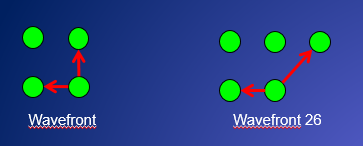

.. ========================= begin_copyright_notice ============================
  
  Copyright (C) 2021 Intel Corporation
  
  SPDX-License-Identifier: MIT
  
  =========================== end_copyright_notice =============================

=====================================================
Tutorial 4. Using Media Walker with Thread Dependence
=====================================================

Media-walker also incorporates a mechanism for launching threads in certain
partial order (a.k.a. setting thread-dependency pattern).

`Calculating the integral image
<../../CalcIntImage2_genx.cpp>`_
is a good example for using the
thread-dependence pattern provided with media walker.  In order
to compute integral image efficiently. we want to start the compuation
at the up-left corner, every pixel uses the results of its three
neighbors: up, left, and up-left. See the example CalcIntImage for
details. Here we only show the distinctive part of the host and device code.

In this example, we create thread space as before, then set the dependency
pattern. Media walker supports two dependence pattern:

* Wavefront: thread (x,y) depends on thread(x-1,y) and thread(x, y-1)

* Wavefront26: thread(x,y) depends on thread(x-1, y) and thread(x+1, y-1)

In this case, we use the wavefront pattern.

Host-Side
=========

.. literalinclude:: CalcIntImage2.cpp
   :language: c++
   :lines: 142-155

Kernel-Side
===========

Pay attention to sevearl cm-primitives related to the implementation of
thread-dependency. They are ``cm_wait()``, ``cm_fence()``, and ``cm_signal()``.

.. literalinclude:: CalcIntImage2_genx.cpp
   :lines: 24-30

.. literalinclude:: CalcIntImage2_genx.cpp
   :language: c++
   :lines: 101-162

