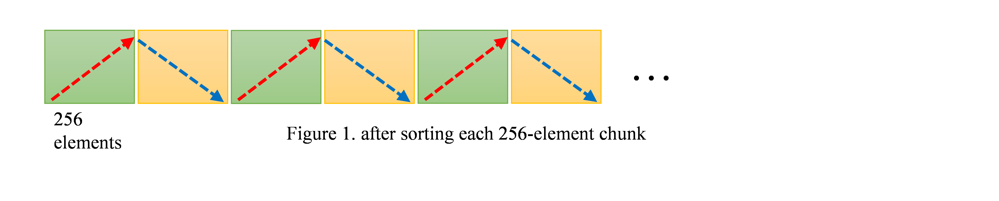
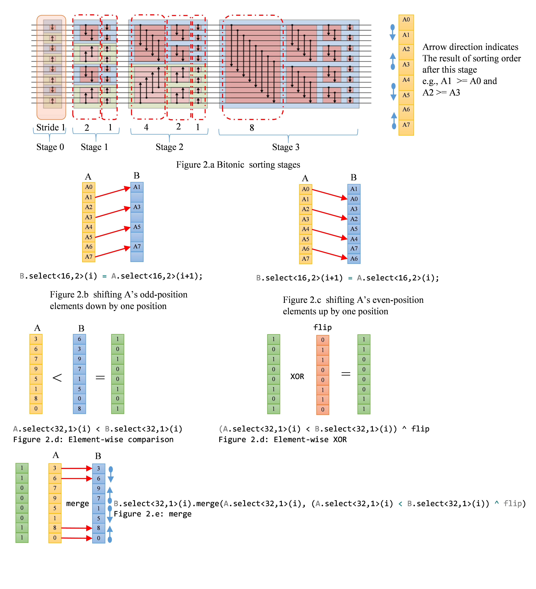
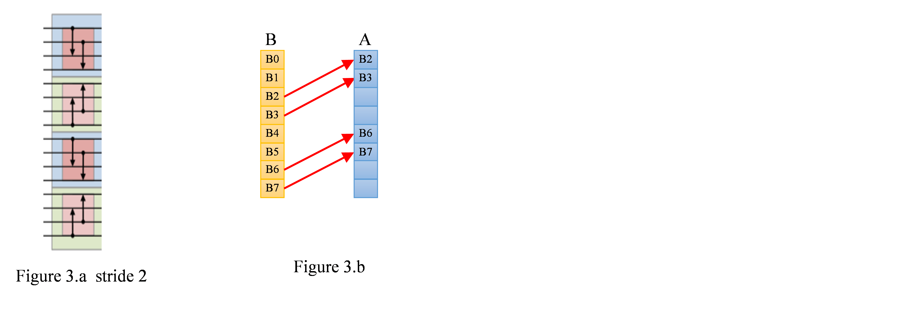
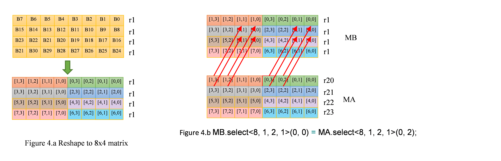
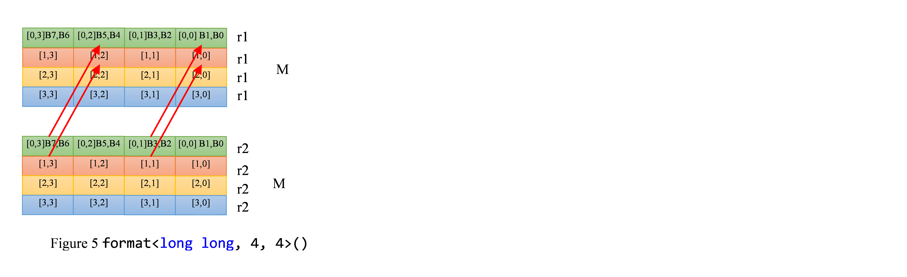
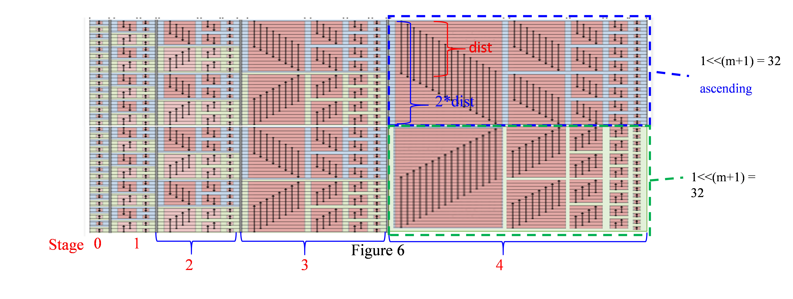
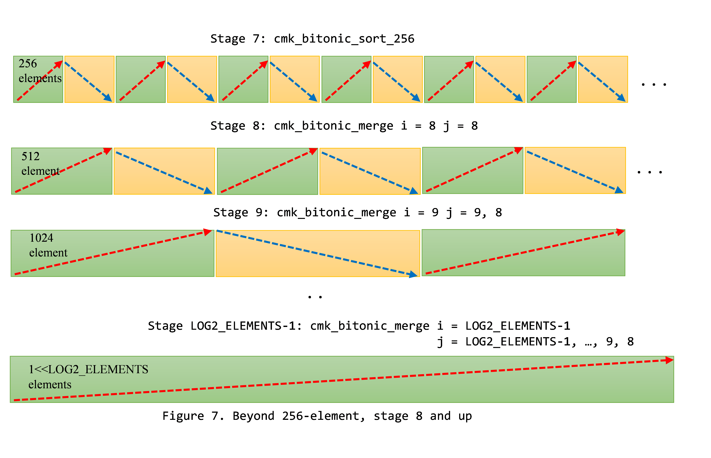
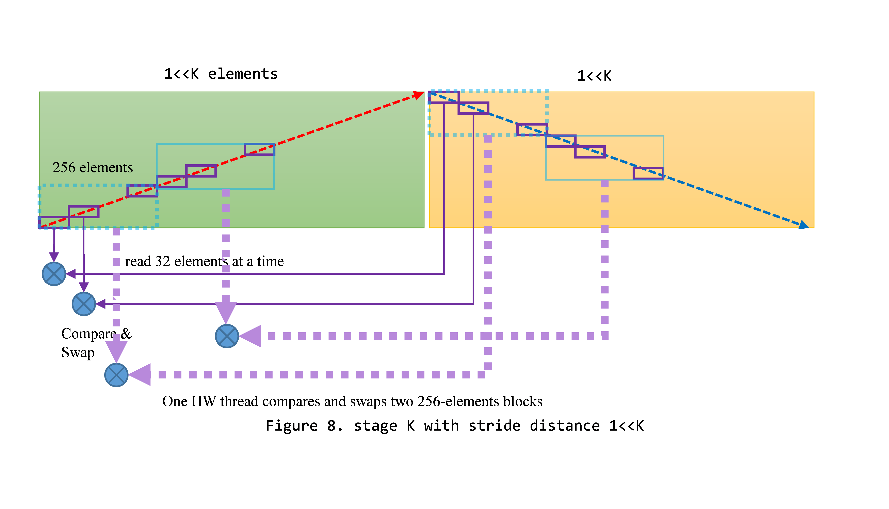

.. ========================= begin_copyright_notice ============================
  
  Copyright (C) 2021 Intel Corporation
  
  SPDX-License-Identifier: MIT
  
  =========================== end_copyright_notice =============================

==========================================
Tutorial 12. Kernel Deep-Dive: BitonicSort
==========================================

In this tutorial, we use BitonicSort as an example to explain how to
write effective kernel code.

Big picture: work division
==========================

To avoid loading/storing excessive data from/to memory, the implementation of the bitonic sort here tries to take advantage of GRF space and do as much work as possible locally without going through memory. The algorithm is implemented using 2 kernels, cmk_bitonic_sort_256 and cmk_bitonic_merge. Given an input, the algorithm first divides the data into 256-element chunks sorted by each HW threads. Since 256 elements are loaded into GRFs, swapping elements within a chunk leverages the expressiveness of Gen register regioning. Once cm_bitonic_sort_256 is complete, 256-elements are in bitonic sequence order as depicted in Figure 1.
Cmk_bitonic_merge takes two 256-chunks and performs swapping elements based on the sorting order directions, ascending or descending.

Sorting 16-element segment
==========================

In order to explain the implementation of 256-element sort, we first start with how to sort each 16-element segment.

16-element sort is implemented using functions bitonic_exchange{1,2,4,8}, which compare and swap elements with the particular strides. Figure 2.a shows all the steps.

The following is the code for bitonic_exchange1. Figure 2.b to Figure 2.e are the corresponding illustrations.

.. literalinclude:: BitonicSortK_genx.cpp
   :language: c++
   :lines: 232-268

The implementation of bitonic_exchange2, 4 and 8 are similar to bitonic_exchange1. The only difference is stride distance and different flip vector. Unlike other strides, the shuffling data patterns for stride 2 cannot be expressed concisely with Gen register regioning. Take the stride 2 in stage 1 as an example, depicted in Figure 3. The first step copies A[2], A[3], A[6] and A[7] to B[0], B[1], B[4] and B[5], respectively as indicated by red arrows in Figure 3.b.

A straightforward C for Metal implementation is to reshape vector A and B to 8x4 matrix and then use select() to copy elements. Reshaping vector to matrix does not generate any code. It is just a way how the compiler views the representation of the data of B. Let's assume that vector B[0-31] reside in r10-13. format<unsigned int, 8,4>() intrinsic reshapes the same data into a 8x4 matrix representation as shown in Figure 4.a.

.. code-block:: c++

  matrix_ref<unsigned int, 8, 4> MB = B.select<32, 1>(i).format<unsigned int, 8, 4>();
  matrix_ref<unsigned int, 8, 4> MA = A.select<32, 1>(i).format<unsigned int, 8, 4>();

Once both vector A and B are reshaped to 8x4 matrices, copying data from B to A is done by the following two simple C for Metal statements.

.. code-block:: c++

  MB.select<8, 1, 2, 1>(0, 0) = MA.select<8, 1, 2, 1>(0, 2);
  MB.select<8, 1, 2, 1>(0, 2) = MA.select<8, 1, 2, 1>(0, 0);

The source of the copy, MA.select<8, 1, 2, 1>(0, 2), maps to region rule well, e.g.,  r20.2<8; 8, 2>:ud.  However, the destination operand can have only horizontal stride, B.select<8, 1, 2, 1>(0, 0) cannot be mapped to Gen instruction efficiently.  The copy operation will be broken into multiple native instructions. Each mov copies only two elements, which is not SIMD efficient.

.. code-block:: c++

  mov (2) r122.0<1>:ud r57.2<2;2,1>:ud {Align1, Q1}
  mov (2) r122.4<1>:ud r57.6<2;2,1>:ud {Align1, Q1}
  mov (2) r123.0<1>:ud r58.2<2;2,1>:ud {Align1, Q1}
  mov (2) r123.4<1>:ud r58.6<2;2,1>:ud {Align1, Q1}
  . . .

To ameliorate the inefficiency caused by the destination restriction, we format vector A and B into matrix_ref<long long,4,4>. MB.select<4, 1, 2, 2>(0, 0) can be mapped to destination region well (stride 2) as shown in Figure 5.

.. code-block:: c++

   MB.select<4, 1, 2, 2>(0, 0) = MA.select<4, 1, 2, 2>(0, 1);

is compiled to

.. code-block:: c++

  mov (4) r34.0<2>:q r41.1<2;1,0>:q {Align1, Q1}
  mov (4) r36.0<2>:q r8.1<2;1,0>:q {Align1, Q1}
  mov (4) r34.1<2>:q r41.0<2;1,0>:q {Align1, Q1}
  mov (4) r36.1<2>:q r8.0<2;1,0>:q {Align1, Q1}

each mov copies four 64-bit data, which is 4X SIMD efficiency improvement over the straightforward implementation.

The following is the code for bitonic_exchange2.

.. literalinclude:: BitonicSortK_genx.cpp
   :language: c++
   :lines: 220-231

Sorting 256-element segment
===========================

To generate efficient code, bitonic_exchange{1,2,4,8} are inlined and loops that perform compare-and-swap are unrolled. The following code is just like what gets depicted in Figure 2.a. Init_masks are the flip vectors used during exchanges.

.. literalinclude:: BitonicSortK_genx.cpp
   :language: c++
   :lines: 58-117

.. literalinclude:: BitonicSortK_genx.cpp
   :language: c++
   :lines: 407-441

However, we need to avoid bloating code size in the meantime. Hence, Stage 4 to 7 are handled in a more generic fashion. Bitonic_merge takes care of one stage that handles all recursion exchange steps. Once 7 stages are done, 256 sorted elements are written out via cmk_write().

.. literalinclude:: BitonicSortK_genx.cpp
   :language: c++
   :lines: 442-447

Let's look at how bitonic_merge is implemented. A bitonic stage N has recursive steps to compare and swap elements with stride 1<<N, 1<<(N-1), ..., 8, 4, 2, 1. bitonic_merge is GRF based implementation that handles stride 1 to 128 compare-and-swap steps. For stride <= 128, 256 data items are kept in GRF. All compare-and-swap can all be completely done with GRF locally. Doing so avoids global synchronizations and repeating load/store 256-element chunks. Parameter m indicates the bitonic stage.  Parameter n indicates that bitonic_merge is handling stride 1<<n for bitonic stage m.

.. literalinclude:: BitonicSortK_genx.cpp
   :language: c++
   :lines: 269-399

Sorting more than 256 elements
==============================

A bitonic stage sorts elements with butterfly network. For a stage K, each compare-and-swap step halves the stride distance of its prior step. The recursive step continues until stride distance 1 is complete. When stride distance is greater than 7, there is global synchronization between two steps i and i+1. Each HW thread reads processes two 256-element chunks as depicted in Figure 8. The 256-element blocks circled by light-blue dotted lines are processed by one HW threads. Global synchronization is done via enqueue from the host side. C for Metal equeue is complete in FIFO order. Namely, one task will finish its job before the next enqueued tasks starts. The following code snippet is from the host code, BitonicSort.cpp, which is also depicted in Figure 7.

.. literalinclude:: BitonicSortK.cpp
   :language: c++
   :lines: 159-208

Finally, here is the cmk_bitonic_merge kernel

.. literalinclude:: BitonicSortK_genx.cpp
   :language: c++
   :lines: 451-516

