.. ========================= begin_copyright_notice ============================
  
  Copyright (C) 2021 Intel Corporation
  
  SPDX-License-Identifier: MIT
  
  =========================== end_copyright_notice =============================

========================================
Tutorial 13. Kernel Deep-Dive: RadixSort
========================================

In this tutorial, we use RadixSort as another example to explain how to
write effective kernel code.

High-level algorithm
====================

The implementation is sorting unsigned int (32-bit) values. It can be easily
adopted to sort signed integer values. The sorting starts from the least
significant bits (LSB). In each iteration, we extract 2-bit values and
put elements into 4 bins/buckets (BIN0, BIN1, BIN2 and BIN3) based on their
2-bit values, i.e., BIN0 for value 0. Once elements are binned, elements
in each bin are written out to an output buffer from BIN0 to BIN4 with FIFO
order. In the next iteration, the previously written output buffer is fed
as the input data buffer and the subsequent 2 bits are extracted and
the same binning is processed. For 32-bit integer, the whole process will
repeat 16 times. The algorithm is simple. The goal is to divide the binning
process so that the work can be done in parallel and efficiently mapped
to Intel GEN HW threads.  In this tutorial, we will present our implementation
in details.

The implementation is composed of three parts.

1. cmk_radix_count: which counts how many elements in each bin locally within each HW thread.

2. prefix sum: which cumulates the number of elements of bins of all threads.

3. cmk_radix_bucket: which reads a chunk of data, 256 elements, bins them into buckets, finally writes elements in each bucket to the output buffer based on the global positions calculated in step 2.

Worth to mention, we also have a version that handles 4 bits (16 bins) each
iteration, which only takes 8 iterations. In one casual measurement, we observed that 4-bit version was 30% faster than 2-bit version. However, illustrating 16-bin would be harder on paper.

Parallel bin counting
=====================

In order to utilize the parallel processing engines in GPU, We apply Map-Reduce
mechanism to this counting process. First, we divide input data into chunks
and Map computing local bin_cnt  for a data chunk to each HW thread. Then apply
Reduce operation to calculate prefix sum for all local bin_cnt. cmk_radix_count
basically reads in one chunk of data, 256 elements, and counts how many
elements in each bin. The local bin counts for each thread are written out to
a buffer as depicted in Figure 1.

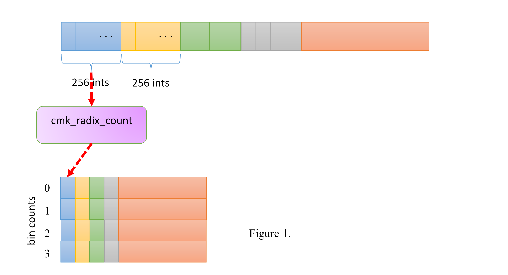

The following is the first part of the cmk_radix_count. Each time 32 elements
are read. Each lane counts its own bing counts within the lane. Figure 2 illustrate the process.

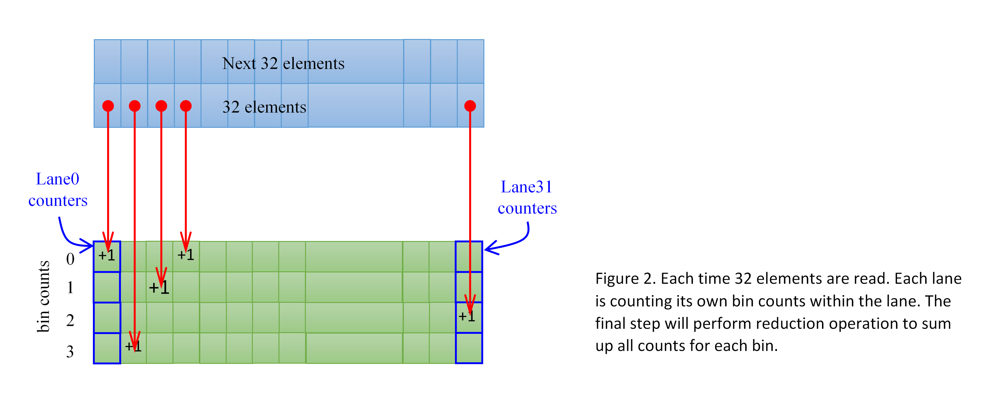

.. literalinclude:: radix_genx.cpp
   :language: c++
   :lines: 54-89

The final step performs reduction operation to sum all counts for each bin.
The most intuitive way to get sum reduction for each bin is to invoke cm_sum
intrinsic for each row. However, doing so leaves some performance on the table.
Instead of using cm_sum, we perform sum reduction for all rows together.
Doing so allows us to design the data layout of intermediate results so as
to exploit vectorization cross rows. Here are the steps we do to achieve
this goal.

The first step performs element-wise add for lower half and upper half data of
each row. The generated asm code is shown as well. The result is stored in
tmp_sum16 (r19-22). Each register (256 bits) holds an entire row, 16 unsigned
shorts (as shown in Figure 3.a). Each row of matrices in Figure 2 has
its own color.

.. code-block:: c++

  matrix<unsigned short, 4, 16> tmp_sum16;
  tmp_sum16 = counters.select<4, 1, 16, 1>(0, 0) + counters.select<4, 1, 16, 1>(0, 16);
  // corresponding assembly code
  add (16) r19.0<1>:w r17.0<8;8,1>:w r18.0<8;8,1>:w {Align1, H1} //#72:$55:
  add (16) r20.0<1>:w r15.0<8;8,1>:w r16.0<8;8,1>:w {Align1, H1} //#72:$56:
  add (16) r21.0<1>:w r13.0<8;8,1>:w r14.0<8;8,1>:w {Align1, H1} //#72:$57:
  add (16) r22.0<1>:w r11.0<8;8,1>:w r12.0<8;8,1>:w {Align1, H1} //#72:$58:

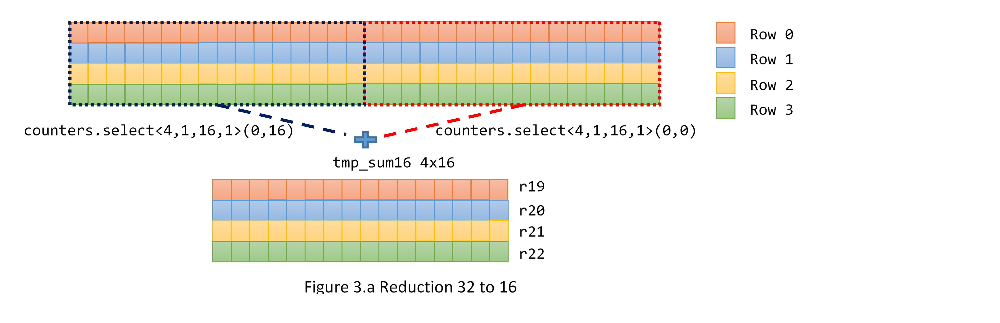

The 2nd step adds upper half and lower half of each row of tmp_sum16.
Because the intermediate result of the previous step is stored in 4x16
matrix, which occupies r19 to r22, Gen register regioning allows one
source operand to select lower half of two rows (likewise for the
upper half). For instance, r19.0<16;8,1>:w selects lower half of
row 0 and 1 (as depicted in Figure 3.b). C for Metal compiler generates only
two add instructions, one each for two rows.
the result of this step is stored in tmp_sum8 (4x8 matrix). Each row
has only 8 unsigned short. Compiler lays out 2 rows in one register.
e.g., row 0 and 1 in r23 and row 2 and 3 in r24.

.. code-block:: c++

  matrix<unsigned short, 4, 8> tmp_sum8;
  tmp_sum8 = tmp_sum16.select<4, 1, 8, 1>(0, 0) + tmp_sum16.select<4, 1, 8, 1>(0, 8);
  // assembly code
  add (16) r23.0<1>:w r19.0<16;8,1>:w r19.8<16;8,1>:w {Align1, H1} //#74:$60:
  add (16) r24.0<1>:w r21.0<16;8,1>:w r21.8<16;8,1>:w {Align1, H1} //#74:$61:

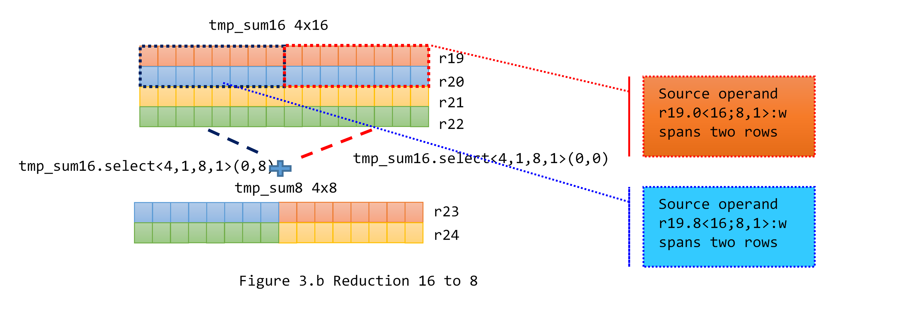

reduction of 4 rows in this steps can be done concisely with one
"add (16)" instruction. Source operand r23.0<8;4,1>:w selects lower
half data (4 element for each row) for 4 rows (as shown in Figure 3.c)

.. code-block:: c++

  matrix<unsigned short, 4,4> tmp_sum4;
  tmp_sum4 = tmp_sum8.select<4, 1, 4, 1>(0, 0) + tmp_sum8.select<4, 1, 4, 1>(0, 4);
  // assembly code
  add (16) r25.0<1>:w r23.0<8;4,1>:w r23.4<8;4,1>:w {Align1, H1} //#76:$63:

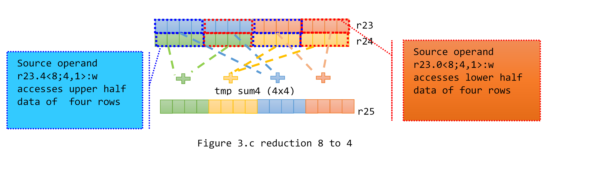

the final two steps do 4-to-2 and 2-to-1 reduction.
reduction of 4-to-2 is done with one add(8) instruction. Region <4;2,1>
allows us to choose the half data for each row (as shown in Figure 3.d).

.. code-block:: c++

  matrix<unsigned short, 4, 2> tmp_sum2;
  tmp_sum2 = tmp_sum4.select<4, 1, 2, 1>(0, 0) + tmp_sum4.select<4, 1, 2, 1>(0, 2);
  bin_cnt = tmp_sum2.select<4, 1, 1, 1>(0, 0) + tmp_sum2.select<4, 1, 1, 1>(0, 1);
  // assembly code
  add (8) r2.4<1>:w r25.0<4;2,1>:w r25.2<4;2,1>:w {Align1, Q1} //#78:$65:
  add (4) r26.0<1>:d r2.4<2;1,0>:uw r2.5<2;1,0>:uw {Align1, Q1} //#79:$67:

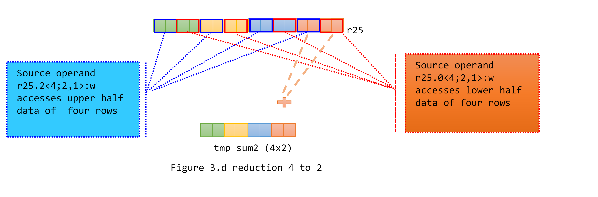

Global prefix sum
=================

Binning needs to maintain global ordering. Namely, when elements are written
out to the output buffer, elements in bin0 must happen before bin1, bin1
ahead of bin2, ..., etc. Furthermore, elements in a bin are written out in
FIFO order.  Maintaining the order is the fundamental part of the algorithm.
Radix sort is based on the assumption that if two numbers differ only on
the extracted bits we are currently examining, then the binning process
will put them into the right order --- the smaller value is in a smaller
bin number. The relative order for the two numbers is therefore properly
maintained. If the two numbers differ on some higher bit positions that
are not yet examined, it doesn't matter what we do now (i.e., which bins
we put them). Later binning iteration will put them into the right relative
order.  How to maintain the global ordering while mapping/distributing
the work to GPU threads is the essential design of our implementation.

We want to apply Map method to the binning process so that all threads
can do their binning independently. Prefix sum table is the essential
data structure for each thread to look up the starting memory address
to where it should write the data elements of its local bins/buckets.
For a given data size of 2^N, T = 2^(N-8) cmk_bin_count threads are
launched (each thread counts 256 elements). The output table from
cmk_bin_count has T entries (as shown in Figure 4 blue shaded table).
Each entry has four counts, one for each local bin count.  For each bin,
an entry i of the prefix sum table simply cumulatively sums up all entries
from 0 to I (light green shaded table). For simplicity of the example, 
we just perform perfix-sum on CPU. If you are interested in offloading
prefix-sum to GPU, we have another example and tutorial about that.

From the prefix sum table, we know how many elements of the input data
are in each bin (i.e., Thread T-1 entry: 4230, 4501, 3998, 3616).
For a thread K, its previous entry (k-1) tells how many cumulated elements
from its prior threads (0 to K-1).

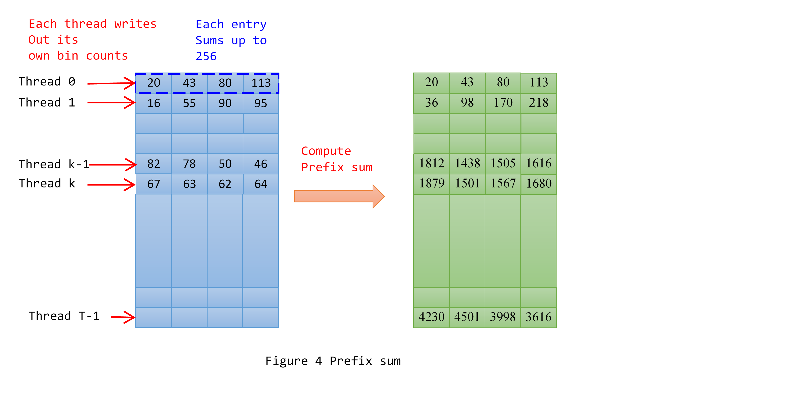

Parallel binning
================

With the prefix sum table ready, the binning process (done by cmk_radix_bucket)
can be mapped to HW threads and done completely in parallel.
Similar to cmk_radix_count, we divide the data into chunks (256 elements each)
and assign them to cmk_radix_bucket threads. cmk_radix_bucket with thread id
(x,y) reads in the same data chunk read by cmk_radix_count (x,y).
Take Thread K in Figure 4 as an example. Given Thread T-1 and K-1 entries,
Thread K can calculate the starting addresses to where its local bins will
be written (as shown in Figure 5). T-1 entry tells there are 4230, 4501, 3998
and 3612 elements in global bin0, bin1, bin2 and bin3, respectively.
(K-1)th entry tells how many elements from thread 0 to K-1. For example,
the starting addresses for thread K to write out its local bin data are

  Bin0: PrefixSum[K-1][0]   // 1812

  Bin1: PrefixSum[T-1][0] +  PrefixSum[K-1][1]  // 4230 + 1438

  Bin2: PrefixSum[T-1][0] +  PrefixSum[T-1][1] + PrefixSum[K-1][2]  // 4230 + 4501 + 1505

  Bin3: PrefixSum[T-1][0] +  PrefixSum[T-1][1] + PefixSum[T-1][2] + PrefixSum[K-1][3]

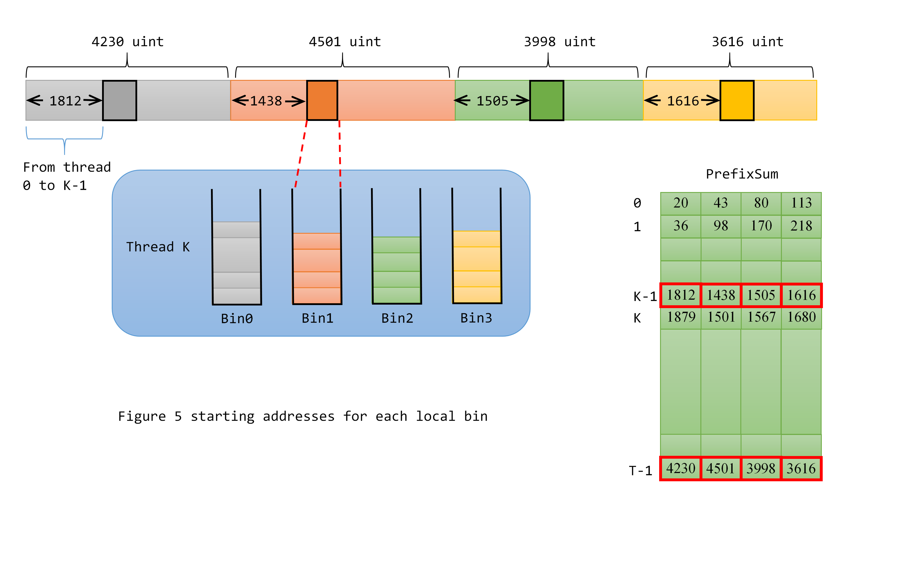

The following is the complete binning kernel.

.. literalinclude:: radix_genx.cpp
   :language: c++
   :lines: 117-240

Figure 6 explains how to find the position of each element in its bin. A prefix sum of a vector is computed, then added upon the "next" of the bin.

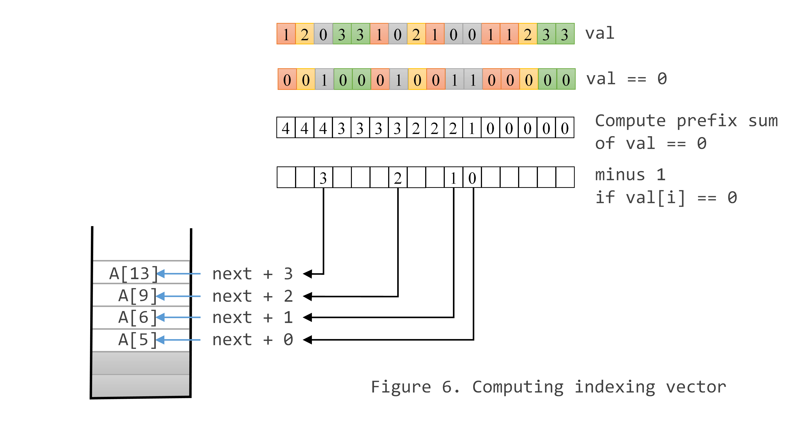

Now more details on how prefix sum of a vector is computed.
It takes log(N) steps to complete. For 32 elements, we need 5 steps.
Arrow indicate that head and tail are added and the result is stored in
the head location.  See Figure 7.

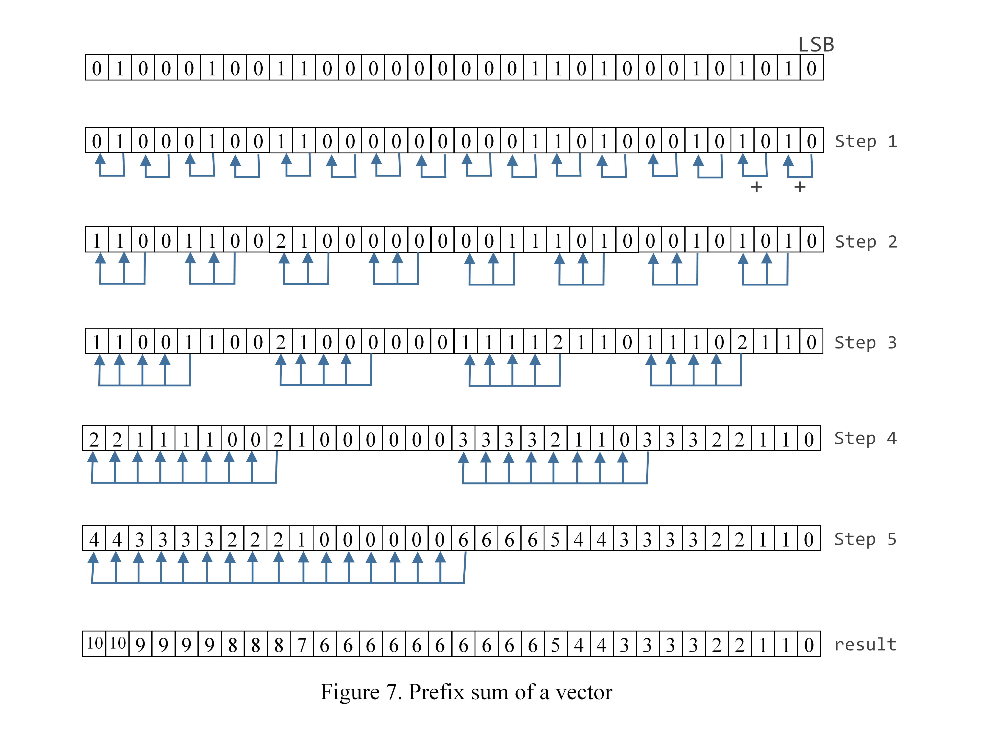

In step 3, we format matrix of uw type into unsigned long long type.
One unsigned long long has 4 uw. The maximum value of prefix sum is 32,
only i.e., every bit is set. No overflow will happen during prefix sum
computation. That is, one long long type add is equivalent to 4 uw additions.
16 additions of uw types can be collapsed into 4 qword additions.
What is more, one add instruction can express those 4 qword additions without
running into the destination stride restriction.

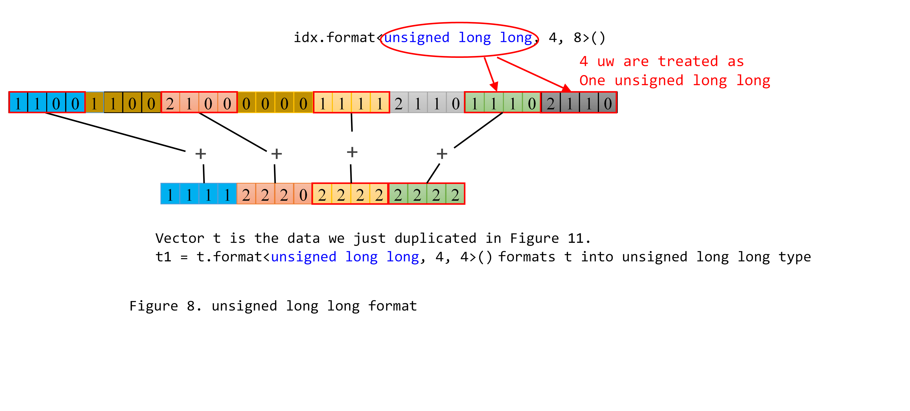

The following is the generated code for step 3 of sum reduction.

.. code-block:: c++

  // t = idx.replicate<16, 8, 4, 0>(0, 3);
  mov (16) r2.0<1>:w r12.3<8;4,0>:w {Align1, H1, NoMask} //#158:$78:
  mov (16) r7.0<1>:w r14.3<8;4,0>:w {Align1, H1, NoMask} //#158:$79:
  mov (16) r8.0<1>:w r16.3<8;4,0>:w {Align1, H1, NoMask} //#158:$80:
  mov (16) r9.0<1>:w r18.3<8;4,0>:w {Align1, H1, NoMask} //#158:$81:

  // m1.select<4, 1, 4, 2>(0, 1) += t1;
  add (4) r12.1<2>:q r12.1<2;1,0>:q r2.0<4;4,1>:q {Align1, Q1, NoMask} // for bin0
  add (4) r14.1<2>:q r14.1<2;1,0>:q r7.0<4;4,1>:q {Align1, Q1, NoMask} // for bin1
  add (4) r16.1<2>:q r16.1<2;1,0>:q r8.0<4;4,1>:q {Align1, Q1, NoMask} // for bin2
  add (4) r18.1<2>:q r18.1<2;1,0>:q r9.0<4;4,1>:q {Align1, Q1, NoMask} // for bin3

