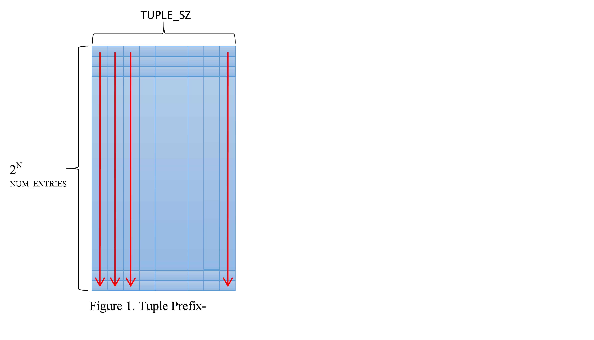
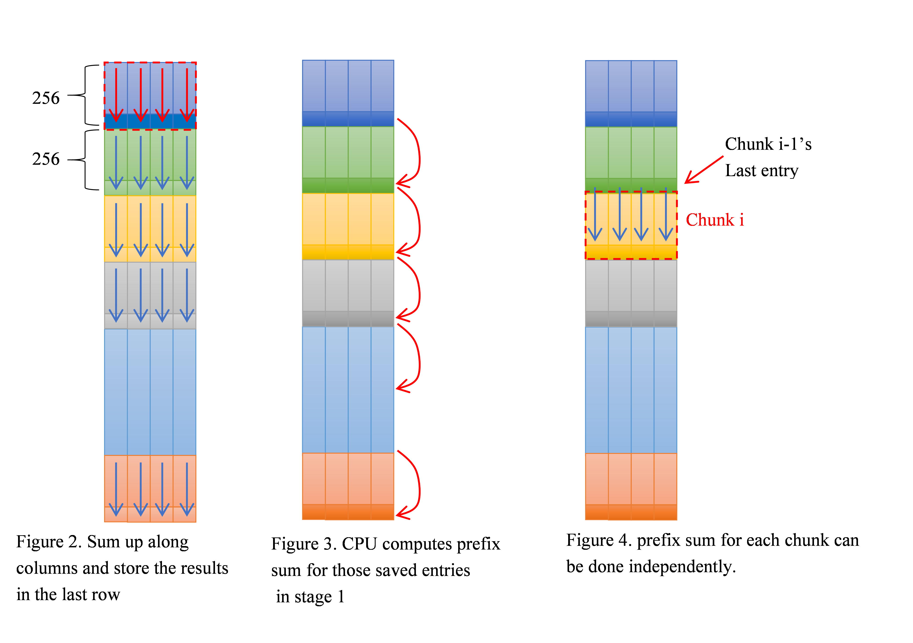

.. ========================= begin_copyright_notice ============================
  
  Copyright (C) 2021 Intel Corporation
  
  SPDX-License-Identifier: MIT
  
  =========================== end_copyright_notice =============================

=======================================
Tutorial 14. Kernel Example - PrefixSum
=======================================

Prefix sum is a fundamental building block in parallel programming.
The prefix sum kernel takes (2^N)*TUPLE_SZ table as input.
The prefix sum of a sequence of (2^N)*TUPLE_SZ values is a new sequence
of (2^N)*TUPLE_SZ values where the value at position (i,j) is the sum
of all the values in the input sequence of column j up to position i.
The code is shown below.

.. code-block:: c++

  for (int i = 1; i < NUM_ENTRIES; i++)
    for (int j = 0; j < TUPLE_SZ; j++)
        Table[i][j] += Table[i-1][j];

The algorithm has a loop-carried dependency which prevents parallelizing
the loops. Each i iteration can only be executed after the previous
iteration has finished.

To break the loop carried dependency so as to map the work to run efficiently
on GEN, we decompose the work into 3 stages.

1. Local count: the local count stage partitions the table into chunks.
Each chunk is 256xTUPLE_SZ. Each HW thread sums up values for each column
within one chunk and stores the results in the last entry of the chunk
(as depicted in Figure 2). All data chunks can be executed in parallel
in this stage.

.. literalinclude:: Prefix_genx.cpp
   :language: c++
   :lines: 53-79

2. Prefix sum of local counts: Stage 1 sums up values along the column
for each chunk and saves the results in the last row of each chunk.
Given N=25 (32M entries), there are 2^17 entries saved. This stage calculates
the prefix sum for those entries (highlighted in darker colors) computed
in Stage 1 as shown in Figure 3. Compared with the input size, the number
of entries needs to be calculated is cut down by a factor 256.
In our implementation, this stage is done by CPU. If the number of entries
is still large and inherently loop-carried dependency still imposes
a concern here, we can apply another local count hierarchically on those
entries. That is, each HW thread sums up 256 entries calculated by Stage 1.

.. literalinclude:: Prefix.cpp
   :language: c++
   :lines: 195-201

3. Global Prefix sum: For a given chunk i, the last entry of chunk (i-1)
tells the prefix sum up to chunk i. Computing prefix sum for all input
entries can be done in parallel. Each HW thread handles a 256-entry chunk.
It reads the last entry of its previous chunk as the initial value and
computes prefix sum for all entries within the chunk (as depicted in Figure 4).

.. literalinclude:: Prefix_genx.cpp
   :language: c++
   :lines: 86-127
