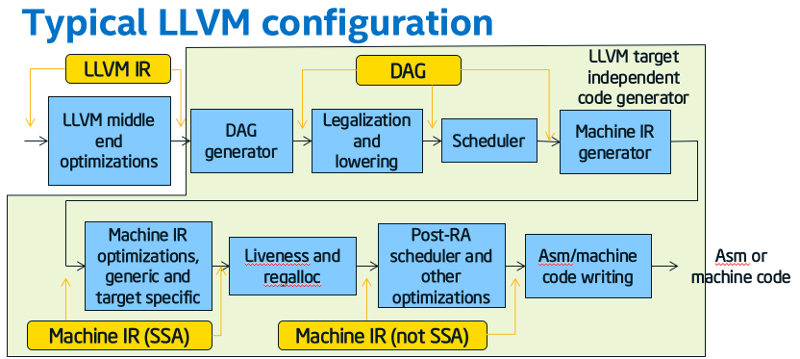
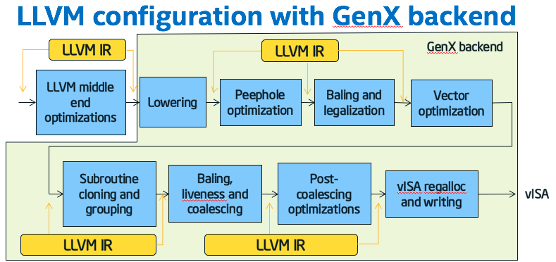

===================
GenX backend design
===================

.. contents::
   :local:
   :depth: 1

Introduction
============

The GenX backend for LLVM targets Intel HD Graphics, and represents EU code in
such a way that it represents the full functionality of an EU thread, such as
region addressing and SIMD control flow.

For more introductory material on the GenX backend, see :doc:`GenXIntro`.

This document does not cover the design of the Clang-based front end of the CM
compiler. Assuming you are reading this in a cm-llvm source tree where you have
built the documentation,
see `Internal documentation for CM
<../../../../support/docs/_build_internal/html/index_internal.html>`_.

LLVM intermediate representation of EU code
-------------------------------------------

The LLVM IR that the GenX backend expects to see is documented in :doc:`GenXLangRef`.

Users of the GenX backend
-------------------------

Currently the only user of the GenX backend is the CM compiler (the cm-llvm
project).

The GenX backend is designed to stand alone from the CM compiler, so it could be
used in other projects that require its whole-EU-thread representation. See the
section *Whole thread representation* in :doc:`GenXLangRef`.

Not using the LLVM target independent code generator
====================================================

Most LLVM targets use the target independent code generator. It mostly uses a
textual machine description that is compiled by tablegen as part of the build
process.

Using that machine description, the target converts the LLVM IR into a DAG form, 
legalizes and instruction selects it, runs a pre-RA scheduler, and converts it
into *machine IR*, which starts off as SSA, but is de-SSAd as part of the
register allocation process.

Disadvantages of the target independent code generator
------------------------------------------------------

The target independent code generator has a number of problems:

* We get lots of problems with the assumption that the target is a
  real CPU with real hardregs, when in fact we are targeting vISA with an
  effectively infinite number of registers.

* Even if we were targeting Gen directly, rather than vISA, the target
  independent code generator would not cope with Gen's almost byte addressable
  register file. Although it can cope with different size registers mapping to
  the same place, they have to be hierarchical (e.g. rax contains eax contains
  ax contains al and ah).

* In machine IR, an operand does not carry a type, only a register
  class. Instead the instruction implies the type (e.g. "add i32"). For the ALU
  ops, even though types are limited to a power of two number of elements limited
  to 32 bytes, we would have quite a few combinations, especially as GenX allows
  the source and destination to be different type and signedness. It is worse for
  one operand in a memory access or region access; such an operand can be any
  number of elements almost up to the entire register file size.

* The vector width legalization carried out on the DAG in the target independent
  code generator is nothing like what we want for region and operand
  legalization.

The alternative: use LLVM IR
----------------------------

The GenX backend does not use the target independent code generator. Instead it
keeps the program in LLVM IR and operates on that, right up to the vISA writer
at the end. It uses LLVM IR in conjunction with other on-the-side data
structures, as is normal with LLVM passes. (For example, LLVM keeps the
dominator tree as a separate on-the-side data structure.)

The GenX backend does have to jump through some hoops to use this approach:

* A single vISA instruction is represented in the LLVM IR by multiple
  instructions, with an on-the-side data structure, *baling info*, saying how
  the instructions are grouped together into *bales*.

* The LLVM IR continues to be SSA, even after the pass (GenXCoalescing) that
  effectively does the de-SSA. This works because GenXCoalescing inserts copies
  to implement the phi nodes, but in such a way that the phi nodes are still
  present. The on-the-side data structure describing liveness and how values
  are coalesced ensures that the operands and result of a particular phi node
  will be in the same register.

(Both IGC and Beignet avoid the target independent code generator too, but use
the slightly different approach of having their own non-SSA IR after LLVM IR.)

Restricting the LLVM IR through the GenX backend
------------------------------------------------

Although the GenX backend uses LLVM IR throughout, what can be represented
becomes more and more restricted as the IR is fed through the passes, until,
at the end, the GenXVisaFuncWriter pass is able to translate the LLVM IR
(together with baling information and register allocation) trivially into
vISA.

In the pass documentation below, an LLVM IR restriction is flagged like this:
**IR restriction**:

Core LLVM modifications
=======================

This list of core LLVM modifications includes only the changes concerning the
GenX backend and its intrinsic functions. There are further core LLVM modifications
specific to the CM compiler listed in the CM compiler design document.

Constant folding, instruction simplification and instruction combining changes
------------------------------------------------------------------------------

In LLVM, *constant folding* is where an instruction has all constant operands,
and uses of it are replaced by the computed constant result. *Instruction simplification*
is where a tree of one or more instructions
can be replaced by one of the operands or a constant.
*Instruction combining* is where a tree of one or more
instructions can be replaced by a new instruction.

GenX intrinsics participate in constant folding and instruction simplification
but not in instruction combining.

* ``lib/Analysis/ConstantFoldingGenX.cpp`` is a new file that does constant folding
  on GenX intrinsics. A hook to call it has been added to
  ``lib/Analysis/ConstantFolding.cpp``.

* ``lib/Analysis/InstructionSimplifyGenX.cpp`` is a new file that does instruction
  simplification on GenX intrinsics. A hook to call it has been added to
  ``lib/Analysis/InstructionSimplify.cpp``.

* ``lib/Analysis/ConstantFolding.cpp`` has an enhancement to fold a bitcast of a
  constant vector in the case that some elements are undef.

* ``lib/Analysis/InstructionSimplify.cpp`` has an enhancement to simplify a double
  bitcast to nothing at all where possible.

* ``lib/Analysis/InstructionSimplify.cpp`` has an enhancement to simplify
  ``(A & B) | (A & ~B)`` to ``A``. This was used by the non-optimal implementation
  of SIMD control flow, before the optimal implementation using goto instructions
  was done.

* ``lib/Analysis/InstructionSimplify.cpp`` could already turn ``select true, X, Y`` into
  ``X`` and ``select false, X, Y`` into ``Y``. We have added an enhancement to make
  this work for a vector select when the condition is partly undef and otherwise true,
  or partly undef and otherwise false.

* ``lib/Analysis/InstCombineMulDivRem.cpp`` has an enhancement to change sdiv to ashr
  when the dividend is known to be non-negative and the divisor is a power of two.
  (There was already code for when the division is known to be exact.)

* ``lib/Analysis/InstCombine.cpp`` has a fix to disable add -> or transformations,
  as it stops the GenX backend being able to spot a constant add to an indirect
  region index. **This change may be an obstacle to commoning up cm-llvm's LLVM code
  base with any othert LLVM-using project such as IGC.** You would need to
  revert this change and instead spot where an or can be turned back into an add
  in the GenX backend.

* ``lib/Analysis/InstCombineCasts.cpp`` has an enhancement to combine ``sitofp(zext(X))``
  to ``uitofp(X)``.

* ``lib/Analysis/InstructionSimplify.cpp`` and ``lib/Analysis/InstCombineCompares.cpp``
  have an enhancement to spot vector icmp of zext/sext from i1 with 0. When the icmp
  predicate is ne, the sequence can be turned into just the i1 input. When the icmp
  predicate is eq, the sequence can be turned into a not of the i1 input.

Other changes
-------------

* There are one- or two-line changes in various files to add the GenX backend. See
  commit ``2f92f3f5``, also the addition of ``include/llvm/IR/IntrinsicsGenX.td``
  in commit ``e7fa4729``.

* ``lib/Transforms/Scalar/IndVarSimplify.cpp`` has a change to disable ``SinkUnusedInvariants``.
  **This change may be an obstacle to commoning up cm-llvm's LLVM code base with any other
  LLVM-using project such as IGC.** You would need to check whether reverting this change increases
  spill in some tests, and, if so, do not revert until there is a better solution for
  moving and rematerializing code to reduce register pressure in the GenX backend.

* ``lib/IR/AsmWriter.cpp`` has an enhancement to add a comment with the source
  location when writing an Instruction in textual form, as happens in -print-after-all.

* ``include/llvm/IR/DiagnosticInfo.h`` has a bugfix to #include ``Module.h``.

* The new FunctionGroupPassManager is in ``lib/Target/GenX/FunctionGroup.h`` in the GenX
  backend, but the addition of a new pass type with associated pass manager required
  a few one line changes in core LLVM files. See commit ``99bab565``.

.. include:: autogenerated/GenXTargetMachine.rstinc

