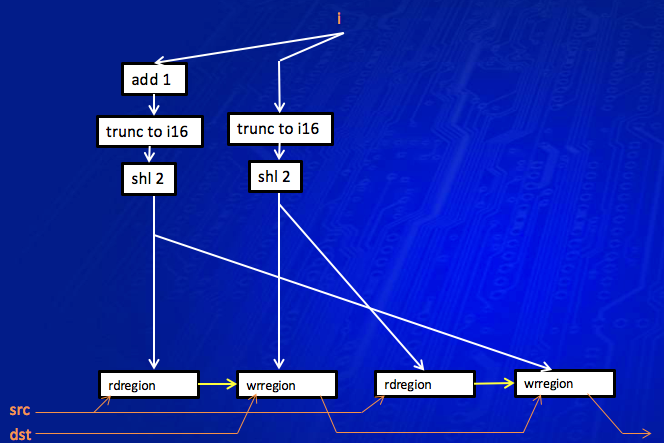
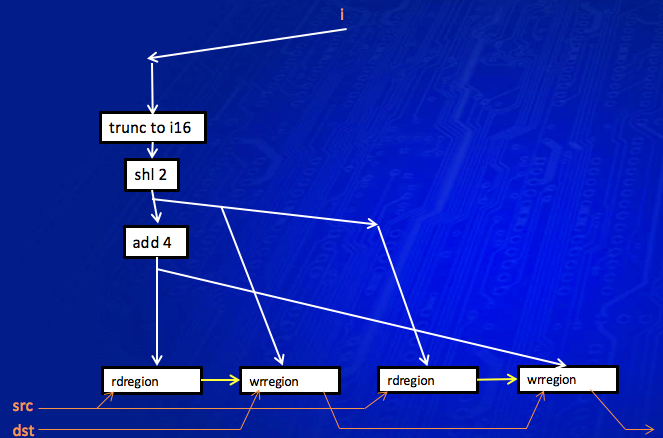
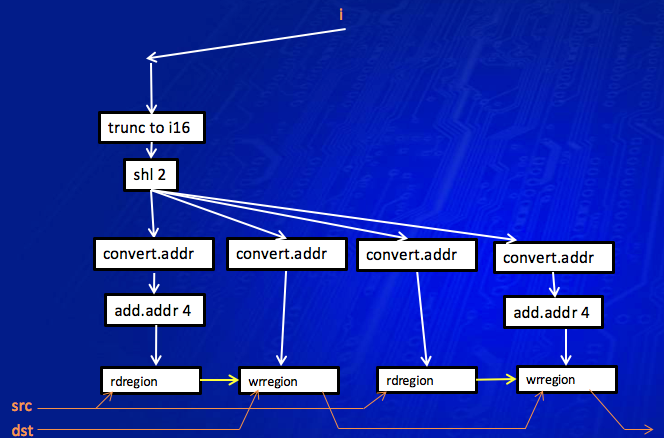
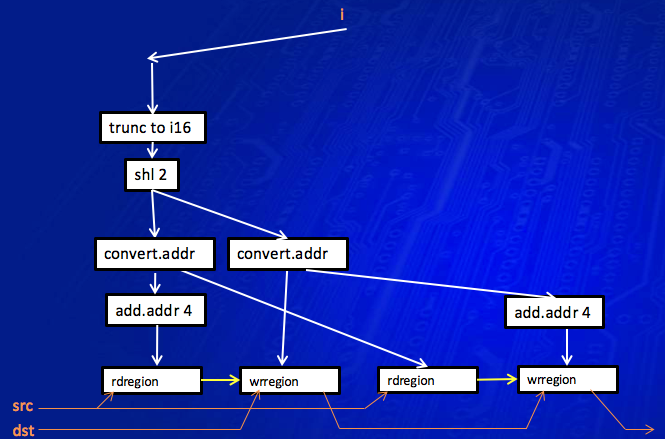

================================
Introduction to the GenX backend
================================

.. contents::
    :local:

LLVM IR representation of CM
============================

Static single assignment form
-----------------------------

Many compiler analyses and optimizations
need to find the possible definitions of a variable for a particular use, or
the possible uses of a particular definition of a variable. Compilers often use
def-use chains and use-def chains to represent these relationships and make
hopping between defs or uses more efficient.

An extension of the idea of a def-use chain
is *static single
assignment* form, or *SSA*, a
form of compiler intermediate language where each value has only one definition
and potentially multiple uses, and the def and uses are permanently linked
together. Each definition of a variable becomes a separate SSA value. A
definition *dominates* all of its uses (meaning that execution must pass through the
definition to be able to get to any use). A join point in the control flow
where a variable has two or more possible values (for example an endif or the
top of a loop) is handled by a *phi
node*, which counts as a new definition which in
turn dominates its uses.

The way that, in SSA, you can only create a
new value for a variable, and not modify it in place, is like programming in a
functional programming language. (Ignoring phi nodes.)

*Modern
Compiler Implementation in C* by Andrew W. Appel,
chapter 19, p433, lists several benefits of SSA:

#. Dataflow analysis and optimization algorithms
   can be made simpler when each variable has only one definition.

#. For a variable with N uses and M defs, the size
   of SSA is usually linear in N + M and thus linear in the size of the program,
   whereas non-SSA def-use and use-def chains take space and time proportional to
   N * M.

#. The dominance property of SSA simplifies
   interference graph construction, needed for register allocation (or, in our
   case, virtual register packing).

#. Unrelated webs of defs and uses of the same variable are obviously
   unrelated in SSA, and are not constrained to be in the same register.

To convert the SSA into real non-SSA
machine code (or in our case non-SSA vISA code), the compiler needs to
implement the phi nodes by inserting the appropriate copy at the end of each
predecessor block leading to the phi node. The compiler needs to do its best to
allocate values linked by a phi node into the same register, so no copy is
actually needed.

LLVM IR and SSA
^^^^^^^^^^^^^^^

LLVM is built from the ground up on SSA.
All the existing analyses and passes in LLVM rely on SSA. Using SSA usually
makes a compiler analysis or optimization simpler to express, and thus, in the
previous experience of the UK compiler team, easier to write and maintain and
more reliable.

LLVM IR and vISA/Gen
--------------------

Use of SSA
^^^^^^^^^^

The approach of cm-llvm is that we
want to use and benefit from LLVM's SSA as much as possible. For this reason,
we ensure that a CM scalar or vector variable is representable as SSA values in
LLVM IR, and is never left in an alloca. If we sometimes leave a variable in
memory, then it loses out on any existing LLVM analyses that use SSA, and it
makes it more difficult for us to write any pass that needs to process the
variable.

To ensure that a variable is never left in
an alloca (after LLVM's Mem2Reg pass), we never take the address of a variable,
and we never use a pointer to point at or into a vector or matrix.

A number of design decisions arise from
this:

* A region read is an intrinsic acting on a value,
  not on a variable in memory.

* A region write is an intrinsic acting on a value
  and returning the updated value, not modifying a variable in memory.

* Indirect indexing is represented as a region
  read/write with a variable index (like in CM's select and iselect), not using
  some notion of an address register that needs further analysis to determine
  what it could point to (like in vISA). The translation to vISA address register
  is done later on in the LLVM vISA code generator.

* Pass-by-ref in a call is represented by copy-in
  copy-out, where the callee takes the parameter by value and returns the updated
  value. If there is more than one pass-by-ref parameter, the callee returns a
  struct with the multiple updated values.

* Any read-from-memory intrinsic is declared such
  that it returns the read data, rather than passing in a reference to the area
  to write the data into.

An issue with this approach is that LLVM
will be considering a whole vector or matrix as a value, not regions inside it.
To fix that we have a vector decomposition pass to allow the use of a region to
be linked directly to a write of the same region where possible. 

See :doc:`GenXLangRef` for details on the LLVM IR accepted by the GenX backend.

CM and vISA representation
^^^^^^^^^^^^^^^^^^^^^^^^^^

The general principle is that LLVM IR represents
the functionality of vISA, but generalized in the following ways to make it
more convenient to represent CM:

* no restriction on vector/matrix size;

* no restriction on region size or GRF crossing;

* no restriction on number of values (general,
  address or state);

* a 2D region write is allowed;

Restrictions to vISA functionality are
imposed to ease code analysis within LLVM (as mentioned above):

* No concept of an address variable being set to the address of a general
  variable. Instead, the intrinsics for region addressing take a variable
  offset.

The GenX backend
================

The GenX backend is the part of the cm-llvm compiler that takes the LLVM IR used
to represent CM and vISA, and generates actual vISA.

Almost all LLVM backends (targets) use the *target independent code generator*.
The GenX backend does not; instead it continues to use LLVM IR through the
backend, with many passes transforming the LLVM IR in order to further restrict
what can be represented, until at the end the GenXVisaFuncWriter pass writes
the LLVM IR as vISA.

The use of LLVM IR in the GenX backend is discussed more fully
in :doc:`GenXDesign`.

Example walk-throughs
=====================

Example: simple arithmetic
--------------------------

Here is a source line from Scale_FaceDetect, doing a simple bit of arithmetic
on a vector of 2 ints:

.. code-block:: c++

  vector<int, 2> rd_y;
  ...
  rd_y <<= 3;

This ends up as the following vISA:

.. code-block:: text

  LOC 65
  shl (M1, 2) V60(0,0)<1>:d V60(0,0)<0;2,1>:d 0x3:d

Here we see what happens to this source statement in LLVM and the GenX backend
to get to this vISA.

After clang
^^^^^^^^^^^

Clang gives each variable a space on the stack using alloca. Each use of the
variable loads from that memory location, and each def of it stores to the
memory location.

.. code-block:: llvm

  %rd_y = alloca <2 x i32>, align 8
  ...
  %10 = load <2 x i32>* %rd_y, align 8, !dbg !200, !tbaa !186
  %shl = shl <2 x i32> %10, <i32 3, i32 3>, !dbg !200
  store <2 x i32> %shl, <2 x i32>* %rd_y, align 8, !dbg !200, !tbaa !186

After SRoA
^^^^^^^^^^

SROA (scalar replacement of aggregates) is the standard LLVM pass
that promotes the alloca
variables from clang into LLVM IR values, in SSA so each value has exactly one
def.

.. code-block:: llvm

  %shl = shl <2 x i32> %wrregion17, <i32 3, i32 3>, !dbg !195

There are now multiple separate values for what was the variable rd_y. Here we
see %wrregion17 for the value just before this line, and %shl for the value
defined in this line as a result of the shift left. These values now have
no connection with the original variable declaration (other than in debug info,
which the GenX backend does not yet implement).

Categories
^^^^^^^^^^

This example is so simple that nothing else happens to it until we reach
the GenXCategory pass in the GenX backend. 
The two values of the original
variable, %wrregion17 and %shl, are both set to category ``{general}``, because
there is no def or use in some other category (address, predicate, surface,
sampler, vme).

The category of a value is stored in a ``LiveRange`` object created for the
value. At this stage, the ``LiveRange`` does not yet have any live range
information; this is added in GenXLiveRanges below.

Live ranges
^^^^^^^^^^^

The next step is to determine the live ranges of these values.

First, the GenXLiveRanges pass numbers the IR instructions.

.. code-block:: text

  [804]  %shl.i.i142 = shl <2 x i32> %wrregion17.i.i141, <i32 3, i32 3>, !dbg !247 // line 65

Then it determines each live range in terms of those instruction numbers:

.. code-block:: text

  wrregion17.i.i141:[797,804){general}
  shl.i.i142:[804,2444){general}

Here we see that the live range of %wrregion17.i.i141 finishes at instruction
804, and the live range of %shl.i.i142 starts at instruction 804.

The instruction numbering and the live ranges are kept in a separate "on the side"
data structure, the analysis pass GenXLiveness. This is then maintained through
subsequent passes; each pass states that it maintains the GenXLiveness analysis.

An "on the side" data structure, an analysis pass, is the standard way of adding
information to LLVM IR without having to extend the IR data structures. The instruction
numbering is kept in a map from an ``Instruction *`` to an integer giving the number;
the live ranges are kept in a map from a ``Value *`` to the ``LiveRange *``.
Looking something up in a map has log(n) complexity, thus making the algorithm
that uses it have at least n log(n) complexity (which it probably had already).

A ``LiveRange`` object contains

* a vector of all the Values that are attached to it (initially just one,
  but possibly more after coalescing);
* a vector of segments each with inclusive start and exclusive end instruction
  number;
* the vISA register category of the live range.

The segments are kept in order, with no abutting or overlapping segments.

vISA register allocation
^^^^^^^^^^^^^^^^^^^^^^^^

In principle, vISA register allocation simply allocates a new vISA register to
each live range (after coalescing, which did not happen in this example). If
a single live range is used with different types, then each distinct type gets
a vISA register alias of the base register.

However, vISA register allocation performs one form of coalescing,
*extra coalescing*. The point of most coalescing is to remove copy instructions;
the point of extra coalescing is just to reduce the number of vISA registers
to reduce the chance of fragmentation in the jitter register allocator.

In this case, extra coalescing sees that the %wrregion17.i.i141 operand and the
%shl.i.i142 result of this shl instruction do not interfere, and have the same
size, so it coalesces them together, giving a single merged live range.

Then vISA the register allocator allocates the register V60 to this coalesced
live range:

.. code-block:: text

  [v60]  %shl.i.i142 = shl <2 x i32> %wrregion17.i.i141, <i32 3, i32 3>, !dbg !247

The results of vISA register allocation are kept in another "on the side" data
structure for the use of the vISA function writer.

vISA function writer
^^^^^^^^^^^^^^^^^^^^

The vISA function writer writes the shl instruction as vISA, looking up the vISA
register of each (non-constant) operand in the vISA register allocation analysis,
resulting in this code:

.. code-block:: text

  LOC 65
  shl (M1, 2) V60(0,0)<1>:d V60(0,0)<0;2,1>:d 0x3:d

Note that the vISA register allocator has also output a ``LOC 65``, giving the
source line number of this instruction. An LLVM IR instruction can include a
*debug location* (a ``DebugLoc``), which is maintained through all the passes,
as long as any pass that modifies the code remembers to set the debug location
on any new instruction it creates (calling ``getDebugLoc()`` on the old
instruction and using the result in ``setDebugLoc()`` on the new instruction).
The vISA function writer uses the debug location to output FILE and LOC vISA
instructions.

Example: read region, baling, legalization, vector decomposition
----------------------------------------------------------------

Here is a source line from linear, reading a region from a uchar matrix
and converting it to float:

.. code-block:: c++

    matrix<uchar, 8, 32> in;
    matrix<float, 6, 24> m;
    ...
    m  = in.select<6,1,24,1>(1,3);

This ends up as the following vISA:

.. code-block:: text

  LOC 23
  mov (M1, 16) V91(0,0)<1>:f V36(1,3)<0;16,1>:ub
  mov (M1, 16) V103{V95}(0,0)<1>:f V36(1,19)<16;8,1>:ub
  mov (M1, 16) V103{V95}(2,0)<1>:f V36(2,11)<0;16,1>:ub
  mov (M1, 16) V92(0,0)<1>:f V36(3,3)<0;16,1>:ub
  mov (M1, 16) V104{V97}(0,0)<1>:f V36(3,19)<16;8,1>:ub
  mov (M1, 16) V104{V97}(2,0)<1>:f V36(4,11)<0;16,1>:ub
  mov (M1, 16) V93(0,0)<1>:f V36(5,3)<0;16,1>:ub
  mov (M1, 16) V105{V99}(0,0)<1>:f V36(5,19)<16;8,1>:ub
  mov (M1, 16) V105{V99}(2,0)<1>:f V36(6,11)<0;16,1>:ub

Note that the uchar matrix in is represented by a single vISA register V36,
but the float matrix m has been split into several vISA registers. This
helps to reduce register fragmentation in the jitter's register allocator.

After SRoA
^^^^^^^^^^

Once SRoA has got rid of the allocas, loads and stores, and converted the variables
to multiple SSA values, we have this IR:

.. code-block:: llvm

  %rdr.rows = tail call <192 x i8> @llvm.genx.rdregion.v192i8.v256i8.i16(<256 x i8> %call1.i.i, i32 32, i32 32, i32 1, i16 32, i32 32), !dbg !42
  %rdr.cols = tail call <144 x i8> @llvm.genx.rdregion.v144i8.v192i8.i16(<192 x i8> %rdr.rows, i32 32, i32 24, i32 1, i16 3, i32 32), !dbg !42
  %conv = uitofp <144 x i8> %rdr.cols to <144 x float>, !dbg !42

Here we see the ``llvm.genx.rdregion`` intrinsic, which is used to represent a
read of a region. Intrinsics are the extension mechanism of LLVM IR; inventing
a new IR Instruction is more difficult and not recommended.
The ``.v144i8.v192i8.i16`` suffix specifies the overloaded
types in the intrinsic. The arguments are as follows (using the second rdregion
as an example):

``<192 x i8> %rdr.rows``
    The input vector/matrix
``i32 32``
    vstride
``i32 24``
    width
``i32 1``
    stride
``i16 3``
    start index in bytes
``i32 32``
    parent width -- ignored when the index is constant

A 2D region read is implemented as two separate rdregions by clang, one to read
the requested rows out of the original matrix, then the second to read the
requested columns out of those rows. Splitting it like this provides
useful information to GenXRegionCollapsing if either or both of the indices
are variable; clang does the split anyway for the constant indices case
for uniformity.

At this stage, a region in the IR is not necessarily a legal vISA region.

Region collapsing
^^^^^^^^^^^^^^^^^

GenXRegionCollapsing implements collapsing (combining) rdregion and wrregion
instructions. Part of the requirement of this comes from the way that a 2D
region access is split into row then column access. But it also deals with
cases where the original source had two region accesses -- a select of a select --
that can be combined.

At this stage, a region is not necessarily a legal vISA region, but it has to
be representable as a 2D region, with vstride, width and stride.
GenXRegionCollapsing has to go to some effort to ensure that this is the case,
more so when a variable index is involved.

In this example, the two rdregions can be combined, recreating the region that
the original source was using, which was a 6x24 region in an 8x32 matrix with
a start index of 35 (1 row and 3 columns).

.. code-block:: llvm

  %rdr.cols.regioncollapsed = call <144 x i8> @llvm.genx.rdregion.v144i8.v256i8.i16(<256 x i8> %call1.i.i, i32 32, i32 24, i32 1, i16 35, i32 undef), !dbg !42
  %conv = uitofp <144 x i8> %rdr.cols.regioncollapsed to <144 x float>, !dbg !42

First baling
^^^^^^^^^^^^

GenXBaling is the pass that spots when multiple IR instructions can be combined
into a single vISA instruction. It does not actually combine them (if it did we
would need intrinsics for all the vISA instructions with all operands
regions and with modifiers). Instead it is an analysis pass that constructs
an "on the side" data structure marking how the IR instructions are combined
into a **bale**.

A **bale** is a tree of IR instructions that will be combined into a vISA
instruction. The **head** of the bale is the last instruction in code order,
the root of the tree, which is the only instruction whose value is used outside
the bale. The **main instruction** of a bale is the IR instruction that
corresponds to the actual vISA instruction, such as add. It is possible to have
a bale with no main instruction, such as when the bale just reads a region and
writes the result into another region. This would become a vISA mov instruction.

GenXBaling is not a pure analysis, in that it can modify the IR. If it decides
to bale an IR instruction (e.g. a rdregion) into another instruction even though
it has multiple uses, it clones the instruction such that the one baled in has
only a single use.

GenXBaling keeps the baling information in the form of a map from an
``Instruction *`` to a ``BaleInfo``. The ``BaleInfo`` for an instruction is a
bitmap of which operands are baled in, plus a field indicating the instruction's
role in the bale, for example rdregion or modifier or main instruction.

Some other passes that use baling information then ask GenXBaling to create
a ``Bale`` from an instruction known to be the head of a bale. A ``Bale`` is
essentially a vector of the instructions in the bale. A ``Bale`` is not persistent
between passes.

GenXBaling runs in two places in the GenX backend. First baling is run just
before GenXLegalization. In this example, the rdregion is baled into the
uitofp.

.. code-block:: text

  bale {
     %rdr.cols.regioncollapsed = call <144 x i8> @llvm.genx.rdregion.v144i8.v256i8.i16(<256 x i8> %call1.i.i, i32 32, i32 24, i32 1, i16 35, i32 undef), !dbg !42 {rdregion} // line 23
     %conv = uitofp <144 x i8> %rdr.cols.regioncollapsed to <144 x float>, !dbg !42 // line 23
  }

Legalization
^^^^^^^^^^^^

As shown in this example, IR can represent arbitrary size vector operations
and region reads and writes. It is the job of GenXLegalization to split
an illegally sized vector operation or illegally strided or GRF crossing
region.

GenXLegalization considers a whole bale (using the information from first
baling above). Generally, with a bale that potentially has some rdregions,
a main instruction and a wrregion, it calculates the split that gives
legal regions and vector size for the whole bale. There are cases where it
has to unbale, that is, remove say a rdregion from a bale and consider
it separately, resulting in separate mov instruction(s) for that region.

In this case, the rdregion has a 6x24 region in an 8x32 matrix, and it
needs to be done as

* a 1D 16 wide vector to cover the first 2/3 of the first row;
* a 2D 2x8 region to cover the last 1/3 of the first row and the first 1/3
  of the second row;
* a 1D 16 wide vector to cover the last 2/3 of the second row;
* and so on for the other rows.

For each split, GenXLegalization needs to create:

* a rdregion to read the smaller subregion out of the original input;
* a smaller uitofp instruction;
* a wrregion to join the result of the uitofp back up with the other
  splits.

.. code-block:: llvm

  %rdr.cols.regioncollapsed3 = call <16 x i8> @llvm.genx.rdregion.v16i8.v256i8.i16(<256 x i8> %call1.i.i, i32 16, i32 16, i32 1, i16 35, i32 undef), !dbg !42
  %conv4 = uitofp <16 x i8> %rdr.cols.regioncollapsed3 to <16 x float>, !dbg !42
  %conv.addedwrregion.join = call <144 x float> @llvm.genx.wrregion.v144f32.v16f32.i16.i1(<144 x float> undef, <16 x float> %conv4, i32 16, i32 16, i32 1, i16 0, i32 undef, i1 true), !dbg !42
  %rdr.cols.regioncollapsed5 = call <16 x i8> @llvm.genx.rdregion.v16i8.v256i8.i16(<256 x i8> %call1.i.i, i32 16, i32 8, i32 1, i16 51, i32 undef), !dbg !42
  %conv6 = uitofp <16 x i8> %rdr.cols.regioncollapsed5 to <16 x float>, !dbg !42
  %conv.addedwrregion.join7 = call <144 x float> @llvm.genx.wrregion.v144f32.v16f32.i16.i1(<144 x float> %conv.addedwrregion.join, <16 x float> %conv6, i32 16, i32 16, i32 1, i16 64, i32 undef, i1 true), !dbg !42
  %rdr.cols.regioncollapsed8 = call <16 x i8> @llvm.genx.rdregion.v16i8.v256i8.i16(<256 x i8> %call1.i.i, i32 16, i32 16, i32 1, i16 75, i32 undef), !dbg !42
  %conv9 = uitofp <16 x i8> %rdr.cols.regioncollapsed8 to <16 x float>, !dbg !42
  %conv.addedwrregion.join10 = call <144 x float> @llvm.genx.wrregion.v144f32.v16f32.i16.i1(<144 x float> %conv.addedwrregion.join7, <16 x float> %conv9, i32 16, i32 16, i32 1, i16 128, i32 undef, i1 true), !dbg !42
  %rdr.cols.regioncollapsed11 = call <16 x i8> @llvm.genx.rdregion.v16i8.v256i8.i16(<256 x i8> %call1.i.i, i32 16, i32 16, i32 1, i16 99, i32 undef), !dbg !42
  %conv12 = uitofp <16 x i8> %rdr.cols.regioncollapsed11 to <16 x float>, !dbg !42
  %conv.addedwrregion.join13 = call <144 x float> @llvm.genx.wrregion.v144f32.v16f32.i16.i1(<144 x float> %conv.addedwrregion.join10, <16 x float> %conv12, i32 16, i32 16, i32 1, i16 192, i32 undef, i1 true), !dbg !42
  %rdr.cols.regioncollapsed14 = call <16 x i8> @llvm.genx.rdregion.v16i8.v256i8.i16(<256 x i8> %call1.i.i, i32 16, i32 8, i32 1, i16 115, i32 undef), !dbg !42
  %conv15 = uitofp <16 x i8> %rdr.cols.regioncollapsed14 to <16 x float>, !dbg !42
  %conv.addedwrregion.join16 = call <144 x float> @llvm.genx.wrregion.v144f32.v16f32.i16.i1(<144 x float> %conv.addedwrregion.join13, <16 x float> %conv15, i32 16, i32 16, i32 1, i16 256, i32 undef, i1 true), !dbg !42
  %rdr.cols.regioncollapsed17 = call <16 x i8> @llvm.genx.rdregion.v16i8.v256i8.i16(<256 x i8> %call1.i.i, i32 16, i32 16, i32 1, i16 139, i32 undef), !dbg !42
  %conv18 = uitofp <16 x i8> %rdr.cols.regioncollapsed17 to <16 x float>, !dbg !42
  %conv.addedwrregion.join19 = call <144 x float> @llvm.genx.wrregion.v144f32.v16f32.i16.i1(<144 x float> %conv.addedwrregion.join16, <16 x float> %conv18, i32 16, i32 16, i32 1, i16 320, i32 undef, i1 true), !dbg !42
  %rdr.cols.regioncollapsed20 = call <16 x i8> @llvm.genx.rdregion.v16i8.v256i8.i16(<256 x i8> %call1.i.i, i32 16, i32 16, i32 1, i16 163, i32 undef), !dbg !42
  %conv21 = uitofp <16 x i8> %rdr.cols.regioncollapsed20 to <16 x float>, !dbg !42
  %conv.addedwrregion.join22 = call <144 x float> @llvm.genx.wrregion.v144f32.v16f32.i16.i1(<144 x float> %conv.addedwrregion.join19, <16 x float> %conv21, i32 16, i32 16, i32 1, i16 384, i32 undef, i1 true), !dbg !42
  %rdr.cols.regioncollapsed23 = call <16 x i8> @llvm.genx.rdregion.v16i8.v256i8.i16(<256 x i8> %call1.i.i, i32 16, i32 8, i32 1, i16 179, i32 undef), !dbg !42
  %conv24 = uitofp <16 x i8> %rdr.cols.regioncollapsed23 to <16 x float>, !dbg !42
  %conv.addedwrregion.join25 = call <144 x float> @llvm.genx.wrregion.v144f32.v16f32.i16.i1(<144 x float> %conv.addedwrregion.join22, <16 x float> %conv24, i32 16, i32 16, i32 1, i16 448, i32 undef, i1 true), !dbg !42
  %rdr.cols.regioncollapsed26 = call <16 x i8> @llvm.genx.rdregion.v16i8.v256i8.i16(<256 x i8> %call1.i.i, i32 16, i32 16, i32 1, i16 203, i32 undef), !dbg !42
  %conv27 = uitofp <16 x i8> %rdr.cols.regioncollapsed26 to <16 x float>, !dbg !42
  %conv.addedwrregion.join28 = call <144 x float> @llvm.genx.wrregion.v144f32.v16f32.i16.i1(<144 x float> %conv.addedwrregion.join25, <16 x float> %conv27, i32 16, i32 16, i32 1, i16 512, i32 undef, i1 true), !dbg !42

Note that baling information has now been discarded, as it applied to the original
unsplit instructions, not these new split instructions.

GenXPostLegalization and vector decomposition
^^^^^^^^^^^^^^^^^^^^^^^^^^^^^^^^^^^^^^^^^^^^^

One of the purposes of the GenXPostLegalization pass is to call
GenXVectorDecomposer.

For a vector written by wrregion and read by rdregion (often
but not always from legalization),
the vector decomposer it finds the way that
the vector can be divided into parts, with each part a range of one or more
GRFs, such that no rdregion or wrregion crosses a part boundary. Then it
decomposes the vector into those parts. A rdregion/wrregion that reads/writes
a whole part can be removed completely; a rdregion/wrregion that reads/writes
only some of the part is replaced to read/write just the applicable part.

In fact it does all this for a web of vectors linked by wrregion, phi nodes
and bitcasts.

The idea is that having lots of small vectors instead of one big vector
reduces register fragmentation in the finalizer's register allocator.

.. code-block:: llvm

  %rdr.cols.regioncollapsed3 = call <16 x i8> @llvm.genx.rdregion.v16i8.v256i8.i16(<256 x i8> %call1.i.i, i32 16, i32 16, i32 1, i16 35, i32 undef), !dbg !42
  %conv4 = uitofp <16 x i8> %rdr.cols.regioncollapsed3 to <16 x float>, !dbg !42
  %rdr.cols.regioncollapsed5 = call <16 x i8> @llvm.genx.rdregion.v16i8.v256i8.i16(<256 x i8> %call1.i.i, i32 16, i32 8, i32 1, i16 51, i32 undef), !dbg !42
  %conv6 = uitofp <16 x i8> %rdr.cols.regioncollapsed5 to <16 x float>, !dbg !42
  %conv.addedwrregion.join7.decomp.1 = call <32 x float> @llvm.genx.wrregion.v32f32.v16f32.i16.i1(<32 x float> undef, <16 x float> %conv6, i32 0, i32 16, i32 1, i16 0, i32 undef, i1 true), !dbg !42
  %rdr.cols.regioncollapsed8 = call <16 x i8> @llvm.genx.rdregion.v16i8.v256i8.i16(<256 x i8> %call1.i.i, i32 16, i32 16, i32 1, i16 75, i32 undef), !dbg !42
  %conv9 = uitofp <16 x i8> %rdr.cols.regioncollapsed8 to <16 x float>, !dbg !42
  %conv.addedwrregion.join10.decomp.1 = call <32 x float> @llvm.genx.wrregion.v32f32.v16f32.i16.i1(<32 x float> %conv.addedwrregion.join7.decomp.1, <16 x float> %conv9, i32 0, i32 16, i32 1, i16 64, i32 undef, i1 true), !dbg !42
  %rdr.cols.regioncollapsed11 = call <16 x i8> @llvm.genx.rdregion.v16i8.v256i8.i16(<256 x i8> %call1.i.i, i32 16, i32 16, i32 1, i16 99, i32 undef), !dbg !42
  %conv12 = uitofp <16 x i8> %rdr.cols.regioncollapsed11 to <16 x float>, !dbg !42
  %rdr.cols.regioncollapsed14 = call <16 x i8> @llvm.genx.rdregion.v16i8.v256i8.i16(<256 x i8> %call1.i.i, i32 16, i32 8, i32 1, i16 115, i32 undef), !dbg !42
  %conv15 = uitofp <16 x i8> %rdr.cols.regioncollapsed14 to <16 x float>, !dbg !42
  %conv.addedwrregion.join16.decomp.3 = call <32 x float> @llvm.genx.wrregion.v32f32.v16f32.i16.i1(<32 x float> undef, <16 x float> %conv15, i32 0, i32 16, i32 1, i16 0, i32 undef, i1 true), !dbg !42
  %rdr.cols.regioncollapsed17 = call <16 x i8> @llvm.genx.rdregion.v16i8.v256i8.i16(<256 x i8> %call1.i.i, i32 16, i32 16, i32 1, i16 139, i32 undef), !dbg !42
  %conv18 = uitofp <16 x i8> %rdr.cols.regioncollapsed17 to <16 x float>, !dbg !42
  %conv.addedwrregion.join19.decomp.3 = call <32 x float> @llvm.genx.wrregion.v32f32.v16f32.i16.i1(<32 x float> %conv.addedwrregion.join16.decomp.3, <16 x float> %conv18, i32 0, i32 16, i32 1, i16 64, i32 undef, i1 true), !dbg !42
  %rdr.cols.regioncollapsed20 = call <16 x i8> @llvm.genx.rdregion.v16i8.v256i8.i16(<256 x i8> %call1.i.i, i32 16, i32 16, i32 1, i16 163, i32 undef), !dbg !42
  %conv21 = uitofp <16 x i8> %rdr.cols.regioncollapsed20 to <16 x float>, !dbg !42
  %rdr.cols.regioncollapsed23 = call <16 x i8> @llvm.genx.rdregion.v16i8.v256i8.i16(<256 x i8> %call1.i.i, i32 16, i32 8, i32 1, i16 179, i32 undef), !dbg !42
  %conv24 = uitofp <16 x i8> %rdr.cols.regioncollapsed23 to <16 x float>, !dbg !42
  %conv.addedwrregion.join25.decomp.5 = call <32 x float> @llvm.genx.wrregion.v32f32.v16f32.i16.i1(<32 x float> undef, <16 x float> %conv24, i32 0, i32 16, i32 1, i16 0, i32 undef, i1 true), !dbg !42
  %rdr.cols.regioncollapsed26 = call <16 x i8> @llvm.genx.rdregion.v16i8.v256i8.i16(<256 x i8> %call1.i.i, i32 16, i32 16, i32 1, i16 203, i32 undef), !dbg !42
  %conv27 = uitofp <16 x i8> %rdr.cols.regioncollapsed26 to <16 x float>, !dbg !42
  %conv.addedwrregion.join28.decomp.5 = call <32 x float> @llvm.genx.wrregion.v32f32.v16f32.i16.i1(<32 x float> %conv.addedwrregion.join25.decomp.5, <16 x float> %conv27, i32 0, i32 16, i32 1, i16 64, i32 undef, i1 true), !dbg !42

Here the 6x24 float matrix (144 elements) has been decomposed into six vectors:

* <16 x float> %conv4
* <32 x float> %conv.addedwrregion.join10.decomp.1 (which still needs two
  wrregions to be joined together from its two 16 wide uitofp instructions)
* <16 x float> %conv12
* <32 x float> %conv.addedwrregion.join19.decomp.3 (ditto)
* <16 x float> %conv21
* <32 x float> %conv.addedwrregion.join28.decomp.5 (ditto)

The 8x32 uchar input matrix does not get decomposed at all, because it is written
by a llvm.genx.media.ld that writes to the whole matrix in one go.

Categories
^^^^^^^^^^

Again, GenXCategory determines that all these values need to be ``{general}``
category, and it create a ``LiveRange`` for each one to store that information
in.

Second baling
^^^^^^^^^^^^^

At this point, GenXBaling is run again. Because the code has now been legalized
(split into legal regions and vector sizes), this time the bales pretty much
represent how the IR instructions will be joined into vISA instructions.

.. code-block:: text

  bale {
     %rdr.cols.regioncollapsed3 = call <16 x i8> @llvm.genx.rdregion.v16i8.v256i8.i16(<256 x i8> %call1.i.i, i32 16, i32 16, i32 1, i16 35, i32 undef), !dbg !42 {rdregion} // line 23
     %conv4 = uitofp <16 x i8> %rdr.cols.regioncollapsed3 to <16 x float>, !dbg !42 // line 23
  }
  bale {
     %rdr.cols.regioncollapsed5 = call <16 x i8> @llvm.genx.rdregion.v16i8.v256i8.i16(<256 x i8> %call1.i.i, i32 16, i32 8, i32 1, i16 51, i32 undef), !dbg !42 {rdregion} // line 23
     %conv6 = uitofp <16 x i8> %rdr.cols.regioncollapsed5 to <16 x float>, !dbg !42 // line 23
     %conv.addedwrregion.join7.decomp.1 = call <32 x float> @llvm.genx.wrregion.v32f32.v16f32.i16.i1(<32 x float> undef, <16 x float> %conv6, i32 0, i32 16, i32 1, i16 0, i32 undef, i1 true), !dbg !42 {wrregion} // line 23
  }
  bale {
     %rdr.cols.regioncollapsed8 = call <16 x i8> @llvm.genx.rdregion.v16i8.v256i8.i16(<256 x i8> %call1.i.i, i32 16, i32 16, i32 1, i16 75, i32 undef), !dbg !42 {rdregion} // line 23
     %conv9 = uitofp <16 x i8> %rdr.cols.regioncollapsed8 to <16 x float>, !dbg !42 // line 23
     %conv.addedwrregion.join10.decomp.1 = call <32 x float> @llvm.genx.wrregion.v32f32.v16f32.i16.i1(<32 x float> %conv.addedwrregion.join7.decomp.1, <16 x float> %conv9, i32 0, i32 16, i32 1, i16 64, i32 undef, i1 true), !dbg !42 {wrregion} // line 23
  }
  bale {
     %rdr.cols.regioncollapsed11 = call <16 x i8> @llvm.genx.rdregion.v16i8.v256i8.i16(<256 x i8> %call1.i.i, i32 16, i32 16, i32 1, i16 99, i32 undef), !dbg !42 {rdregion} // line 23
     %conv12 = uitofp <16 x i8> %rdr.cols.regioncollapsed11 to <16 x float>, !dbg !42 // line 23
  }
  bale {
     %rdr.cols.regioncollapsed14 = call <16 x i8> @llvm.genx.rdregion.v16i8.v256i8.i16(<256 x i8> %call1.i.i, i32 16, i32 8, i32 1, i16 115, i32 undef), !dbg !42 {rdregion} // line 23
     %conv15 = uitofp <16 x i8> %rdr.cols.regioncollapsed14 to <16 x float>, !dbg !42 // line 23
     %conv.addedwrregion.join16.decomp.3 = call <32 x float> @llvm.genx.wrregion.v32f32.v16f32.i16.i1(<32 x float> undef, <16 x float> %conv15, i32 0, i32 16, i32 1, i16 0, i32 undef, i1 true), !dbg !42 {wrregion} // line 23
  }
  bale {
     %rdr.cols.regioncollapsed17 = call <16 x i8> @llvm.genx.rdregion.v16i8.v256i8.i16(<256 x i8> %call1.i.i, i32 16, i32 16, i32 1, i16 139, i32 undef), !dbg !42 {rdregion} // line 23
     %conv18 = uitofp <16 x i8> %rdr.cols.regioncollapsed17 to <16 x float>, !dbg !42 // line 23
     %conv.addedwrregion.join19.decomp.3 = call <32 x float> @llvm.genx.wrregion.v32f32.v16f32.i16.i1(<32 x float> %conv.addedwrregion.join16.decomp.3, <16 x float> %conv18, i32 0, i32 16, i32 1, i16 64, i32 undef, i1 true), !dbg !42 {wrregion} // line 23
  }
  bale {
     %rdr.cols.regioncollapsed20 = call <16 x i8> @llvm.genx.rdregion.v16i8.v256i8.i16(<256 x i8> %call1.i.i, i32 16, i32 16, i32 1, i16 163, i32 undef), !dbg !42 {rdregion} // line 23
     %conv21 = uitofp <16 x i8> %rdr.cols.regioncollapsed20 to <16 x float>, !dbg !42 // line 23
  }
  bale {
     %rdr.cols.regioncollapsed23 = call <16 x i8> @llvm.genx.rdregion.v16i8.v256i8.i16(<256 x i8> %call1.i.i, i32 16, i32 8, i32 1, i16 179, i32 undef), !dbg !42 {rdregion} // line 23
     %conv24 = uitofp <16 x i8> %rdr.cols.regioncollapsed23 to <16 x float>, !dbg !42 // line 23
     %conv.addedwrregion.join25.decomp.5 = call <32 x float> @llvm.genx.wrregion.v32f32.v16f32.i16.i1(<32 x float> undef, <16 x float> %conv24, i32 0, i32 16, i32 1, i16 0, i32 undef, i1 true), !dbg !42 {wrregion} // line 23
  }
  bale {
     %rdr.cols.regioncollapsed26 = call <16 x i8> @llvm.genx.rdregion.v16i8.v256i8.i16(<256 x i8> %call1.i.i, i32 16, i32 16, i32 1, i16 203, i32 undef), !dbg !42 {rdregion} // line 23
     %conv27 = uitofp <16 x i8> %rdr.cols.regioncollapsed26 to <16 x float>, !dbg !42 // line 23
     %conv.addedwrregion.join28.decomp.5 = call <32 x float> @llvm.genx.wrregion.v32f32.v16f32.i16.i1(<32 x float> %conv.addedwrregion.join25.decomp.5, <16 x float> %conv27, i32 0, i32 16, i32 1, i16 64, i32 undef, i1 true), !dbg !42 {wrregion} // line 23
  }

This second baling now survives until the vISA writer at the end of the GenX
backend.

Live ranges
^^^^^^^^^^^

Again, the GenXLiveRanges pass starts by numbering the instructions. But, within a
bale, all instructions get the same number, because they will be part of the
same vISA instruction.

The jump in number between each bale is partly an artifact of the way GenXLiveRanges
numbers the instructions then decides to change all the instructions in a bale to
match the head (the last instruction). But, even without baling, it leaves a gap
of one between each instruction. This number is then used as the number of an inserted
copy from a failed two-address coalesce (see below).

.. code-block:: text

  [39]  bale {
  [39]     %rdr.cols.regioncollapsed3 = call <16 x i8> @llvm.genx.rdregion.v16i8.v256i8.i16(<256 x i8> %call1.i.i, i32 16, i32 16, i32 1, i16 35, i32 undef), !dbg !42 {rdregion} // line 23
  [39]     %conv4 = uitofp <16 x i8> %rdr.cols.regioncollapsed3 to <16 x float>, !dbg !42 // line 23
  [39]  }
  [48]  bale {
  [48]     %rdr.cols.regioncollapsed5 = call <16 x i8> @llvm.genx.rdregion.v16i8.v256i8.i16(<256 x i8> %call1.i.i, i32 16, i32 8, i32 1, i16 51, i32 undef), !dbg !42 {rdregion} // line 23
  [48]     %conv6 = uitofp <16 x i8> %rdr.cols.regioncollapsed5 to <16 x float>, !dbg !42 // line 23
  [48]     %conv.addedwrregion.join7.decomp.1 = call <32 x float> @llvm.genx.wrregion.v32f32.v16f32.i16.i1(<32 x float> undef, <16 x float> %conv6, i32 0, i32 16, i32 1, i16 0, i32 undef, i1 true), !dbg !42 {wrregion} // line 23
  [48]  }
  [58]  bale {
  [58]     %rdr.cols.regioncollapsed8 = call <16 x i8> @llvm.genx.rdregion.v16i8.v256i8.i16(<256 x i8> %call1.i.i, i32 16, i32 16, i32 1, i16 75, i32 undef), !dbg !42 {rdregion} // line 23
  [58]     %conv9 = uitofp <16 x i8> %rdr.cols.regioncollapsed8 to <16 x float>, !dbg !42 // line 23
  [58]     %conv.addedwrregion.join10.decomp.1 = call <32 x float> @llvm.genx.wrregion.v32f32.v16f32.i16.i1(<32 x float> %conv.addedwrregion.join7.decomp.1, <16 x float> %conv9, i32 0, i32 16, i32 1, i16 64, i32 undef, i1 true), !dbg !42 {wrregion} // line 23
  [58]  }
  [61]  bale {
  [61]     %rdr.cols.regioncollapsed11 = call <16 x i8> @llvm.genx.rdregion.v16i8.v256i8.i16(<256 x i8> %call1.i.i, i32 16, i32 16, i32 1, i16 99, i32 undef), !dbg !42 {rdregion} // line 23
  [61]     %conv12 = uitofp <16 x i8> %rdr.cols.regioncollapsed11 to <16 x float>, !dbg !42 // line 23
  [61]  }
  [70]  bale {
  [70]     %rdr.cols.regioncollapsed14 = call <16 x i8> @llvm.genx.rdregion.v16i8.v256i8.i16(<256 x i8> %call1.i.i, i32 16, i32 8, i32 1, i16 115, i32 undef), !dbg !42 {rdregion} // line 23
  [70]     %conv15 = uitofp <16 x i8> %rdr.cols.regioncollapsed14 to <16 x float>, !dbg !42 // line 23
  [70]     %conv.addedwrregion.join16.decomp.3 = call <32 x float> @llvm.genx.wrregion.v32f32.v16f32.i16.i1(<32 x float> undef, <16 x float> %conv15, i32 0, i32 16, i32 1, i16 0, i32 undef, i1 true), !dbg !42 {wrregion} // line 23
  [70]  }
  [80]  bale {
  [80]     %rdr.cols.regioncollapsed17 = call <16 x i8> @llvm.genx.rdregion.v16i8.v256i8.i16(<256 x i8> %call1.i.i, i32 16, i32 16, i32 1, i16 139, i32 undef), !dbg !42 {rdregion} // line 23
  [80]     %conv18 = uitofp <16 x i8> %rdr.cols.regioncollapsed17 to <16 x float>, !dbg !42 // line 23
  [80]     %conv.addedwrregion.join19.decomp.3 = call <32 x float> @llvm.genx.wrregion.v32f32.v16f32.i16.i1(<32 x float> %conv.addedwrregion.join16.decomp.3, <16 x float> %conv18, i32 0, i32 16, i32 1, i16 64, i32 undef, i1 true), !dbg !42 {wrregion} // line 23
  [80]  }
  [83]  bale {
  [83]     %rdr.cols.regioncollapsed20 = call <16 x i8> @llvm.genx.rdregion.v16i8.v256i8.i16(<256 x i8> %call1.i.i, i32 16, i32 16, i32 1, i16 163, i32 undef), !dbg !42 {rdregion} // line 23
  [83]     %conv21 = uitofp <16 x i8> %rdr.cols.regioncollapsed20 to <16 x float>, !dbg !42 // line 23
  [83]  }
  [92]  bale {
  [92]     %rdr.cols.regioncollapsed23 = call <16 x i8> @llvm.genx.rdregion.v16i8.v256i8.i16(<256 x i8> %call1.i.i, i32 16, i32 8, i32 1, i16 179, i32 undef), !dbg !42 {rdregion} // line 23
  [92]     %conv24 = uitofp <16 x i8> %rdr.cols.regioncollapsed23 to <16 x float>, !dbg !42 // line 23
  [92]     %conv.addedwrregion.join25.decomp.5 = call <32 x float> @llvm.genx.wrregion.v32f32.v16f32.i16.i1(<32 x float> undef, <16 x float> %conv24, i32 0, i32 16, i32 1, i16 0, i32 undef, i1 true), !dbg !42 {wrregion} // line 23
  [92]  }
  [102]  bale {
  [102]     %rdr.cols.regioncollapsed26 = call <16 x i8> @llvm.genx.rdregion.v16i8.v256i8.i16(<256 x i8> %call1.i.i, i32 16, i32 16, i32 1, i16 203, i32 undef), !dbg !42 {rdregion} // line 23
  [102]     %conv27 = uitofp <16 x i8> %rdr.cols.regioncollapsed26 to <16 x float>, !dbg !42 // line 23
  [102]     %conv.addedwrregion.join28.decomp.5 = call <32 x float> @llvm.genx.wrregion.v32f32.v16f32.i16.i1(<32 x float> %conv.addedwrregion.join25.decomp.5, <16 x float> %conv27, i32 0, i32 16, i32 1, i16 64, i32 undef, i1 true), !dbg !42 {wrregion} // line 23
  [102]  }

Within a bale, only the head instruction (the last one in code order, the one
whose value is used outside the bale) needs a vISA register, and hence needs
a live range. All the other instructions in bales now have their ``LiveRange``
objects deleted.

.. code-block:: text

  conv4:[39,123){general}
  conv.addedwrregion.join7.decomp.1:[48,58){general}
  conv.addedwrregion.join10.decomp.1:[58,132){general}
  conv12:[61,145){general}
  conv.addedwrregion.join16.decomp.3:[70,80){general}
  conv.addedwrregion.join19.decomp.3:[80,154){general}
  conv21:[83,167){general}
  conv.addedwrregion.join25.decomp.5:[92,102){general}
  conv.addedwrregion.join28.decomp.5:[102,176){general}

Note the short live ranges for
conv.addedwrregion.join7.decomp.1,
conv.addedwrregion.join16.decomp.3,
conv.addedwrregion.join25.decomp.5.
For each of the three 32 x float vectors resulting from vector decomposition,
there is a uitofp+wrregion bale creating the first half of the vector, and
a uitofp+wrregion bale creating the second half. These short live ranges are
the result of the first wrregion feeding in to the second wrregion. As required
by SSA, each result (of wrregion or any other instruction) is a separate value.

Coalescing
^^^^^^^^^^

The GenXCoalescing pass coalesces live ranges to avoid needing to insert copy
instructions, and inserts the required copy instructions where coalescing fails.

There are several different kinds of coalescing; the one we see in this example
is *two-address coalescing*. This is where we have an instruction where the
result and one of the inputs needs to be in the same vISA register.
The name comes from a two-address instruction set such as x86, where one
source and the destination are the same register, as opposed to a three-address
instruction set such as ARM.

The most
obvious example of two-address coalescing,
and the one we see here, is a wrregion: the "old value of vector"
input and the result need to be in the same vISA register.

Two-address coalescing consists of:

* spotting such a case (here, a wrregion);
* if the two live ranges do not interfere, coalesce them, that is merge the
  live ranges, giving a single ``LiveRange`` object attached to the union
  of all values attached to the two original ``LiveRange`` objects;
* if the two live ranges interfere, coalescing fails, so a copy needs to be
  inserted just before the instruction. The result of the copy is a new
  value which is added to the ``LiveRange`` for the original instruction's
  result. The instruction number of the inserted copy is the gap, the
  unused number, just before the original instruction.

In our example we have a pair of wrregions for each one of the three 32 x float
decomposed vectors. The first one of each pair has an UndefValue as its "old
value of vector" input, and thus does not need coalescing as it is writing a
region in a vector that was previously completely undefined. The second one
of each pair does need coalescing.

Here, each one of the three coalesces succeeds, so the results of the two
wrregions in each pair end up in the same ``LiveRange`` (and will thus be in
the same vISA register). Each also gets coalesced in wrregions later in the
program, so each live range has quite a few values attached.

.. code-block:: text

  conv4:[39,123){general}
  conv511.decomp.1,conv50.addedwrregion.join396.decomp.1,mul49.addedwrregion.join389.inplacecast394.decomp.1,conv50.addedwrregion.join393.decomp.1,mul49.addedwrregion.join389.inplacecast391.decomp.1,conv50.inplacecast.decomp.1,mul49.addedwrregion.join377.decomp.1,mul49.addedwrregion.join375.decomp.1,add48.addedwrregion.join354.decomp.1,add48.addedwrregion.join351.decomp.1,add42.addedwrregion.join311.decomp.1,add42.addedwrregion.join308.decomp.1,add36.addedwrregion.join268.decomp.1,add36.addedwrregion.join265.decomp.1,add30.addedwrregion.join225.decomp.1,add30.addedwrregion.join222.decomp.1,add24.addedwrregion.join182.decomp.1,add24.addedwrregion.join179.decomp.1,add18.addedwrregion.join139.decomp.1,add18.addedwrregion.join136.decomp.1,add12.addedwrregion.join96.decomp.1,add12.addedwrregion.join93.decomp.1,add.addedwrregion.join53.decomp.1,add.addedwrregion.join50.decomp.1,conv.addedwrregion.join10.decomp.1,conv.addedwrregion.join7.decomp.1:[48,952){general}
  conv12:[61,145){general}
  conv511.decomp.3,conv50.addedwrregion.join405.decomp.3,mul49.addedwrregion.join389.inplacecast403.decomp.3,conv50.addedwrregion.join402.decomp.3,mul49.addedwrregion.join389.inplacecast400.decomp.3,conv50.inplacecast.decomp.3,mul49.addedwrregion.join383.decomp.3,mul49.addedwrregion.join381.decomp.3,add48.addedwrregion.join363.decomp.3,add48.addedwrregion.join360.decomp.3,add42.addedwrregion.join320.decomp.3,add42.addedwrregion.join317.decomp.3,add36.addedwrregion.join277.decomp.3,add36.addedwrregion.join274.decomp.3,add30.addedwrregion.join234.decomp.3,add30.addedwrregion.join231.decomp.3,add24.addedwrregion.join191.decomp.3,add24.addedwrregion.join188.decomp.3,add18.addedwrregion.join148.decomp.3,add18.addedwrregion.join145.decomp.3,add12.addedwrregion.join105.decomp.3,add12.addedwrregion.join102.decomp.3,add.addedwrregion.join62.decomp.3,add.addedwrregion.join59.decomp.3,conv.addedwrregion.join19.decomp.3,conv.addedwrregion.join16.decomp.3:[70,992){general}
  conv21:[83,167){general}
  conv511.decomp.5,conv50.addedwrregion.join414.decomp.5,mul49.addedwrregion.join389.inplacecast412.decomp.5,conv50.addedwrregion.join411.decomp.5,mul49.addedwrregion.join389.inplacecast409.decomp.5,conv50.inplacecast.decomp.5,mul49.addedwrregion.join389.decomp.5,mul49.addedwrregion.join387.decomp.5,add48.addedwrregion.join372.decomp.5,add48.addedwrregion.join369.decomp.5,add42.addedwrregion.join329.decomp.5,add42.addedwrregion.join326.decomp.5,add36.addedwrregion.join286.decomp.5,add36.addedwrregion.join283.decomp.5,add30.addedwrregion.join243.decomp.5,add30.addedwrregion.join240.decomp.5,add24.addedwrregion.join200.decomp.5,add24.addedwrregion.join197.decomp.5,add18.addedwrregion.join157.decomp.5,add18.addedwrregion.join154.decomp.5,add12.addedwrregion.join114.decomp.5,add12.addedwrregion.join111.decomp.5,add.addedwrregion.join71.decomp.5,add.addedwrregion.join68.decomp.5,conv.addedwrregion.join28.decomp.5,conv.addedwrregion.join25.decomp.5:[92,1032){general}

vISA register allocation
^^^^^^^^^^^^^^^^^^^^^^^^

GenXVisaRegAlloc allocates a vISA register to each of these six live ranges
(V91, V101, V92, V102, V93, V103):

.. code-block:: text

    %rdr.cols.regioncollapsed3 = call <16 x i8> @llvm.genx.rdregion.v16i8.v256i8.i16(<256 x i8> %call1.i.i, i32 16, i32 16, i32 1, i16 35, i32 undef), !dbg !42
  [v91]  %conv4 = uitofp <16 x i8> %rdr.cols.regioncollapsed3 to <16 x float>, !dbg !42
    %rdr.cols.regioncollapsed5 = call <16 x i8> @llvm.genx.rdregion.v16i8.v256i8.i16(<256 x i8> %call1.i.i, i32 16, i32 8, i32 1, i16 51, i32 undef), !dbg !42
    %conv6 = uitofp <16 x i8> %rdr.cols.regioncollapsed5 to <16 x float>, !dbg !42
  [v101]  %conv.addedwrregion.join7.decomp.1 = call <32 x float> @llvm.genx.wrregion.v32f32.v16f32.i16.i1(<32 x float> undef, <16 x float> %conv6, i32 0, i32 16, i32 1, i16 0, i32 undef, i1 true), !dbg !42
    %rdr.cols.regioncollapsed8 = call <16 x i8> @llvm.genx.rdregion.v16i8.v256i8.i16(<256 x i8> %call1.i.i, i32 16, i32 16, i32 1, i16 75, i32 undef), !dbg !42
    %conv9 = uitofp <16 x i8> %rdr.cols.regioncollapsed8 to <16 x float>, !dbg !42
  [v101]  %conv.addedwrregion.join10.decomp.1 = call <32 x float> @llvm.genx.wrregion.v32f32.v16f32.i16.i1(<32 x float> %conv.addedwrregion.join7.decomp.1, <16 x float> %conv9, i32 0, i32 16, i32 1, i16 64, i32 undef, i1 true), !dbg !42
    %rdr.cols.regioncollapsed11 = call <16 x i8> @llvm.genx.rdregion.v16i8.v256i8.i16(<256 x i8> %call1.i.i, i32 16, i32 16, i32 1, i16 99, i32 undef), !dbg !42
  [v92]  %conv12 = uitofp <16 x i8> %rdr.cols.regioncollapsed11 to <16 x float>, !dbg !42
    %rdr.cols.regioncollapsed14 = call <16 x i8> @llvm.genx.rdregion.v16i8.v256i8.i16(<256 x i8> %call1.i.i, i32 16, i32 8, i32 1, i16 115, i32 undef), !dbg !42
    %conv15 = uitofp <16 x i8> %rdr.cols.regioncollapsed14 to <16 x float>, !dbg !42
  [v102]  %conv.addedwrregion.join16.decomp.3 = call <32 x float> @llvm.genx.wrregion.v32f32.v16f32.i16.i1(<32 x float> undef, <16 x float> %conv15, i32 0, i32 16, i32 1, i16 0, i32 undef, i1 true), !dbg !42
    %rdr.cols.regioncollapsed17 = call <16 x i8> @llvm.genx.rdregion.v16i8.v256i8.i16(<256 x i8> %call1.i.i, i32 16, i32 16, i32 1, i16 139, i32 undef), !dbg !42
    %conv18 = uitofp <16 x i8> %rdr.cols.regioncollapsed17 to <16 x float>, !dbg !42
  [v102]  %conv.addedwrregion.join19.decomp.3 = call <32 x float> @llvm.genx.wrregion.v32f32.v16f32.i16.i1(<32 x float> %conv.addedwrregion.join16.decomp.3, <16 x float> %conv18, i32 0, i32 16, i32 1, i16 64, i32 undef, i1 true), !dbg !42
    %rdr.cols.regioncollapsed20 = call <16 x i8> @llvm.genx.rdregion.v16i8.v256i8.i16(<256 x i8> %call1.i.i, i32 16, i32 16, i32 1, i16 163, i32 undef), !dbg !42
  [v93]  %conv21 = uitofp <16 x i8> %rdr.cols.regioncollapsed20 to <16 x float>, !dbg !42
    %rdr.cols.regioncollapsed23 = call <16 x i8> @llvm.genx.rdregion.v16i8.v256i8.i16(<256 x i8> %call1.i.i, i32 16, i32 8, i32 1, i16 179, i32 undef), !dbg !42
    %conv24 = uitofp <16 x i8> %rdr.cols.regioncollapsed23 to <16 x float>, !dbg !42
  [v103]  %conv.addedwrregion.join25.decomp.5 = call <32 x float> @llvm.genx.wrregion.v32f32.v16f32.i16.i1(<32 x float> undef, <16 x float> %conv24, i32 0, i32 16, i32 1, i16 0, i32 undef, i1 true), !dbg !42
    %rdr.cols.regioncollapsed26 = call <16 x i8> @llvm.genx.rdregion.v16i8.v256i8.i16(<256 x i8> %call1.i.i, i32 16, i32 16, i32 1, i16 203, i32 undef), !dbg !42
    %conv27 = uitofp <16 x i8> %rdr.cols.regioncollapsed26 to <16 x float>, !dbg !42
  [v103]  %conv.addedwrregion.join28.decomp.5 = call <32 x float> @llvm.genx.wrregion.v32f32.v16f32.i16.i1(<32 x float> %conv.addedwrregion.join25.decomp.5, <16 x float> %conv27, i32 0, i32 16, i32 1, i16 64, i32 undef, i1 true), !dbg !42

There is still baling information at this point, but it is not showing up
in this dump. But we can see that any instruction not at the head of a bale
does not have a vISA register allocated, because it is not part of a live range.

vISA function writer
^^^^^^^^^^^^^^^^^^^^

In this example with regions and baling, the logic followed in GenXVisaFuncWriter
is a little more complex. It looks at each bale in turn, starting at the head
of the bale. (An unbaled instruction by itself counts as a bale with a single
instruction that is the head.) It then has to handle cases such as:

* The head is a wrregion is in a bale by itself, so write a mov with a region in the
  destination.
* The head is a wrregion whose "new value" input is a rdregion, so write a mov with
  regions in the source and destination.
* The head is a wrregion whose "new value" input is a main instruction. The main
  instruction's operands may in turn be rdregions (or modifiers such as abs).
* The head is a main instruction whose operands may be rdregions (or modifiers).
* The head is a source modifier or a rdregion, and there is no main instruction.

Looking at the first three bales in our example code gives two different cases:

.. code-block:: text

    bale {
       %rdr.cols.regioncollapsed3 = call <16 x i8> @llvm.genx.rdregion.v16i8.v256i8.i16(<256 x i8> %call1.i.i, i32 16, i32 16, i32 1, i16 35, i32 undef), !dbg !42 {rdregion} // line 23
  [v91]%conv4 = uitofp <16 x i8> %rdr.cols.regioncollapsed3 to <16 x float>, !dbg !42 // line 23
    }
    bale {
       %rdr.cols.regioncollapsed5 = call <16 x i8> @llvm.genx.rdregion.v16i8.v256i8.i16(<256 x i8> %call1.i.i, i32 16, i32 8, i32 1, i16 51, i32 undef), !dbg !42 {rdregion} // line 23
       %conv6 = uitofp <16 x i8> %rdr.cols.regioncollapsed5 to <16 x float>, !dbg !42 // line 23
  [v101]%conv.addedwrregion.join7.decomp.1 = call <32 x float> @llvm.genx.wrregion.v32f32.v16f32.i16.i1(<32 x float> undef, <16 x float> %conv6, i32 0, i32 16, i32 1, i16 0, i32 undef, i1 true), !dbg !42 {wrregion} // line 23
    }
  bale {
     %rdr.cols.regioncollapsed8 = call <16 x i8> @llvm.genx.rdregion.v16i8.v256i8.i16(<256 x i8> %call1.i.i, i32 16, i32 16, i32 1, i16 75, i32 undef), !dbg !42 {rdregion} // line 23
     %conv9 = uitofp <16 x i8> %rdr.cols.regioncollapsed8 to <16 x float>, !dbg !42 // line 23
  [v101]%conv.addedwrregion.join10.decomp.1 = call <32 x float> @llvm.genx.wrregion.v32f32.v16f32.i16.i1(<32 x float> %conv.addedwrregion.join7.decomp.1, <16 x float> %conv9, i32 0, i32 16, i32 1, i16 64, i32 undef, i1 true), !dbg !42 {wrregion} // line 23
  }

The first bale is a main instruction uitofp whose operand is a rdregion. Uitofp
is written as a mov instruction that does type conversion, and the rdregion becomes
the region in the source operand:

.. code-block:: text

  LOC 23
  mov (M1, 16) V91(0,0)<1>:f V36(1,3)<0;16,1>:ub

The second and third bales are each a rdregion-uitofp-wrregion bale. Again the
uitofp is written as a mov instruction that does type conversion, and this time
both the destination and the source are regioned, from the wrregion and rdregion
respectively:

.. code-block:: text

  mov (M1, 16) V103{V95}(0,0)<1>:f V36(1,19)<16;8,1>:ub
  mov (M1, 16) V103{V95}(2,0)<1>:f V36(2,11)<0;16,1>:ub

Example: phi nodes
------------------

This is line 294 of BitonicSort_1m_SLM:

.. code-block:: c++

    for ( uint stride = size / 2; stride > 0; stride >>= 1) {
      // bitonic mergeglobal

      int numBlocks = boundary / (stride << 1);
      int numThreadPerBlock = num_threads / numBlocks;
      if (stride <= 128) {
        numThreadPerBlock = 1;
      }

This gives the following vISA:

.. code-block:: text

    LOC 294
    shr (M1, 1) V261(0,0)<1>:ud V257(0,0)<0;1,0>:ud 0x1:ud
    cmp (M1, 1).eq P26 V261(0,0)<0;1,0>:ud 0:d
    (P26) jmp (M1, 1) BB_25
    LOC 305
    div (M1, 1) V448{V260}(0,0)<1>:ud V557{V256}(0,0)<0;1,0>:ud V257(0,0)<0;1,0>:ud
    and (M1, 1) V558{V260}(0,0)<1>:d V558{V260}(0,0)<0;1,0>:d 0x1:d
    xor (M1, 1) V558{V260}(0,0)<1>:d V558{V260}(0,0)<0;1,0>:d V253(0,0)<0;1,0>:d
    LOC 344
    mov (M1, 1) V262(0,0)<1>:ud V257(0,0)<0;1,0>:ud
  BB_16:
    LOC 294
    mov (M1, 1) V263(0,0)<1>:d V261(0,0)<0;1,0>:ud
    LOC 297
    shl (M1, 1) V264(0,0)<1>:d V263(0,0)<0;1,0>:d 0x1:d
    div (M1, 1) V265(0,0)<1>:ud V254(0,0)<0;1,0>:ud V559{V264}(0,0)<0;1,0>:ud
    LOC 298
    div (M1, 1) V265(0,0)<1>:ud V560{V37}(0,0)<0;1,0>:ud V265(0,0)<0;1,0>:ud
    LOC 303
    add (M1, 1) V561{V265}(0,0)<1>:d V561{V265}(0,0)<0;1,0>:d 0xffffffff:d
    LOC 299
    cmp (M1, 1).lt P27 V262(0,0)<0;1,0>:ud 0x102:ud
    LOC 303
    (P27) sel (M1, 1) V265(0,0)<1>:ud 0:d V265(0,0)<0;1,0>:ud

BB_16 is the start of the loop body for this loop. LLVM seems to have done some
LICM (loop invariant code motion) such that the divide and associated code from
line 305 (a source line not shown in the snippet above) is outside the loop.

The state of the IR when it enters the GenX backend illustrates the use of
*phi nodes* as join points in SSA:

.. code-block:: llvm

    %stride253.0619 = lshr exact i32 %size249.0630, 1, !dbg !424
    ...
    br label %for.body256, !dbg !425
  for.body256:                                      ; preds = %if.end356.7, %for.body256.lr.ph
    %stride253.0624 = phi i32 [ %stride253.0619, %for.body256.lr.ph ], [ %stride253.0, %if.end356.7 ]
    %stride253.0.in623 = phi i32 [ %size249.0630, %for.body256.lr.ph ], [ %stride253.0624, %if.end356.7 ]
    %E.0.load607622 = phi <16 x i32> [ %E.0.load606629, %for.body256.lr.ph ], [ %merge375.7, %if.end356.7 ]
    %D.0.load610621 = phi <16 x i32> [ %D.0.load609628, %for.body256.lr.ph ], [ %merge368.7, %if.end356.7 ]
    %shl257 = shl nuw i32 %stride253.0624, 1, !dbg !429
    %div258 = udiv i32 %N., %shl257, !dbg !429
    tail call void @llvm.dbg.value(metadata !{i32 %div258}, i64 0, metadata !184), !dbg !430
    %div259 = udiv i32 %10, %div258, !dbg !431
    tail call void @llvm.dbg.value(metadata !{i32 %div259}, i64 0, metadata !186), !dbg !432
    %cmp260 = icmp ult i32 %stride253.0.in623, 258, !dbg !433
    %div259.op = add i32 %div259, -1, !dbg !422
    %sub264 = select i1 %cmp260, i32 0, i32 %div259.op, !dbg !422
    ...
    %stride253.0 = lshr i32 %stride253.0624, 1, !dbg !424
    %cmp255 = icmp eq i32 %stride253.0, 0, !dbg !425
    br i1 %cmp255, label %for.inc382.loopexit, label %for.body256, !dbg !425

The basic block ``for.body256`` is the start of the loop body for this loop, and as such
it has two predecessors: ``for.body256.lr.ph``, the loop pre-header (i.e. code executed
just before going into the loop), and ``if.end356.7``, which is at the end of the loop
body and conditionally branches back.

In SSA, a value has a single definition, and that definition *dominates* all
its uses, that is, execution must pass through the definition to reach a use.
This is the *dominance property*.

A *phi node* is used to represent a join point of two or more different values
of a variable where there is a join point in the control flow. A phi node has
an *incoming value* for each incoming basic block. The phi node is at the start
of the basic block at the join point, but each incoming value counts as being
at the end of the incoming block for the purposes of the dominance property.

Any variable that is set inside the loop thus needs to have a phi node at the top of
the loop to represent the join of the value coming in to the loop and the
value coming round from the bottom of the loop. Thus, for example,
``%E.0.load607622`` is the value of the variable ``E`` at the top of the loop,
a merge of the value ``%E.0.load606629`` coming in to the loop and ``%merge375.7``
coming round from the bottom of the loop.

Critical edge splitting
^^^^^^^^^^^^^^^^^^^^^^^

In terms of the real vISA code generated, a phi node represents a copy at the
end of each incoming block, except where a copy can be avoided by coalescing (ensuring
the incoming value and the phi node result are in the same vISA register).

For that to work, there needs to be somewhere to insert such a copy. If an incoming
block ends with a conditional branch, so it has another successor in addition to
the start of the loop body (for example, a do..while loop, which LLVM tries to
turn all loops into), then inserting the copy at the end of the loop just before
the conditional branch is no good because it also affects execution if the loop
backedge is not taken.

This situation, where a CFG edge comes from a block with more than one successor
and goes to a block with more than one predecessor, is called a *critical edge*.
We use a standard LLVM pass BreakCriticalEdges to ensure that there is somewhere
to put the copies that implement the phi nodes.

After BreakCriticalEdges, the start of the loop looks like this:

.. code-block:: llvm

  for.body256:                                      ; preds = %if.end356.7.for.body256_crit_edge, %for.body256.lr.ph
    %stride253.0624 = phi i32 [ %stride253.0619, %for.body256.lr.ph ], [ %stride253.0, %if.end356.7.for.body256_crit_edge ]
    %stride253.0.in623 = phi i32 [ %size249.0630, %for.body256.lr.ph ], [ %stride253.0624, %if.end356.7.for.body256_crit_edge ]
    %E.0.load607622 = phi <16 x i32> [ %E.0.load606629, %for.body256.lr.ph ], [ %merge375.7, %if.end356.7.for.body256_crit_edge ]
    %D.0.load610621 = phi <16 x i32> [ %D.0.load609628, %for.body256.lr.ph ], [ %merge368.7, %if.end356.7.for.body256_crit_edge ]

and the end looks like this:

.. code-block:: llvm

    %cmp255 = icmp eq i32 %stride253.0, 0, !dbg !414
    br i1 %cmp255, label %if.end356.7.for.inc382_crit_edge, label %if.end356.7.for.body256_crit_edge, !dbg !414

  if.end356.7.for.body256_crit_edge:                ; preds = %if.end356.7
    br label %for.body256, !dbg !414

  if.end356.7.for.inc382_crit_edge:                 ; preds = %if.end356.7

The critical edge has been split by creating a new block ``if.end356.7.for.body256_crit_edge``,
which now has an unconditional branch back to ``for.body256``. The incoming blocks in
the phi nodes have been changed accordingly.

Circular phi nodes
^^^^^^^^^^^^^^^^^^

The variable ``stride`` is slightly different.
The standard LLVM passes seem to have made a transformation which means that we have
two values of the induction variable ``stride`` live at the same time: the "next" one
and the "current" one. These are ``%stride253.0624`` and ``%stride253.0.in623``.

An issue with the phi nodes here is that the ordering looks wrong for the ``stride``
ones, although it is not really wrong once we understand how LLVM IR phi nodes work:

.. code-block:: llvm

    %stride253.0624 = phi i32 [ %stride253.0619, %for.body256.lr.ph ], [ %stride253.0, %if.end356.7 ]
    %stride253.0.in623 = phi i32 [ %size249.0630, %for.body256.lr.ph ], [ %stride253.0624, %if.end356.7 ]

The second phi node has an incoming value from round the loop of ``%stride253.0624``, which
is the result of the first phi node. So it looks like it is immediately using that value.
The key here is that LLVM IR defines that the incoming value must come via the incoming
block ``%if.end356.7``, thus it comes from the first phi node *in the previous iteration
of the loop*. The semantics would be exactly the same if the two phi nodes were swapped;
LLVM IR attaches no meaning to the order of the phi nodes in one basic block.

When we get to GenXLiveRanges, where the instructions, including the phi nodes,
are numbered, and we calculate the live ranges in terms of instruction numbers,
the order of phi nodes becomes significant, and the above IR would generate an
incorrect result as it fails to account for ``%stride253.0624`` interfering with
itself as it comes round the loop.

So we need some way of avoiding this *circular phi node* situation.

The GenXCategory pass, before it creates ``LiveRange`` objects and sets the
category in each one, fixes this situation. Currently it just inserts a copy
just after the phi nodes of the circular phi node, and replaces all the uses.
A better solution in the future might be to try and re-order the phi nodes,
and fall back to inserting a copy only if no ordering can be found that avoids
circular phi nodes.

So after GenXCategory, the circular phi node has been fixed by inserting a copy:

.. code-block:: llvm

  for.body256:
    %stride253.0624 = phi i32 [ %stride253.0619, %for.body256.lr.ph ], [ %stride253.0, %if.end356.7.for.body256_crit_edge ]
    %stride253.0.in623 = phi i32 [ %size249.0630, %for.body256.lr.ph ], [ %stride253.0624.unoverlapper, %if.end356.7.for.body256_crit_edge ]
    %E.0.load607622 = phi <16 x i32> [ %E.0.load606629, %for.body256.lr.ph ], [ %merge375.7, %if.end356.7.for.body256_crit_edge ]
    %D.0.load610621 = phi <16 x i32> [ %D.0.load609628, %for.body256.lr.ph ], [ %merge368.7, %if.end356.7.for.body256_crit_edge ]
    %stride253.0624.unoverlapper = bitcast i32 %stride253.0624 to i32

and all other uses of ``%stride253.0624``, including the one in the first phi node,
have been changed to use ``%stride253.0624.unoverlapper``.

Now we can treat the ordering of the phi nodes as significant, and assume
that inserted copies to implement phi nodes will appear in the same order
in each incoming block as the phi nodes themselves in this block.

Numbering and live ranges for phi nodes
^^^^^^^^^^^^^^^^^^^^^^^^^^^^^^^^^^^^^^^

GenXLiveRanges numbers the instructions and calculates live ranges.

A phi node gets special treatment in instruction numbering. As well as a
number for the phi node itself, the site of its inserted copy in each
incoming block also gets a number reserved for it. These reserved numbers
are not explicity shown in any dump, but they might look like this:

.. code-block:: text

  [4476]  %xor272.reduceintsize217 = bitcast i32 %xor272 to <2 x i16>, !dbg !417 // line 344
  [4477]  // reserved for phi copy for %stride253.0624
  [4478]  // reserved for phi copy for %stride253.0.in623
  [4479]  // reserved for phi copy for %E.0.load607622
  [4480]  // reserved for phi copy for %D.0.load610621
  [4482]  br label %for.body256, !dbg !414 // line 294
  for.body256:
  [4485]  %stride253.0624 = phi i32 [ %stride253.0619, %for.body256.lr.ph ], [ %stride253.0, %if.end356.7.for.body256_crit_edge ]
  [4487]  %stride253.0.in623 = phi i32 [ %size249.0630, %for.body256.lr.ph ], [ %stride253.0624.unoverlapper, %if.end356.7.for.body256_crit_edge ]
  [4489]  %E.0.load607622 = phi <16 x i32> [ %E.0.load606629, %for.body256.lr.ph ], [ %merge375.7, %if.end356.7.for.body256_crit_edge ]
  [4491]  %D.0.load610621 = phi <16 x i32> [ %D.0.load609628, %for.body256.lr.ph ], [ %merge368.7, %if.end356.7.for.body256_crit_edge ]
  [4493]  %stride253.0624.unoverlapper = bitcast i32 %stride253.0624 to i32
  ...
  [6769]  br i1 %cmp255, label %if.end356.7.for.inc382_crit_edge, label %if.end356.7.for.body256_crit_edge, !dbg !414 // line 294
  if.end356.7.for.body256_crit_edge:
  [6771]  // reserved for phi copy for %stride253.0624
  [6772]  // reserved for phi copy for %stride253.0.in623
  [6773]  // reserved for phi copy for %E.0.load607622
  [6774]  // reserved for phi copy for %D.0.load610621
  [6776]  br label %for.body256, !dbg !414 // line 294
  if.end356.7.for.inc382_crit_edge:

Then the live range of a phi node includes a segment for each of its phi copy
site, up to the end of that basic block, and a segment from the start of the
phi node's basic block. This reflects the actual live range of the register
that will be assigned to the phi node once its copies have been inserted.

.. code-block:: text

  stride253.0624:[4477,4493)[6771,6777){general}
  stride253.0.in623:[4478,4642)[6772,6777){general}
  E.0.load607622:[4479,4773)[6773,6777){general}
  D.0.load610621:[4480,4754)[6774,6777){general}
  stride253.0624.unoverlapper:[4493,4861)[5127,6772){general}

Phi coalescing
^^^^^^^^^^^^^^

It is the job of GenXCoalescing to insert copies where required to implement
phi nodes, but to avoid copies where possible by coalescing. Like in
two-address coalescing, two live ranges can be coalesced if they do
not interfere.

Inserting copies to implement phi nodes is a process often known as *DeSSA*.
This is what it is called in LLVM's target independent code generator, and I
believe that is also the name used in IGC. But the usual approach is for
the IR to leave SSA at this point. In LLVM's target independent code generator,
a different IR (machine IR) is being used at that point, which can be taken
out of SSA at that point.

The GenX backend uses LLVM IR throughout, which only allows SSA. So its approach
is to add the copies where necessary, but remain in SSA. The phi nodes remain,
but we have ensured that a phi node is coalesced with each incoming value.
If necessary, we insert a copy at the end of the incoming block, and change
the phi node to use that as an incoming. The copy can always be coalesced
with the phi node.

.. code-block:: text

  [4476]  %xor272.reduceintsize217 = bitcast i32 %xor272 to <2 x i16>, !dbg !417 // line 344
  [4478]  %phicopy = bitcast i32 %size249.0630 to i32
  [4482]  br label %for.body256, !dbg !414 // line 294
  for.body256:
  [4485]  %stride253.0624 = phi i32 [ %stride253.0619, %for.body256.lr.ph ], [ %stride253.0, %if.end356.7.for.body256_crit_edge ]
  [4487]  %stride253.0.in623 = phi i32 [ %phicopy, %for.body256.lr.ph ], [ %phicopy1426, %if.end356.7.for.body256_crit_edge ]
  [4489]  %E.0.load607622 = phi <16 x i32> [ %E.0.load606629, %for.body256.lr.ph ], [ %merge375.7, %if.end356.7.for.body256_crit_edge ]
  [4491]  %D.0.load610621 = phi <16 x i32> [ %D.0.load609628, %for.body256.lr.ph ], [ %merge368.7, %if.end356.7.for.body256_crit_edge ]
  [4493]  %stride253.0624.unoverlapper = bitcast i32 %stride253.0624 to i32
  ...
  [6769]  br i1 %cmp255, label %if.end356.7.for.inc382_crit_edge, label %if.end356.7.for.body256_crit_edge, !dbg !414 // line 294
  if.end356.7.for.body256_crit_edge:
  [6772]  %phicopy1426 = bitcast i32 %stride253.0624.unoverlapper to i32
  [6776]  br label %for.body256, !dbg !414 // line 294
  if.end356.7.for.inc382_crit_edge:

``%stride253.0.in623`` failed to coalesce both its incomings, causing the insertion
of phi copies ``%phicopy`` and ``%phicopy1426``. The other three phi nodes
successfully coalesced both incomings, so no copies were inserted.

.. code-block:: text

  stride253.0624,stride253.0619,stride253.0:[4458,4463)[4468,4493)[6765,6777){general}
  stride253.0.in623,phicopy,phicopy1426:[4478,4642)[6772,6777){general}
  E.0.load606629,E.0.load607.lcssa,E.0.load607622,scaled1115,merge375.7:[4446,4808)[4861,4882)[6714,6782){general}
  D.0.load609628,D.0.load610.lcssa,D.0.load610621,scaled1116,merge368.7:[4447,4808)[4861,4882)[6708,6782){general}
  stride253.0624.unoverlapper,splat.splat359213:[4493,4861)[5127,6772){general}

The new copies have been coalesced into the corresponding phi nodes. This does
not change the live range, as the live range of a phi node already accounts
for a copy in case it needs to be inserted.

The IR is still in SSA form, but with phi copies inserted and coalescing done so
that each phi node is in the same register as all its incoming values.

Example: indirect regions and address optimization
--------------------------------------------------

ult2/addrTest1 is a tiny test that contains this loop:

.. code-block:: c++

    vector<int, 8> src = 0;
    vector<int, 8> dst = 0;
    // other code ...

    for (int i = 0; i < 8; i += 2) {
        dst(i) = src(i + 1);
        dst(i + 1) = src(i);
    }

As the IR comes into the GenX backend, the body of the loop looks like this:

.. code-block:: text

  %add5 = add nsw i32 %i1.031, 1, !dbg !21 // ult2/addrTest1_genx.cpp:44:9
  %conv6 = trunc i32 %add5 to i16, !dbg !21 // ult2/addrTest1_genx.cpp:44:9
  %2 = shl i16 %conv6, 2, !dbg !21 // ult2/addrTest1_genx.cpp:44:9
  %rdr = tail call <1 x i32> @llvm.genx.rdregioni.v1i32.v8i32.i16(<8 x i32> %wrregion.lcssa, i32 0, i32 1, i32 0, i16 %2, i32 undef), !dbg !21 // ult2/addrTest1_genx.cpp:44:9
  %conv7 = trunc i32 %i1.031 to i16, !dbg !21 // ult2/addrTest1_genx.cpp:44:9
  %3 = shl i16 %conv7, 2, !dbg !21 // ult2/addrTest1_genx.cpp:44:9
  %wrregion8 = tail call <8 x i32> @llvm.genx.wrregioni.v8i32.v1i32.i16.i1(<8 x i32> %dst.030, <1 x i32> %rdr, i32 0, i32 1, i32 0, i16 %3, i32 undef, i1 true), !dbg !21 // ult2/addrTest1_genx.cpp:44:9
  %rdr11 = tail call <1 x i32> @llvm.genx.rdregioni.v1i32.v8i32.i16(<8 x i32> %wrregion.lcssa, i32 0, i32 1, i32 0, i16 %3, i32 undef), !dbg !24 // ult2/addrTest1_genx.cpp:45:9
  %wrregion14 = tail call <8 x i32> @llvm.genx.wrregioni.v8i32.v1i32.i16.i1(<8 x i32> %wrregion8, <1 x i32> %rdr11, i32 0, i32 1, i32 0, i16 %2, i32 undef, i1 true), !dbg !24 // ult2/addrTest1_genx.cpp:45:9

Earlier LLVM passes have already done some common subexpression elimination on
this. It is still calculating the i+1 index separately from the i index, but it
is not doing all four indices separately.

After GenXLowering, it looks like this:

.. code-block:: text

  %add5 = add nsw i32 %i1.031, 1, !dbg !21 // ult2/addrTest1_genx.cpp:44:9
  %conv610 = bitcast i32 %add5 to <2 x i16>, !dbg !21 // ult2/addrTest1_genx.cpp:44:9
  %conv611 = call i16 @llvm.genx.rdregioni.i16.v2i16.i16(<2 x i16> %conv610, i32 2, i32 1, i32 2, i16 0, i32 undef), !dbg !21 // ult2/addrTest1_genx.cpp:44:9
  %conv618 = bitcast i32 %i1.031 to <2 x i16>, !dbg !21 // ult2/addrTest1_genx.cpp:44:9
  %conv619 = call i16 @llvm.genx.rdregioni.i16.v2i16.i16(<2 x i16> %conv618, i32 2, i32 1, i32 2, i16 0, i32 undef), !dbg !21 // ult2/addrTest1_genx.cpp:44:9
  %2 = shl i16 %conv619, 2, !dbg !21 // ult2/addrTest1_genx.cpp:44:9
  %addr_add = add i16 %2, 4, !dbg !21 // ult2/addrTest1_genx.cpp:44:9
  %conv646 = bitcast i32 %i1.031 to <2 x i16>, !dbg !21 // ult2/addrTest1_genx.cpp:44:9
  %conv647 = call i16 @llvm.genx.rdregioni.i16.v2i16.i16(<2 x i16> %conv646, i32 2, i32 1, i32 2, i16 0, i32 undef), !dbg !21 // ult2/addrTest1_genx.cpp:44:9
  %3 = shl i16 %conv647, 2, !dbg !21 // ult2/addrTest1_genx.cpp:44:9
  %addr_add5 = add i16 %3, 4, !dbg !21 // ult2/addrTest1_genx.cpp:44:9
  %4 = shl i16 %conv611, 2, !dbg !21 // ult2/addrTest1_genx.cpp:44:9
  %rdr = tail call <1 x i32> @llvm.genx.rdregioni.v1i32.v8i32.i16(<8 x i32> %wrregion.lcssa, i32 0, i32 1, i32 0, i16 %addr_add5, i32 undef), !dbg !21 // ult2/addrTest1_genx.cpp:44:9
  %conv72 = bitcast i32 %i1.031 to <2 x i16>, !dbg !21 // ult2/addrTest1_genx.cpp:44:9
  %conv73 = call i16 @llvm.genx.rdregioni.i16.v2i16.i16(<2 x i16> %conv72, i32 2, i32 1, i32 2, i16 0, i32 undef), !dbg !21 // ult2/addrTest1_genx.cpp:44:9
  %5 = shl i16 %conv73, 2, !dbg !21 // ult2/addrTest1_genx.cpp:44:9
  %wrregion8 = tail call <8 x i32> @llvm.genx.wrregioni.v8i32.v1i32.i16.i1(<8 x i32> %dst.030, <1 x i32> %rdr, i32 0, i32 1, i32 0, i16 %5, i32 undef, i1 true), !dbg !21 // ult2/addrTest1_genx.cpp:44:9
  %rdr11 = tail call <1 x i32> @llvm.genx.rdregioni.v1i32.v8i32.i16(<8 x i32> %wrregion.lcssa, i32 0, i32 1, i32 0, i16 %5, i32 undef), !dbg !24 // ult2/addrTest1_genx.cpp:45:9
  %wrregion14 = tail call <8 x i32> @llvm.genx.wrregioni.v8i32.v1i32.i16.i1(<8 x i32> %wrregion8, <1 x i32> %rdr11, i32 0, i32 1, i32 0, i16 %addr_add, i32 undef, i1 true), !dbg !24 // ult2/addrTest1_genx.cpp:45:9

.. image:: GenXIntro_AddrOpt3.png

GenXLowering has done *add sinking*, where it spots that the calculation for
an indirect region index includes a constant add, and ensures that the
constant add is the last thing that happens. It does this because it knows that:

* the constant add can probably be baled into the region as a constant offset,
  saving an instruction;

* cases like this happen frequently, where two address calculations are the
  same other than the add, and sinking the add makes it more likely that the
  calculations can be commoned up.

However, in doing the address sinking, it has undone some of the earlier CSE.
That does not matter, because we will be doing another CSE later.

Also, GenXLowering has turned a trunc into the equivalent bitcast and strided
region read. The bitcast does not generate any code, as GenXCoalescing will
ensure that its operand and result are in the same register. The strided
region read will probably not use an instruction in itself because it will
be baled into whatever uses it. I have continued to represent the
bitcast-and-strided-rdregion as trunc in the diagram.

After CSE and dead code elimination, it is all commoned up again:

.. code-block:: text

  %conv618 = bitcast i32 %i1.031 to <2 x i16>, !dbg !21 // ult2/addrTest1_genx.cpp:44:9
  %conv619 = call i16 @llvm.genx.rdregioni.i16.v2i16.i16(<2 x i16> %conv618, i32 2, i32 1, i32 2, i16 0, i32 undef), !dbg !21 // ult2/addrTest1_genx.cpp:44:9
  %1 = shl i16 %conv619, 2, !dbg !21 // ult2/addrTest1_genx.cpp:44:9
  %addr_add = add i16 %1, 4, !dbg !21 // ult2/addrTest1_genx.cpp:44:9
  %rdr = tail call <1 x i32> @llvm.genx.rdregioni.v1i32.v8i32.i16(<8 x i32> %wrregion, i32 0, i32 1, i32 0, i16 %addr_add, i32 undef), !dbg !21 // ult2/addrTest1_genx.cpp:44:9
  %wrregion8 = tail call <8 x i32> @llvm.genx.wrregioni.v8i32.v1i32.i16.i1(<8 x i32> %dst.030, <1 x i32> %rdr, i32 0, i32 1, i32 0, i16 %1, i32 undef, i1 true), !dbg !21 // ult2/addrTest1_genx.cpp:44:9
  %rdr11 = tail call <1 x i32> @llvm.genx.rdregioni.v1i32.v8i32.i16(<8 x i32> %wrregion, i32 0, i32 1, i32 0, i16 %1, i32 undef), !dbg !24 // ult2/addrTest1_genx.cpp:45:9
  %wrregion14 = tail call <8 x i32> @llvm.genx.wrregioni.v8i32.v1i32.i16.i1(<8 x i32> %wrregion8, <1 x i32> %rdr11, i32 0, i32 1, i32 0, i16 %addr_add, i32 undef, i1 true), !dbg !24 // ult2/addrTest1_genx.cpp:45:9
  %add16 = add nsw i32 %i1.031, 2, !dbg !25 // ult2/addrTest1_genx.cpp:43:28

GenXCategory is the pass that inserts conversions between different register
categories if necessary, in particular address registers. After GenXCategory,
the IR looks like this:

.. code-block:: text

  %conv618 = bitcast i32 %i1.031 to <2 x i16>, !dbg !21 // ult2/addrTest1_genx.cpp:44:9
  %conv619 = call i16 @llvm.genx.rdregioni.i16.v2i16.i16(<2 x i16> %conv618, i32 2, i32 1, i32 2, i16 0, i32 undef), !dbg !21 // ult2/addrTest1_genx.cpp:44:9
  %shl = shl i16 %conv619, 2, !dbg !21 // ult2/addrTest1_genx.cpp:44:9
  %shl.categoryconv = call i16 @llvm.genx.convert.addr.i16(i16 %shl, i16 0), !dbg !21 // ult2/addrTest1_genx.cpp:44:9
  %addr_add.addradd18 = call i16 @llvm.genx.add.addr.i16(i16 %shl.categoryconv, i16 4), !dbg !21 // ult2/addrTest1_genx.cpp:44:9
  %rdr = tail call <1 x i32> @llvm.genx.rdregioni.v1i32.v8i32.i16(<8 x i32> %wrregion, i32 0, i32 1, i32 0, i16 %addr_add.addradd18, i32 undef), !dbg !21 // ult2/addrTest1_genx.cpp:44:9
  %shl.categoryconv21 = call i16 @llvm.genx.convert.addr.i16(i16 %shl, i16 0), !dbg !21 // ult2/addrTest1_genx.cpp:44:9
  %wrregion8 = tail call <8 x i32> @llvm.genx.wrregioni.v8i32.v1i32.i16.i1(<8 x i32> %dst.030, <1 x i32> %rdr, i32 0, i32 1, i32 0, i16 %shl.categoryconv21, i32 undef, i1 true), !dbg !21 // ult2/addrTest1_genx.cpp:44:9
  %shl.categoryconv20 = call i16 @llvm.genx.convert.addr.i16(i16 %shl, i16 0), !dbg !24 // ult2/addrTest1_genx.cpp:45:9
  %rdr11 = tail call <1 x i32> @llvm.genx.rdregioni.v1i32.v8i32.i16(<8 x i32> %wrregion, i32 0, i32 1, i32 0, i16 %shl.categoryconv20, i32 undef), !dbg !24 // ult2/addrTest1_genx.cpp:45:9
  %shl.categoryconv19 = call i16 @llvm.genx.convert.addr.i16(i16 %shl, i16 0), !dbg !24 // ult2/addrTest1_genx.cpp:45:9
  %addr_add.addradd = call i16 @llvm.genx.add.addr.i16(i16 %shl.categoryconv19, i16 4), !dbg !24 // ult2/addrTest1_genx.cpp:45:9
  %wrregion14 = tail call <8 x i32> @llvm.genx.wrregioni.v8i32.v1i32.i16.i1(<8 x i32> %wrregion8, <1 x i32> %rdr11, i32 0, i32 1, i32 0, i16 %addr_add.addradd, i32 undef, i1 true), !dbg !24 // ult2/addrTest1_genx.cpp:45:9

``llvm.genx.convert.addr`` represents a conversion from an integer index to
an address register. However, although the integer index is its only operand,
it implicitly uses the base register of any indirect region it is used in, as
the value in the address register is actually the start of the base register
plus the index.

At the time that GenXCategory runs, it does not know which indirect regions
will be in the same base register, so it has to assume that each indirect
region has a separate base register. Thus there are four separate category
conversions in here.

The adds that GenXLowering ensured were sunk are now able to be expressed as
``llvm.genx.add.addr``, after the category conversion. That ensures that the
adds can be baled into their indirect regions.

GenXCoalescing then works out how the live ranges for individual LLVM IR values
can be coalesced, such that the whole coalesced live range will be allocated
to the same vISA register. This is where the GenX backend realizes that all the
values of the variable ``dst`` (the input to the first wrregion, the result of
that that is the input to the second wrregion, and the result of that) can
all be coalesced together. So, after GenXCoalescing, the liveness information
includes this line

.. code-block:: text

  dst.030,wrregion14,constant17,wrregion8:[35,38)[43,92){general,align32}

Now we can tell which address conversions we can common up because they have the
same base register. This is the job of the GenXAddressCommoning pass. After that
pass, the IR looks like this:

.. code-block:: text

  [54]  %conv618 = bitcast i32 %i1.031 to <2 x i16>, !dbg !21 // ult2/addrTest1_genx.cpp:44:9
  [58]  bale {
  [56]     %conv619 = call i16 @llvm.genx.rdregioni.i16.v2i16.i16(<2 x i16> %conv618, i32 2, i32 1, i32 2, i16 0, i32 undef), !dbg !21 // ult2/addrTest1_genx.cpp:44:9 {rdregion}
  [58]     %shl = shl i16 %conv619, 2, !dbg !21 // ult2/addrTest1_genx.cpp:44:9
  [58]  }
  [60]  %shl.categoryconv = call i16 @llvm.genx.convert.addr.i16(i16 %shl, i16 0), !dbg !21 // ult2/addrTest1_genx.cpp:44:9
  [62]  %shl.categoryconv21 = call i16 @llvm.genx.convert.addr.i16(i16 %shl, i16 0), !dbg !21 // ult2/addrTest1_genx.cpp:44:9
  [68]  bale {
  [64]     %addr_add.addradd18 = call i16 @llvm.genx.add.addr.i16(i16 %shl.categoryconv, i16 4), !dbg !21 // ult2/addrTest1_genx.cpp:44:9 {addradd}
  [66]     %rdr = tail call <1 x i32> @llvm.genx.rdregioni.v1i32.v8i32.i16(<8 x i32> %wrregion, i32 0, i32 1, i32 0, i16 %addr_add.addradd18, i32 undef), !dbg !21 // ult2/addrTest1_genx.cpp:44:9 {rdregion}
  [68]     %wrregion8 = tail call <8 x i32> @llvm.genx.wrregioni.v8i32.v1i32.i16.i1(<8 x i32> %dst.030, <1 x i32> %rdr, i32 0, i32 1, i32 0, i16 %shl.categoryconv21, i32 undef, i1 true), !dbg !21 // ult2/addrTest1_genx.cpp:44:9 {wrregion}
  [68]  }
  [78]  bale {
  [74]     %rdr11 = tail call <1 x i32> @llvm.genx.rdregioni.v1i32.v8i32.i16(<8 x i32> %wrregion, i32 0, i32 1, i32 0, i16 %shl.categoryconv, i32 undef), !dbg !24 // ult2/addrTest1_genx.cpp:45:9 {rdregion}
  [76]     %addr_add.addradd = call i16 @llvm.genx.add.addr.i16(i16 %shl.categoryconv21, i16 4), !dbg !24 // ult2/addrTest1_genx.cpp:45:9 {addradd}
  [78]     %wrregion14 = tail call <8 x i32> @llvm.genx.wrregioni.v8i32.v1i32.i16.i1(<8 x i32> %wrregion8, <1 x i32> %rdr11, i32 0, i32 1, i32 0, i16 %addr_add.addradd, i32 undef, i1 true), !dbg !24 // ult2/addrTest1_genx.cpp:45:9 {wrregion}
  [78]  }

Now there are only two address conversions, and thus only two address registers
used between the four indirect accesses. Also note that the ``add.addr``
intrinsics have been baled into their regions, so are not taking any extra
instructions.

Finally, the GenXVisaFuncWriter pass writes the vISA as:

.. code-block:: text

  LOC 44
  shl (M1, 1) V37(0,0)<1>:w V40{V35}(0,0)<0;1,0>:w 0x2:w
  addr_add (M1, 1) A1(0)<1> V33(0,0)<0;1,0>:d V41{V37}(0,0)<0;1,0>:uw
  addr_add (M1, 1) A2(0)<1> V36(0,0)<0;1,0>:d V41{V37}(0,0)<0;1,0>:uw
  mov (M1, 1) [A2(0)+0]{nogrfcross}<0;1,1>:d [A1(0)+4]<0;1,0>:d
  LOC 45
  mov (M1, 1) [A2(0)+4]<0;1,1>:d [A1(0)+0]{nogrfcross}<0;1,0>:d

Glossary
========

**Bale**
    A tree of IR instructions marked by GenXBaling that they will be combined into a
    single vISA
    instruction. The **head** of the bale is the last instruction in code order,
    the root of the tree, which is the only instruction whose value is used outside
    the bale. The **main instruction** of a bale is the IR instruction that
    corresponds to the actual vISA instruction, such as add. It is possible to have
    a bale with no main instruction, such as when the bale just reads a region and
    writes the result into another region. This would become a vISA mov instruction.

**Coalescing**
    Merging two live ranges into one, in order to save a copy instruction that
    would otherwise be needed from one to the other.

**Extra coalescing**
    Coalescing two live ranges, but in this case it is not to save a copy
    instruction. Rather it is where one live range has a kill use and the other
    has its definition at the same instruction, and they have the same data
    size. They are coalesced to ensure they get the same vISA register allocated,
    in order to reduce the chance of fragmentation in the jitter's register
    allocator.

**SRoA**
    Scalar Replacement of Aggregates

**SSA**
    Static Single Assignment

**Two address coalescing**
    Coalescing two live ranges into one in order to save a copy instruction, in
    the specific case that one is an input and the other is the result of an
    instruction that requires them to be in the same vISA register, for example
    the "old value of vector" input and the result of a wrregion.

