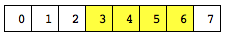
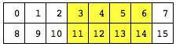

============================
LLVM IR for the GenX backend
============================

.. contents::
    :local:

Introduction
============

The GenX backend accepts
:doc:`LLVM intermediate representation <../LangRef>`
with certain restrictions, and with additional GenX-specific intrinsics.

LLVM IR representation of EU code
=================================

Whole thread representation
---------------------------

When using LLVM with the GenX backend, the LLVM IR represents execution on a
whole EU thread. This is distinct from IGC and Beignet (the OpenCL compiler for
the Intel open source driver), in which the LLVM IR represents just a single
work item, and a later stage of the compiler after LLVM IR parallelizes that
into simd4,8,16 or 32.

The GenX backend thus gives more flexibility for a client that needs full
control over what is executed in the EU thread for one of these reasons:

#. the compiler needs to expose that control in the language (like CM);
   
#. the compiler wants to do some parallelization, but in a more
   flexible way (e.g. different SIMD width for different parts of the code).
   This could be done as an LLVM pass before reaching the GenX backend, or
   it could be done even before reaching LLVM;

#. the compiler wants to expose "cross lane" functionality, where an algorithm
   can be executed in parallel within a single EU thread, but the separate lanes
   need to access each other's data at some points.

Linkage
-------

A kernel is represented by a function with ``dllexport`` linkage.

A non-kernel function is represented by a function with ``public`` linkage.

A subroutine is represented by a function with ``internal`` linkage. A subroutine
is allowed to be accessed from multiple kernels and non-kernel functions; the
GenX backend clones such a subroutine so it appears with each kernel and function
that uses it in the vISA.

No other linkage is supported.

Global variables are not supported. (The CM compiler has its own CMABI pass that
works around this by passing such variable into and out of any subroutine that
uses it.)

Kernel information
------------------

The genx.kernels named metadata node contains a metadata node
for each kernel, containing:

* 0: reference to Function
* 1: kernel name
* 2: asm name
* 3: kernel argument kinds (i32 for each kernel argument)
* 4: slm size in bytes
* 5: kernel argument offsets (i32 for each kernel argument)

Types
-----

Only fundamental types that correspond to Gen types are allowed:

* i1 for predicate
* i8 for b/ub
* i16 for w/uw
* half for hf
* i32 for d/ud
* float for f
* i64 for q/uq
* double for df

Arbitrary size vectors of these types are allowed.

Arithmetic/logic operator
-------------------------

There is no vector width restriction on operands and result of an
arithmetic/logic operator.

Where the operands and result have the same type, and no saturation is
required, the corresponding LLVM IR instruction can be used, for example
``add``.

A floating point operation where saturation is required is represented by
the LLVM IR instruction followed by the ``llvm.genx.sat`` intrinsic.

For an integer operation, vISA allows the operands to have one type
and the result to have a different type. This is represented by an intrinsic,
typically with signed/unsigned variants and variants with saturation.
Saturation cannot be represented by a separate intrinsic as for floating
point, because the intermediate result in the EU's ALU has one more bit
than the execution size.

An intrinsic is also required where the operator does not have an LLVM IR
instruction equivalent, such as ``min``.

Load and store
--------------

Load and store instructions are allowed only to load/store from/to a static
alloca, i.e. ones that are removed by a mem2reg pass.

Vector regions
==============

Introduction to region-based addressing
---------------------------------------

The Gen hardware, and thus vISA, provide the ability for a vector operand of an
instruction to be a region within a register.

1D region
^^^^^^^^^

A 1D region has the following parameters:

* The execution size is the number of elements in the region. This is
  determined by the instruction in which the operand appears.
* The horizontal stride (sometimes called just the stride) is the number of
  elements to step between each element of the region. This is 1 for a
  contiguous region, but can take other values, including 0 (in a source
  operand only) to splat the same scalar value across the whole operand.
* The start index indicates which element within the register is the start of
  the region.

The stride must be a constant. The start index can be a variable (giving an indirect operand).

Here is a simple contiguous 1D region (yellow), with execution size 4, stride 1
and start index 3, in a register with 8 elements:

Here is a non-contiguous 1D region, with execution size 4, stride 2 and start
index 3, in a register with 16 elements:

.. image:: GenXLangRef_region_example2.png

2D region
^^^^^^^^^

A 2D region has multiple rows where each row is a 1D region. It has the following parameters:

* The execution size is the number of elements in the region. This is
  determined by the instruction in which the operand appears.
* The vertical stride (or vstride) is the number of elements to step between
  the start of one row and the start of the next row. It can be 0 (in a source
  operand only) to repeat the same row multiple times.
* The width is the number of elements per row.
* The horizontal stride (or stride) is the number of elements to step between
  each element of the region within a row. This is 1 for a contiguous row, but
  can take other values, including 0 (in a source operand only) to splat the
  same scalar value across the whole row.
* The start index indicates which element within the register is the start of
  the region.

The vstride, width and stride must be a constant. The start index can be a scalar variable (giving an indirect operand) or a vector variable with an element per row of the region (giving a multi-indirect operand).

Here is a 2D region with contiguous rows, with:

* execution size 8 (the number of elements in the region)
* vstride 8 (the step between the start of one row (3) and the start of the next (11)
* width 4 (the number of elements in a row)
* stride 1 (the step between each element in a row)
* start index 3

Here is a 2D region with:

* execution size 9 (the number of elements in the region)
* vstride 7 (the step between the start of one row (8) and the start of the next (15)
* width 3 (the number of elements in a row)
* stride 3 (the step between each element in a row)
* start index 8

.. image:: GenXLangRef_region_example4.png

Notes
^^^^^

Some points that arise from these examples:

* The execution size must be a multiple of the width. Execution size divided by
  width is the number of rows in a 2D region. If the number of rows is 1, then
  it is a 1D region.

* Gen and vISA only support powers of two within certain limits for the region
  parameters other than start index. Also 2D regions are allowed only in a
  source operand. But source languages like CM using regions do not have these
  restrictions, and the compiler needs to allow for the more general case.

* The matrix representation shown in the last two examples is not a property of
  the register from/into which the region is read/written. Rather, it is a
  property of the region parameters. We show a matrix whose width is the
  vstride of the region. In the last example, the register is not even a
  multiple of vstride number of elements, so we have some left-over elements at
  the bottom.

Region access in LLVM IR
------------------------

Region access is represented in LLVM IR by intrinsics with the same region
parameters as above. The representation is close to the hardware capabilities,
but:

* The vISA/hardware restrictions on the region parameters being powers of 2
  within certain ranges are not initially imposed. The GenX backend includes a
  legalization pass that imposes these restrictions, and other gen-specific
  ones such as not being allowed to cross 2 GRF boundaries and not being
  allowed a 2D region as a destination, by splitting up region accesses.

* There is an extra *parent width* region parameter used for optimizations
  when the GenX backend collapses and legalizes region accesses.

* To make the parent width parameter effective when a variable start index is
  involved, a compiler frontend should compile a 2D region access as two
  separate accesses, one for the rows and one for the columns within the rows.

The restriction still needs to be imposed that the region is entirely contained
within the vector it is being read from or written to, otherwise undefined
behavior ensues at runtime.

Reading a region
^^^^^^^^^^^^^^^^

Reading a region, that is extracting certain elements from a vector to make a
new smaller vector, is represented by the ``llvm.genx.rdregioni`` or
``llvm.genx.rdregionf`` intrinsic. (There are integer and fp variants simply
because the tablegen language for declaring an overloaded intrinsic does not
allow an "any scalar or vector type".

The operands to this intrinsic are:

* the vector being read from;
* vstride (ignored for a 1D region, that is width == execution size);
* width;
* stride;
* start index;
* parent width (see below).
  
The execution
size is implied by the vector width of the return value of the intrinsic call.

The vstride, width and stride are expressed in elements. But the start index is
expressed in bytes, as this is what the hardware does in the variable index
case.

A read from the first example region from above:

is represented by the following LLVM IR (assuming the start index is constant, and the element type is i32):

.. code-block:: text

  %v1 = <8 x i32> something
  %region1 = call <4 x i32> @llvm.genx.rdregioni.v4i32.v8i32(<8 x i32> %v1, i32 0, i32 4, i32 1, i16 12, i32 undef)

The vstride is set to 0, but is ignored because it is a 1D region.

The width is 4 (elements) and the stride is 1.

The start index is 12, but remember this is in bytes, so it means 3 elements. (The elements have type i32.)

A read from the fourth example region from above:

.. image:: GenXLangRef_region_example2.png

is represented by this LLVM IR (assuming constant start index and i32 element
type):

.. code-block:: text

  %v2 = <30 x i32> something
  %region2 = call <9 x i32> @llvm.genx.rdregioni.v9i32.v30i32(<30 x i32> %v2, i32 7, i32 3, i32 2, i16 32)

With:

* execution size 9 (the number of elements in the region)
* vstride 7 (the step between the start of one row (8) and the start of the next (15)
* width 3 (the number of elements in a row)
* stride 3 (the step between each element in a row)
* start index 32 bytes, which is 8 elements.

The diagram above shows the input vector %v2 as a matrix of width 7 with two elements left over in a partial row. This 7 is not a property of the input vector value, which is just a vector (LLVM IR does not represent matrices). Instead it is the vstride of the region we are reading.

Writing a region
^^^^^^^^^^^^^^^^

Writing a region, that is inserting the elements of a vector into certain
positions of another vector, yielding a new value for the latter vector,
is represented by the ``llvm.genx.wrregioni`` or
``llvm.genx.wrregionf`` intrinsic. (There are integer and fp variants simply
because the tablegen language for declaring an overloaded intrinsic does not
allow an "any scalar or vector type".

In SSA, each value is defined exactly once. Since we are representing a vector
value as an LLVM IR value, the only way of representing a write to a region,
which is a partial write, is for the operation to take the old value of the
vector as an input, and to return the updated value of the vector. It is then up to
the GenX backend to ensure that the two values are allocated to the same register.

The operands to this intrinsic are:

* the "old value" of the vector being written into;
* the "new value", that is, the vector or scalar value to write into the region;
* vstride;
* width;
* stride;
* start index;
* parent width (see below);
* mask.

The execution size is the vector width of the "new value" input.
For a 1D region (width == execution size), vstride is ignored.

As above in llvm.genx.rdregion, the vstride, width and stride are expressed in
elements, but the start index is expressed in bytes.

Using the same two example regions as above in llvm.genx.rdregion:

Writing the elements of %region3 into the region in %v3, generating a new value %v3.new is represented by:

.. code-block:: text

  %v3 = <8 x i32> something
  %region3 = <4 x i32> something
  %v3.new = call <8 x i32> @llvm.genx.wrregion.v8i32.v4i32.i1(<8 x i32> %v3, <4 x i32> %region3, i32 0, i32 4, i32 1, i16 12, i32 undef, i1 1)

The .v8i32.v4i32.i1 decoration on the intrinsic name arises from LLVM’s
intrinsic overloading mechanism. The v8i32 is the type of the return value, and
the v4i32 is the type of the value being written in to the region. The i1 is
the type of the mask operand; see below.

The vstride is set to 0, but is ignored because it is a 1D region.

The width is 4 (elements) and the stride is 1.

The start index is 12, but remember this is in bytes, so it means 3 elements. (The elements have type i32.)

.. image:: GenXLangRef_region_example4.png

Writing the elements of %region4 into the region in %v4, generating a new value %v4.new is represented by:

.. code-block:: text

  %v4 = <30 x i32> something
  %region4 = <9 x i32> something
  %v4.new = call <30 x i32> @llvm.genx.wrregion.v30i32.v9i32.i1(<30 x i32> %v4, <9 x i32> %region4, i32 7, i32 3, i32 2, i16 32, i32 undef, i1 1)

With:

* execution size 9 (the number of elements in the region)
* vstride 7 (the step between the start of one row (8) and the start of the next (15)
* width 3 (the number of elements in a row)
* stride 3 (the step between each element in a row)
* start index 32 bytes, which is 8 elements.

The mask operand
^^^^^^^^^^^^^^^^

The wrregion* intrinsics have an extra mask operand. This is used to control
which elements in the region are actually written, for use in predication and
SIMD control flow.

Most generally, the mask operand is a vector of i1 with the same vector width
as the value being written in to the region, and it is variable. If any element
of the mask is 0, the corresponding element of the value is not written in to
the region, leaving that element unchanged.

The most common case, used when there is no predication, is that the mask is all
ones. As a shorthand, this is represented by a single constant i1 value of 1,
rather than the whole vector.

Single element region
^^^^^^^^^^^^^^^^^^^^^

A single element could be a scalar value or a 1-vector. It is convenient to
allow both in LLVM IR, because CM allows both as distinct types.

The rdregion and wrregion intrinsics are defined such that
a single element region can be represented as either a scalar or a 1-vector.
However, for the scalar case, it is recommended to use the LLVM IR instructions
extractelement and insertelement instead, as core LLVM optimizations understand
them.

The parent width operand
^^^^^^^^^^^^^^^^^^^^^^^^

For a 2D region, certain parts of the GenX backend can optimize better if it is
known that a row of the region cannot cross certain boundaries:

* Collapsing two 2D regions is possible only if it is known that a row of the
  inner 2D region cannot cross a row boundary of the outer 2D region.

* Knowing that a row of a 2D region cannot cross a GRF boundary can help to
  avoid splitting it up so much in legalization.

For a region with a constant start index, this can all be calculated from the
start index and region parameters. For a region with a variable start index,
the *parent width* operand is set to value N to make a statement
that the semantics of the language being compiled say that a row of the region
cannot cross a multiple of N boundary.

Predicates and predication
==========================

Certain vector operations can be *predicated*, that is, a vector of i1
predicate controls whether the corresponding element of the operation is
written into its result element.

LLVM IR already has ``select`` with a vector condition.

As outlined above, the wrregion intrinsics have a mask operand. If a bit is
not set in the mask, then the corresponding element of the "new value" input
is not written into the result.

The intrinsics corresponding to predicated send messages (e.g. gather), and
the raw send intrinsics, have a predicate operand.

Non-GenX intrinsics
===================

In general the GenX backend does not implement non-GenX intrinsics, with the
following exceptions:

* ``llvm.uadd.with.overflow`` -- the GenX backend does not implement the other
  arithmetic-with-overflow intrinsics, but I found a case where LLVM was
  transforming a CM program to use this one, so I had to implement it.

* ``llvm.fma`` -- this intrinsic is generated in the GenXPatternMatch pass,
  but I think the GenX backend would be able to cope with it being in the IR
  already.

GenX intrinsics
===============

.. include:: autogenerated/GenXLangRef.rstinc

